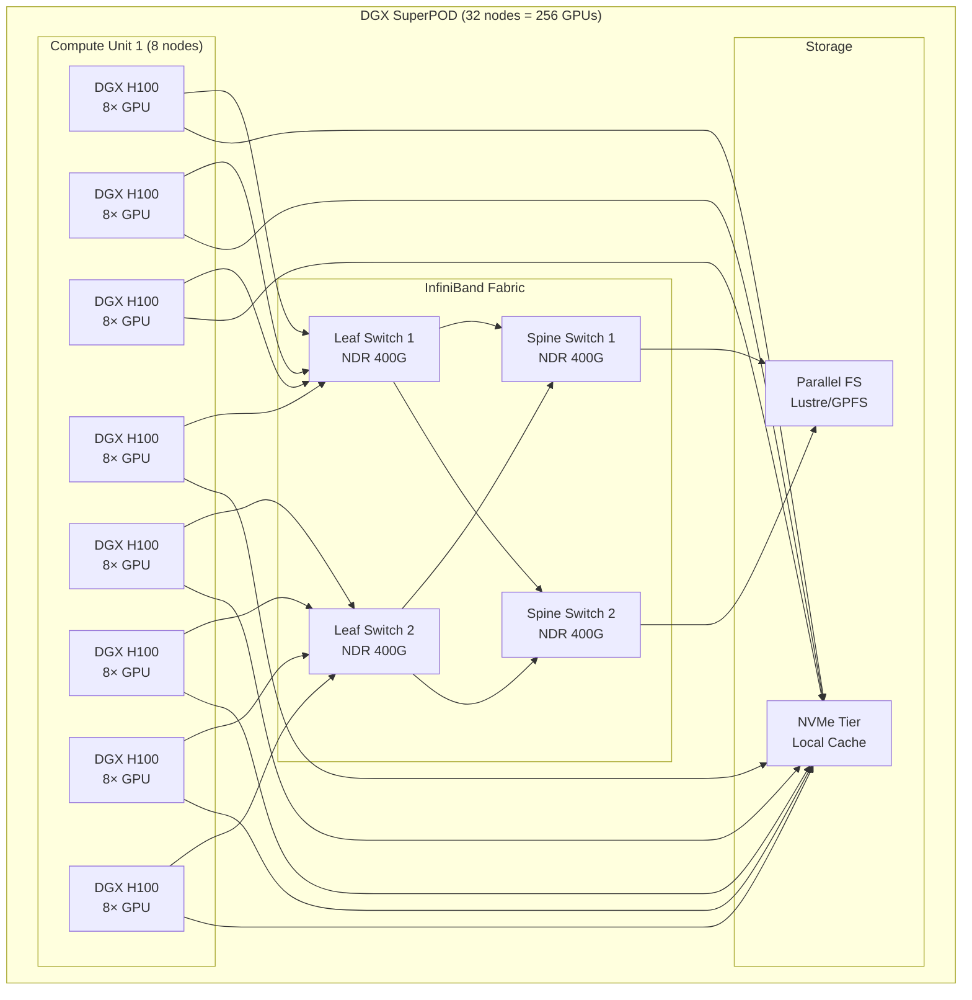

# GPU Cluster Architecture

## Why This Matters for Staff Architects

GPU clusters are the foundation of AI infrastructure. A wrong GPU choice wastes $100K+/month. A wrong interconnect topology creates bottlenecks that no software optimization can fix. Staff architects own these multi-million-dollar decisions.

---

## GPU Hierarchy: Choosing the Right Accelerator

### NVIDIA H100 (Hopper Architecture)
- **Memory**: 80GB HBM3
- **Memory Bandwidth**: 3.35 TB/s
- **FP16 Tensor Core**: 1,979 TFLOPS
- **FP8 Tensor Core**: 3,958 TFLOPS
- **TDP**: 700W
- **Interconnect**: NVLink 4.0 (900 GB/s), PCIe Gen5
- **Use case**: Large model training, high-throughput inference for 70B+ models
- **Cost**: ~$30K/GPU, ~$3-4/hr cloud spot

### NVIDIA A100 (Ampere Architecture)
- **Memory**: 80GB HBM2e (or 40GB variant)
- **Memory Bandwidth**: 2.0 TB/s
- **FP16 Tensor Core**: 624 TFLOPS (with sparsity)
- **TDP**: 400W
- **Interconnect**: NVLink 3.0 (600 GB/s)
- **Use case**: General-purpose training and inference, 7B-70B models
- **Cost**: ~$15K/GPU, ~$1.5-2/hr cloud spot

### NVIDIA L40S (Ada Lovelace)
- **Memory**: 48GB GDDR6
- **Memory Bandwidth**: 864 GB/s
- **FP16 Tensor Core**: 733 TFLOPS (with sparsity)
- **TDP**: 350W
- **Interconnect**: PCIe Gen4 only (no NVLink)
- **Use case**: Single-GPU inference, fine-tuning 7B-13B models, multi-modal
- **Cost**: ~$8K/GPU, ~$1/hr cloud

### NVIDIA T4 (Turing Architecture)
- **Memory**: 16GB GDDR6
- **Memory Bandwidth**: 320 GB/s
- **FP16 Tensor Core**: 130 TFLOPS (with sparsity)
- **TDP**: 70W
- **Interconnect**: PCIe Gen3
- **Use case**: Small model inference (<7B quantized), edge deployment, cost-sensitive
- **Cost**: ~$2K/GPU, ~$0.35/hr cloud spot

### Decision Matrix

| Workload | GPU Choice | Rationale |
|----------|-----------|-----------|
| Train 70B+ model | H100 × 64+ | Memory bandwidth + NVLink mandatory |
| Serve 70B model | H100 × 4-8 TP | Need HBM3 bandwidth for generation |
| Serve 7B model | A100 or L40S × 1 | Fits in single GPU memory |
| Serve 7B quantized | T4 × 1 | GPTQ-4bit fits in 16GB |
| Fine-tune 13B (LoRA) | A100 × 1 | Needs ~40GB for activations |
| Embedding model | T4 or L4 × N | Compute-bound, doesn't need HBM |

---

## Interconnect Topology

### NVLink
- **Purpose**: GPU-to-GPU communication within a node
- **NVLink 4.0 (H100)**: 900 GB/s bidirectional per GPU
- **NVLink 3.0 (A100)**: 600 GB/s bidirectional per GPU
- **Why it matters**: Tensor parallelism requires all-reduce across GPUs. PCIe Gen5 maxes at 128 GB/s — 7× slower than NVLink 4.0.

### NVSwitch
- **Purpose**: Enables all-to-all GPU communication within a node (full bisection bandwidth)
- **H100 DGX**: 4× NVSwitch chips connecting 8 GPUs
- **Without NVSwitch**: GPUs form a ring topology (limited bandwidth for all-reduce)
- **With NVSwitch**: Any GPU can talk to any other at full 900 GB/s

### InfiniBand (IB)
- **Purpose**: GPU-to-GPU communication across nodes
- **NDR (400 Gb/s)**: Standard for H100 clusters (50 GB/s per port)
- **HDR (200 Gb/s)**: Common for A100 clusters
- **GPUDirect RDMA**: Network card reads directly from GPU memory (bypasses CPU)
- **Why not Ethernet?**: IB has 1-2μs latency vs 10-50μs for RoCE, and purpose-built for collective ops

### Topology Matters

```
Within a DGX H100 node (8 GPUs):
- All-to-all via NVSwitch: 900 GB/s
- Total GPU memory: 640 GB HBM3

Between DGX nodes:
- 8× ConnectX-7 NICs per node (one per GPU)
- Each NIC: 400 Gb/s InfiniBand NDR
- Total inter-node bandwidth: 3.2 Tb/s (400 GB/s)
```

---

## DGX vs HGX vs Cloud GPU Instances

### NVIDIA DGX H100
- **What**: Turnkey server with 8× H100, NVSwitch, InfiniBand, full software stack
- **Cost**: ~$300K per node
- **Includes**: Hardware, networking, DGX OS, NVIDIA AI Enterprise license, 3yr support
- **Best for**: Organizations building private GPU clusters with operations team
- **Lead time**: 6-12 months (supply constrained)

### NVIDIA HGX H100
- **What**: GPU baseboard only (8× H100 + NVSwitch), you provide the rest
- **Cost**: ~$200K for the baseboard
- **Requires**: OEM server (Dell, HPE, Supermicro), your own networking, your own software
- **Best for**: Large enterprises with existing data center operations

### Cloud GPU Instances

| Provider | Instance | GPUs | Interconnect | $/hr (on-demand) |
|----------|----------|------|-------------|-----------------|
| AWS | p5.48xlarge | 8× H100 | NVSwitch + EFA | ~$98/hr |
| GCP | a3-highgpu-8g | 8× H100 | NVSwitch + GPUDirect | ~$101/hr |
| Azure | ND96isr_H100_v5 | 8× H100 | NVSwitch + InfiniBand | ~$96/hr |
| CoreWeave | H100_80GB_SXM | 8× H100 | NVSwitch + InfiniBand | ~$75/hr |
| Lambda | gpu_8x_h100_sxm5 | 8× H100 | NVSwitch + InfiniBand | ~$70/hr |

### Build vs Buy Decision

```
Self-hosted (3-year amortized):
  DGX H100: $300K / (3 years × 8760 hours) = ~$11.40/hr
  + Power (5KW × $0.10/kWh) = $0.50/hr  
  + Cooling, space, ops team ≈ $3/hr
  Total: ~$15/hr for 8× H100

Cloud (on-demand):
  ~$96-101/hr for 8× H100
  
Cloud (1-year reserved):
  ~$55-65/hr for 8× H100

Cloud (3-year reserved):
  ~$35-45/hr for 8× H100

Break-even: Self-hosting wins at >60% utilization over 3 years
```

---

## Multi-Node GPU Clusters

### DGX SuperPOD Architecture



### Scaling Patterns

| Cluster Size | GPUs | Use Case | Estimated Cost/Month |
|-------------|------|----------|---------------------|
| 1 node | 8× H100 | Serve 70B model, fine-tune | $70K (cloud) |
| 4 nodes | 32× H100 | Train 13B model, serve multiple 70B | $280K (cloud) |
| 32 nodes | 256× H100 | Train 70B model from scratch | $2.2M (cloud) |
| 128 nodes | 1024× H100 | Train 175B+ frontier model | $8.8M (cloud) |

---

## Memory Hierarchy

### GPU Memory Levels

```
Level       | Size          | Bandwidth      | Latency
------------|---------------|----------------|----------
Registers   | 256 KB/SM     | ~20 TB/s       | 1 cycle
L1/SRAM     | 256 KB/SM     | ~20 TB/s       | ~28 cycles  
L2 Cache    | 50 MB (H100)  | ~12 TB/s       | ~200 cycles
HBM3        | 80 GB (H100)  | 3.35 TB/s      | ~400 cycles
NVLink      | Remote GPU    | 900 GB/s       | ~1-5 μs
PCIe/IB     | System/Remote | 50-128 GB/s    | ~1-10 μs
```

### Why Memory Bandwidth is the Bottleneck

For autoregressive LLM inference (decode phase):
- Each token requires reading ALL model weights from HBM
- 70B model in FP16 = 140 GB to read per token
- H100 bandwidth: 3.35 TB/s → 140GB / 3.35 TB/s = **42ms per token per GPU**
- With 4-way tensor parallelism: ~10ms per token

This is why:
1. Quantization (reducing bytes read) directly improves throughput
2. Batching amortizes weight reads across multiple sequences
3. Memory bandwidth, not compute FLOPS, determines inference speed for LLMs

---

## Cost Analysis: Real Numbers

### Single H100 Monthly Cost

| Option | Monthly Cost | Commitment | Flexibility |
|--------|-------------|------------|-------------|
| Self-hosted (amortized) | ~$12K | 3+ years | None - hardware fixed |
| Cloud reserved (1yr) | ~$40K | 1 year | Limited scaling |
| Cloud reserved (3yr) | ~$25K | 3 years | None |
| Cloud on-demand | ~$72K | None | Full flexibility |
| Cloud spot/preemptible | ~$15-25K | None | Can be interrupted |

### Cost Per 1M Tokens (approximate, 70B model)

| Setup | GPU | Throughput | Cost/1M tokens |
|-------|-----|-----------|----------------|
| 4× H100 (reserved) | H100 SXM | ~500 tok/s | ~$0.60 |
| 8× A100 | A100 80GB | ~200 tok/s | ~$1.50 |
| API (OpenAI GPT-4) | N/A | N/A | ~$30 (input) |
| API (Claude Sonnet) | N/A | N/A | ~$3 (input) |

---

## Anti-Patterns

### 1. Over-Provisioning
**Mistake**: Deploying 8× H100 for a 7B model that fits on one A100.
**Impact**: 8× the cost with no throughput benefit for single requests.
**Fix**: Right-size GPU to model. Use H100 only when you need the bandwidth or multi-GPU parallelism.

### 2. Wrong GPU for Workload
**Mistake**: Using T4 for 70B model inference (doesn't fit in memory).
**Mistake**: Using H100 for embedding generation (waste of HBM bandwidth).
**Fix**: Match GPU memory and bandwidth to model requirements.

### 3. Ignoring Memory Bandwidth
**Mistake**: Choosing GPU based on TFLOPS alone.
**Reality**: LLM inference is memory-bandwidth-bound, not compute-bound.
**Fix**: Calculate bytes-per-token-generation. Compare against GPU memory bandwidth.

### 4. No Interconnect Planning
**Mistake**: Using PCIe-only GPUs for tensor parallelism across 8 GPUs.
**Impact**: 7× slower all-reduce vs NVLink, destroying throughput.
**Fix**: If multi-GPU needed for serving, require NVLink/NVSwitch topology.

### 5. Ignoring Cooling and Power
**Mistake**: Planning GPU density without power/cooling capacity.
**Reality**: 8× H100 = 5.6KW per node. A 32-node cluster = 180KW.
**Fix**: Validate data center power availability before ordering hardware.

---

## Staff Architect Decision Framework

### Step 1: Define Requirements
```
- Model size (parameters): ___B
- Precision: FP16 / FP8 / INT4
- Target latency (p99): ___ms  
- Target throughput: ___ tokens/s
- Concurrent users: ___
- Budget (monthly): $___
```

### Step 2: Calculate GPU Memory Needed
```
Memory per model = parameters × bytes_per_param
  FP16: 70B × 2 bytes = 140 GB
  FP8:  70B × 1 byte  = 70 GB  
  INT4: 70B × 0.5 byte = 35 GB

Add KV cache: batch_size × seq_len × layers × heads × head_dim × 2 × 2 bytes
  Example: 32 × 4096 × 80 × 8 × 128 × 2 × 2 = ~42 GB for 70B model

Total GPU memory needed = model + KV cache + overhead (~10%)
```

### Step 3: Select Parallelism Strategy
```
If model fits in 1 GPU memory: single GPU (simplest)
If model fits in 1 node (8 GPUs): tensor parallelism within node
If model needs multiple nodes: pipeline parallelism across nodes + TP within nodes
```

### Step 4: Determine GPU Count for Throughput
```
Single GPU throughput (decode) ≈ memory_bandwidth / model_size_bytes
  H100: 3.35 TB/s / 140 GB = ~24 tokens/s per GPU (unbatched, 70B FP16)
  
With batching (batch=32): ~500 tokens/s on 4× H100 (TP=4)

GPUs needed = target_throughput / per_replica_throughput × TP_degree
```

### Step 5: Make Build-vs-Buy Decision
```
If utilization < 40%: cloud on-demand
If utilization 40-70%: cloud reserved + spot bursting
If utilization > 70% sustained over 2+ years: evaluate self-hosting
If team < 5 ML infra engineers: cloud (always)
```

### Step 6: Plan for Growth
```
- Start with cloud for flexibility
- Migrate high-utilization workloads to reserved/self-hosted
- Keep burst capacity in cloud
- Re-evaluate every 6 months as GPU generations change
```

---

## Key Takeaways

1. **Memory bandwidth determines LLM inference speed**, not TFLOPS
2. **Interconnect topology is not optional** — NVLink/NVSwitch for multi-GPU, InfiniBand for multi-node
3. **Right-sizing saves more than any other optimization** — don't run small models on big GPUs
4. **Self-hosting only makes sense at scale** with dedicated ops team and >70% utilization
5. **GPU generations change every 2 years** — plan hardware refresh cycles into TCO

---

## Further Reading

- NVIDIA H100 Whitepaper: Architecture deep-dive
- NVIDIA DGX SuperPOD Reference Architecture
- "Efficiently Scaling Transformer Inference" (Pope et al., 2022)
- "LLM Inference Performance Engineering" (NVIDIA blog series)
