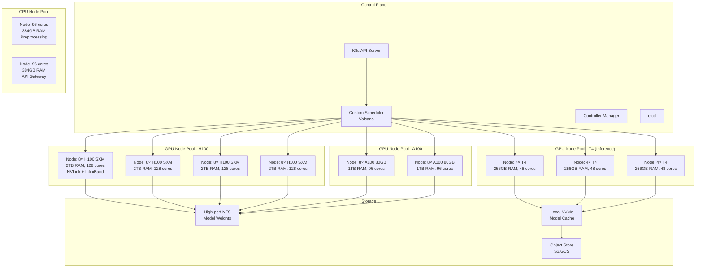

# Kubernetes for AI Workloads

## Why This Matters for Staff Architects

Kubernetes is the de facto platform for orchestrating AI workloads at scale. But GPU scheduling, topology awareness, and storage for multi-hundred-GB models require AI-specific expertise. Misconfigured K8s clusters waste GPUs worth $30K+/month each.

---

## Why Kubernetes for AI

1. **Resource Management**: GPUs are expensive — need scheduling, sharing, quotas
2. **Multi-tenancy**: Multiple teams sharing GPU clusters with isolation
3. **Scaling**: Auto-scale inference replicas based on traffic
4. **Declarative**: GitOps for model deployments, reproducible environments
5. **Ecosystem**: Operators for model serving (KServe, Seldon), training (Kubeflow)
6. **Portability**: Same manifests across cloud providers

### What K8s Does NOT Solve Without Configuration
- GPU topology awareness (default scheduler is topology-blind)
- Efficient GPU sharing (default is whole-GPU-per-pod)
- Gang scheduling for distributed training (pods must co-schedule)
- High-throughput storage for model weights
- Network optimization for collective operations

---

## GPU Scheduling in Kubernetes

### NVIDIA Device Plugin
```yaml
# Automatically exposes nvidia.com/gpu as a schedulable resource
apiVersion: apps/v1
kind: DaemonSet
metadata:
  name: nvidia-device-plugin-daemonset
  namespace: kube-system
spec:
  selector:
    matchLabels:
      name: nvidia-device-plugin-ds
  template:
    spec:
      containers:
      - name: nvidia-device-plugin-ctr
        image: nvcr.io/nvidia/k8s-device-plugin:v0.14.0
        env:
        - name: FAIL_ON_INIT_ERROR
          value: "false"
```

### Requesting GPUs in Pods
```yaml
apiVersion: v1
kind: Pod
metadata:
  name: llm-inference
spec:
  containers:
  - name: vllm
    image: vllm/vllm-openai:latest
    resources:
      limits:
        nvidia.com/gpu: 4  # Request 4 GPUs
      requests:
        memory: "320Gi"
        cpu: "32"
    env:
    - name: NVIDIA_VISIBLE_DEVICES
      value: "all"
```

### Multi-Instance GPU (MIG)

MIG partitions a single H100/A100 into up to 7 isolated GPU instances:

```
H100 MIG Profiles:
  1g.10gb  - 1/7 of GPU (10 GB) - small model inference
  2g.20gb  - 2/7 of GPU (20 GB) - medium inference
  3g.40gb  - 3/7 of GPU (40 GB) - 7B model
  4g.40gb  - 4/7 of GPU (40 GB) - 7B model + more compute
  7g.80gb  - Full GPU (80 GB)   - large models
```

K8s MIG configuration:
```yaml
# Pod requesting a MIG slice
resources:
  limits:
    nvidia.com/mig-3g.40gb: 1  # One 3g.40gb MIG instance
```

**When to use MIG:**
- Multiple small models (< 20B parameters) on shared hardware
- Development/staging environments
- Cost optimization for light inference

**When NOT to use MIG:**
- Models needing full GPU memory
- Workloads needing NVLink between GPUs (MIG disables NVLink)
- Latency-sensitive serving (MIG adds scheduling overhead)

### GPU Time-Slicing
```yaml
# nvidia-device-plugin ConfigMap for time-slicing
apiVersion: v1
kind: ConfigMap
metadata:
  name: nvidia-plugin-configs
data:
  config: |
    version: v1
    sharing:
      timeSlicing:
        resources:
        - name: nvidia.com/gpu
          replicas: 4  # Each physical GPU appears as 4 logical GPUs
```

**Trade-offs**: No memory isolation, no compute isolation. Only useful for non-latency-sensitive batch workloads.

---

## Topology-Aware Scheduling

### The Problem
Default K8s scheduler doesn't understand:
- GPU interconnect topology (NVLink pairs)
- NUMA node affinity (CPU socket to GPU mapping)
- Network card proximity (which NIC is closest to which GPU)

### Node Labels for Topology
```yaml
# Label GPU nodes with topology info
metadata:
  labels:
    nvidia.com/gpu.product: "NVIDIA-H100-SXM"
    nvidia.com/gpu.count: "8"
    topology.kubernetes.io/zone: "us-east1-b"
    gpu-interconnect: "nvlink"
    infiniband: "true"
```

### Node Affinity for GPU Type
```yaml
affinity:
  nodeAffinity:
    requiredDuringSchedulingIgnoredDuringExecution:
      nodeSelectorTerms:
      - matchExpressions:
        - key: nvidia.com/gpu.product
          operator: In
          values:
          - "NVIDIA-H100-SXM"
        - key: gpu-interconnect
          operator: In
          values:
          - "nvlink"
```

### Topology Manager (kubelet)
```yaml
# kubelet configuration
topologyManagerPolicy: "single-numa-node"  # or "best-effort", "restricted"
topologyManagerScope: "pod"  # or "container"
```

This ensures CPU cores, GPU, and memory are from the same NUMA node — critical for avoiding cross-socket memory access penalties.

---

## Custom Schedulers for AI

### Volcano Scheduler
Purpose: Gang scheduling, fair-share queuing, preemption for training jobs.

```yaml
apiVersion: batch.volcano.sh/v1alpha1
kind: Job
metadata:
  name: distributed-training
spec:
  minAvailable: 4  # All 4 pods must schedule together
  schedulerName: volcano
  queue: training-queue
  tasks:
  - replicas: 4
    name: worker
    template:
      spec:
        containers:
        - name: trainer
          image: training-image:latest
          resources:
            limits:
              nvidia.com/gpu: 8
```

Key features:
- **Gang scheduling**: All pods in a job start together or none start
- **Queue management**: Priority queues with fair-share across teams
- **Preemption**: Lower-priority jobs yield GPUs to higher-priority
- **Backfill**: Small jobs fill gaps while waiting for large allocations

### YuniKorn
- Apache project, alternative to Volcano
- Better multi-tenant resource management
- Hierarchical queue with guaranteed/max quotas
- Used by large enterprises with many teams sharing GPU clusters

### When to Use Custom Schedulers
| Scenario | Default Scheduler | Volcano/YuniKorn |
|----------|------------------|-----------------|
| Single inference deployment | ✓ | Overkill |
| Multiple teams, shared GPUs | Fragmentation | ✓ Fair-share |
| Distributed training | Partial scheduling risk | ✓ Gang scheduling |
| Priority preemption | Basic | ✓ Advanced |

---

## K8s AI Cluster Architecture



---

## Scaling Patterns

### Horizontal Pod Autoscaler (HPA) for Inference
```yaml
apiVersion: autoscaling/v2
kind: HorizontalPodAutoscaler
metadata:
  name: llm-inference-hpa
spec:
  scaleTargetRef:
    apiVersion: apps/v1
    kind: Deployment
    name: llm-inference
  minReplicas: 2
  maxReplicas: 16
  metrics:
  - type: Pods
    pods:
      metric:
        name: gpu_utilization
      target:
        type: AverageValue
        averageValue: "70"
  - type: External
    external:
      metric:
        name: inference_queue_depth
      target:
        type: AverageValue
        averageValue: "10"
  behavior:
    scaleUp:
      stabilizationWindowSeconds: 60
      policies:
      - type: Pods
        value: 2
        periodSeconds: 60
    scaleDown:
      stabilizationWindowSeconds: 300  # Slow scale-down (GPU pods are expensive to restart)
```

### KEDA for Queue-Based Scaling
```yaml
apiVersion: keda.sh/v1alpha1
kind: ScaledObject
metadata:
  name: llm-batch-processor
spec:
  scaleTargetRef:
    name: batch-inference
  minReplicaCount: 0  # Scale to zero when no work
  maxReplicaCount: 8
  triggers:
  - type: rabbitmq
    metadata:
      queueName: inference-requests
      queueLength: "5"  # 5 messages per pod
```

### Cluster Autoscaler with GPU Node Pools
```yaml
# GKE node pool auto-provisioning
apiVersion: container.gke.io/v1
kind: NodePool
metadata:
  name: h100-pool
spec:
  autoscaling:
    enabled: true
    minNodeCount: 0
    maxNodeCount: 8
  config:
    machineType: a3-highgpu-8g
    accelerators:
    - acceleratorType: nvidia-h100-80gb
      acceleratorCount: 8
```

**Critical consideration**: GPU node startup time is 5-10 minutes (driver init, model loading). Plan for pre-warming or accept cold-start latency.

---

## Storage for AI Workloads

### Model Weight Storage
```yaml
# PersistentVolume for model weights (read-many)
apiVersion: v1
kind: PersistentVolume
metadata:
  name: model-weights-pv
spec:
  capacity:
    storage: 2Ti
  accessModes:
    - ReadOnlyMany  # Multiple pods read same weights
  csi:
    driver: filestore.csi.storage.gke.io
    volumeHandle: projects/my-project/locations/us-east1/instances/model-store/shares/models
  mountOptions:
    - nconnect=16  # Parallel NFS connections for throughput
```

### High-Throughput Storage Options

| Storage Type | Throughput | Latency | Cost | Best For |
|-------------|-----------|---------|------|----------|
| Local NVMe | 7 GB/s | <100μs | Included w/ node | Model loading cache |
| Filestore/EFS (Premium) | 1.6 GB/s | 1-5ms | $0.30/GB/mo | Shared model weights |
| Lustre/FSx | 10+ GB/s | <1ms | $0.14/GB/mo | Training checkpoints |
| GCS/S3 (parallel) | 10+ GB/s | 50-200ms | $0.02/GB/mo | Cold storage, backup |

### Model Loading Pattern
```yaml
initContainers:
- name: model-downloader
  image: model-loader:latest
  command: ["python", "download_model.py"]
  args: ["--model", "llama-70b", "--dest", "/models"]
  volumeMounts:
  - name: model-cache
    mountPath: /models
  resources:
    requests:
      memory: "16Gi"
      cpu: "8"
volumes:
- name: model-cache
  hostPath:
    path: /mnt/nvme/models  # Local NVMe for fast loading
    type: DirectoryOrCreate
```

---

## Anti-Patterns

### 1. No Resource Limits on GPU Pods
**Mistake**: Not setting memory requests/limits alongside GPU requests.
**Impact**: OOM kills, node instability. A 70B model pod without memory request may get scheduled on a node with insufficient RAM.
**Fix**: Always specify memory requests matching model size + KV cache + overhead.

### 2. Single-GPU-Per-Pod Waste
**Mistake**: Running a 3B model on a full H100 (80GB) when it only needs 6GB.
**Impact**: $30K/month GPU with 8% memory utilization.
**Fix**: Use MIG to partition H100 into smaller slices, or use appropriate smaller GPUs.

### 3. Ignoring Topology for Multi-GPU Pods
**Mistake**: Pod requesting 4 GPUs gets 2 from NUMA node 0, 2 from NUMA node 1.
**Impact**: Cross-NUMA NVLink traffic, 30-50% slower tensor parallelism.
**Fix**: Use topology manager `single-numa-node` policy, or custom scheduler.

### 4. No Gang Scheduling for Training
**Mistake**: Distributed training with 4 pods — 3 schedule, 1 waits. 3 GPUs idle.
**Impact**: Wasted GPU hours while waiting for the last pod.
**Fix**: Use Volcano with `minAvailable` equal to total required pods.

### 5. Ignoring Model Loading Time
**Mistake**: HPA scales up new pods that take 10 minutes to load a 140GB model.
**Impact**: Request timeouts during scale-up events.
**Fix**: Pre-load models on warm pools, use readiness probes that check model availability.

### 6. PVC Per Pod for Model Weights
**Mistake**: Each replica creates its own PVC and downloads the model separately.
**Impact**: 16 replicas × 140GB = 2.24TB downloaded, huge startup latency.
**Fix**: Use `ReadOnlyMany` PV with pre-loaded model weights, or `hostPath` with DaemonSet pre-loader.

---

## Production Setup Comparison

### GKE (Google Kubernetes Engine)
```yaml
# GKE Autopilot with GPU
# Pros: Simplest, auto-provisioning, no node management
# Cons: Less control, limited GPU types, higher cost
nodePool:
  machineType: a3-highgpu-8g
  accelerators:
    - type: nvidia-h100-80gb
      count: 8
      gpuDriverInstallation:
        type: DEFAULT  # Auto-installs drivers
  spotInstances: true  # For cost savings
```

### EKS (Amazon Elastic Kubernetes Service)
```yaml
# EKS with Karpenter for GPU auto-scaling
# Pros: Broadest GPU selection, EFA networking, spot instances
# Cons: More ops burden, manual driver management
apiVersion: karpenter.sh/v1beta1
kind: NodePool
metadata:
  name: gpu-inference
spec:
  template:
    spec:
      requirements:
      - key: node.kubernetes.io/instance-type
        operator: In
        values: ["p5.48xlarge", "p4d.24xlarge"]
      - key: karpenter.sh/capacity-type
        operator: In
        values: ["on-demand", "spot"]
```

### AKS (Azure Kubernetes Service)
```yaml
# AKS with GPU node pool
# Pros: Azure integration, InfiniBand support on ND-series
# Cons: Fewer GPU SKUs, less spot availability
az aks nodepool add \
  --resource-group myRG \
  --cluster-name myCluster \
  --name gpupool \
  --node-count 4 \
  --node-vm-size Standard_ND96isr_H100_v5 \
  --gpu-instance-profile MIG3g \
  --enable-cluster-autoscaler \
  --min-count 0 \
  --max-count 8
```

---

## Staff Architect Decision Framework

### Step 1: Cluster Design Questions
```
1. How many teams will share the cluster?
2. What's the ratio of training vs inference workloads?
3. What's the largest model you'll serve? (Determines min GPU memory)
4. What's peak vs average GPU demand? (Determines autoscaling strategy)
5. What's your operations team capacity? (Managed vs self-managed)
```

### Step 2: Node Pool Strategy
```
Pool 1: H100 SXM (training + large inference)
  - NVLink mandatory, InfiniBand for multi-node
  - Reserve capacity for always-on inference
  - Spot/preemptible for training (checkpoints protect against preemption)

Pool 2: A100/L40S (medium inference, fine-tuning)
  - Cost-effective for 7B-30B models
  - MIG for multi-tenant small model serving

Pool 3: T4/L4 (small inference, edge)
  - Cheapest option for <7B quantized models
  - Scale-to-zero with KEDA for cost savings

Pool 4: CPU (preprocessing, routing, API gateway)
  - Horizontal scaling is cheap
  - Handles tokenization, validation, routing
```

### Step 3: Scheduling Configuration
```
- Enable topology manager (single-numa-node for GPU pods)
- Deploy Volcano if running distributed training
- Configure MIG profiles based on model size distribution
- Set pod priority classes: critical-inference > batch-training > experiments
- Configure preemption policies
```

### Step 4: Storage Architecture
```
Tier 1: Local NVMe (fastest model loading, ephemeral)
Tier 2: Network filesystem (shared model weights, ReadOnlyMany)
Tier 3: Object store (model registry, checkpoints, backups)

Model loading strategy:
  - DaemonSet pre-pulls popular models to local NVMe
  - Init container loads from network FS as fallback
  - Object store as source of truth
```

---

## Key Takeaways

1. **Default K8s scheduler is inadequate for AI** — need topology awareness and gang scheduling
2. **MIG is your best friend for cost optimization** — partition expensive GPUs for small models
3. **Storage is the hidden bottleneck** — 140GB model loads take minutes without local NVMe
4. **Scale-down is as important as scale-up** — aggressive scale-down saves significant GPU cost
5. **GPU node startup is slow** — pre-warm capacity or accept 5-10 min cold starts
6. **Multi-tenancy requires custom scheduling** — Volcano or YuniKorn for fair-share across teams
