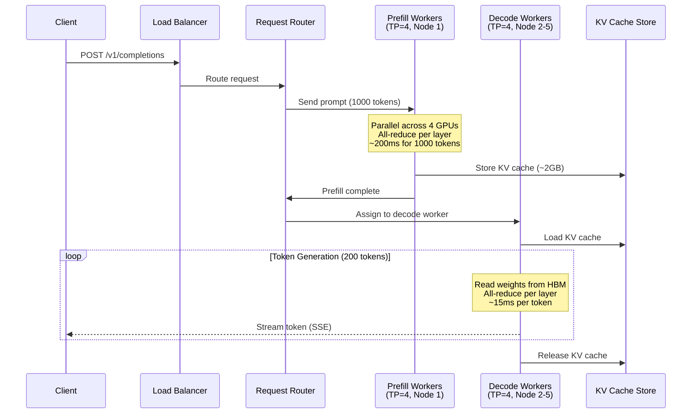

# Distributed Inference

## Why This Matters for Staff Architects

Models too large for a single GPU require distributed inference. The choice between tensor parallelism, pipeline parallelism, and disaggregated architectures determines latency, throughput, cost, and operational complexity. These are architectural decisions with 10× impact on serving economics.

---

## Parallelism Strategies

### Data Parallelism
- **What**: Same model replicated on multiple GPUs, different requests on each
- **When**: Model fits on single GPU, need more throughput
- **Scaling**: Linear throughput increase with GPU count
- **No communication overhead** during inference (each replica independent)
- **Example**: 7B model on 8 separate A100s = 8× throughput

### Tensor Parallelism (TP)
- **What**: Split individual layers across GPUs (Megatron-style)
- **When**: Model too large for single GPU memory
- **Communication**: All-reduce after every transformer layer (~2× per layer)
- **Scaling**: Reduces per-GPU memory, but adds communication overhead
- **Requires**: High-bandwidth interconnect (NVLink mandatory for good performance)
- **Example**: 70B model split across 4 H100s (35GB per GPU)

```
Layer computation with TP=4:

Input → [GPU0: columns 0-2047] → all-reduce → 
        [GPU1: columns 2048-4095] → combine  →  Output
        [GPU2: columns 4096-6143] →
        [GPU3: columns 6144-8191] →
```

### Pipeline Parallelism (PP)
- **What**: Different layers on different GPUs/nodes
- **When**: Model spans multiple nodes (can't use NVLink between nodes)
- **Communication**: Only at stage boundaries (pass activations forward)
- **Trade-off**: Lower bandwidth requirement, but adds latency (sequential stages)
- **Example**: 70B model — layers 0-19 on Node1, layers 20-39 on Node2, etc.

### Combined Strategy (TP + PP)
```
For a 175B model on 16 GPUs (2 nodes × 8 GPUs):

Node 1 (layers 0-47):   TP=8 across 8 GPUs via NVLink
Node 2 (layers 48-95):  TP=8 across 8 GPUs via NVLink
Pipeline: Node1 → Node2 via InfiniBand

This gives:
- Fast intra-layer communication (NVLink 900 GB/s)
- Manageable inter-node communication (only activations, not weights)
```

---

## Serving Framework Comparison

### vLLM
- **Focus**: High-throughput LLM serving with PagedAttention
- **Parallelism**: TP (via Ray or multiprocessing), PP (experimental)
- **Key features**: Continuous batching, PagedAttention, speculative decoding
- **Best for**: Production LLM serving with high concurrency
- **Limitations**: Primarily decoder-only models, Python overhead

### TensorRT-LLM
- **Focus**: Maximum performance via NVIDIA-optimized kernels
- **Parallelism**: TP + PP, inflight batching
- **Key features**: Custom CUDA kernels, quantization (FP8, INT4), KV cache reuse
- **Best for**: Lowest latency, highest throughput on NVIDIA hardware
- **Limitations**: NVIDIA-only, complex build process, longer iteration cycles

### Text Generation Inference (TGI)
- **Focus**: Production-ready serving by Hugging Face
- **Parallelism**: TP (via NCCL)
- **Key features**: Continuous batching, flash attention, quantization
- **Best for**: Hugging Face model ecosystem, quick deployment
- **Limitations**: Less optimized than TensorRT-LLM, fewer parallelism options

### Triton Inference Server
- **Focus**: Multi-framework, multi-model serving platform
- **Parallelism**: Model-level (different models on different GPUs)
- **Key features**: Dynamic batching, model ensemble, multi-backend (ONNX, TRT, PyTorch)
- **Best for**: Multi-model deployments, non-LLM models, ensemble pipelines
- **Limitations**: More operational complexity, less LLM-specific optimization

### Comparison Matrix

| Feature | vLLM | TensorRT-LLM | TGI | Triton |
|---------|------|--------------|-----|--------|
| Throughput | High | Highest | Medium-High | Medium |
| Latency | Low | Lowest | Medium | Medium |
| Ease of use | High | Low | High | Medium |
| Model support | Decoder LLMs | Decoder LLMs | HF models | Any framework |
| Quantization | AWQ, GPTQ, FP8 | FP8, INT4, INT8 | AWQ, GPTQ, BnB | Backend-dependent |
| Continuous batching | ✓ | ✓ | ✓ | Dynamic batching |
| PagedAttention | ✓ | ✓ (variant) | ✓ | N/A |
| Production maturity | High | High | High | Very High |

---

## Distributed Inference Request Flow



---

## Prefill/Decode Disaggregation (Splitwise Pattern)

### The Problem
Prefill and decode have fundamentally different resource profiles:

| Phase | Compute Pattern | Bottleneck | GPU Utilization |
|-------|----------------|-----------|----------------|
| Prefill | Compute-bound (matrix multiply) | FLOPS | High (80%+) |
| Decode | Memory-bound (weight loading) | Bandwidth | Low (5-30%) |

Mixing them on the same GPU causes:
- Prefill latency spikes when decode batch is large
- GPU underutilization during decode (wasting expensive FLOPS)
- Difficult to optimize one without hurting the other

### Disaggregated Architecture
```
Prefill Pool (fewer, high-compute GPUs):
  - Processes prompts in parallel
  - Generates KV cache
  - Optimized for compute throughput
  - Can use larger batch sizes

Decode Pool (more GPUs optimized for bandwidth):
  - Receives KV cache from prefill
  - Generates tokens autoregressively
  - Optimized for memory bandwidth
  - Smaller batches, lower latency

KV Cache Transfer:
  - Via shared memory (same node)
  - Via RDMA/InfiniBand (across nodes)
  - Via high-speed network storage (NVMe-oF)
```

### When to Use Disaggregation
- Long prompts (>2000 tokens) with short outputs
- Strict latency SLAs on time-to-first-token
- Large scale (>16 GPUs dedicated to one model)
- When prefill queue depth causes head-of-line blocking

### When NOT to Use
- Small scale (<4 GPUs)
- Short prompts with long outputs (decode dominates anyway)
- KV cache transfer overhead exceeds the optimization benefit

---

## Load Balancing for Inference

### Least-Tokens-Pending
Best algorithm for LLM inference:
```
Score = tokens_currently_being_processed + 
        tokens_in_queue × estimated_tokens_to_generate
        
Route to: replica with lowest score
```

Why this beats round-robin:
- A request with 10K prompt takes 10× longer to prefill
- Round-robin sends equal requests to each replica regardless of current load
- Least-tokens-pending accounts for actual work remaining

### Session Affinity for Multi-Turn
```
If conversation uses KV cache reuse:
  Route subsequent turns to same replica (preserves cached context)
  Fallback: any replica (recompute KV cache)
```

### Health-Aware Routing
```
Remove from pool if:
  - GPU memory >95% (OOM risk)
  - Response latency >5× p50 (likely thrashing)
  - Error rate >1%
  - Health check fails (model not loaded)
```

---

## Autoscaling Inference

### Scale-to-Zero
```yaml
# KEDA ScaledObject for scale-to-zero
spec:
  minReplicaCount: 0
  maxReplicaCount: 8
  cooldownPeriod: 300  # 5 min after last request
  triggers:
  - type: prometheus
    metadata:
      query: sum(inference_requests_pending)
      threshold: "1"
```

**Trade-off**: Saves 100% cost when idle, but cold start = model loading time (30s-5min).

### Cold Start Mitigation
1. **Keep-warm pool**: Minimum 1 replica always running for low-latency path
2. **Predictive scaling**: Scale up before predicted traffic spike
3. **Model pre-loading**: Keep model in local NVMe, only load to GPU on demand (~30s vs 5min from object store)
4. **Smaller fallback model**: Route to smaller model during scale-up window

### Scaling Signals (Priority Order)
1. Queue depth (most responsive — leading indicator)
2. GPU memory utilization (capacity limit)
3. Request latency p99 (user-facing impact)
4. GPU compute utilization (resource efficiency)

---

## Memory Management

### PagedAttention
Manages KV cache like OS virtual memory:
- KV cache split into fixed-size pages (blocks)
- Non-contiguous physical memory mapped to logical sequence
- Enables: memory sharing between requests, dynamic allocation, near-zero waste

Without PagedAttention: must pre-allocate max_seq_len for every request → 60-80% memory waste.

### Continuous Batching
```
Traditional static batching:
  Wait for batch of 8 requests → process all → return all
  Problem: short requests wait for longest in batch

Continuous batching (iteration-level):
  Each decode step: check for completed/new requests
  Insert new requests immediately after their prefill
  Remove completed requests without waiting for others
  Result: 2-4× throughput improvement
```

### KV Cache Memory Budget
```
Per token per layer:
  2 × num_heads × head_dim × 2 bytes (FP16)
  
LLaMA 70B (80 layers, 64 heads, 128 dim):
  Per token: 2 × 64 × 128 × 2 × 80 = 2.62 MB
  
4096 token context:
  4096 × 2.62 MB = 10.7 GB per sequence
  
Batch of 32:
  32 × 10.7 GB = 342 GB KV cache alone!
  
This is why:
  - KV cache compression (GQA, MQA) is critical
  - PagedAttention prevents waste
  - Large batches need GPU memory beyond just model weights
```

---

## Anti-Patterns

### 1. Synchronization Bottlenecks
**Mistake**: Using TP=8 across nodes connected by 25Gbps Ethernet.
**Impact**: All-reduce dominates latency (100ms+ per layer instead of 0.1ms).
**Fix**: TP only within NVLink-connected GPUs. Use PP across nodes.

### 2. Unbalanced Pipeline Stages
**Mistake**: First pipeline stage has embedding + 50 layers, second has 30 layers.
**Impact**: Second stage idle 40% of the time waiting for first.
**Fix**: Balance FLOPS per stage. Account for embedding/head layers being lighter.

### 3. No Continuous Batching
**Mistake**: Static batching that waits for batch to fill or timeout.
**Impact**: 2-4× lower throughput, high latency variance.
**Fix**: Use vLLM/TGI/TensorRT-LLM which implement continuous batching.

### 4. Over-Parallelizing Small Models
**Mistake**: TP=8 for a 7B model (0.9GB per GPU, mostly empty).
**Impact**: Communication overhead dominates, slower than single GPU.
**Fix**: Use TP only when model doesn't fit on single GPU. Otherwise, replicate.

### 5. Ignoring Prefill/Decode Interference
**Mistake**: No priority between prefill and decode in the same batch.
**Impact**: Long prefill (10K tokens) blocks decode for all concurrent users.
**Fix**: Limit prefill batch size, use chunked prefill, or disaggregate.

---

## Staff Architect Decision Framework

### Step 1: Determine Parallelism Strategy
```
Model memory (FP16) = params × 2 bytes
KV cache per seq = layers × 2 × heads × dim × 2 × seq_len

If model + KV_cache(batch) fits in 1 GPU → Data Parallelism (replicate)
If fits in 1 node (8 GPUs w/ NVLink) → Tensor Parallelism (TP = min needed)
If needs multiple nodes → TP within node + PP across nodes
```

### Step 2: Choose Serving Framework
```
Need max performance, NVIDIA-only? → TensorRT-LLM
Need quick deployment, good perf? → vLLM
Need multi-framework, ensembles? → Triton
Hugging Face models, simplicity? → TGI
```

### Step 3: Design Scaling Architecture
```
Traffic < 10 req/s: Single replica, data parallelism for throughput
Traffic 10-100 req/s: Multiple replicas, HPA on queue depth
Traffic 100-1000 req/s: Disaggregated prefill/decode, multi-tier routing
Traffic > 1000 req/s: Multiple clusters, geographic distribution
```

### Step 4: Validate with Numbers
```
Target: 500 tokens/s output, p99 < 200ms TTFT, 70B model

Decode throughput per H100 (70B, TP=4): ~120 tokens/s per replica
Replicas needed: 500/120 ≈ 5 replicas = 20 H100s for decode

Prefill at 1000 tokens avg prompt: ~100ms on TP=4
TTFT budget: 200ms - 100ms prefill = 100ms queue wait
Max prefill queue: 1 request deep → need enough prefill capacity

Total: 4-8 prefill GPUs + 20 decode GPUs = 24-28 H100s
Monthly cost (reserved): 28 × $25K = $700K/month
```

---

## Key Takeaways

1. **Tensor parallelism within NVLink nodes, pipeline parallelism across nodes** — never TP over slow interconnects
2. **Decode is memory-bandwidth-bound** — more FLOPS doesn't help, more bandwidth does
3. **Continuous batching is table stakes** — 2-4× throughput vs static batching
4. **Prefill/decode disaggregation** unlocks independent scaling at large scale
5. **Right-size parallelism** — over-parallelizing adds overhead without benefit
