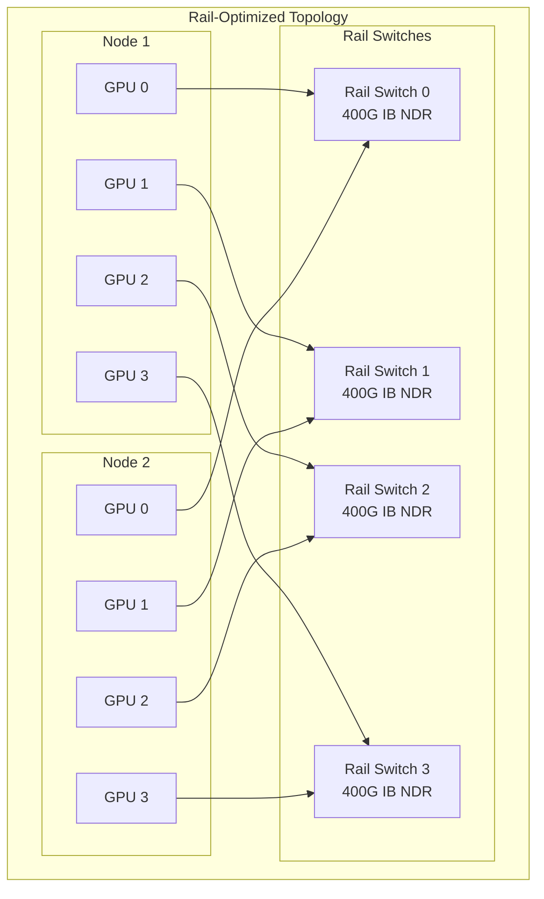

# Networking for AI Infrastructure

## Why This Matters for Staff Architects

Network architecture determines whether your GPU cluster operates at 90% efficiency or 30%. A $10M GPU investment can be crippled by $100K in wrong network switches. Staff architects must understand bandwidth requirements, topology choices, and protocol selection for AI workloads.

---

## Bandwidth Requirements by Workload

### Training (Collective Operations)
```
All-reduce per layer (70B model, TP=8):
  Gradient size = hidden_dim × hidden_dim × 2 bytes × 2 (ring all-reduce)
  = 8192 × 8192 × 2 × 2 = 256 MB per attention layer
  
Total per training step (80 layers):
  ~20 GB of collective communication
  
At NVLink 900 GB/s: ~22ms (acceptable)
At PCIe 64 GB/s: ~312ms (20% of step time — bottleneck!)
At 400Gb IB (50 GB/s): ~400ms (only for PP, not TP)
```

### Inference (Tensor Parallel All-Reduce)
```
Per decode step, 70B model, TP=4:
  All-reduce size = batch_size × hidden_dim × 2 bytes × 2
  Batch=32: 32 × 8192 × 2 × 2 = 1 MB per layer, 80 layers = 80 MB
  
At NVLink 900 GB/s: ~0.09ms (negligible)
At PCIe 64 GB/s: ~1.25ms (adds 100ms over 80 layers — unacceptable!)
```

### Model Download
```
70B FP16 = 140 GB model weights

From S3 (10 Gbps per stream, 100 streams): ~12 seconds
From GCS (parallel composite): ~15 seconds  
From NFS (10 GB/s Lustre): ~14 seconds
From local NVMe (7 GB/s): ~20 seconds
```

### API Serving (Client-Facing)
```
Per request (streaming):
  Input: ~4KB (1000 tokens prompt)
  Output: ~800 bytes streamed over 3 seconds (200 tokens × 4 bytes)
  
10,000 concurrent streams:
  Bandwidth: ~26 Mbps (trivial)
  Connections: 10,000 (needs connection pooling)
  
Network is NOT the bottleneck for API serving — GPU compute is.
```

---

## InfiniBand vs RoCE vs TCP

### InfiniBand (IB)
- **Latency**: 0.6-1.5 μs
- **Bandwidth**: NDR 400 Gb/s (50 GB/s) per port
- **RDMA**: Kernel-bypass, zero-copy, hardware-offloaded collectives
- **Adaptive routing**: Hardware-level congestion avoidance
- **Cost**: ~$5K per port (NIC + switch port)
- **Best for**: GPU-to-GPU training/inference across nodes

### RoCE (RDMA over Converged Ethernet)
- **Latency**: 2-5 μs
- **Bandwidth**: 100-400 Gb/s (depending on NIC)
- **RDMA**: Over standard Ethernet (requires lossless fabric — PFC/ECN)
- **Cost**: ~$2-3K per port
- **Trade-off**: Cheaper than IB, but requires careful network configuration (priority flow control, ECN)
- **Best for**: Budget-constrained clusters, cloud environments without IB

### TCP/IP
- **Latency**: 10-50 μs
- **Bandwidth**: 10-100 Gb/s typical
- **RDMA**: None (kernel involvement on every packet)
- **Cost**: Cheapest
- **Best for**: API serving, model downloads, non-collective traffic
- **NEVER use for**: Tensor parallel all-reduce, training gradient sync

### Decision Matrix

| Use Case | Protocol | Rationale |
|----------|----------|-----------|
| TP all-reduce (intra-node) | NVLink | Highest bandwidth, lowest latency |
| TP all-reduce (inter-node) | InfiniBand | Need RDMA for collective performance |
| PP activations transfer | InfiniBand or RoCE | Lower bandwidth requirement, RDMA still helps |
| Model weight download | TCP or RDMA | One-time cost, throughput matters more than latency |
| Client API traffic | TCP (HTTP/2, gRPC) | Standard protocols, load balancer compatible |
| Monitoring/control plane | TCP | Low bandwidth, standard tooling |

---

## NCCL Deep-Dive

### What is NCCL?
NVIDIA Collective Communications Library — the standard for multi-GPU communication:
- All-reduce, all-gather, reduce-scatter, broadcast, reduce
- Automatically selects optimal algorithm based on topology
- Integrates with NVLink, NVSwitch, InfiniBand, RoCE, TCP

### How NCCL Selects Transport
```
Priority order:
1. NVLink (same node, NVLink-connected GPUs)
2. NVSwitch (same node, all-to-all via switch)
3. InfiniBand with GPUDirect RDMA (cross-node, NIC near GPU)
4. InfiniBand with host memory staging (cross-node, CPU bounce)
5. TCP socket (fallback, worst performance)
```

### NCCL Environment Variables (Critical for Performance)
```bash
# Force specific network interface
export NCCL_SOCKET_IFNAME=eth0

# Enable GPUDirect RDMA
export NCCL_NET_GDR_LEVEL=5

# Set InfiniBand HCA selection
export NCCL_IB_HCA=mlx5

# Number of channels (parallelism in collective)
export NCCL_MIN_NCHANNELS=4
export NCCL_MAX_NCHANNELS=16

# Ring vs tree algorithm threshold
export NCCL_ALGO=Ring  # or Tree, CollnetDirect

# Debug topology detection
export NCCL_DEBUG=INFO
export NCCL_DEBUG_SUBSYS=INIT,NET
```

### NCCL Topology Detection
NCCL discovers GPU-NIC affinity automatically:
```
GPU 0 ↔ NIC 0 (same PCIe switch) → GPUDirect RDMA (fastest)
GPU 1 ↔ NIC 0 (different switch) → CPU bounce buffer (slower)

Optimal: 1 NIC per GPU, on same PCIe switch
DGX H100: 8 GPUs, 8 ConnectX-7 NICs (1:1 mapping)
```

---

## Network Topology for AI

### Fat-Tree (Traditional)
```
        [Core Switches]
       /    |    |    \
    [Agg1] [Agg2] [Agg3] [Agg4]
    / \    / \    / \    / \
  [L1][L2][L3][L4][L5][L6][L7][L8]
   |   |   |   |   |   |   |   |
  Nodes...
```
- Full bisection bandwidth (any node can talk to any other at line rate)
- Expensive (many switches, many cables)
- Standard for general-purpose data centers

### Rail-Optimized (AI-Specific)
```
GPU 0 in all nodes → Rail Switch 0
GPU 1 in all nodes → Rail Switch 1
...
GPU 7 in all nodes → Rail Switch 7

Each GPU has dedicated network path to same-index GPUs in other nodes.
```
- Optimized for all-reduce patterns (GPU i talks to GPU i on other nodes)
- Fewer switches needed (8 rail switches vs full fat-tree)
- 50% less cabling than fat-tree
- Used in NVIDIA DGX SuperPOD reference architecture

### Network Topology Diagram



### Leaf-Spine for Inference Clusters
```
When inference doesn't need collective ops between nodes:
- Standard leaf-spine Ethernet is sufficient
- 100 GbE per node for model loading
- 25 GbE per node for API traffic
- No InfiniBand needed (replicas are independent)
```

---

## Latency Considerations

### Intra-Node Communication
```
NVLink 4.0 (H100):
  Bandwidth: 900 GB/s bidirectional
  Latency: ~1 μs for small messages
  
  All-reduce (1 MB, 8 GPUs via NVSwitch):
    Time = size / bandwidth = 1 MB / 900 GB/s ≈ 1.1 μs
    (Near-zero for typical inference workloads)
```

### Inter-Node Communication
```
InfiniBand NDR 400 Gb/s:
  Bandwidth: 50 GB/s per port (400 Gbps)
  Latency: 1-2 μs base + size/bandwidth
  
  All-reduce (1 MB, across 4 nodes, ring):
    Base: 2 μs
    Transfer: 1 MB / 50 GB/s = 20 μs
    Hops (ring): 2 × (4-1) = 6 passes
    Total: ~6 × 22 μs = ~132 μs

  All-reduce (80 MB, across 4 nodes, ring):
    ~6 × (2 + 1600) μs = ~9.6 ms
```

### Impact on Inference Latency
```
70B model, TP=4, single node (NVLink):
  Per-layer all-reduce: ~0.002 ms
  80 layers × 0.002 ms = 0.16 ms overhead per token
  
70B model, TP=4, across nodes (InfiniBand):
  Per-layer all-reduce: ~0.15 ms
  80 layers × 0.15 ms = 12 ms overhead per token
  
Conclusion: Inter-node TP adds 75× more communication latency.
This is why TP must stay within NVLink-connected GPUs.
```

---

## Model Download Optimization

### P2P Distribution (BitTorrent-style)
```
Problem: 32 nodes each downloading 140GB from object store = 4.5TB total
Solution: First node downloads, then distributes to peers

Node 1: Download from S3 (140GB / 10Gbps = 112s)
Node 1→2: Transfer while downloading rest
Node 1→2, 2→3, 1→4: Parallel P2P spreading

Total time: ~120s instead of 32×112s on shared bandwidth
Tools: Dragonfly (CNCF), Kraken (Uber)
```

### CDN + Local Cache Strategy
```
Layer 1: CDN (CloudFront/Fastly) for model files (global edge cache)
Layer 2: Regional object store (S3/GCS) as source
Layer 3: Cluster-local cache (NFS/Lustre shared filesystem)  
Layer 4: Node-local NVMe cache (fastest, limited capacity)

First load: CDN → local NVMe (~30s for 140GB over high-speed)
Subsequent loads: NVMe → GPU memory (~20s)
Pod restart: NVMe already has model → skip download
```

### Memory-Mapped Loading
```python
# Instead of read() which copies to RAM then GPU:
model = torch.load("model.pt")  # Slow: reads entire file into RAM

# Memory-map: only loads pages actually accessed
import mmap
with open("model.bin", "rb") as f:
    mm = mmap.mmap(f.fileno(), 0, access=mmap.ACCESS_READ)
    # Only pages touched are loaded from SSD
    # Kernel handles prefetching
```

---

## API Gateway Networking

### Connection Pooling
```
Problem: 10,000 concurrent SSE streams to inference backends
Without pooling: 10,000 TCP connections per backend (memory, FD exhaustion)
With pooling: Multiplex over HTTP/2 (100 connections × 100 streams each)
```

### HTTP/2 for Streaming Inference
```
Advantages:
- Multiplexing: many requests over single TCP connection
- Server push: send multiple frames without client requests
- Binary framing: lower overhead than HTTP/1.1 chunked encoding
- Flow control: per-stream (won't block slow clients)

SSE over HTTP/2:
- Each stream = one inference request
- Tokens sent as SSE events
- Connection stays open for multiple requests (session reuse)
```

### Keep-Alive Configuration
```nginx
# Nginx reverse proxy for inference backends
upstream inference_pool {
    server vllm-0:8000;
    server vllm-1:8000;
    keepalive 100;  # Persistent connections to backends
    keepalive_timeout 300s;
}

server {
    location /v1/completions {
        proxy_pass http://inference_pool;
        proxy_http_version 1.1;
        proxy_set_header Connection "";
        proxy_buffering off;  # Required for streaming
        proxy_read_timeout 300s;  # Long generation time
    }
}
```

---

## Anti-Patterns

### 1. TCP for Collective Operations
**Mistake**: Using NCCL over TCP sockets for multi-node training.
**Impact**: 10-50× slower than InfiniBand. Training that takes 1 day takes 10-50 days.
**Fix**: InfiniBand NDR for multi-node collectives. If budget-constrained, RoCE with proper PFC/ECN.

### 2. Ignoring NUMA Topology
**Mistake**: GPU on NUMA node 0 using NIC on NUMA node 1.
**Impact**: Cross-NUMA memory access adds 100-300ns per packet.
**Fix**: Verify GPU-NIC affinity with `nvidia-smi topo -m`. Configure NCCL to use correct NIC per GPU.

### 3. Oversubscribed Network
**Mistake**: 32 GPU nodes sharing a single 100G uplink switch.
**Impact**: 32 × 400G = 12.8 Tb/s demand on 100G link. 128:1 oversubscription.
**Fix**: Non-blocking fabric for training. Acceptable oversubscription ratios:
  - Training: 1:1 (no oversubscription)
  - Inference (independent replicas): 4:1 acceptable
  - API traffic: 10:1 acceptable

### 4. No Network Monitoring
**Mistake**: No visibility into IB fabric errors, congestion, retransmits.
**Impact**: Silent performance degradation. 1% packet loss = 50% throughput drop.
**Fix**: Deploy UFM (NVIDIA), monitor port errors, CRC errors, congestion events.

### 5. Flat Network for Mixed Workloads
**Mistake**: Training traffic, inference traffic, and storage traffic on same network.
**Impact**: Training all-reduce saturates network, inference latency spikes.
**Fix**: Separate networks: IB for compute fabric, Ethernet for storage, Ethernet for API.

---

## Staff Architect Decision Framework

### Step 1: Classify Traffic Types
```
1. Collective compute (all-reduce, all-gather):
   → InfiniBand or NVLink. No exceptions for training.
   → NVLink within node for inference TP.

2. Pipeline activations (point-to-point):
   → InfiniBand preferred, RoCE acceptable.

3. Storage/model loading:
   → High-bandwidth Ethernet (100G+), parallel reads.

4. Client API traffic:
   → Standard Ethernet, load balanced.
```

### Step 2: Select Topology
```
Training cluster: Rail-optimized (matches all-reduce pattern)
Inference cluster (TP within node): Leaf-spine Ethernet sufficient
Mixed: Separate fabrics for compute and storage
```

### Step 3: Size the Network
```
Per node bandwidth:
  Compute: 8 × 400G IB = 3.2 Tb/s (rail-optimized)
  Storage: 2 × 100G Ethernet = 200 Gb/s
  Management: 1 × 25G Ethernet

Total fabric (32 nodes):
  Compute: 256 × 400G ports = 64 rail switches
  Storage: 64 × 100G ports = leaf-spine fabric
```

### Step 4: Budget
```
Compute fabric (32 nodes):
  8 × ConnectX-7 per node: $40K × 32 = $1.28M
  Rail switches (QM9700): $80K × 8 = $640K
  Cables: ~$200K
  Total: ~$2.1M

Compared to GPU cost: 32 × $300K = $9.6M
Network = ~22% of GPU cost. Underspending here cripples the GPUs.
```

---

## Key Takeaways

1. **InfiniBand is mandatory for multi-node collective operations** — TCP/RoCE causes 10-50× slowdown
2. **Rail-optimized topology** saves 50% cabling cost while matching all-reduce patterns
3. **GPU-NIC affinity is critical** — cross-NUMA access adds measurable latency
4. **Network cost should be ~20% of GPU cost** — underspending here wastes GPU investment
5. **Separate networks for separate traffic classes** — never mix collective and API traffic
