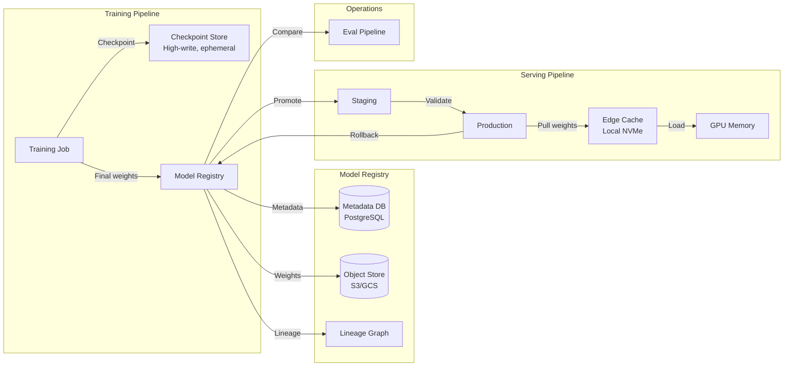
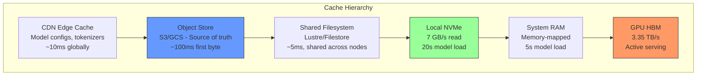

# Storage and Model Registry

## Why This Matters for Staff Architects

A 70B model is 140GB. A fine-tuning run produces checkpoints every hour at 280GB each. Embedding stores hit multi-TB scale. Without proper storage architecture, model deployments take 10+ minutes, rollbacks are impossible, and storage costs spiral. Staff architects design the data lifecycle from training to production.

---

## Model Weight Storage

### Size Reference
```
Model Parameters → Storage Size:

| Model | Params | FP32 | FP16 | FP8 | INT4 (GPTQ) |
|-------|--------|------|------|-----|-------------|
| 1.5B  | 1.5B   | 6 GB | 3 GB | 1.5 GB | 0.9 GB |
| 7B    | 7B     | 28 GB| 14 GB| 7 GB   | 4 GB   |
| 13B   | 13B    | 52 GB| 26 GB| 13 GB  | 7.5 GB |
| 34B   | 34B    | 136 GB| 68 GB| 34 GB | 19 GB  |
| 70B   | 70B    | 280 GB| 140 GB| 70 GB | 40 GB  |
| 405B  | 405B   | 1.6 TB| 810 GB| 405 GB| 230 GB |
```

### Storage Tier Architecture
```
Tier 0: GPU HBM (80 GB per H100)
  - Active model weights + KV cache
  - Fastest: 3.35 TB/s bandwidth
  - Cannot persist across restarts

Tier 1: Local NVMe SSD (1-8 TB per node)
  - Cached model weights for fast loading
  - 7 GB/s sequential read
  - Model load: 140 GB / 7 GB/s = 20 seconds
  - Survives pod restarts (if using hostPath)

Tier 2: Network Filesystem (shared, scalable)
  - Lustre: 10+ GB/s aggregate, shared across nodes
  - NFS (Filestore/EFS): 1-16 GB/s depending on tier
  - Model load: 140 GB / 5 GB/s = 28 seconds
  - Shared across all nodes (ReadOnlyMany)

Tier 3: Object Store (S3/GCS/Blob)
  - Cheapest: $0.02/GB/month
  - 10+ GB/s with parallel downloads
  - Model load: 140 GB / 10 GB/s = 14 seconds (parallel)
  - Source of truth, versioned, durable
```

### Loading Strategy for Production
```
On node startup (DaemonSet):
  1. Check local NVMe for model version
  2. If current → skip
  3. If stale → download from object store to NVMe
  
On pod startup (initContainer):
  1. Load from local NVMe to shared memory
  2. GPU loads from shared memory (fastest path)
  
Benefit: Pod restarts don't re-download from remote storage
```

---

## Model Registry Architecture

### What a Model Registry Stores
```
Per Model Version:
  - Weights (binary files, sharded)
  - Configuration (architecture, tokenizer config)
  - Metadata (training run, dataset, hyperparameters)
  - Metrics (eval scores, benchmarks)
  - Lineage (parent model, fine-tuning dataset, code commit)
  - Deployment config (serving framework, parallelism, quantization)
  - Tags (production, staging, canary, deprecated)
```

### Registry Architecture



### Registry Implementation Options

| Tool | Type | Best For |
|------|------|----------|
| MLflow Model Registry | Open-source | Teams already using MLflow |
| Weights & Biases | SaaS | Experiment tracking + registry |
| DVC | Git-based | Version control mental model |
| Hugging Face Hub | SaaS/Self-hosted | HF ecosystem models |
| Custom (S3 + DB) | DIY | Full control, enterprise needs |
| Vertex AI Model Registry | Managed (GCP) | GCP-native teams |
| SageMaker Model Registry | Managed (AWS) | AWS-native teams |

### Versioning Scheme
```
models/
  llama-70b/
    v1.0.0/          # Base model (original weights)
    v1.1.0/          # Fine-tuned for domain
    v1.1.1/          # Quantized to FP8
    v2.0.0/          # Re-trained on new data
    
Semantic versioning:
  MAJOR: Architecture change or full retrain
  MINOR: Fine-tune or significant behavior change  
  PATCH: Quantization, optimization, no behavior change
```

---

## Checkpoint Storage for Fine-Tuning

### Requirements
```
Checkpoint characteristics:
  - Size: Full model weights + optimizer state + scheduler
  - 70B model checkpoint: ~280 GB (FP16 weights) + 560 GB (Adam optimizer) = 840 GB
  - LoRA checkpoint: ~1-5 GB (only adapter weights)
  - Frequency: Every 100-1000 steps (every 10-60 minutes)
  - Retention: Keep last N + best checkpoint
  
Storage requirements for 24-hour training run:
  Full fine-tune: 840 GB × 24 checkpoints = 20 TB
  LoRA fine-tune: 3 GB × 24 checkpoints = 72 GB
```

### Checkpoint Storage Strategy
```
Write path (fast, temporary):
  GPU → Local NVMe (7 GB/s write)
  Then async upload to object store
  
  Never block training on storage I/O!
  Use asynchronous checkpointing (torch.distributed.checkpoint)

Retention policy:
  Local NVMe: Last 2 checkpoints (for crash recovery)
  Object store: Last 5 + best (by eval metric)
  Archive: Monthly consolidation to cheaper storage tier
  
Cost optimization:
  - Use S3 Intelligent Tiering (auto-moves old checkpoints to cold)
  - Delete optimizer states after training (only keep weights)
  - Compress checkpoints (20-30% savings with zstd)
```

---

## Embedding Storage at Scale

### Scale Reference
```
Embedding dimensions: 768 (small), 1536 (OpenAI), 3072 (large)

Storage calculation:
  1M documents × 1536 dims × 4 bytes (FP32) = 5.7 GB
  100M documents × 1536 dims × 4 bytes = 573 GB
  1B documents × 1536 dims × 4 bytes = 5.7 TB
  
With quantization (int8):
  1B documents × 1536 dims × 1 byte = 1.4 TB
  
With binary quantization:
  1B documents × 1536 dims × 1 bit = 183 GB
```

### Storage Options for Vectors

| Solution | Max Vectors | Latency | Cost Model |
|----------|------------|---------|-----------|
| Pinecone | Billions | 10-50ms | Per vector/month |
| Qdrant | 100M+ per node | 5-20ms | Self-hosted or cloud |
| Weaviate | 100M+ per node | 5-30ms | Self-hosted or cloud |
| pgvector | 10M per instance | 10-100ms | Database cost |
| FAISS (in-memory) | Limited by RAM | <5ms | Compute cost |
| Milvus | Billions (distributed) | 5-20ms | Self-hosted |

### Tiered Vector Storage
```
Hot (in GPU memory): 
  Most-accessed vectors for real-time search
  Capacity: ~1M vectors per GPU (80GB / 6KB per vector)
  
Warm (in RAM):
  Active index, all vectors in memory
  Capacity: 100M vectors per node (600GB RAM)
  
Cold (on-disk with memory-mapped index):
  Index in RAM, vectors on SSD
  Capacity: 1B+ vectors per node
  Latency: 1-5ms (SSD random read)
```

---

## Cache Hierarchy for Model Serving



### Cache Invalidation
```
Model update workflow:
  1. New version uploaded to registry (object store)
  2. Registry publishes event (version changed)
  3. Cache nodes receive invalidation signal
  4. Background: download new version to local NVMe
  5. When ready: hot-swap (load new to GPU, unload old)
  6. Zero-downtime deployment: rolling update across replicas
```

---

## Data Loading Pipelines

### Prefetching
```python
# Naive loading (blocks inference):
model = load_from_disk("/models/llama-70b")  # 20 seconds blocked

# Prefetch pattern:
# Background thread loads next model version while current serves
class ModelManager:
    def prefetch(self, model_id, version):
        """Load model to NVMe in background"""
        threading.Thread(
            target=self._download,
            args=(model_id, version)
        ).start()
    
    def swap(self, model_id, version):
        """Atomic swap: load prefetched model to GPU"""
        new_model = self._load_from_nvme(model_id, version)
        old_model = self.active_model
        self.active_model = new_model  # Atomic pointer swap
        del old_model  # Free GPU memory
```

### Parallel Sharded Loading
```
70B model stored as 8 shards (17.5 GB each):
  shard-00001-of-00008.safetensors
  shard-00002-of-00008.safetensors
  ...

Parallel load (8 threads):
  Time = max_shard_size / bandwidth = 17.5 GB / 7 GB/s = 2.5s
  vs Sequential: 140 GB / 7 GB/s = 20s
  
8× speedup with parallel shard loading!
```

### Memory Mapping for Large Models
```
Traditional: read() → RAM copy → GPU copy (2× RAM needed)
Memory-mapped: mmap() → direct DMA to GPU (0× extra RAM)

Benefits:
  - No 2× memory requirement for loading
  - OS handles page caching (warm restarts are instant)
  - Multiple processes can share mapped pages (CoW)
  
Works with safetensors format (memory-map friendly):
  model = safetensors.torch.load_file("model.safetensors", device="cuda")
```

---

## Anti-Patterns

### 1. Storing Models in Container Images
**Mistake**: Baking 140GB model into Docker image.
**Impact**: 
  - Image pull takes 20+ minutes
  - Container registry costs explode
  - Can't update model without rebuilding image
  - Image layers don't compress model weights well
**Fix**: Separate model weights from application code. Load at runtime from registry.

### 2. No Model Versioning
**Mistake**: Overwriting `latest` tag with new model weights.
**Impact**: Can't rollback, can't reproduce results, no audit trail.
**Fix**: Immutable versions. `latest` is a pointer, not a destination.

### 3. Blocking Training on Checkpoint Upload
**Mistake**: Synchronous checkpoint save to S3 in training loop.
**Impact**: Training step pauses 30-60 seconds per checkpoint (lost GPU time).
**Fix**: Async checkpointing — save to local NVMe, background upload to object store.

### 4. No Storage Tiering
**Mistake**: All models (including unused) on expensive high-performance storage.
**Impact**: $0.30/GB/month × 10TB of old models = $3K/month wasted.
**Fix**: Auto-tier: hot models on NVMe, warm on NFS, cold on object store, archive on Glacier.

### 5. Single-Region Model Storage
**Mistake**: Models in us-east-1, serving from eu-west-1.
**Impact**: 140GB cross-region download per pod startup, egress charges.
**Fix**: Replicate model weights to each serving region. Use multi-region object store.

### 6. No Integrity Verification
**Mistake**: Loading model weights without checksum verification.
**Impact**: Corrupted download → silent model quality degradation or crashes.
**Fix**: SHA256 checksums in registry. Verify before loading. Safetensors format has built-in integrity checks.

---

## Staff Architect Decision Framework

### Step 1: Calculate Storage Requirements
```
Inputs:
  - Number of models in production: N
  - Largest model size: X GB
  - Fine-tuning cadence: every M days
  - Checkpoint retention: K checkpoints
  - Embedding corpus size: V vectors × D dimensions

Storage needed:
  Production models: N × X GB × 2 (current + rollback)
  Checkpoints: K × (X × 6) GB (weights + optimizer)
  Embeddings: V × D × 4 bytes
  Buffer (30%): multiply total by 1.3
```

### Step 2: Design Cache Strategy
```
For serving latency < 30s cold start:
  Local NVMe mandatory (keeps models warm across pod restarts)
  
For serving latency < 5s cold start:
  Models pre-loaded in RAM (memory-mapped)
  Requires: sufficient RAM headroom on GPU nodes

For zero-downtime deployments:
  2× GPU memory available (old + new model simultaneously)
  OR: rolling update with load balancer draining
```

### Step 3: Choose Registry
```
< 10 models, single team: MLflow or simple S3 + metadata file
10-100 models, multiple teams: MLflow + governance policies
Enterprise (100+ models): Custom registry with RBAC, lineage, compliance
Cloud-native: Use provider's managed registry (Vertex/SageMaker)
```

### Step 4: Plan for Scale
```
Year 1: 5 models, 2TB storage → S3 + local NVMe cache
Year 2: 20 models, 10TB + embeddings → Tiered storage + registry
Year 3: 50+ models, multi-region → Full lifecycle management, FinOps
```

---

## Key Takeaways

1. **Separate model weights from application code** — never in container images
2. **Local NVMe is mandatory for fast model loading** — 7× faster than network FS
3. **Async checkpointing** prevents training time waste on I/O
4. **Immutable versioning** enables instant rollback and reproducibility
5. **Storage costs scale with model count** — implement tiering early
6. **Parallel shard loading** cuts startup time by Nx (where N = shard count)
