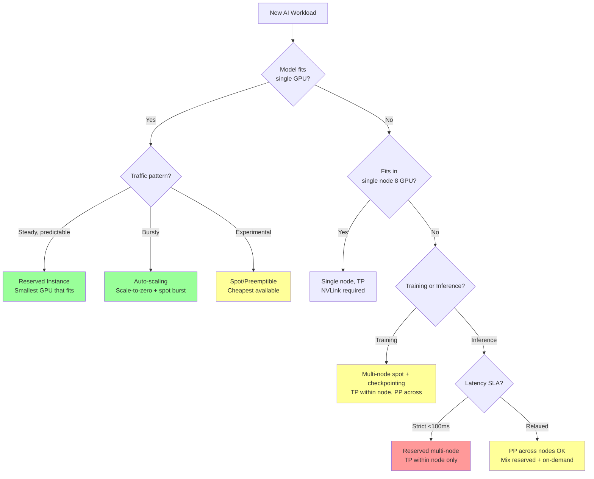

# Cost Engineering at Scale

## Why This Matters for Staff Architects

AI infrastructure is the most expensive line item in many engineering budgets. A single H100 cluster costs $70K+/month in cloud. Staff architects who understand cost engineering save organizations millions annually through right-sizing, tiering, and strategic procurement. This is not about penny-pinching — it's about maximizing AI capability per dollar.

---

## Total Cost of Ownership (TCO)

### Cloud TCO Components
```
Monthly cost per 8× H100 node (cloud):

Compute (on-demand):     $70,000/month  (70%)
Storage (2TB NVMe):       $3,000/month   (3%)
Networking (IB egress):   $5,000/month   (5%)
Kubernetes/management:    $2,000/month   (2%)
Monitoring/observability: $1,500/month   (1.5%)
Engineering time (ops):  $15,000/month  (15%)
Licenses (TensorRT, etc): $3,500/month   (3.5%)
────────────────────────────────────────────────
Total:                  ~$100,000/month per node
```

### Self-Hosted TCO Components
```
Monthly cost per DGX H100 node (self-hosted, 3yr amortized):

Hardware amortization:    $8,300/month  (42%)
Power (5.6KW × $0.10/kWh): $4,000/month   (20%)
Cooling (PUE 1.3):       $1,200/month   (6%)
Data center space:        $2,000/month  (10%)
Networking (IB fabric):   $1,500/month   (8%)
Operations team (shared): $2,000/month  (10%)
Spare parts/warranty:       $800/month   (4%)
────────────────────────────────────────────────
Total:                   ~$20,000/month per node
```

### Break-Even Analysis
```
Cloud on-demand: $100K/month
Cloud 1-yr reserved: $65K/month
Cloud 3-yr reserved: $45K/month
Self-hosted: $20K/month

Self-hosted break-even vs cloud reserved (1yr):
  Upfront: $300K (hardware) + $100K (networking) + $50K (setup)
  Monthly savings: $65K - $20K = $45K
  Break-even: $450K / $45K = 10 months
  
But requires:
  - 3+ ML infrastructure engineers ($600K+/year)
  - Data center capacity
  - 70%+ sustained utilization
  - 3-year hardware commitment
```

---

## Cloud GPU Pricing Comparison

### Per-GPU-Hour Pricing (as of 2024)

| GPU | AWS | GCP | Azure | CoreWeave | Lambda |
|-----|-----|-----|-------|-----------|--------|
| H100 SXM (8-pack) | $12.26/GPU/hr | $12.63/GPU/hr | $12.00/GPU/hr | $9.38/GPU/hr | $8.75/GPU/hr |
| A100 80GB (8-pack) | $5.12/GPU/hr | $5.07/GPU/hr | $4.60/GPU/hr | $3.75/GPU/hr | $3.00/GPU/hr |
| A100 40GB | $4.10/GPU/hr | $3.67/GPU/hr | $3.40/GPU/hr | — | $2.50/GPU/hr |
| L40S | — | $2.35/GPU/hr | $2.10/GPU/hr | $1.50/GPU/hr | — |
| T4 | $0.53/GPU/hr | $0.35/GPU/hr | $0.45/GPU/hr | — | — |

### Discount Structures

| Type | Discount | Commitment | Flexibility |
|------|----------|-----------|-------------|
| On-demand | 0% | None | Full |
| Spot/Preemptible | 60-90% off | None (can be interrupted) | High risk |
| 1-year reserved | 30-40% off | 1 year | Low |
| 3-year reserved | 50-60% off | 3 years | None |
| Committed use (GCP) | 50-57% off | 1-3 years | Some flexibility |
| Savings Plans (AWS) | 30-50% off | 1-3 years | Instance flexibility |

### Spot Instance Strategy
```
Suitable for:
  ✓ Training with checkpointing (resume after preemption)
  ✓ Batch inference (queue-based, retryable)
  ✓ Experimentation and development
  ✓ Burst capacity on top of reserved base

NOT suitable for:
  ✗ Production inference (user-facing, can't tolerate interruption)
  ✗ Real-time serving with SLAs
  ✗ Multi-node training without checkpoint infra
  
Mitigation:
  - Checkpoint every 10-30 minutes
  - Diversify across zones/regions
  - Graceful shutdown handlers (2-minute warning)
  - Fallback to on-demand if spot unavailable
```

---

## Right-Sizing GPU to Workload

### The Most Common Waste
```
Scenario: Running Llama-7B (14GB FP16) on H100 (80GB HBM3)
  GPU memory utilization: 14/80 = 17.5%
  Cost: $12/hr
  
Better: Run on A100 40GB or L40S 48GB
  GPU memory utilization: 14/40 = 35% (more room for KV cache batching)
  Cost: $4/hr (3× cheaper!)
  
Even better: Quantize to INT4 (4GB) and run on T4 (16GB)
  GPU memory utilization: 4/16 = 25%
  Cost: $0.50/hr (24× cheaper!)
```

### Right-Sizing Decision Table

| Model Size | Quantization | Min GPU | Recommended | Monthly Cost |
|-----------|-------------|---------|-------------|-------------|
| 1-3B | FP16 | T4 (16GB) | T4 | $360 |
| 7B | FP16 | L40S (48GB) | A100 40GB | $3,000 |
| 7B | INT4 | T4 (16GB) | T4 or L4 | $360 |
| 13B | FP16 | A100 40GB | A100 80GB | $3,700 |
| 34B | FP16 | A100 80GB | 2× A100 | $7,400 |
| 70B | FP16 | 2× H100 | 4× H100 TP | $36,000 |
| 70B | FP8 | 1× H100 | 2× H100 TP | $18,000 |
| 405B | FP8 | 8× H100 | 16× H100 TP+PP | $144,000 |

---

## Cost Decision Tree



---

## Multi-Tier Inference

### Route by Complexity
```
Tier 1 (Cheapest): Small model or cache hit
  - Exact match in response cache → $0
  - Simple queries → 7B quantized on T4 ($0.50/hr)
  - Cost per 1M tokens: ~$0.05

Tier 2 (Medium): Standard model
  - Most requests → 70B on 4× A100 ($20/hr)
  - Cost per 1M tokens: ~$0.50

Tier 3 (Expensive): Largest/best model
  - Complex reasoning → 405B on 8× H100 ($100/hr)
  - Cost per 1M tokens: ~$5.00
  
Router logic:
  If query is simple classification/extraction → Tier 1
  If query is standard generation → Tier 2
  If query needs deep reasoning or user is premium → Tier 3
```

### Savings from Tiering
```
Without tiering (all requests to 70B):
  1M requests/day × $0.50/1M tokens × 500 avg tokens = $250K/month

With tiering (60% Tier 1, 30% Tier 2, 10% Tier 3):
  600K × $0.05 × 500 = $15K
  300K × $0.50 × 500 = $75K  
  100K × $5.00 × 500 = $250K
  Total = $340K/month... worse?
  
Adjust: Tier 3 only for long-form (2000 tokens):
  100K × $5.00 × 2000 = $1M... even worse!

Real optimization: Tier 1 handles 80% with 100-token responses:
  800K × $0.05 × 100 = $4K
  180K × $0.50 × 500 = $45K
  20K  × $5.00 × 2000 = $200K
  Total = $249K/month (vs $250K baseline)

Key insight: Tiering saves money ONLY if the cheap tier handles
most requests AND those requests have short outputs.
The real win is routing AWAY from expensive models, not just to cheaper ones.
```

---

## Capacity Planning

### From Traffic Forecast to GPU Count
```
Step 1: Forecast traffic
  Current: 100 requests/second
  Growth: 20%/month
  6-month target: 100 × 1.2^6 = 300 requests/second

Step 2: Determine throughput per GPU
  Model: 70B FP16, TP=4 on H100
  Per-replica throughput: ~150 tokens/s output
  Average output length: 200 tokens
  Effective requests/s per replica: 150/200 = 0.75 req/s
  (But with batching of 32): ~15 req/s per replica

Step 3: Calculate replicas
  Target: 300 req/s
  Per replica: 15 req/s
  Replicas needed: 300/15 = 20 replicas
  Each replica = 4 GPUs (TP=4)
  Total GPUs: 80× H100

Step 4: Add headroom
  Peak multiplier (2×): 160 GPUs
  Redundancy (N+1 per 10): 176 GPUs
  
  Reality check: 176 H100s at reserved pricing = ~$1.5M/month

Step 5: Optimization
  Apply quantization (FP8): halve GPU count → 88 GPUs
  Apply tiering (70% to 7B model): 
    70B: 26 GPUs, 7B: 8 GPUs = 34 GPUs total
  Monthly cost: ~$300K (vs $1.5M unoptimized)
```

### Capacity Planning Template
```
| Metric | Current | +3mo | +6mo | +12mo |
|--------|---------|------|------|-------|
| Requests/sec (p50) | | | | |
| Requests/sec (p99) | | | | |
| Avg input tokens | | | | |
| Avg output tokens | | | | |
| Latency SLA (p99) | | | | |
| GPU type | | | | |
| GPUs needed (base) | | | | |
| GPUs needed (peak) | | | | |
| Monthly cost | | | | |
```

---

## FinOps Practices

### Chargeback Model
```
Cost attribution per team:
  
  Team A (Search):
    - 4× A100 reserved (embedding generation)
    - 2× T4 on-demand (reranking)
    - Monthly: $18,000
    
  Team B (Chatbot):
    - 8× H100 reserved (70B model serving)
    - Burst: 4× H100 spot (peak hours)
    - Monthly: $85,000
    
  Team C (Analytics):
    - Shared T4 pool (time-sliced)
    - Spot training jobs
    - Monthly: $5,000

Implementation:
  - K8s namespaces per team with ResourceQuotas
  - GPU-hours tracked via Prometheus + custom metrics
  - Monthly report: actual usage vs budget
  - Alert at 80% budget consumption
```

### Showback Dashboard Metrics
```
Per team:
  - GPU-hours consumed (by GPU type)
  - GPU utilization (actual compute vs allocated)
  - Cost per request / per 1M tokens
  - Waste: allocated but idle GPU-hours
  - Trend: MoM cost change

Per model:
  - Serving cost per 1M tokens
  - Infrastructure cost per user-session
  - Margin: revenue per request - infra cost per request
```

### Cost Optimization Leaderboard
```
Quick wins (implement in days):
  1. Kill idle GPU pods (scale-to-zero): -20% cost
  2. Right-size GPU type: -30% cost
  3. Enable spot for training: -60% training cost
  4. Add response caching: -10-30% inference cost

Medium effort (weeks):
  5. Quantize models (FP8/INT4): -50% serving cost
  6. Implement multi-tier routing: -30% serving cost
  7. Reserved instances for base load: -35% cost
  
Strategic (months):
  8. Speculative decoding: +2× throughput (same GPUs)
  9. Custom distilled models: -80% vs large model
  10. Self-hosting evaluation: potential -60% at scale
```

---

## Build vs Buy Break-Even

### Analysis Framework
```
Variables:
  R = monthly request volume
  C_api = cost per request via API (e.g., $0.03 per 1K tokens)
  C_self = monthly self-hosting cost (fixed + variable)
  
API cost: R × C_api
Self-host cost: C_self (mostly fixed)

Break-even: R × C_api = C_self
  R_breakeven = C_self / C_api

Example (70B model equivalent):
  API (Claude/GPT-4 class): $0.015 per 1K output tokens
  Self-hosted (8× H100 reserved): $65K/month
  Throughput capacity: ~500 tokens/s = 1.3B tokens/month
  
  Break-even requests: $65K / $0.015 per 1K = 4.3M K-tokens = 4.3B tokens
  At capacity (1.3B tokens/month): API would cost $19.5K
  
  So self-hosting 8× H100 only wins if you EXCEED their capacity
  AND you're running at high utilization.
  
  Real break-even: ~$200K+/month in API spend before self-hosting saves money
  (accounting for ops team, maintenance, and <100% utilization)
```

### Decision Criteria Beyond Cost
```
Self-host when:
  ✓ Data sovereignty requirements (can't send data to API)
  ✓ Customization needs (fine-tuned models, custom architectures)
  ✓ Latency requirements (co-located inference)
  ✓ Volume exceeds $200K/month API spend consistently
  ✓ You have ML infrastructure team (3+ engineers)
  
Use API when:
  ✓ Rapid prototyping and iteration
  ✓ Volume < $200K/month
  ✓ No data residency requirements
  ✓ Want latest models without retraining
  ✓ Team lacks GPU operations expertise
  ✓ Unpredictable/spiky traffic
```

---

## Staff Architect's Cost Proposal Template

```markdown
# AI Infrastructure Cost Proposal

## Executive Summary
- Current monthly spend: $___
- Proposed monthly spend: $___
- Annual savings: $___
- Implementation effort: ___ engineering-months

## Current State
- Models in production: [list with sizes]
- Current GPU allocation: [type × count]
- Current utilization: ___%
- Current cost per request: $___

## Proposed Architecture
- GPU selection: [type × count, with rationale]
- Procurement strategy: [reserved/spot/on-demand mix]
- Optimization applied: [quantization, tiering, caching]

## Cost Comparison

| Item | Current | Proposed | Savings |
|------|---------|----------|---------|
| GPU compute | $ | $ | $ |
| Storage | $ | $ | $ |
| Networking | $ | $ | $ |
| Operations | $ | $ | $ |
| Total | $ | $ | $ |

## Risk Analysis
- Risk 1: [e.g., spot interruption] → Mitigation: [checkpointing]
- Risk 2: [e.g., capacity constraints] → Mitigation: [multi-cloud]

## Implementation Timeline
- Week 1-2: [Right-sizing, kill idle resources]
- Week 3-4: [Quantization, caching]
- Month 2: [Reserved procurement, tiering]
- Month 3: [Self-hosting evaluation if applicable]

## Success Metrics
- Cost per 1M tokens: target $___
- GPU utilization: target ___%
- Monthly infrastructure spend: target $___
```

---

## Anti-Patterns

### 1. No Cost Visibility
**Mistake**: Teams deploy GPU pods without knowing the cost.
**Impact**: $500K/month surprise bills.
**Fix**: Real-time cost dashboards, budget alerts, mandatory cost estimates in deployment PRs.

### 2. Premium GPUs for All Workloads
**Mistake**: H100 for everything including 3B model inference.
**Impact**: 5-10× overspend on simple workloads.
**Fix**: Enforce right-sizing review. Match GPU to model size.

### 3. Always-On for Variable Traffic
**Mistake**: 24/7 GPU allocation for service that gets 10× traffic only 8 hours/day.
**Impact**: Paying for 16 hours of near-idle GPUs daily.
**Fix**: Auto-scaling with scale-to-zero for off-peak, warm pool for latency-sensitive.

### 4. No Caching Strategy
**Mistake**: Every identical request runs full inference.
**Impact**: Redundant GPU computation for repeated queries (up to 30% of traffic).
**Fix**: Semantic cache, exact-match cache, prompt-prefix cache.

### 5. Ignoring Egress Costs
**Mistake**: Streaming inference responses across regions.
**Impact**: At $0.08/GB, 1TB/month egress = $80. Not huge, but scales.
**Fix**: Serve from same region as users. CDN for static content.

---

## Key Takeaways

1. **Right-sizing is the #1 cost optimization** — wrong GPU choice wastes 3-10× the money
2. **Self-hosting only makes sense above $200K/month API spend** with dedicated ops team
3. **Multi-tier routing** can cut costs 50%+ by matching model capability to query complexity
4. **Spot instances for training** save 60-90% — always use with checkpointing
5. **FinOps visibility is prerequisite** — you can't optimize what you can't measure
6. **Quantization is free money** — FP8/INT4 cuts GPU count by 50% with minimal quality loss
