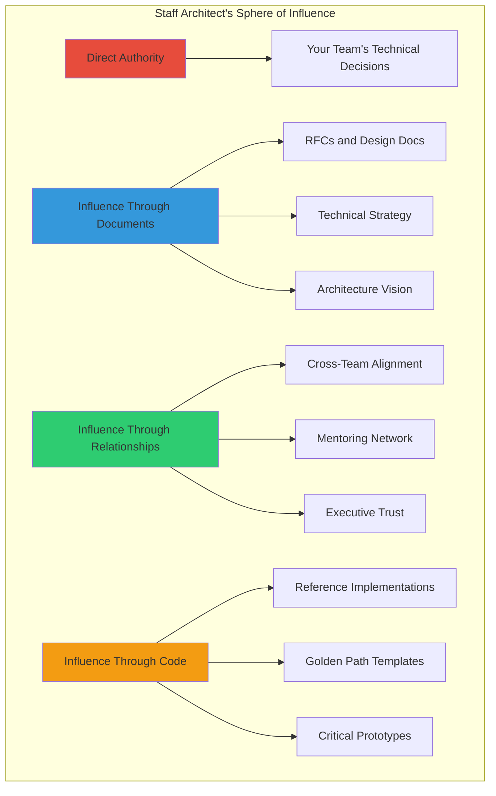

# What Staff Architects Actually Do

## The Fundamental Shift: It's a Different Job

Here's the uncomfortable truth that nobody tells you before you reach Staff level: **the skills that got you promoted to Senior will not get you promoted to Staff**. In fact, they might actively hold you back.

At Senior level, you're rewarded for:
- Writing excellent code
- Owning complex features end-to-end
- Deep expertise in specific technologies
- Being the fastest problem solver on the team

At Staff level, you're rewarded for:
- Making everyone around you more effective
- Solving problems that span multiple teams
- Writing documents that align organizations
- Making decisions that won't need to be revisited
- Identifying the RIGHT problems to solve (not just solving them well)

This isn't a promotion in the traditional sense. It's a career change that happens to share the same company and codebase.

```
Senior Engineer: "I built the best recommendation engine."
Staff Engineer:  "I created the architecture that lets 5 teams 
                  build recommendation engines independently 
                  without stepping on each other."
```

## Staff Archetypes (Will Larson's Framework)

Will Larson identified four archetypes of Staff+ engineers. Most Staff architects are a blend, but understanding the archetypes helps you find your fit:

### 1. Tech Lead
- **Scope**: Single team, deep ownership
- **Activities**: Design authority, team technical direction, partner with EM
- **AI Example**: The person who owns the entire inference pipeline for one product
- **Strength**: Execution certainty
- **Risk**: Becomes a bottleneck, can't delegate

### 2. Architect
- **Scope**: Multi-team, cross-cutting concerns
- **Activities**: System design, technical strategy, standards
- **AI Example**: The person defining how all teams integrate with the ML platform
- **Strength**: Coherence across systems
- **Risk**: Ivory tower, disconnected from reality

### 3. Solver
- **Scope**: Wherever the hardest problem is
- **Activities**: Parachutes into critical problems, unblocks
- **AI Example**: Called in when model serving hits scaling limits nobody can crack
- **Strength**: Unblocking velocity
- **Risk**: Creates hero dependency, no sustained ownership

### 4. Right Hand
- **Scope**: Organization-wide, executive extension
- **Activities**: Whatever the VP of Eng needs, strategic initiatives
- **AI Example**: Leading the "AI cost reduction" initiative across all product lines
- **Strength**: Organizational leverage
- **Risk**: Too political, loses technical edge

## Day in the Life: What Actually Fills the Calendar

A typical week for a Staff AI Architect:

| Day | Morning | Afternoon |
|-----|---------|-----------|
| Mon | Design review: new RAG pipeline proposal | Writing: Technical strategy doc draft |
| Tue | 1:1 mentoring with senior engineer | Cross-team sync: model serving standards |
| Wed | Code review (selective, teaching-focused) | RFC feedback for 2 proposals |
| Thu | Architecture guild presentation | Stakeholder meeting with Product VP |
| Fri | Prototype: evaluating new approach | Writing: Architecture decision record |

**Key observation**: Notice how little of this is writing code. A Staff architect might write code 20-30% of the time, and that code is usually:
- Prototypes proving a concept
- Critical path code that sets patterns for others
- Tooling that multiplies the team

## The Influence Model: Persuasion Over Authority



**The critical insight**: You have almost no direct authority. You can't tell other teams what to do. You can't mandate adoption. You can't fire people who disagree with you. Everything you accomplish is through:

1. **Writing** - Documents that make your case so clearly that agreement becomes obvious
2. **Relationships** - Trust built over months of being helpful, reliable, and right
3. **Demonstrations** - Prototypes and examples that prove the approach works
4. **Teaching** - Helping others see what you see, so they reach the same conclusions

## Scope: The Expanding Horizon

As you progress through Staff levels:

```
Staff Engineer:     Team → Adjacent teams
Senior Staff:       Organization (engineering org)
Principal:          Company-wide (engineering + product + business)
Distinguished:      Industry (setting standards beyond your company)
```

**For AI specifically:**

| Level | Typical Scope | Example Decision |
|-------|---------------|-----------------|
| Staff | "How should our team do RAG?" | Choose retrieval strategy |
| Senior Staff | "How should the company do RAG?" | Define RAG platform architecture |
| Principal | "Should we build or buy AI infrastructure?" | Build vs buy vs partner strategy |
| Distinguished | "How should the industry think about AI agents?" | Publish frameworks, speak at conferences |

## How to Get Promoted to Staff

### The "Staff Project" Myth

Many people believe: "I need one big project that demonstrates Staff-level work."

**Reality**: Staff promotion is about **sustained demonstration** of operating at that level, not a single project. The "Staff project" is what makes the case legible to a promotion committee, but it's not what actually gets you there.

What actually gets you promoted:
1. **Pattern of impact beyond your team** - You've been influencing adjacent teams for 6-12 months
2. **Technical judgment that's trusted** - People seek your opinion before making decisions
3. **Documents that shaped direction** - You wrote the strategy that 3 teams adopted
4. **Mentoring visible results** - Engineers you've coached got promoted or unblocked
5. **A "Staff project" that packages the above** - The capstone, not the foundation

### What Demonstrates Staff-Level Work

- Writing an RFC that changes how multiple teams work
- Identifying and articulating a technical problem nobody else saw
- Building alignment between teams that were previously conflicting
- Creating abstractions that simplified work for 20+ engineers
- Defining evaluation methodology that became the company standard
- Leading a migration that required coordinating 5+ teams

## Anti-Patterns: How Staff Engineers Fail

### The Ivory Tower Architect
- Produces beautiful diagrams nobody implements
- Hasn't touched production code in years
- Designs are technically elegant but ignore operational reality
- **Fix**: Spend 1 day/week on-call or writing production code

### The Code-Only Staff
- Still operates like a very fast Senior engineer
- Produces excellent code but doesn't multiply others
- Avoids writing documents or attending alignment meetings
- **Fix**: Force yourself to write one design doc per month, mentor one person

### The Meeting-Only Staff
- Calendar is 100% meetings, zero maker time
- Has opinions on everything but builds nothing
- Influence comes from presence, not substance
- **Fix**: Block 2 full days per week for deep work, say no to 50% of meetings

### The "Brilliant Jerk"
- Technically excellent but destroys psychological safety
- Other engineers avoid their code reviews
- Right about architecture, wrong about people
- **Fix**: This one requires deep personal work, or a role change

## What Makes AI Staff Architects Different

AI systems introduce challenges that don't exist in traditional software:

### Non-Determinism as a First-Class Concern
- Traditional: "Given input X, output is Y"
- AI: "Given input X, output is probably Y-ish, maybe Z"
- **Staff skill**: Designing systems that are robust to probabilistic behavior

### Evaluation is the Product
- Traditional: Unit tests prove correctness
- AI: Evaluation methodology IS the architecture decision
- **Staff skill**: Creating eval frameworks that the whole org trusts

### Cost is Architecture
- Traditional: Compute cost is table stakes
- AI: A single model call can cost $0.10, multiplied by millions of users
- **Staff skill**: Making cost-performance tradeoffs explicit in design docs

### The Field Changes Monthly
- Traditional: React has been dominant for 8 years
- AI: The best approach from 6 months ago might be obsolete
- **Staff skill**: Building architectures that can absorb paradigm shifts

### Ethics and Safety are Engineering Problems
- Traditional: Security is a concern but well-understood
- AI: Novel harms, bias, misuse - no established playbook
- **Staff skill**: Embedding safety into architecture, not bolting it on

## Red Flags You're NOT Operating at Staff Level

- [ ] You can't name 3 engineers you've meaningfully mentored this quarter
- [ ] You haven't written a design document in the last month
- [ ] No one outside your team has asked for your technical opinion recently
- [ ] Your manager has to tell you what to work on (vs you proposing)
- [ ] You've never written a document that changed another team's direction
- [ ] You optimize for personal code output rather than team velocity
- [ ] You can't explain your company's AI technical strategy in 3 sentences
- [ ] You've never said "we shouldn't build this" and been listened to

## Practice Exercise

### Exercise: Map Your Current Staff-Level Activities

1. **Time Audit**: Track your activities for one week. Categorize them:
   - Writing code (what kind? production, prototype, review?)
   - Writing documents (what kind? design docs, strategy, ADRs?)
   - Meetings (what kind? alignment, review, mentoring, status?)
   - Thinking/research (scheduled or accidental?)

2. **Influence Map**: Draw your current sphere of influence:
   - Who seeks your opinion? (List names)
   - What decisions have you influenced outside your team? (Last 3 months)
   - What documents have you written that others reference?

3. **Gap Analysis**: Compare your time audit to the "Day in the Life" above:
   - Where are you spending too much time?
   - What Staff activities are you avoiding?
   - What's one thing you could start doing this week?

4. **Archetype Identification**: Which Larson archetype fits you best?
   - Is that the archetype your organization needs most?
   - What would it take to flex into a different archetype temporarily?

### Deliverable
Write a one-page "Staff Development Plan" for yourself:
- Current operating level (honestly)
- Target archetype
- Three specific actions this quarter
- One document you'll write this month
- One person you'll start mentoring

---

*"The best Staff engineers I've worked with have one thing in common: they're comfortable with ambiguity and uncomfortable with unnecessary complexity. They don't need to be told what to do, and they don't need to prove they're smart. They just quietly make everything around them better."* — A Principal Engineer at a major AI company
