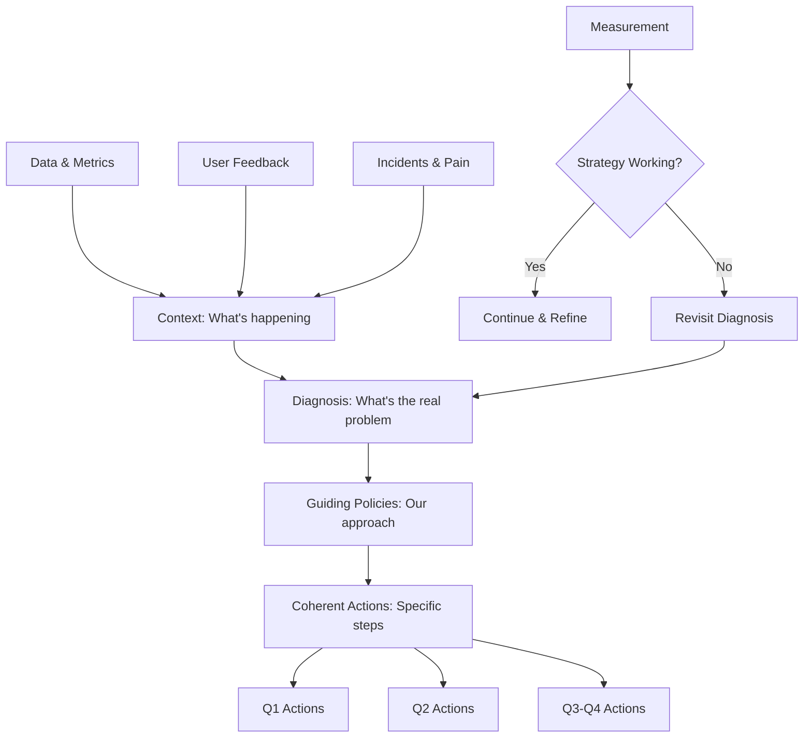
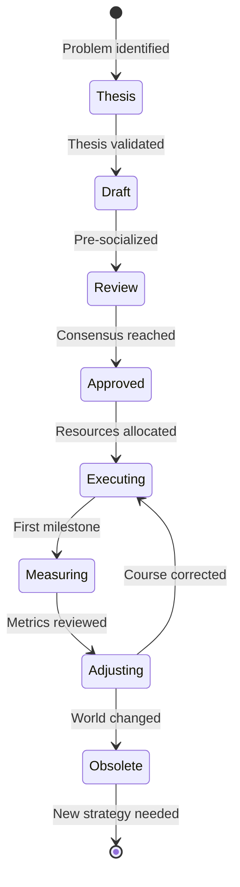

# Writing Technical Strategy

## What Is a Technical Strategy Document?

A technical strategy is **not** a project plan. It's not a list of things to do. It's a diagnosis of your situation and a coherent set of decisions about how to navigate it.

Most "strategy documents" in tech companies are actually one of these imposters:
- **A project plan** disguised as strategy ("We'll do X, then Y, then Z")
- **A wishlist** ("We want to be best-in-class at everything")
- **A technology shopping list** ("We'll adopt Kubernetes, Kafka, and Ray")
- **A mission statement** ("We'll build a world-class AI platform")

A real strategy has **teeth**. It says what you WILL do and, crucially, what you WON'T do. It makes tradeoffs explicit. It explains WHY.

## When to Write a Technical Strategy

Write a strategy when:
- Multiple teams are making conflicting technical decisions
- You're facing a paradigm shift (e.g., foundation models changing RAG approaches)
- Current architecture can't support the next 2-3 years of growth
- There's organizational confusion about technical direction
- You need to justify significant infrastructure investment

**Don't** write a strategy when:
- The answer is obvious and everyone agrees
- You're solving a single team's problem (use an RFC instead)
- You don't have enough information yet (do research first)

## Richard Rumelt's Good Strategy Framework

The gold standard for strategy thinking. Every good technical strategy has:

### 1. Context (The Situation)
What's happening? What are the facts? No opinions yet - just ground truth.

### 2. Diagnosis (The Kernel Problem)
What's the ACTUAL problem? This is where most strategies fail. They skip the diagnosis and jump to solutions. A good diagnosis reframes the situation in a way that makes the solution direction obvious.

### 3. Guiding Policies (The Approach)
High-level decisions that constrain the solution space. These are NOT actions - they're principles that make actions coherent.

### 4. Coherent Actions (The Plan)
Specific, sequenced actions that implement the guiding policies. "Coherent" means they reinforce each other - they're not a random collection.



## Full Example: AI Platform Technical Strategy 2025

### Context

> Our AI platform serves 10M inference requests/day across 3 foundation models (GPT-4, Claude, Gemini) with a 99.5% availability SLA. We have 12 product teams consuming the platform, with 5 more teams planning to integrate in H1 2025.
>
> Current state:
> - Average latency: 2.3s p50, 8.1s p99
> - Monthly compute cost: $2.1M (growing 40% QoQ)
> - RAG pipeline supports 50M documents across all tenants
> - 3 incidents in last quarter related to model provider outages
> - Evaluation coverage: 35% of production use cases have automated evals
> - Developer onboarding time: 3 weeks average to first production integration

### Diagnosis

> **The core problem is not scale or cost individually - it's that our architecture couples model choice to application logic, making it impossible to optimize cost, latency, and reliability independently.**
>
> Symptoms:
> - Teams hardcode model names, so we can't route to cheaper models for simple queries
> - Provider outages cascade because there's no abstraction layer for failover
> - RAG is embedded per-team, creating 12 copies of similar logic with different bugs
> - Costs grow linearly with traffic because we have no caching or tiering
>
> Root cause: We built the platform for a single-model world (GPT-4 only) and bolted on multi-model support without rethinking the architecture.

### Guiding Policies

> 1. **Model-agnostic by default**: Applications declare intent (quality, speed, cost), not model names. The platform routes optimally.
>
> 2. **Shared retrieval, custom ranking**: RAG infrastructure is centralized; product-specific relevance is a configuration, not custom code.
>
> 3. **Cost is a first-class SLO**: Every request has a cost budget alongside latency and quality budgets. We optimize across all three.
>
> 4. **Graceful degradation over hard failure**: When a provider fails, serve degraded responses rather than errors. Quality can flex; availability cannot.
>
> 5. **Platform adoption through developer experience**: Teams adopt because it's easier than building custom, not because we mandate it.

### Coherent Actions

> **Q1 2025: Foundation**
> - Ship model gateway with intent-based routing (replaces direct API calls)
> - Implement semantic caching layer (target: 30% cache hit rate)
> - Define cost-per-query budgets for all existing use cases
>
> **Q2 2025: Migration**
> - Migrate top 5 teams (by traffic) to gateway
> - Launch centralized RAG service (v1: simple retrieval, no custom ranking yet)
> - Implement automatic failover between providers
>
> **Q3 2025: Optimization**
> - Add intelligent routing (simple queries → cheaper models)
> - Launch custom ranking layer for RAG
> - Achieve 60% eval coverage
>
> **Q4 2025: Scale**
> - All 17 teams on platform
> - RAG scales to 200M documents
> - Cost per query reduced by 40% vs Q1 baseline

## How to Get Buy-In: The Pre-Socialization Playbook

The #1 reason strategies fail: **they surprise people**. By the time you present a strategy in a review meeting, every stakeholder should already know what's in it and roughly agree.

### Stakeholder Mapping

Before writing a single word:

| Stakeholder | Role | Interest | Concern | Pre-Socialize How |
|------------|------|----------|---------|-------------------|
| VP Eng | Sponsor | Cost reduction, reliability | Investment required | 1:1, high-level pitch |
| Platform EM | Partner | Team capacity, roadmap impact | Resources, timeline | Co-author the doc |
| Product Eng Leads | Adopters | Ease of migration, no regressions | Migration burden | Design review, input |
| SRE Lead | Operator | Reliability, observability | Operational complexity | Technical deep-dive |
| Finance | Budget | Cost trajectory | ROI timeline | Cost modeling session |

### The Pre-Socialization Process

1. **Draft thesis** (1 page) → Share with your manager and 1-2 trusted peers
2. **Incorporate feedback** → Expand to full draft
3. **1:1s with key stakeholders** → Walk through, listen to concerns
4. **Revised draft** → Address concerns explicitly in the document
5. **Group review** → By now, this should be ratification, not debate
6. **Final document** → Published, socialized, referenced

**If the review meeting has major surprises, you failed at pre-socialization.**

## Common Mistakes

### Mistake 1: Strategy Without Diagnosis
```
BAD:  "We should adopt Kubernetes for all AI workloads"
GOOD: "Our deployment time of 2 weeks per model is caused by 
       manual infrastructure provisioning. Container orchestration 
       would reduce this to hours."
```

### Mistake 2: Strategy That's Really a Project Plan
```
BAD:  "Step 1: Set up Kafka. Step 2: Migrate events. Step 3: ..."
GOOD: "Guiding Policy: Event-driven over request-response for all 
       async ML pipelines, because [diagnosis explains why]"
```

### Mistake 3: Strategy Without Tradeoffs
```
BAD:  "We'll have the fastest, cheapest, most reliable platform"
GOOD: "We prioritize reliability over latency, and latency over 
       cost. When forced to choose, we'll pay more to stay up."
```

### Mistake 4: Strategy That Doesn't Say "No"
```
BAD:  "We'll support all use cases across all teams"
GOOD: "We will NOT support real-time training in 2025. Teams 
       needing online learning should use [alternative]. We'll 
       revisit in 2026 Q1."
```

### Mistake 5: Strategy Disconnected from Metrics
```
BAD:  "We'll improve our AI platform"
GOOD: "Success metrics: cost/query ↓40%, p99 latency ↓50%, 
       onboarding time ↓60%. Measured quarterly."
```

## Strategy Document Lifecycle



## How to Measure If Your Strategy Is Working

Define **leading indicators** (not just lagging):

| Type | Metric | Check Frequency |
|------|--------|-----------------|
| Leading | Teams requesting platform onboarding | Monthly |
| Leading | Engineers referencing strategy in design docs | Quarterly |
| Leading | Reduction in cross-team conflicts about approach | Quarterly |
| Lagging | Cost per query trend | Monthly |
| Lagging | Platform adoption % | Quarterly |
| Lagging | Incidents caused by architecture issues | Monthly |

**The most important signal**: Are people citing your strategy document in their design decisions? If yes, it's working. If no one references it, it's shelfware.

## The Writing Process

### How to Actually Write It

1. **Start with the diagnosis** (not the solution). Spend 50% of your writing time here.
2. **Write the worst version first**. A bad draft you can iterate on beats a blank page.
3. **Use concrete numbers**. Replace "improve latency" with "reduce p99 from 8.1s to 3s."
4. **Name the tradeoffs**. Every decision costs something—say what.
5. **Include "What this does NOT cover"** section. Scope clarity prevents scope creep.
6. **Write for your skeptic**. Who disagrees? Address their concerns directly.
7. **End with measurable outcomes**. How will we know this worked?

### Document Structure Template

```markdown
# [Platform/System] Technical Strategy [Year]

## TL;DR (3 sentences max)

## Context
### Current State (with metrics)
### Growth Projections
### Key Constraints

## Diagnosis
### Core Problem Statement
### Root Causes (not symptoms)
### Why Now (urgency)

## Guiding Policies
### Policy 1: [Name]
- Rationale
- Tradeoff accepted

### Policy 2: [Name]
...

## Coherent Actions
### Q1: [Theme]
### Q2: [Theme]
### H2: [Theme]

## What This Does NOT Cover

## Success Metrics

## Risks and Mitigations

## Appendix: Alternatives Considered
```

## Red Flags You're NOT Operating at Staff Level

- [ ] You write strategies for your own team only (scope too small)
- [ ] Your strategy has no numbers in it
- [ ] You've never had a stakeholder disagree with your diagnosis
- [ ] Your strategy doesn't say "no" to anything
- [ ] You presented it without pre-socializing and got surprised by pushback
- [ ] The document hasn't been updated in 6+ months despite changing conditions
- [ ] No one references your strategy in their design docs
- [ ] You can't explain the tradeoffs you're making

## Practice Exercise

### Exercise: Write a Mini Technical Strategy

Pick a real technical challenge in your current work (or use this scenario):

> Your team runs 5 different LLM-powered features. Each was built independently with its own prompt management, evaluation, and deployment pipeline. Costs are growing 50% quarter-over-quarter. Two features have had production incidents due to prompt regression. The VP wants to add 3 more LLM features in the next quarter.

Write a 2-page technical strategy following Rumelt's framework:
1. **Context** (5 sentences with fake but realistic metrics)
2. **Diagnosis** (What's the REAL problem? Not the symptoms)
3. **Guiding Policies** (3-4 policies with explicit tradeoffs)
4. **Coherent Actions** (Sequenced over 2 quarters)
5. **Success Metrics** (3-5 measurable outcomes)

### Evaluation Criteria
- Does your diagnosis go deeper than the obvious?
- Do your policies constrain the solution space (not just describe goals)?
- Are your actions coherent (reinforce each other)?
- Did you say "no" to something?
- Would a skeptical peer be persuaded?

---

*"A strategy is not a to-do list. A to-do list says what to do. A strategy says WHY you're doing those particular things and not other things. If you can't explain the 'why not' for the alternatives, you don't have a strategy - you have a plan."* — Adapted from Richard Rumelt
