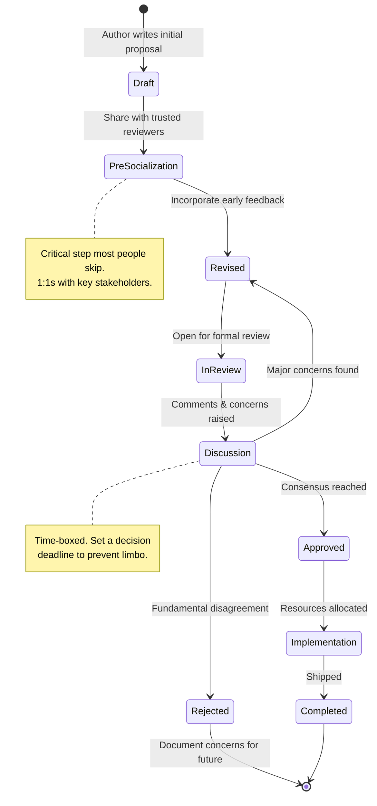

# Writing RFCs and Design Documents

## The Document Landscape: RFC vs Design Doc vs ADR

These three document types serve different purposes. Using the wrong one creates confusion.

| Document | Purpose | Scope | Lifespan | Decision Made? |
|----------|---------|-------|----------|---------------|
| **RFC** | Propose a significant change, seek feedback | Cross-team or architectural | Until implemented | No - requesting input |
| **Design Doc** | Detail how to build something already agreed upon | Single team/feature | Until built | Yes - detailing execution |
| **ADR** | Record a decision already made, with context | Single decision | Forever (historical record) | Yes - documenting why |

### When to Use Each

**Write an RFC when:**
- The change affects multiple teams
- There are genuine alternatives worth debating
- The decision is hard to reverse
- You need organizational buy-in before proceeding
- The change has significant cost, risk, or scope

**Write a Design Doc when:**
- The team agrees on WHAT to build, you're detailing HOW
- The scope is within one team's authority
- You need to think through implementation details
- You want code reviewers to have context

**Write an ADR when:**
- A decision has been made and you want to record WHY
- Future engineers will wonder "why did we do it this way?"
- You want to prevent relitigating settled decisions
- The decision has consequences that constrain future choices

## RFC Template for AI Systems

```markdown
# RFC: [Title - Action-Oriented, Specific]

**Authors:** [Names]
**Status:** Draft | In Review | Approved | Rejected | Superseded
**Created:** [Date]
**Last Updated:** [Date]
**Reviewers:** [Names - include both supporters and skeptics]
**Decision Deadline:** [Date - prevents indefinite review]

---

## Summary

[One paragraph. A Staff engineer should understand the proposal 
after reading only this paragraph. Include: what you're proposing, 
why, and the key tradeoff you're making.]

## Motivation

### What's Broken / What's Needed

[Concrete evidence that something needs to change. Include:
- Metrics showing the problem
- Incidents caused by current state
- User/developer pain points
- Growth projections that current architecture can't handle]

### Why Now

[Why is this urgent? What happens if we do nothing for 6 months?
Be honest - if it's not urgent, say so.]

## Detailed Design

### Architecture Overview

[Diagram showing the proposed system. For AI systems, include:
- Data flow (training data → model → inference → user)
- Component boundaries and ownership
- Integration points with existing systems]

### Key Design Decisions

[For each major decision in the design:
- What you decided
- Why (link back to motivation)
- What you're trading off]

### API / Interface Design

[If applicable: the interfaces this system exposes.
For AI systems: prompt templates, input/output schemas, 
configuration surfaces]

### Data Model

[What data does this system store/process?
For AI systems: embeddings, model artifacts, eval results,
usage metrics, conversation history]

### AI-Specific Concerns

#### Non-Determinism Handling
[How does the system handle probabilistic outputs?
- Retry strategies
- Output validation
- Fallback behavior when output is unexpected]

#### Evaluation Methodology
[How will you know this system works correctly?
- Offline eval datasets and metrics
- Online A/B testing plan
- Human evaluation protocol
- Regression detection]

#### Cost Projections
[What will this cost to run?
- Per-request cost breakdown
- Monthly projected spend at current and 10x scale
- Cost optimization levers available]

#### Model Lifecycle
[How do you handle:
- Model updates from providers
- Fine-tuned model retraining
- Model deprecation
- A/B testing between model versions]

### Failure Modes

[What can go wrong? For each failure mode:
- How do you detect it?
- How do you recover?
- What's the blast radius?]

## Alternatives Considered

### Alternative 1: [Name]

**Description:** [What this alternative looks like]

**Pros:**
- [Genuine advantages - be fair]

**Cons:**
- [Why you didn't choose this]

**Why Not:** [The decisive reason]

### Alternative 2: [Name]
[Same structure]

### Alternative 3: [Name]
[Same structure - minimum 3 alternatives]

### Do Nothing
[Always include this. What happens if we don't act?]

## Migration Plan

[How do we get from here to there?
- Phase 1: [Parallel run / shadow mode]
- Phase 2: [Gradual traffic shift]
- Phase 3: [Old system decommission]
- Rollback plan at each phase]

## Risks and Mitigations

| Risk | Likelihood | Impact | Mitigation |
|------|-----------|--------|------------|
| [Risk 1] | High/Med/Low | High/Med/Low | [Plan] |
| [Risk 2] | ... | ... | ... |

## Open Questions

[Things you genuinely don't know yet. Be vulnerable here.
Mark each as:
- Blocking (must resolve before approval)
- Non-blocking (can resolve during implementation)]

## Timeline

[High-level phases with rough estimates.
Include dependencies on other teams.]

## Appendix

[Supporting data, detailed calculations, research findings]
```

## RFC Lifecycle



## How to Write "Alternatives Considered" That Actually Persuades

The Alternatives section is where most RFCs fail. Common mistakes:

### Bad: Straw Man Alternatives
```
Alternative: Use a NoSQL database
Cons: Can't do joins, no ACID, basically terrible
Why Not: Obviously worse in every way
```
This tells reviewers you didn't seriously consider alternatives.

### Good: Steel Man Alternatives
```
Alternative: Use DynamoDB for embedding storage
Pros: 
- Single-digit millisecond latency at any scale
- Fully managed, zero operational burden
- Team already has DynamoDB expertise

Cons:
- No native vector search (requires separate index)
- Cost per GB is 5x higher than S3 + pgvector at our scale
- Query patterns limited to key-value; complex retrieval needs application logic

Why Not: At our projected scale of 200M embeddings, the cost 
differential ($40K/month vs $8K/month) and the need for hybrid 
search (vector + metadata filtering) make pgvector the better fit.
We'd reconsider DynamoDB if latency requirements tighten to <5ms 
or if our scale stays under 10M embeddings.
```

### The Rule: If the reviewer can't see WHY someone might choose the alternative, you haven't described it fairly enough.

## AI-Specific RFC Concerns

AI systems require sections that traditional RFCs don't:

### 1. Evaluation Methodology (Critical)
```markdown
## Evaluation Plan

### Offline Evaluation
- Dataset: 5,000 labeled query-response pairs from production logs
- Metrics: NDCG@10 for retrieval, GPT-4 judge for response quality
- Baseline: Current system scores (include numbers)
- Target: 10% improvement on NDCG@10, parity on quality

### Online Evaluation  
- A/B test with 5% traffic for 2 weeks
- Primary metric: Task completion rate
- Guardrail metrics: Latency p99, cost per query, safety flags
- Decision criteria: Ship if primary ↑5% with no guardrail regression

### Regression Detection
- Daily automated eval runs against golden dataset
- Alert if quality drops >2% from baseline
- Automated rollback if safety metrics degrade
```

### 2. Non-Determinism Strategy
```markdown
## Handling Non-Determinism

### Output Validation
- JSON schema validation for structured outputs
- Retry with modified prompt if validation fails (max 3 attempts)
- Fallback to deterministic rule-based response after retries exhausted

### Consistency Requirements
- Same user query within 5 minutes should return consistent answers
- Implement semantic caching with 0.95 similarity threshold
- Document which use cases require strict consistency vs are OK with variety
```

### 3. Cost Modeling
```markdown
## Cost Analysis

### Per-Request Breakdown
| Component | Cost | At 1M req/day | At 10M req/day |
|-----------|------|---------------|----------------|
| LLM inference (GPT-4) | $0.03/req | $30K/mo | $300K/mo |
| Embedding generation | $0.0001/req | $100/mo | $1K/mo |
| Vector search | $0.001/req | $1K/mo | $10K/mo |
| Caching (hit rate 30%) | -$0.009/req saved | -$9K/mo | -$90K/mo |

### Cost Optimization Levers
1. Route simple queries to GPT-3.5 (est. 40% of traffic) → -$36K/mo
2. Increase cache hit rate to 50% → -$15K/mo  
3. Batch embedding generation → -$500/mo (negligible)
```

## Example: RFC for Multi-Model Gateway

Here's a condensed real-world example:

```markdown
# RFC: Unified Model Gateway for AI Platform

**Authors:** [Staff Architect]
**Status:** In Review
**Reviewers:** Platform team, ML Infra, Product Eng leads

## Summary

Replace direct model provider API calls with a unified gateway 
that provides model-agnostic routing, automatic failover, 
cost optimization, and centralized observability. Teams declare 
intent (quality tier, latency budget, cost budget) and the 
gateway selects the optimal model and configuration.

## Motivation

- 3 provider outages in Q4 caused full product outages (no failover)
- Teams hardcode model names: blocked from cost optimization
- No visibility into org-wide AI spend by feature/team
- Onboarding a new model provider takes 3 weeks per team

## Key Design Decision

Intent-based routing over explicit model selection:

```python
# Before (teams do today)
response = openai.chat("gpt-4", messages)

# After (proposed)
response = gateway.complete(
    messages=messages,
    intent=Intent(
        quality="high",      # high, medium, low
        max_latency_ms=3000,
        max_cost_cents=5
    )
)
```

## Alternatives Considered

1. **Thin proxy (just failover, no routing)** - Simpler but 
   doesn't solve cost optimization. Teams still coupled to models.

2. **Client-side SDK with config** - No centralized control, 
   can't do org-wide optimization or instant failover.

3. **Do nothing** - Next outage costs ~$200K in lost revenue.
   Costs grow 40% QoQ unchecked.
```

## How to Run a Design Review Meeting

### Before the Meeting
- Send RFC minimum 3 days before review
- Ask reviewers to leave written comments before the meeting
- Identify the 2-3 biggest disagreements from comments

### During the Meeting (60 minutes max)
- **[5 min]** Author: 3-sentence summary, biggest open question
- **[10 min]** Clarifying questions only (no debate yet)
- **[30 min]** Discuss top 2-3 concerns (from pre-read comments)
- **[10 min]** Decisions: what's resolved, what needs more work
- **[5 min]** Next steps: who does what by when

### Rules
- No "I haven't read it but..." — reading is prerequisite to attending
- Disagree with the proposal, not the person
- "I don't know" is a valid and respected answer
- Time-box: if unresolved after 30 min, take it offline with smaller group
- Document decisions in the RFC, not in meeting notes

### After the Meeting
- Author updates RFC within 2 business days
- Unresolved concerns get explicit owners and deadlines
- If no consensus after 2 review cycles, escalate to decision-maker

## Anti-Patterns

### The Rubber-Stamp RFC
- Sent for review after implementation started
- "Does anyone have concerns?" with 24-hour deadline
- Written to justify a decision already made
- **Fix**: If you've already decided, write an ADR instead. Be honest.

### The RFC With No Alternatives
- Only presents the author's preferred solution
- Alternatives section says "We considered not doing this"
- **Fix**: Minimum 3 genuine alternatives. Ask a skeptic to write one.

### The RFC That's Really a Design Doc
- Too detailed, 50+ pages
- Specifies implementation details no one outside the team cares about
- **Fix**: RFC is the WHAT and WHY. Design doc is the HOW.

### The Infinite RFC
- Never reaches decision, perpetual "In Review" status
- Scope creeps with each review round
- **Fix**: Set a decision deadline. Imperfect decisions > no decisions.

### The Solo RFC
- Written in isolation, sprung on the organization
- Author is defensive about feedback
- **Fix**: Pre-socialize. Co-author with a skeptic.

## Red Flags You're NOT Operating at Staff Level

- [ ] You've never written an RFC that affected another team
- [ ] Your RFCs have fewer than 3 alternatives considered
- [ ] You can't remember the last time an RFC of yours was meaningfully challenged
- [ ] You write design docs for everything (even cross-team decisions that need RFCs)
- [ ] You don't include cost projections or eval methodology in AI system RFCs
- [ ] Your RFCs are approved in the first review with no changes (too safe / too obvious)
- [ ] You've never rejected or significantly revised someone else's RFC

## Practice Exercise

### Exercise: Write an RFC for a Real Problem

Choose one of these scenarios (or use your own):

**Scenario A:** Your company uses 3 different vector databases across teams (Pinecone, Weaviate, pgvector). There's no standard, and each team maintains their own. Some teams are hitting scale limits.

**Scenario B:** Your AI product currently has no way to update its knowledge without redeployment. Users are getting stale answers. You need a real-time knowledge update mechanism.

**Scenario C:** Your evaluation system runs nightly batch jobs. You need to detect quality regressions before they reach users, not 24 hours after.

### Write:
1. Summary (1 paragraph)
2. Motivation with metrics (even if estimated)
3. Detailed Design (architecture diagram + key decisions)
4. Three genuine alternatives (steel-manned)
5. AI-specific sections (eval plan, cost model, non-determinism handling)
6. Migration plan (phased)

### Evaluation Criteria
- Would a skeptical Staff engineer take this seriously?
- Are your alternatives genuinely competitive?
- Is your eval methodology concrete enough to actually execute?
- Could someone implement this from your description?
- Did you identify the real risks (not just obvious ones)?

---

*"The point of an RFC is not to get approval. The point is to think clearly, expose your reasoning to scrutiny, and make better decisions through collective intelligence. If your RFC is never challenged, either you're always right (unlikely) or you're not proposing anything ambitious enough."*
