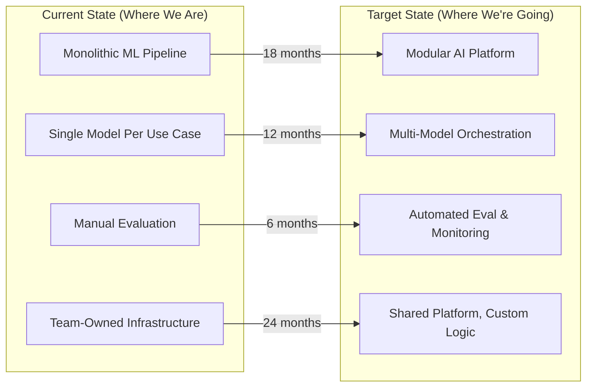

# Architecture Vision Documents

## What Is an Architecture Vision?

An architecture vision is a **2-3 year picture** of where your technical architecture is heading and why. It's longer-horizon than a strategy (which is 1 year) and more concrete than a mission statement.

Think of it this way:
- **Strategy** answers: "What are we doing THIS year and why?"
- **Vision** answers: "What does our architecture look like in 3 years, and what's the path?"
- **RFC** answers: "How do we build this specific thing?"

A vision document exists because:
1. Multiple teams need to make decisions that won't conflict with each other
2. Infrastructure investments need 2-3 years to pay off - you need a destination
3. You need to communicate technical direction to non-technical stakeholders
4. Without a shared vision, teams independently optimize into local maxima

## When You Need an Architecture Vision

- Starting a new platform or major system
- After an acquisition (merging two technical worlds)
- Paradigm shift (e.g., moving from batch ML to real-time AI)
- New leadership asking "where are we going technically?"
- Teams are building overlapping capabilities independently

## Structure

### Current State → Problems → Target State → Transition Plan



## Example: AI Platform Architecture Vision 2025-2027

### Current State (Early 2025)

**Architecture:**
- 12 teams running independent ML/AI pipelines
- Direct API calls to model providers (no abstraction)
- Per-team RAG implementations (6 different vector DBs)
- Evaluation is ad-hoc: some teams do it, most don't
- Deployment: manual, per-team CI/CD for ML artifacts

**Key Metrics:**
- Total AI spend: $2.1M/month (growing 40% QoQ)
- Average onboarding: 3 weeks per new AI feature
- Evaluation coverage: 35% of production use cases
- Incident response: 4+ hours average (no shared tooling)
- Code reuse: <10% across teams

### Problems With Current State

1. **Cost inefficiency**: No shared optimization (caching, routing, batching)
2. **Reliability risk**: Single provider failures cascade to all products
3. **Slow innovation**: Each team reinvents RAG, eval, prompt management
4. **Quality blind spots**: Most features have no automated quality monitoring
5. **Talent bottleneck**: Every team needs ML infrastructure expertise

### Target State (End of 2027)

**Architecture:**
```
┌─────────────────────────────────────────────────┐
│              Product Applications                 │
│  (Teams write business logic + prompts only)     │
├─────────────────────────────────────────────────┤
│           AI Platform Services                    │
│  ┌──────────┐ ┌────────────┐ ┌──────────────┐  │
│  │  Model   │ │ Retrieval  │ │  Evaluation  │  │
│  │  Gateway │ │  Service   │ │  Platform    │  │
│  └──────────┘ └────────────┘ └──────────────┘  │
│  ┌──────────┐ ┌────────────┐ ┌──────────────┐  │
│  │  Prompt  │ │  Agent     │ │  Safety &    │  │
│  │  Mgmt    │ │  Runtime   │ │  Guardrails  │  │
│  └──────────┘ └────────────┘ └──────────────┘  │
├─────────────────────────────────────────────────┤
│           Infrastructure Layer                    │
│  Compute │ Storage │ Observability │ Cost Mgmt  │
└─────────────────────────────────────────────────┘
```

**Target Metrics:**
- AI spend: $1.5M/month (despite 3x traffic growth)
- Onboarding: 2 days per new AI feature
- Evaluation coverage: 95% of production use cases
- Incident response: <30 minutes (shared tooling + runbooks)
- Code reuse: 70% (platform provides common capabilities)

### Transition Plan

**Phase 1 (H1 2025): Foundation** — Build the core platform
- Model Gateway with intent-based routing
- Centralized evaluation framework
- Cost attribution and monitoring

**Phase 2 (H2 2025): Migration** — Move teams to platform
- Migrate top 5 teams (by traffic)
- Launch Retrieval Service v1
- Prompt Management as a service

**Phase 3 (H1 2026): Optimization** — Make it excellent
- Intelligent routing reduces cost 40%
- Agent Runtime for multi-step workflows
- Self-serve onboarding (no platform team involvement)

**Phase 4 (H2 2026-2027): Differentiation** — Competitive advantage
- Custom model fine-tuning as a service
- Real-time learning and personalization
- Cross-product knowledge sharing

## Communicating to Different Audiences

The same vision, tailored:

### For Engineers (Technical Depth)
> "We're building a model gateway that abstracts provider-specific APIs behind an intent-based interface. You'll declare quality/latency/cost requirements and the gateway handles routing, failover, and caching. The retrieval service provides chunking, embedding, and hybrid search so you don't need to manage vector infrastructure."

### For Engineering Directors (Team Impact)
> "This platform will reduce your team's AI infrastructure burden by ~60%. Instead of each team maintaining RAG pipelines and model integrations, they'll plug into shared services. Onboarding new AI features goes from 3 weeks to 2 days. Your engineers focus on product logic, not infrastructure."

### For VPs (Business Outcomes)
> "We'll support 3x traffic growth while reducing AI costs by 30%. New AI features launch in days instead of months. We eliminate single-provider risk that caused 3 outages last quarter. The platform gives us leverage to negotiate better rates with providers."

### For C-Suite (Strategic Value)
> "Our AI platform becomes a competitive moat. We ship AI features faster than competitors, at lower cost, with higher reliability. We can adopt new models (like GPT-5 or open-source alternatives) in days, not months. This is the infrastructure that makes our AI strategy executable."

## The Architecture Runway Concept

Architecture runway = foundational work that enables future features without being a feature itself.

**The tension**: Product wants features NOW. Platform needs to build foundations for LATER.

**How to justify runway:**
1. Show the cost of NOT having it (incidents, slow delivery, mounting tech debt)
2. Make it incremental (each runway investment delivers partial value immediately)
3. Tie it to business outcomes (not just technical elegance)
4. Set time-boxes (no open-ended platform work)

**Example:**
```
Without runway:  Feature A (4 weeks) + Feature B (4 weeks) + Feature C (4 weeks) = 12 weeks
With runway:     Platform (3 weeks) + Feature A (1 week) + Feature B (1 week) + Feature C (1 week) = 6 weeks
Break-even:      After 2 features
```

## The 80% Rule: Balancing Vision with Pragmatism

Your vision should:
- Cover 80% of use cases well
- Explicitly acknowledge the 20% it doesn't cover
- Provide escape hatches for edge cases
- Evolve as you learn (it's a living document)

**Pragmatism checklist:**
- [ ] Can we deliver value in 3-month increments?
- [ ] Does each phase work independently if we stop?
- [ ] Have we validated key assumptions with prototypes?
- [ ] Is the migration path reversible at each stage?
- [ ] Are we solving problems teams ACTUALLY have (not imagined ones)?

## How to Avoid the "PowerPoint Architect" Trap

Symptoms of the PowerPoint Architect:
- Beautiful diagrams, no working code
- Vision that's never been prototyped
- No hands-on understanding of the challenges
- Can't answer "what's the hardest part to build?"

**Antidotes:**
1. **Prototype the riskiest part first** before publishing the vision
2. **Stay in the codebase** - review PRs, write critical-path code
3. **Own an on-call rotation** for something in the platform
4. **Include "I don't know yet" sections** in your vision
5. **Set 90-day checkpoints** where you update the vision based on learnings

## Architecture Fitness Functions

How do you know if you're moving toward your vision?

Define measurable fitness functions:

| Dimension | Fitness Function | Current | Target | Threshold |
|-----------|-----------------|---------|--------|-----------|
| Cost Efficiency | Cost per 1K queries | $3.20 | $1.50 | Alert if >$4.00 |
| Reliability | Provider-independent availability | 99.5% | 99.95% | Alert if <99.0% |
| Developer Experience | Time to first AI feature | 15 days | 2 days | Alert if >20 days |
| Quality | % use cases with automated eval | 35% | 95% | Alert if declining |
| Platform Adoption | % traffic through gateway | 0% | 100% | Track monthly |

**Measure quarterly. Update vision if fitness functions reveal wrong assumptions.**

## Red Flags You're NOT Operating at Staff Level

- [ ] Your vision doesn't have concrete metrics for current and target state
- [ ] You can't explain the vision differently to engineers vs VPs
- [ ] The vision has no transition plan (just "current" and "future" with magic in between)
- [ ] You haven't prototyped the riskiest part of the vision
- [ ] The vision is 18 months old and hasn't been updated
- [ ] No fitness functions - you can't measure progress toward the vision
- [ ] Teams don't reference the vision when making design decisions

## Practice Exercise

### Exercise: Create a Mini Architecture Vision

**Scenario:** You're the Staff Architect for a company that has 3 AI-powered products:
1. Customer support chatbot (RAG-based, 1M queries/day)
2. Content recommendation engine (embedding-based, 10M requests/day)
3. Internal code assistant (fine-tuned model, 100K queries/day)

Each product was built by a different team with completely independent infrastructure. The company wants to launch 2 more AI products next year.

### Write:
1. **Current State** (1 page with key metrics - invent realistic numbers)
2. **Three biggest problems** with current state
3. **Target State** diagram (ASCII or mermaid)
4. **Two-year transition plan** (4 phases)
5. **Fitness functions** (5 measurable indicators of progress)
6. **Executive summary** (3 sentences for the C-suite)

### Evaluation Criteria
- Is your target state specific enough to make decisions against?
- Does your transition plan deliver value incrementally?
- Could you explain this to a VP in 5 minutes?
- Have you identified what NOT to build?
- Are your fitness functions actually measurable today?

---

*"A vision without a transition plan is a fantasy. A transition plan without a vision is busywork. The Staff architect's job is to hold both simultaneously - the inspiring destination AND the pragmatic path."*

---

## Vision Document Template

```markdown
# Architecture Vision: [System/Domain Name]
**Author**: [Name] | **Date**: YYYY-MM-DD | **Status**: Draft/Review/Approved

## Executive Summary (1 paragraph)
[What we're doing, why, and what success looks like — readable by a VP in 30 seconds]

## Current State
- Architecture diagram (as-is)
- Key pain points (with data)
- Business constraints driving change

## Target State (12-18 month horizon)
- Architecture diagram (to-be)
- Key properties of the target (scalability, cost, reliability targets)
- What we're explicitly NOT building

## Fitness Functions
[Measurable criteria that tell us we're on track]
- Metric 1: [current value] → [target value]
- Metric 2: [current value] → [target value]

## Transition Plan
### Phase 1: [Name] (Months 1-3)
- Deliverables, teams involved, dependencies, value delivered

### Phase 2: [Name] (Months 4-8)
- Deliverables, teams involved, dependencies, value delivered

### Phase 3: [Name] (Months 9-14)
- Deliverables, teams involved, dependencies, value delivered

## Risks and Mitigations
| Risk | Likelihood | Impact | Mitigation |
|------|-----------|--------|------------|

## Resource Requirements
- Teams, headcount, budget, external dependencies

## Decision Log
| Date | Decision | Rationale |
|------|----------|-----------|
```

## Review Process

| Stage | Duration | Participants | Goal |
|-------|----------|--------------|------|
| **Draft** | 1-2 weeks | Author + 1 trusted peer | Get structure and logic right |
| **Technical review** | 1 week | Staff+ engineers, tech leads | Validate feasibility, catch gaps |
| **Stakeholder review** | 1 week | Product, Eng leadership | Align on priorities and resources |
| **Approval** | 1 meeting | Decision makers (VP/Director) | Get explicit go/no-go |
| **Socialization** | Ongoing | All engineering | Build understanding and buy-in |

**Review best practices:**
- Share the document async first; use meetings for discussion, not reading
- Explicitly ask reviewers what feedback you need (feasibility? priority? risk?)
- Track and respond to every piece of feedback, even if you disagree

## Communication Strategies for Different Audiences

| Audience | Format | Length | Focus |
|----------|--------|--------|-------|
| **Executive/VP** | 1-page summary + verbal walkthrough | 5 min read | Business impact, cost, timeline, risks |
| **Engineering leadership** | Full vision doc | 20 min read | Feasibility, resource needs, team impact |
| **Individual teams** | Team-specific excerpt + Q&A session | 30 min meeting | "What changes for YOUR team and when" |
| **New hires** | Simplified overview in onboarding | 10 min read | Context on where we're going and why |

**Communication anti-patterns:**
- Sending a 15-page doc to executives (they won't read it)
- Presenting only the target state without the transition plan (creates anxiety)
- Using different terminology in different forums (creates confusion)
- Not revisiting the vision after 6 months (people assume it's abandoned)
