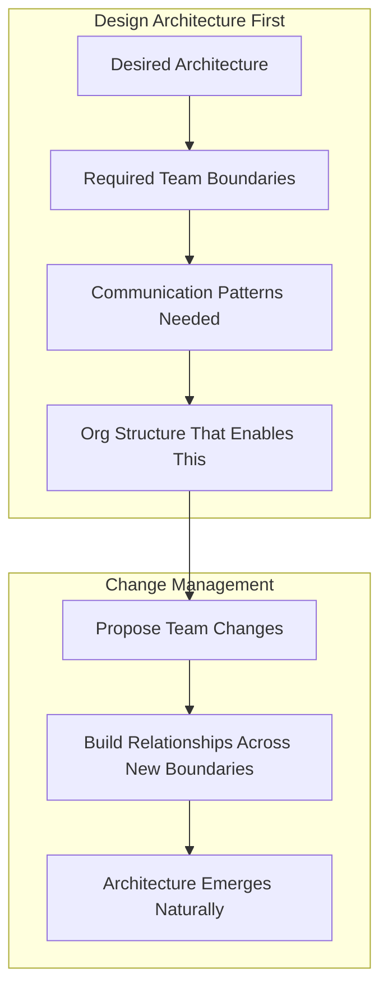
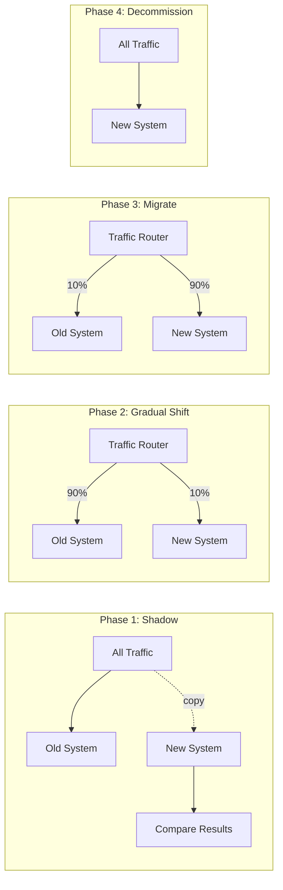

# Driving Organizational Change

## Why Great Architecture Fails

The #1 reason architectures fail isn't technical. It's organizational.

You can design the perfect system. If the organization can't or won't adopt it, it doesn't matter. The graveyard of tech companies is filled with beautiful architectures that nobody used because:

- The team that needed to adopt it had different priorities
- The migration required coordination nobody was willing to fund
- Political dynamics meant one team wouldn't depend on another
- The architect designed in isolation and surprised everyone
- There was no incremental path - it was all-or-nothing

**The uncomfortable truth**: At Staff level, your effectiveness is bounded not by your technical skill but by your organizational skill. You can be the best architect in the world and accomplish nothing if you can't navigate people.

## Conway's Law for AI Systems

> "Organizations which design systems are constrained to produce designs which are copies of the communication structures of these organizations." — Melvin Conway

**For AI specifically:**

| Org Structure | AI Architecture You Get |
|---------------|------------------------|
| Separate ML and Product teams | Models trained offline, served via API, constant misalignment |
| Each product team owns their own AI | Duplicated infrastructure, inconsistent quality |
| Centralized AI platform team | Good infra, but slow to serve product needs |
| Embedded ML + Platform hybrid | Best of both worlds, hardest to organize |

**Implication**: If you want to change the architecture, you often need to change the org structure (or at least the communication patterns). This is why Staff architects need to work with engineering leadership on team topology, not just system topology.

### The Inverse Conway Maneuver

Instead of accepting that org → architecture, intentionally structure teams to get the architecture you want:



## Building Consensus Across Teams

### The Pre-Socialization Framework

Never present a major architectural change in a meeting for the first time. By the time you present:
- 80% of stakeholders should already agree
- The remaining 20% should at least feel heard
- No one should be surprised

**Process:**
1. **Identify stakeholders** (see Stakeholder Mapper program)
2. **1:1 conversations** - Listen first, propose second
3. **Incorporate feedback** - Genuinely. Not performatively.
4. **Build coalition** - Get 2-3 respected engineers to co-advocate
5. **Group presentation** - Now it's ratification, not debate

### Handling Disagreement

When a senior engineer or team lead disagrees:

| Situation | Response |
|-----------|----------|
| They have information you lack | Thank them. Update your proposal. |
| They have a valid alternative approach | Include it in your RFC. Maybe they're right. |
| They disagree on priorities, not approach | Escalate to shared leadership for prioritization. |
| They have political/territorial concerns | Address privately. Find a win-win. |
| They're simply wrong | Build evidence. Prototype. Show, don't tell. |

**Never**: Dismiss concerns, go over their head without telling them, or force adoption through authority you don't have.

## The "Writing Is Thinking" Principle

Documents aren't just communication tools. They're **thinking tools**.

When you write a strategy or RFC, you're forced to:
- Make implicit assumptions explicit
- Identify gaps in your reasoning
- Consider alternatives you hadn't thought of
- Sequence actions coherently
- Anticipate objections

**This is why Staff architects write so much.** It's not bureaucracy. It's how you think at organizational scale.

The document also becomes an **alignment tool**:
- People can engage asynchronously (not everyone in one meeting)
- Feedback is specific (comments on specific sections)
- Decisions are recorded (not lost in meeting notes)
- New joiners can onboard by reading the doc

## Migration Strategies

When driving architectural change, you need a migration strategy:

### Big Bang
- **What**: Replace old system entirely on a cutover date
- **When**: Old system is so broken that gradual migration costs more
- **Risk**: Everything breaks at once. No rollback.
- **AI Example**: Swapping from one embedding model to another (can't mix)

### Strangler Fig
- **What**: Gradually replace old system piece by piece
- **When**: System is modular enough to replace incrementally
- **Risk**: Running two systems indefinitely. Migration fatigue.
- **AI Example**: Wrapping existing model calls with gateway, team by team

### Parallel Run
- **What**: Run old and new system simultaneously, compare results
- **When**: Correctness is critical and hard to verify in advance
- **Risk**: Double the cost during transition. Comparison logic is complex.
- **AI Example**: Running new RAG pipeline alongside old, comparing answer quality

### Recommended for AI Systems: Strangler Fig + Parallel Run
1. Build new system alongside old
2. Shadow traffic to new system (parallel run for validation)
3. Gradually shift traffic team by team (strangler fig)
4. Decommission old system only when all traffic migrated



## Building Credibility: The Trust Equation

Your ability to drive change is proportional to your credibility:

```
Trust = (Competence × Reliability × Empathy) / Self-Interest
```

- **Competence**: Do you actually know what you're talking about? (Prototype, don't just PowerPoint)
- **Reliability**: Do you deliver on what you promise? (Small promises kept > big promises broken)
- **Empathy**: Do you understand others' constraints? (Listen before proposing)
- **Self-Interest**: Are you doing this for the org or for your resume? (People can tell)

### How to Build Credibility as a New Staff Architect

**Month 1-2**: Listen, learn, help
- Attend design reviews. Ask questions. Don't propose changes yet.
- Help teams with their current problems (not your agenda)
- Map the political landscape

**Month 3-4**: Small wins
- Fix one thing that everyone agrees is broken
- Write one helpful document that people reference
- Build relationships with key stakeholders

**Month 5-6**: Larger proposals
- Now you have context, relationships, and credibility
- Propose changes that build on your earned trust
- Co-author with people who've been there longer

**Common mistake**: New Staff architects propose sweeping changes in month 1. This always fails, regardless of how good the proposal is.

## Navigating Politics

### When Engineering Meets Business

| Business Says | They Actually Mean | Your Response |
|---------------|-------------------|---------------|
| "We need this yesterday" | "This is high priority" | Propose phased delivery with early value |
| "Can't we just use GPT-4 for everything?" | "I don't understand why it's complex" | Educate with concrete cost/latency numbers |
| "Our competitor shipped this in 2 weeks" | "I'm under pressure" | Show what shortcuts cost long-term |
| "We need to reduce AI costs" | "CFO is asking questions" | Present optimization roadmap with timeline |

### Political Patterns to Recognize

- **Empire building**: Team wants to own more than they should
- **Not invented here**: Team rejects platform because they didn't build it
- **Bikeshedding**: Debating trivial details to avoid hard decisions
- **Analysis paralysis**: Using "we need more data" to delay action
- **Pocket veto**: Agreeing in meetings, doing nothing after

### How to Navigate

1. **Always have a sponsor** - A VP or Director who supports your direction
2. **Create wins for others** - Frame changes as helping them, not imposing on them
3. **Pick your battles** - Not everything is worth fighting for
4. **Document decisions** - So they can't be relitigated without new information
5. **Be patient** - Organizational change takes 2-3x longer than you expect

## Common Staff Failures

### Designing Without Building Relationships
```
Failure: Spent 3 months writing perfect architecture vision.
         Presented to leadership. Everyone nodded.
         6 months later, nothing changed.

Root cause: No relationships with the teams who need to implement it.
            No understanding of their constraints.
            No co-ownership of the solution.

Fix: Spend 50% of your time on relationships, 50% on documents.
```

### Mandating Without Migrating
```
Failure: "All teams must use the new platform by Q3."
         Teams are stuck on old system because migration is hard.
         Deadline passes. Mandate is quietly forgotten.

Root cause: Mandates without migration support are just wishes.

Fix: Provide migration tooling, dedicated support, and realistic timelines.
     Make migration EASY, not just required.
```

### Optimizing for Architectural Purity Over Delivery
```
Failure: Rejected 5 feature proposals because they didn't fit the vision.
         Product launched late. Competitor won the market.

Root cause: Architecture serves the business, not the other way around.

Fix: "How do we deliver this feature AND move toward the vision?"
     80% alignment with vision is fine. 100% alignment is the enemy of shipping.
```

## Case Study: Migrating 50 Teams to Centralized AI Platform

**Context**: Large tech company with 50 product teams, each running independent ML pipelines. Total AI spend: $15M/month. New Staff Architect hired to consolidate.

**What Failed (Year 1):**
- Announced "mandatory platform migration" 
- Built platform in isolation for 6 months
- Teams resisted: "Our use case is special"
- Platform didn't handle edge cases
- Migration stalled at 5 teams

**What Worked (Year 2-3):**
1. **Found champion teams** (3 teams with acute pain, eager to migrate)
2. **Built platform WITH them** (their requirements shaped the platform)
3. **Made success visible** (published cost savings, latency improvements)
4. **Created "golden path" onboarding** (2-day migration for standard cases)
5. **Staffed a migration support team** (dedicated engineers helping teams migrate)
6. **Let laggards come last** (don't force the most resistant teams early)
7. **Celebrated migrations publicly** (engineering all-hands, shoutouts)

**Result**: 45 of 50 teams migrated in 18 months. Last 5 got exemptions with clear criteria for when they'd need to migrate. AI spend reduced to $10M/month despite 2x traffic growth.

**Key lesson**: The architecture was the easy part. Earning trust, providing support, and being patient was the hard part.

## Red Flags You're NOT Operating at Staff Level

- [ ] You design architectures without talking to the teams that will build them
- [ ] You've never changed your proposal based on stakeholder feedback
- [ ] You mandate rather than persuade
- [ ] You can't name the political dynamics affecting your initiative
- [ ] You've never helped a team migrate to your proposed architecture
- [ ] You get frustrated when change takes longer than you expected
- [ ] You optimize for architectural purity over organizational reality
- [ ] You don't have a sponsor in leadership

## Practice Exercise

### Exercise: Plan an Organizational Change

**Scenario:** You're a Staff AI Architect. Your company has 8 product teams, each with their own prompt engineering approach. There's no shared evaluation, no prompt versioning, and quality is inconsistent. Last month, two teams shipped prompt changes that caused production incidents. You want to introduce a centralized prompt management and evaluation platform.

### Tasks:
1. **Stakeholder Map** - List 5 stakeholders, their likely position (supporter/neutral/blocker), and their core concern
2. **Pre-socialization Plan** - Who do you talk to first, second, third? What do you ask vs tell?
3. **Migration Strategy** - Which of the 3 strategies works here? Why?
4. **First 90 Days** - What do you do in months 1, 2, 3?
5. **Success Metrics** - How will you know this is working?
6. **Failure Prediction** - What's most likely to go wrong? How do you mitigate?

### Evaluation Criteria
- Do you start by listening or by proposing?
- Is your plan patient enough? (If it takes <6 months, it's probably unrealistic)
- Have you identified who might block this and why?
- Does your plan create wins for others (not just for "the architecture")?
- Can you explain why a team should adopt this in terms of THEIR problems?

---

*"I've never seen a great architecture that was adopted through mandate. Every successful platform I've been part of was adopted because it made people's lives easier. If your platform requires a mandate to get adoption, your platform isn't good enough yet."* — Staff Engineer at a FAANG company
