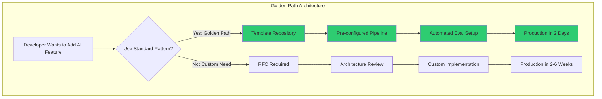

# Mentoring and Multiplying

## The Force Multiplier Effect

The math is simple:
- A 10x individual contributor produces 10x output
- A Staff engineer who makes 10 people 2x better produces 20x output

**This is why companies pay Staff engineers more than Senior engineers.** Not because they write better code (though they often do), but because their impact multiplies through others.

Your job shifts from "How fast can I produce?" to "How much faster can I make everyone else?"

```
Individual Output:     You × 10 = 10 units
Multiplier Output:     10 people × 2 (because of you) = 20 units
Combined (realistic):  Your output (3) + Others improved (15) = 18 units
```

The transition is uncomfortable. You feel less productive because YOUR output drops. But the team's output increases dramatically. You have to measure yourself differently.

## Technical Mentoring: The GROW Model for Engineers

The GROW model, adapted for technical mentoring:

### G - Goal
"What are you trying to achieve?"
- Short term: "Ship feature X with clean architecture"
- Career: "Get promoted to Senior" or "Become a systems expert"
- Learning: "Understand distributed consensus"

### R - Reality
"Where are you now?"
- Skills assessment (no judgment, just mapping)
- What's blocking them?
- What have they already tried?

### O - Options
"What could you do?"
- Don't give the answer immediately
- Help them generate options: "What are three approaches you could take?"
- Add options they haven't considered: "Have you thought about...?"

### W - Will / Way Forward
"What will you actually do?"
- Commit to a specific next step
- Set a check-in time
- Remove blockers they can't remove themselves

### Example Mentoring Conversation

```
Mentee: "I'm stuck on how to design the eval pipeline. Should I 
         use streaming or batch?"

BAD Mentor Response: "Use batch. Here's why... [10 minute monologue]"

GOOD Mentor Response:
- "What are the requirements? How fresh do evals need to be?" [Goal]
- "How are you doing evals now? What's painful about it?" [Reality]  
- "What are the tradeoffs of each approach as you see them?" [Options]
- "Which tradeoff matters most for your use case?" [Options]
- "Sounds like batch with hourly trigger. Want to sketch the design 
   and I'll review tomorrow?" [Will]
```

The difference: In the BAD response, you solved their problem. In the GOOD response, you taught them to solve problems like this.

## Code Review as Teaching

Most code reviews focus on "is this correct?" Staff-level code review asks "does this teach the right patterns?"

### Review Levels

| Level | Focus | Example Comment |
|-------|-------|-----------------|
| Correctness | Does it work? | "This will NPE when input is null" |
| Design | Is it well-structured? | "Consider extracting this into a strategy pattern - you'll need to add more models soon" |
| Teaching | Does the author learn? | "This works! For next time: this pattern is called X and it helps with Y. Here's a resource." |
| Strategic | Does it align with direction? | "This approach will conflict with the new gateway RFC. Let's discuss how to align." |

### Code Review Principles for Staff Engineers

1. **Review selectively** - You can't review everything. Focus on:
   - Architecture-impacting PRs
   - Junior engineers who need guidance
   - Critical path code
   - Code that sets patterns others will follow

2. **Explain the WHY** - Not just "change this" but "change this because..."

3. **Praise good patterns** - "Great use of the circuit breaker here. This is exactly the pattern we want for model calls."

4. **Ask questions instead of mandating** - "What happens if the model returns invalid JSON here?" teaches more than "Add validation."

5. **Distinguish nitpicks from requirements** - Prefix with "nit:" or "suggestion:" vs "must fix:"

## Architecture Guilds and Communities of Practice

### What Is an Architecture Guild?

A recurring forum where engineers across teams share architectural knowledge, review designs, and maintain standards.

**Structure:**
- Bi-weekly, 1 hour
- Open to all engineers (not just Staff+)
- Rotating presentations: one team shares a design decision
- Discussion: others ask questions, share similar experiences
- Artifacts: ADRs or design principles emerge from discussions

### How to Run One Successfully

**Do:**
- Keep it practical (real designs, real problems)
- Rotate presenters (not always you)
- Create safe space for "I don't know"
- Produce artifacts (decisions, patterns, anti-patterns)
- Make attendance valuable (not just another meeting)

**Don't:**
- Turn it into a rubber-stamp approval process
- Let one person dominate
- Make it theoretical (no real-world examples)
- Require attendance (make it so good people WANT to come)

## Creating Golden Paths

A golden path is the **paved road** - the default way to do something that works well, is well-documented, and is easy to follow.



### Golden Path Examples for AI Teams

| Task | Golden Path | Escape Hatch |
|------|-------------|--------------|
| Add LLM feature | Use platform SDK + template | RFC for custom model integration |
| Set up RAG | Use retrieval service + config | Custom pipeline if >100M docs |
| Evaluate quality | Use eval framework + standard metrics | Custom eval if novel modality |
| Deploy model | Use model gateway + CI template | Custom serving if <10ms latency needed |

### Principle: Make the Right Thing the Easy Thing

If the "right" architectural choice requires more effort than the "wrong" one, people will choose wrong every time. Your job is to make the right choice the path of least resistance:

- **Bad**: "You should use the platform gateway. Here's a 20-page migration guide."
- **Good**: `pip install our-ai-sdk` and you're done. Same API, automatic routing.

## Tech Talks and Writing: Building Organizational Knowledge

### Writing Cadence for Staff Engineers

| Type | Frequency | Audience | Purpose |
|------|-----------|----------|---------|
| ADRs | When decisions are made | Future engineers | Record context |
| Blog posts (internal) | Monthly | All engineering | Teach patterns |
| Design reviews | As needed | Relevant teams | Align direction |
| RFC summaries | After approval | Broader org | Awareness |
| Postmortems | After incidents | All engineering | Learn from failure |

### How to Give a Useful Tech Talk

1. **Start with the problem** (not the solution)
2. **Show the journey** (what you tried, what failed)
3. **Be vulnerable** ("Here's what I got wrong")
4. **End with actionable takeaways** (not just "cool, huh?")
5. **Keep it to 20 minutes** (leave time for discussion)

## Succession Planning

**Your job is to make yourself replaceable.** This sounds counterintuitive but:
- If you're the only one who can do something, you're a bottleneck
- If you get hit by a bus, the organization shouldn't collapse
- Being replaceable frees you to take on bigger scope

### How to Make Yourself Replaceable

1. **Document your mental models** - Write down how you make decisions
2. **Delegate architecture ownership** - Let senior engineers own subsystems
3. **Mentor your replacement** - Identify who could do your job, develop them
4. **Create processes that don't require you** - Design reviews that work without your attendance
5. **Build systems not heroes** - If it only works because of you, it doesn't work

## Measuring Impact Through Others

### Indirect Influence Metrics

| Metric | How to Measure |
|--------|---------------|
| Engineers mentored to promotion | Count promotions you actively supported |
| Design docs influenced | Docs that reference your patterns/principles |
| Platform adoption | Teams voluntarily using what you built |
| Knowledge sharing | Attendance at guilds you run, docs you wrote being read |
| Decision quality | Fewer architecture-related incidents over time |
| Onboarding speed | New engineers productive faster because of your docs/tools |

### The Portfolio of Impact

At Staff level, your "performance review evidence" looks like:
```
Q1 Impact:
- Mentored 3 engineers (1 promoted to Senior)
- Wrote AI Platform Strategy (adopted by 5 teams)
- Designed model gateway (RFC approved, in implementation)
- Ran 6 architecture guild sessions (avg 25 attendees)
- Code reviews: 45 PRs reviewed (focus: teaching patterns)
- Reduced platform incidents by 40% through reliability RFC
```

Notice: very little "I wrote code that shipped feature X."

## Anti-Patterns

### Gatekeeping
- All decisions must go through you
- You block PRs that don't match your style
- You're the only one who can deploy
- **Fix**: Create standards, then let others apply them. Trust.

### Hero Culture
- You fix every critical incident personally
- You're the only one who understands the system
- You work 70-hour weeks because "only you can"
- **Fix**: Invest in documentation, on-call training, and delegation.

### Knowledge Hoarding
- You keep information in your head
- You enjoy being the expert people come to
- You don't write things down because "it's faster to just ask me"
- **Fix**: If someone asks you something twice, write it down. Blog, ADR, wiki.

## Red Flags You're NOT Operating at Staff Level

- [ ] No one you've mentored has been promoted in the last year
- [ ] You're still the go-to person for operational issues (not strategic ones)
- [ ] You can't take a 2-week vacation without things breaking
- [ ] Your code reviews focus only on correctness, not teaching
- [ ] You haven't given a tech talk or written an internal post in 3 months
- [ ] Engineers don't seek you out for career advice
- [ ] There's no one who could replace you if you left

## Practice Exercise

### Exercise: Design Your Multiplier Plan

1. **Identify 3 engineers** you could mentor (different levels):
   - One junior (needs fundamentals)
   - One mid-level (needs system design skills)
   - One senior (needs Staff-level skills)

2. **For each, define:**
   - Their current growth edge
   - One specific thing you'll teach them this month
   - How you'll teach it (not lecture - pair, review, delegate?)

3. **Create a golden path** for one common task in your org:
   - What task do people do repeatedly but differently each time?
   - What would the "paved road" version look like?
   - What documentation/tooling would make it effortless?

4. **Plan an architecture guild session:**
   - Topic (real, relevant, debatable)
   - Format (presentation + discussion? Workshop? Review?)
   - Desired outcome (decision? Shared understanding? Written principle?)

5. **Succession plan:**
   - What do you do that only you can do?
   - Who could learn each of those things?
   - What's your 6-month plan to transfer knowledge?

---

*"The best architects I've known didn't hoard their knowledge - they radiated it. They left behind systems, documents, and people who could carry on without them. Their legacy wasn't code - it was capability."*

---

## Mentoring Anti-Patterns

| Anti-Pattern | What It Looks Like | Fix |
|--------------|-------------------|-----|
| **The Rescuer** | Solving problems for mentees instead of guiding them | Ask questions: "What have you tried? What would happen if...?" |
| **The Clone** | Pushing mentees toward your exact career path | Help them find THEIR strengths and interests |
| **The Ghost** | Agreeing to mentor then being unavailable | Block recurring time; if you can't commit, say no |
| **The Lecturer** | Monologuing about your experience without listening | Spend 70% of mentoring time listening and asking |
| **The Gatekeeper** | Only mentoring people who remind you of yourself | Actively seek mentees with different backgrounds and styles |

## Scaling Mentoring Programs

When you can't mentor everyone 1:1:

- **Office hours**: Weekly open slot anyone can book (15-min slots)
- **Design review as teaching**: Use real reviews to teach principles to a group
- **Written artifacts**: ADRs, tech talks, and docs that teach asynchronously at scale
- **Mentoring chains**: Your mentees mentor others; you coach the mentors
- **Cohort programs**: Group 3-4 mentees working on similar growth areas; meet together monthly
