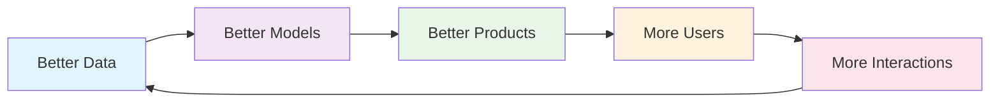
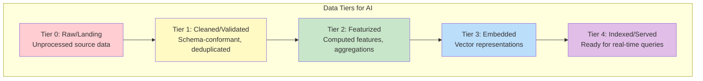
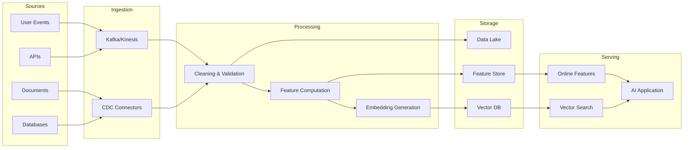

# Data Architecture Fundamentals for AI Systems

## Why Data Architecture Is the #1 Determinant of AI System Quality

Every failed AI project I've investigated shares a common root cause: **bad data architecture**. Not bad models, not bad infrastructure—bad data foundations.

The uncomfortable truth:
- **Models are commoditized** — GPT-4, Claude, Llama are available to everyone
- **Infrastructure is commoditized** — cloud providers offer the same compute
- **Data architecture is your moat** — how you collect, transform, and serve data determines AI quality

```
AI System Quality Equation:
┌─────────────────────────────────────────────────────┐
│ System Quality = f(Data Quality × Data Freshness    │
│                    × Data Completeness              │
│                    × Feature Engineering)           │
│                                                     │
│ Model choice contributes ~20% of final quality      │
│ Data architecture contributes ~60%                  │
│ Infrastructure contributes ~20%                     │
└─────────────────────────────────────────────────────┘
```

### Evidence from Industry

| Company | Model Improvement | Data Architecture Improvement |
|---------|------------------|-------------------------------|
| Uber | Switched model: +3% accuracy | Fixed feature freshness: +12% accuracy |
| Airbnb | Upgraded embedding model: +5% relevance | Added user features: +18% relevance |
| LinkedIn | Better ranking model: +2% engagement | Real-time features: +15% engagement |

---

## The Data Flywheel: The Virtuous Cycle



### Flywheel Mechanics

**Stage 1: Better Data**
- More training examples from user interactions
- Higher quality labels from implicit feedback (clicks, dwell time, purchases)
- Edge cases naturally discovered at scale

**Stage 2: Better Models**
- More data = better generalization
- Diverse data = fewer blind spots
- Fresh data = current relevance

**Stage 3: More Users**
- Better products attract more users
- More users generate more data
- Network effects compound

### Why Some Flywheels Stall

The flywheel only works if your data architecture supports it:
- **No feedback loop** → flywheel never starts
- **Slow data processing** → flywheel spins slowly
- **No data quality checks** → flywheel ingests garbage
- **No feature engineering** → raw data doesn't become model-ready

---

## Data Architecture Principles for AI

### Principle 1: Schema Evolution

AI data schemas WILL change. Your architecture must handle it gracefully.

```
Schema Evolution Example:
─────────────────────────
v1: {user_id, query, timestamp}
v2: {user_id, query, timestamp, session_id}          ← additive (safe)
v3: {user_id, query, timestamp, session_id, intent}  ← additive (safe)
v4: {user_id, queries[], timestamps[], session_id}   ← breaking change!
```

**Rules:**
1. Additive changes only in production schemas
2. Version all schemas explicitly (not implicitly)
3. Maintain backward compatibility for N-1 versions minimum
4. Schema registry is mandatory, not optional

### Principle 2: Immutability

Never mutate data in place. Always append.

```
Mutable (WRONG):
  UPDATE user_features SET embedding = new_value WHERE user_id = 123
  
Immutable (CORRECT):
  INSERT INTO user_features (user_id, embedding, version, timestamp)
  VALUES (123, new_value, 'v2', NOW())
```

**Why immutability matters for AI:**
- Reproducibility: retrain on exact historical data
- Debugging: trace when data changed
- Rollback: revert to previous feature versions
- Compliance: audit trail for GDPR

### Principle 3: Lineage

Every piece of data must be traceable from source to consumption.

```
Lineage Chain:
  Raw Event → Cleaned Record → Feature → Embedding → Index → Response
       ↓           ↓              ↓         ↓          ↓        ↓
  [source]    [transform]    [compute]  [model]   [store]  [serve]
```

---

## Data Tiers: The AI Data Pyramid



### Tier Details

| Tier | Storage | Freshness | Access Pattern | Example |
|------|---------|-----------|----------------|---------|
| 0: Raw | Data Lake (S3/GCS) | Minutes-hours | Batch scan | Raw API responses, logs |
| 1: Cleaned | Warehouse (BigQuery/Snowflake) | Hours | SQL queries | Validated, typed records |
| 2: Featurized | Feature Store | Hours-minutes | Key-value lookup | User activity counts, averages |
| 3: Embedded | Vector Store | Hours | ANN search | Document embeddings, user embeddings |
| 4: Indexed | Serving layer | Seconds | API call | Search index, recommendation cache |

### Tier Transition Rules

```
Tier 0 → 1: Validation, deduplication, schema enforcement
Tier 1 → 2: Aggregation, feature computation, joins
Tier 2 → 3: Embedding generation (model inference)
Tier 3 → 4: Index building, cache warming, replication
```

---

## End-to-End Data Pipeline for AI Systems



---

## Batch vs Streaming Data Pipelines for AI

### When to Use Batch

| Use Case | Why Batch | Latency OK |
|----------|-----------|------------|
| Training data preparation | Full dataset needed | Hours |
| Bulk embedding generation | GPU batch efficiency | Hours |
| Historical feature computation | Point-in-time joins | Hours |
| Data quality reports | Full-scan validation | Daily |
| Model evaluation | Complete test sets | Hours |

### When to Use Streaming

| Use Case | Why Streaming | Latency Required |
|----------|---------------|-----------------|
| Real-time features | User just did X | Seconds |
| Fraud detection | Immediate response | Milliseconds |
| Personalization | Current session context | Seconds |
| Alerting on data quality | Fast detection | Minutes |
| Event-driven re-embedding | Document changed | Minutes |

### Hybrid Architecture (Most Common)

```
Batch Path (Lambda Architecture):
  Source → Lake → Batch Process → Feature Store (offline)
                                              ↓
                                    Training Pipeline

Streaming Path:
  Source → Kafka → Stream Process → Feature Store (online)
                                              ↓
                                    Serving Pipeline

The key insight: BOTH paths must produce IDENTICAL features
for training-serving consistency.
```

---

## Data Catalog and Discoverability

### Why Catalogs Matter

In a 500-person engineering org:
- 2,000+ tables in the warehouse
- 500+ features in the feature store
- 100+ embedding collections
- 50+ AI pipelines

Without a catalog, engineers:
- Recreate existing features (30% duplication is typical)
- Use wrong data sources (stale tables, deprecated schemas)
- Can't find domain experts for data questions

### Catalog Components

```
Data Catalog Entry:
├── Metadata
│   ├── Name, description, domain
│   ├── Schema (columns, types, constraints)
│   ├── Owner (team + individual)
│   └── Classification (PII, confidential, public)
├── Quality
│   ├── Freshness SLA
│   ├── Completeness metrics
│   └── Quality score trend
├── Lineage
│   ├── Upstream sources
│   ├── Downstream consumers
│   └── Transformations applied
├── Usage
│   ├── Query frequency
│   ├── Top consumers (teams/pipelines)
│   └── Last accessed
└── AI-Specific
    ├── Used in models (list)
    ├── Feature importance scores
    └── Embedding model version
```

---

## Anti-Patterns

### 1. Data Swamp

```
Symptom: "We have a data lake but nobody knows what's in it"
Cause: No governance, no catalog, dump everything
Fix: Catalog + ownership + retention policies
Cost: Teams spend 60% of time finding/understanding data
```

### 2. Schema-less Chaos

```
Symptom: JSON blobs with no enforced schema
Cause: "Move fast" mentality without schema registry
Fix: Schema registry + validation at ingestion
Cost: Silent pipeline failures when producers change format
```

### 3. No Versioning

```
Symptom: "The model worked yesterday, what changed?"
Cause: Mutable data, no version tracking
Fix: Immutable storage + version columns + lineage
Cost: Unreproducible results, impossible debugging
```

### 4. Copy-Paste ETL

```
Symptom: 15 pipelines computing "active users" differently
Cause: No shared definitions, no feature store
Fix: Feature store + single source of truth per metric
Cost: Inconsistent AI behavior across products
```

---

## Staff Decision: Centralized Data Lake vs Federated Data Mesh

### Decision Matrix

| Factor | Data Lake | Data Mesh |
|--------|-----------|-----------|
| Org size | < 200 engineers | > 200 engineers |
| Domain complexity | Low-medium | High |
| Data team | Centralized, capable | Distributed expertise |
| Time to value | Faster initially | Slower initially, scales better |
| Governance | Easier to enforce | Requires platform investment |
| AI use cases | Single team consuming | Multiple teams producing + consuming |

### Decision Framework

```
Choose Centralized Data Lake when:
├── Single data/AI team serves all consumers
├── < 50 data sources
├── Governance requirements are uniform
├── Organization < 200 engineers
└── Speed of initial delivery is priority

Choose Federated Data Mesh when:
├── Multiple domain teams own data + AI
├── > 100 data sources across domains
├── Domain-specific quality requirements
├── Organization > 500 engineers
├── Long-term scalability is priority
└── Central team is bottleneck
```

### Hybrid Approach (Most Realistic)

```
Reality for most organizations:

Year 1: Centralized lake + central AI team
Year 2: Some domains start owning their data products
Year 3: Self-serve platform enables domain teams
Year 4: Full mesh with federated governance

Don't try to jump to mesh on day 1.
```

---

## Real Case Studies

### Uber: Michelangelo Platform

**Architecture:**
- Centralized feature store (Palette) with 10,000+ features
- Offline: Hive/Spark for batch features
- Online: Cassandra for real-time features
- Strict feature versioning and point-in-time correctness

**Key decisions:**
- Built custom feature store (no good options existed in 2016)
- Enforced feature documentation and ownership
- Automated training-serving consistency checks

**Results:**
- Reduced ML model development from months to days
- 100+ teams sharing features across company

### Airbnb: Data Quality at Scale

**Architecture:**
- Midas: automated data quality monitoring
- Minerva: metrics consistency layer
- Zipline: feature store for ML

**Key decisions:**
- Invested heavily in data quality BEFORE scaling ML
- Centralized metric definitions (one "bookings" metric)
- Automated anomaly detection on all critical data

**Results:**
- 95% of data quality issues caught before model consumption
- Consistent metrics across 30+ ML models

### LinkedIn: Real-Time AI Features

**Architecture:**
- Frame: online feature store serving 5M+ QPS
- Pro-ML: standardized ML platform
- Venice: derived data platform

**Key decisions:**
- Near-real-time features (< 1 second freshness)
- Feature marketplace for cross-team discovery
- Strong separation: feature computation vs feature serving

**Results:**
- Feed ranking uses 1000+ features
- Real-time personalization for 900M+ members

---

## Summary: Staff Architect Checklist

```
Data Architecture for AI - Design Checklist:

□ Data tiers defined (raw → cleaned → featurized → embedded → indexed)
□ Schema evolution strategy (additive changes, versioning)
□ Immutability enforced (append-only, versioned)
□ Lineage tracked (source → transformation → consumption)
□ Batch + streaming paths produce consistent features
□ Data catalog in place (searchable, maintained)
□ Quality gates at each tier transition
□ Feature store for shared ML features
□ Vector store strategy for embeddings
□ Centralized vs federated decision documented
□ Data flywheel identified and instrumented
□ Anti-patterns actively avoided
```

---

## Key Takeaways

1. **Data architecture determines AI quality more than model choice**
2. **The data flywheel is your competitive advantage** — architect for it
3. **Immutability + lineage + schema evolution** = debuggable AI systems
4. **Batch + streaming hybrid** is the realistic architecture
5. **Start centralized, evolve to federated** as organization grows
6. **Invest in data quality before model sophistication** — always
