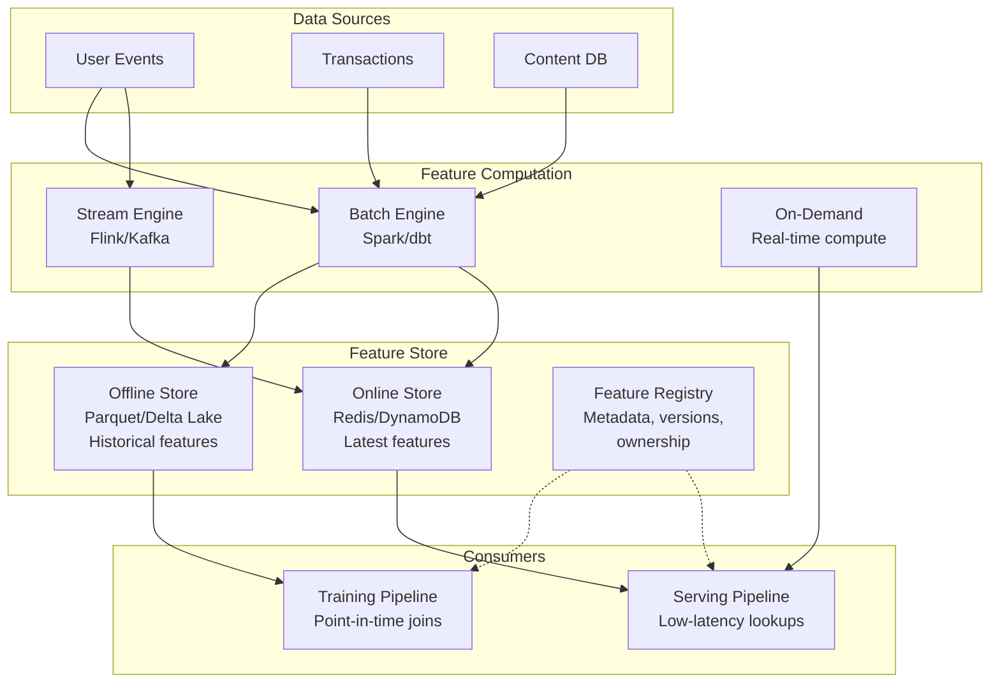

# Feature Stores for AI Systems

## What Is a Feature Store?

A feature store is the **data layer between raw data and ML/AI models**. It provides:

1. **Feature computation** — transforming raw data into model-ready features
2. **Feature storage** — offline (batch) and online (low-latency) stores
3. **Feature registry** — catalog of all features with metadata
4. **Feature serving** — consistent features for training AND inference

```
Without Feature Store:
  Training: data scientist writes SQL → extracts features → trains model
  Serving: engineer reimplements features in Java → serves in production
  Result: training-serving skew, bugs, inconsistency

With Feature Store:
  Training: request features from offline store → train model
  Serving: request same features from online store → serve predictions
  Result: guaranteed consistency, faster iteration
```

---

## Why Feature Stores Matter for AI

### The Training-Serving Skew Problem

```
Training-Serving Skew:
┌─────────────────────────────────────────────────────┐
│ Training: avg_session_duration computed over 30 days │
│ Serving:  avg_session_duration computed over 7 days  │
│                                                     │
│ Result: Model accuracy drops 15% in production      │
│ Cause: Nobody noticed the different window sizes    │
│ Time to debug: 3 weeks                              │
└─────────────────────────────────────────────────────┘
```

### Business Impact

| Problem | Without Feature Store | With Feature Store |
|---------|----------------------|-------------------|
| Feature development time | 2-4 weeks | 2-4 days |
| Training-serving bugs | Monthly | Near zero |
| Feature duplication | 30-50% | < 5% |
| Cross-team feature sharing | Manual, brittle | Self-serve |
| Point-in-time correctness | Hope | Guaranteed |

---

## Architecture: Offline + Online Stores



### Offline Store

- **Purpose:** Historical feature values for training
- **Storage:** Parquet files on S3/GCS, Delta Lake, BigQuery
- **Access pattern:** Point-in-time joins (give me features AS OF this timestamp)
- **Latency:** Seconds to minutes (batch reads)
- **Retention:** Months to years

### Online Store

- **Purpose:** Latest feature values for real-time inference
- **Storage:** Redis, DynamoDB, Bigtable
- **Access pattern:** Key-value lookup (get user_123's features NOW)
- **Latency:** < 10ms (p99)
- **Retention:** Latest value only (or short window)

### Feature Registry

- **Purpose:** Catalog of all features with metadata
- **Contents:** Name, description, owner, schema, version, data source, compute logic
- **Access:** Search, browse, dependency graph

---

## Feature Computation Patterns

### Batch Features (Most Common)

```python
# Computed daily/hourly via Spark/dbt
# Example: user's average order value over 30 days
feature: user_avg_order_30d
computation: SELECT user_id, AVG(order_total) 
             FROM orders 
             WHERE order_date > NOW() - INTERVAL 30 DAY
             GROUP BY user_id
schedule: daily at 2am
freshness: 24 hours
```

**Use when:** Feature doesn't need real-time freshness, complex aggregations over large windows.

### Streaming Features

```python
# Computed in real-time via Flink/Kafka Streams
# Example: user's click count in last 5 minutes
feature: user_clicks_5min
computation: COUNT events WHERE type='click' 
             WINDOW TUMBLING(5 minutes)
freshness: seconds
```

**Use when:** Recency matters (fraud detection, real-time personalization).

### On-Demand Features

```python
# Computed at request time
# Example: cosine similarity between user and item embeddings
feature: user_item_similarity
computation: cosine(user_embedding, item_embedding)
freshness: instant
```

**Use when:** Feature depends on request context (query, candidate item).

---

## Feature Types for LLM/RAG Systems

### User Context Features

```
Features that describe the user making the request:
├── user_role: admin/viewer/editor
├── user_department: engineering/sales/marketing
├── user_access_level: confidential/internal/public
├── user_recent_queries: last 10 queries (for context)
├── user_preferred_format: brief/detailed/technical
└── user_interaction_history: what they've clicked/liked
```

### Document Features

```
Features that describe documents in the knowledge base:
├── doc_freshness_days: days since last update
├── doc_access_count_30d: popularity signal
├── doc_quality_score: automated quality assessment
├── doc_domain: which team/product owns it
├── doc_embedding_version: which model generated embeddings
└── doc_chunk_count: how many chunks it was split into
```

### Interaction Features

```
Features computed from user-document interactions:
├── query_doc_click_rate: historical relevance signal
├── doc_avg_dwell_time: engagement proxy
├── doc_feedback_score: explicit thumbs up/down
├── query_intent_cluster: what type of question is this
└── session_query_count: how many queries in this session
```

### Using Features in RAG

```
Standard RAG: query → embed → vector search → top-K → LLM

Feature-Enhanced RAG: 
  query → embed → vector search 
       → re-rank using features (freshness, popularity, user access)
       → personalize using user features (role, history)
       → top-K → LLM with user context
```

---

## Point-in-Time Correctness

### The Data Leakage Problem

```
WRONG: Training with future information
─────────────────────────────────────────
Event at T=10: user clicks document
Feature computed at T=15: user_click_count = 5 (includes T=10 click)
Training label at T=10: will user click? YES

Problem: Feature ALREADY includes the event we're trying to predict!
The model "learns" to cheat by looking at the answer.
```

### Correct Point-in-Time Join

```
CORRECT: Features computed AS OF the prediction time
─────────────────────────────────────────────────────
Event at T=10: user clicks document
Feature AS OF T=9: user_click_count = 4 (excludes T=10)
Training label at T=10: will user click? YES

The model sees only information available BEFORE the event.
```

### Implementation

```sql
-- Point-in-time join: get features as they existed at event time
SELECT 
  events.user_id,
  events.timestamp AS event_time,
  features.user_click_count,
  features.feature_timestamp
FROM events
LEFT JOIN features
  ON events.user_id = features.user_id
  AND features.feature_timestamp <= events.timestamp
  AND features.feature_timestamp = (
    SELECT MAX(f2.feature_timestamp) 
    FROM features f2
    WHERE f2.user_id = events.user_id
    AND f2.feature_timestamp <= events.timestamp
  )
```

---

## Feature Store Options Comparison

| Feature | Feast | Tecton | Vertex AI FS | Databricks FS |
|---------|-------|--------|--------------|---------------|
| Deployment | Self-managed | Managed SaaS | GCP managed | Databricks |
| Online store | Redis, DynamoDB | Built-in | Bigtable | DynamoDB |
| Offline store | Parquet, BQ, Snowflake | Built-in | BigQuery | Delta Lake |
| Streaming | Kafka + custom | Native | Dataflow | Spark Streaming |
| Cost | Free (infra cost) | $$$ | $$ | $$ |
| Complexity | High (DIY) | Low (managed) | Medium | Medium |
| Lock-in | None | Moderate | GCP | Databricks |
| Best for | Teams wanting control | Teams wanting managed | GCP shops | Databricks shops |

### Feast (Open Source)

```
Pros:
- No vendor lock-in
- Active community
- Supports multiple backends
- Free (pay only for infra)

Cons:
- No native streaming features
- Operational burden (you manage it)
- Limited monitoring out of the box
- Point-in-time joins can be slow at scale
```

### Tecton (Managed)

```
Pros:
- Native batch + streaming + real-time
- Managed infrastructure
- Built-in monitoring
- Strong point-in-time correctness

Cons:
- Expensive ($50K-500K+/year)
- Vendor lock-in
- Overkill for simple use cases
```

---

## Integration with RAG Systems

### Feature Store as Retrieval Signal

```
Traditional RAG:
  relevance_score = cosine_similarity(query_embedding, doc_embedding)

Feature-Enhanced RAG:
  relevance_score = 0.6 * cosine_similarity(query_embedding, doc_embedding)
                  + 0.2 * freshness_score(doc_freshness_days)
                  + 0.1 * popularity_score(doc_access_count_30d)
                  + 0.1 * personalization_score(user_department, doc_domain)
```

### Architecture

```
User Query
    ↓
[Feature Store: get user features]  ← user_role, history, preferences
    ↓
[Vector Search: get candidate docs]
    ↓
[Feature Store: get doc features]   ← freshness, quality, popularity
    ↓
[Re-ranker: combine all signals]
    ↓
[LLM: generate response with context]
```

---

## Anti-Patterns

### 1. Feature Duplication

```
Symptom: 5 teams computing "active_users" 5 different ways
Impact: Models disagree, A/B tests are invalid
Fix: Feature store with single definition per feature
```

### 2. Training-Serving Skew

```
Symptom: Model works in notebook, fails in production
Impact: -15% accuracy in production vs offline evaluation
Fix: Same feature computation code for training and serving
```

### 3. No Versioning

```
Symptom: "Which version of user_embedding was the model trained on?"
Impact: Can't reproduce results, can't roll back
Fix: Version every feature definition, track which model uses which version
```

### 4. Storing Raw Data in Feature Store

```
Symptom: Feature store has raw JSON blobs
Impact: Serving latency spikes, no type safety
Fix: Feature store stores computed, typed, validated features only
```

### 5. Ignoring Feature Freshness

```
Symptom: Online store serves 3-day-old "real-time" features
Impact: Personalization based on stale data
Fix: Freshness SLAs per feature, monitoring, alerting
```

---

## Staff Decision: Build vs Buy Feature Store

### Decision Framework

```
Build (Feast + custom) when:
├── Team has strong data engineering (5+ senior DEs)
├── Unique requirements (custom online store, custom compute)
├── Cost sensitivity (can't justify $200K+/year)
├── Already have infrastructure (Redis, Spark, Kafka)
└── Want full control and no lock-in

Buy (Tecton/Vertex/Databricks) when:
├── Small data team (< 5 DEs)
├── Standard requirements (batch + streaming features)
├── Time-to-value is critical (need features in weeks not months)
├── Budget available ($100K-500K/year)
└── Don't want operational burden
```

### When You DON'T Need a Feature Store

```
Skip the feature store if:
├── < 5 ML models in production
├── All features are batch-only (no online serving)
├── Single team consuming features (no sharing need)
├── Features are simple (direct database lookups)
└── Total feature count < 50

Instead: use a simple feature table in your warehouse
with a lightweight serving layer (Redis cache of latest values).
```

### Migration Path

```
Stage 1: Features in SQL/notebooks (< 5 models)
Stage 2: Shared feature tables in warehouse (5-20 models)
Stage 3: Lightweight feature store - Feast (20-50 models)
Stage 4: Full feature platform - Tecton/custom (50+ models)
```

---

## Key Takeaways

1. **Feature stores solve training-serving skew** — the most common ML bug
2. **Offline + online stores serve different access patterns** — you need both
3. **Point-in-time correctness prevents data leakage** — critical for valid training
4. **Feature stores enable cross-team feature sharing** — 30-50% less duplication
5. **Start simple, add complexity as needed** — don't over-engineer for 3 models
6. **For RAG systems, features enhance retrieval quality** — beyond pure vector similarity
