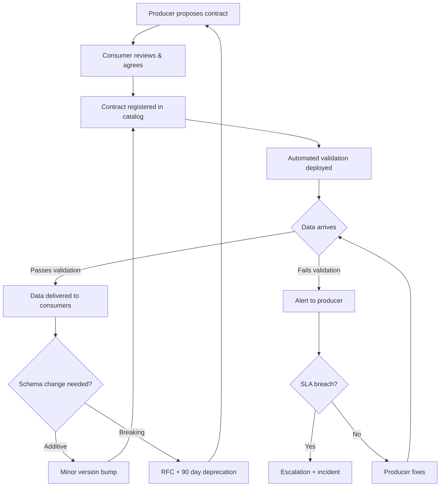

# Data Contracts and Quality for AI Systems

## What Are Data Contracts?

A data contract is a **formal agreement between a data producer and data consumer** that specifies:
- **Schema:** exact structure, types, and constraints
- **SLAs:** freshness, availability, quality thresholds
- **Ownership:** who is responsible when things break
- **Semantics:** what the data actually means

```
Without Contracts:
  Producer changes column name → consumer pipeline silently fails
  Producer adds nulls → consumer model trains on garbage
  Producer delays by 6 hours → consumer serves stale predictions
  Nobody knows until a customer complains

With Contracts:
  Producer changes column name → contract violation → blocked deployment
  Producer adds nulls → quality gate rejects → alert to producer
  Producer delays by 6 hours → SLA breach → automated escalation
  Issues caught in minutes, not days
```

---

## Why Contracts Matter for AI Systems

AI pipelines are uniquely vulnerable to data issues:

1. **Silent degradation** — a model doesn't crash on bad data, it just gets worse
2. **Long feedback loops** — quality drops may not be noticed for days/weeks
3. **Cascading failures** — bad data → bad embeddings → bad search → bad answers
4. **Non-obvious dependencies** — embedding model depends on 50+ upstream tables

### The Cost of No Contracts

```
Real incident timeline (no contracts):
─────────────────────────────────────
Day 0: Producer team renames `user_country` to `country_code`
Day 1: ETL pipeline maps NULL for all users (no error, just empty)
Day 3: Feature store computes wrong regional features
Day 5: Model predictions degrade for non-US users
Day 8: Customer support tickets spike
Day 12: Root cause identified
Day 14: Fix deployed

Total impact: $2.3M revenue loss, 12 days of degraded service
```

---

## Contract Structure

### Complete Data Contract Specification

```yaml
# data-contract.yaml
contract:
  name: user_interactions
  version: "2.1.0"
  description: "User interactions with documents in knowledge base"
  
  owner:
    team: knowledge-platform
    contact: knowledge-platform@company.com
    oncall: knowledge-platform-oncall
    
  schema:
    type: record
    fields:
      - name: user_id
        type: string
        required: true
        description: "Unique user identifier"
        pii: true
      - name: document_id
        type: string
        required: true
        description: "Document that was interacted with"
      - name: interaction_type
        type: enum
        values: [view, click, bookmark, share, feedback]
        required: true
      - name: timestamp
        type: timestamp
        required: true
        format: "ISO 8601"
      - name: session_id
        type: string
        required: false
      - name: feedback_score
        type: integer
        required: false
        constraints:
          min: 1
          max: 5
          
  sla:
    freshness: 
      max_delay: 15 minutes
      measurement: event_time to landing_time
    availability:
      uptime: 99.9%
      measurement: monthly
    volume:
      expected_daily: 1M-5M events
      alert_if_below: 500K
      alert_if_above: 10M
    completeness:
      required_fields_null_rate: < 0.1%
      
  quality_rules:
    - rule: "user_id matches pattern ^[a-zA-Z0-9]{8,32}$"
    - rule: "timestamp is not in the future"
    - rule: "timestamp is not older than 7 days"
    - rule: "document_id exists in document catalog"
    - rule: "no duplicate (user_id, document_id, timestamp) within 1 second"
    
  consumers:
    - team: ai-search
      use_case: "Training search ranking model"
      fields_used: [user_id, document_id, interaction_type, timestamp]
    - team: recommendations
      use_case: "Building user preference features"
      fields_used: [user_id, document_id, interaction_type, feedback_score]
      
  evolution:
    compatibility: backward
    deprecation_notice: 90 days
    breaking_change_process: RFC required
```

---

## Data Contract Lifecycle



---

## Data Quality Dimensions

### The Six Dimensions

| Dimension | Definition | AI Impact | Measurement |
|-----------|-----------|-----------|-------------|
| **Completeness** | Are all required fields present? | Missing features → model bias | % null in required fields |
| **Accuracy** | Is data correct? | Wrong labels → wrong predictions | Spot checks, cross-validation |
| **Freshness** | How recent is the data? | Stale data → outdated responses | Event time vs processing time |
| **Consistency** | Same entity, same value? | Conflicting features → noise | Cross-source comparison |
| **Uniqueness** | No unwanted duplicates? | Duplicates → training bias | Dedup rate |
| **Validity** | Values within expected range? | Invalid values → model confusion | Constraint check pass rate |

### AI-Specific Quality Concerns

```
Embedding Quality:
├── Drift: embeddings computed with different model versions
├── Staleness: document changed but embedding not recomputed
├── Corruption: truncated documents → partial embeddings
├── Dimensionality: mixed 768-dim and 1536-dim in same collection
└── Coverage: 15% of documents have no embedding at all

Feature Quality:
├── Skew: training features != serving features
├── Leakage: future information in training features
├── Staleness: "real-time" feature is 3 days old
├── Distribution shift: feature distribution changed significantly
└── Missing: feature available for 80% of users, missing for 20%
```

---

## Quality Gates: Automated Validation

### Gate Architecture

```
Data Flow with Quality Gates:
═══════════════════════════════════════════════

Source → [Gate 1: Schema] → Landing Zone
              ↓ fail → Dead Letter Queue

Landing → [Gate 2: Business Rules] → Cleaned
              ↓ fail → Quarantine

Cleaned → [Gate 3: Statistical] → Feature Store
              ↓ fail → Alert + Block

Feature Store → [Gate 4: Serving Check] → Production
              ↓ fail → Serve stale + Alert
```

### Gate Definitions

**Gate 1: Schema Validation**
```
- All required fields present
- Types match contract
- Enum values are valid
- No unexpected fields (strict mode)
- Action on fail: REJECT to dead letter queue
```

**Gate 2: Business Rule Validation**
```
- Referential integrity (user_id exists)
- Temporal constraints (not future-dated)
- Range constraints (0 <= score <= 100)
- Pattern constraints (email format)
- Action on fail: QUARANTINE for review
```

**Gate 3: Statistical Validation**
```
- Distribution drift < threshold
- Volume within expected range
- Null rate within SLA
- Duplicate rate within SLA
- Action on fail: BLOCK pipeline + alert
```

**Gate 4: Serving Readiness**
```
- Feature completeness > 95%
- Feature freshness within SLA
- No NaN/Inf values
- Latency within serving budget
- Action on fail: SERVE STALE + alert
```

---

## Tooling Comparison

### Great Expectations

```
Strengths:
- Python-native, rich expectation library
- Data docs (auto-generated quality reports)
- Works with pandas, Spark, SQL
- Open source with commercial offering

Weaknesses:
- Complex setup for streaming
- Performance at scale (large datasets)
- Steep learning curve

Best for: Python-heavy teams, batch pipelines
```

### Soda

```
Strengths:
- SQL-native (SodaCL language)
- Easy to get started
- Good cloud offering (Soda Cloud)
- Built-in anomaly detection

Weaknesses:
- Less flexible than Great Expectations for custom checks
- Newer, smaller community

Best for: SQL-heavy teams, quick setup
```

### dbt Tests

```
Strengths:
- Integrated with transformation layer
- Simple YAML-based tests
- Runs with your transformations
- Great for referential integrity

Weaknesses:
- Limited to warehouse data
- No streaming support
- Basic statistical checks only

Best for: dbt-centric data teams
```

### Comparison Matrix

| Capability | Great Expectations | Soda | dbt Tests |
|-----------|-------------------|------|-----------|
| Custom checks | Excellent | Good | Limited |
| Streaming | Possible (complex) | Limited | No |
| Setup time | Days | Hours | Minutes |
| Statistical tests | Excellent | Good | Basic |
| Alerting | Plugin-based | Built-in | CI/CD |
| Cost | Free / $$ (Cloud) | Free / $$ | Free |

---

## Data Quality for Embeddings

### Detecting Embedding Drift

```
Embedding drift occurs when:
1. Source documents change significantly
2. Embedding model is updated
3. Chunking strategy changes
4. Preprocessing pipeline changes

Detection methods:
- Compare embedding distributions over time (centroid shift)
- Monitor retrieval quality metrics (MRR, recall@K)
- Track cosine similarity between consecutive versions
- Alert when average similarity drops below threshold

Threshold example:
  avg_cosine_similarity(embeddings_today, embeddings_yesterday) < 0.95
  → ALERT: significant embedding drift detected
```

### Embedding Staleness

```
Problem: Document was updated 30 days ago, embedding is from original version

Detection:
  SELECT doc_id, doc_updated_at, embedding_computed_at
  FROM documents d
  JOIN embeddings e ON d.id = e.doc_id
  WHERE d.doc_updated_at > e.embedding_computed_at + INTERVAL '24 hours'

SLA: embeddings must be recomputed within 24 hours of document update
Monitor: % of documents with stale embeddings (target: < 5%)
```

---

## Monitoring: Data Quality Dashboards

### Key Metrics to Track

```
Dashboard Sections:
─────────────────────

1. Contract Compliance
   - % contracts with no violations (target: 99%)
   - Top violated contracts this week
   - SLA breach trend over time

2. Quality Scores
   - Per-dataset quality score (0-100)
   - Dimension breakdown (completeness, freshness, etc.)
   - Quality score trend

3. Pipeline Health
   - Records processed vs rejected vs quarantined
   - Gate pass rates
   - Dead letter queue depth

4. AI-Specific
   - Embedding freshness distribution
   - Feature completeness by model
   - Training-serving skew metrics
   - Retrieval quality trend (MRR, recall)
```

### Alerting Rules

```
Critical (page oncall):
- SLA breach on Tier 1 contract (>15 min stale)
- Quality gate blocking production pipeline
- Embedding coverage drops below 90%
- Feature serving returns errors

Warning (Slack notification):
- Quality score drops >10% day-over-day
- Null rate exceeds 5% on important field
- Volume anomaly (2x or 0.5x normal)
- Stale embedding count growing

Info (dashboard only):
- Minor schema drift detected
- Quarantine queue growing slowly
- Non-critical contract minor violation
```

---

## Anti-Patterns

### 1. No Contracts (Implicit Schemas)

```
Symptom: "What format does team X send us data in?" → "Check their code"
Impact: Any upstream change breaks downstream silently
Fix: Explicit contracts, validated at ingestion
```

### 2. Quality Checked Only at Serving Time

```
Symptom: Bad data discovered when model makes wrong prediction
Impact: By then, model may have trained on bad data for days
Fix: Quality gates at ingestion, not just serving
```

### 3. No Ownership

```
Symptom: "Who owns this table?" → "It was created 3 years ago by someone who left"
Impact: Nobody fixes quality issues, nobody approves changes
Fix: Every dataset has a team owner in the contract
```

### 4. Quality Theater

```
Symptom: Quality checks exist but nobody looks at results
Impact: False sense of security, checks become stale
Fix: Quality gates that BLOCK pipelines, not just report
```

### 5. One-Size-Fits-All Quality

```
Symptom: Same quality rules for critical and non-critical data
Impact: Alert fatigue (too many alerts) or missed issues (too few)
Fix: Tiered quality requirements based on data criticality
```

---

## Staff Deliverable: Data Contract Template

### Template for AI Systems

```yaml
# Template: AI Data Contract
# Copy this template for each data product consumed by AI systems

contract:
  name: "<dataset_name>"
  version: "<semver>"
  description: "<what this data represents>"
  classification: "<public|internal|confidential|restricted>"
  
  owner:
    team: "<team_name>"
    contact: "<email>"
    oncall: "<oncall_rotation>"
    
  schema:
    format: "<parquet|json|avro|protobuf>"
    fields:
      - name: "<field_name>"
        type: "<string|int|float|bool|timestamp|array|map>"
        required: <true|false>
        pii: <true|false>
        description: "<what this field means>"
        constraints:
          # Add as needed: min, max, pattern, enum, foreign_key
          
  sla:
    freshness:
      max_delay: "<duration>"
      measurement: "<how measured>"
    availability:
      uptime: "<percentage>"
    volume:
      expected_daily: "<range>"
      alert_thresholds: "<below X or above Y>"
    completeness:
      required_fields_null_rate: "<threshold>"
      
  quality_rules:
    # List validation rules
    - rule: "<description>"
      severity: "<critical|warning|info>"
      action: "<reject|quarantine|alert>"
      
  ai_specific:
    used_by_models: ["<model_name>"]
    feature_derived: ["<feature_name>"]
    embedding_source: <true|false>
    training_data: <true|false>
    freshness_impact: "<how staleness affects AI quality>"
    
  consumers:
    - team: "<team>"
      use_case: "<description>"
      fields_used: ["<field>"]
      criticality: "<high|medium|low>"
      
  evolution:
    compatibility: "<backward|forward|full|none>"
    deprecation_notice: "<duration>"
    breaking_change_process: "<description>"
    
  monitoring:
    dashboard: "<url>"
    alerts: "<channel>"
    review_cadence: "<weekly|monthly|quarterly>"
```

---

## Key Takeaways

1. **Data contracts prevent the #1 AI failure mode** — silent data degradation
2. **Contracts are enforceable agreements**, not documentation
3. **Quality gates must BLOCK pipelines**, not just report
4. **AI needs extra quality dimensions** — embedding freshness, feature skew, distribution drift
5. **Tiered quality requirements** prevent alert fatigue
6. **Every dataset needs an owner** — unowned data is unmaintained data
7. **Template-driven contracts** lower the barrier to adoption
