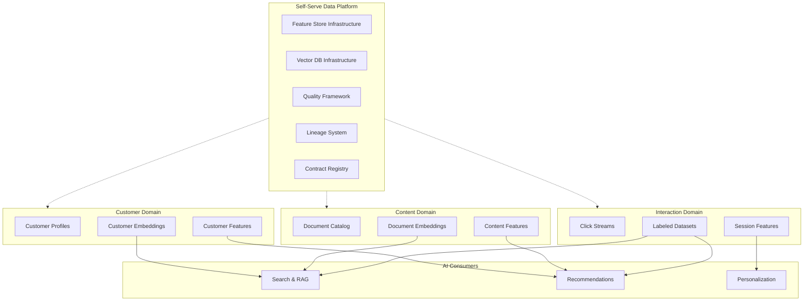

# Data Mesh for AI Systems

## Data Mesh Principles

Data mesh is an organizational and architectural paradigm that treats data as a product, owned by domain teams. It has four core principles:

### 1. Domain Ownership
Each business domain (e.g., search, recommendations, payments) owns its data end-to-end — production, quality, and serving.

### 2. Data as Product
Data is treated with the same rigor as customer-facing products: SLAs, documentation, versioning, discoverability.

### 3. Self-Serve Data Infrastructure
A platform team provides tools and infrastructure so domain teams can produce and consume data products without centralized bottlenecks.

### 4. Federated Computational Governance
Standards and policies are defined globally but enforced locally through automation, not manual review.

```
Traditional (Centralized):
  Domain A → Central Data Team → Data Lake → Central AI Team → AI Product
  Domain B ↗                                                    
  Domain C ↗                                                    
  
  Bottleneck: Central teams become overwhelmed

Data Mesh:
  Domain A → [owns] → AI-Ready Data Product A → consumed by any team
  Domain B → [owns] → AI-Ready Data Product B → consumed by any team
  Domain C → [owns] → AI-Ready Data Product C → consumed by any team
  
  Platform Team provides: infrastructure, standards, tooling
```

---

## How Data Mesh Applies to AI

### The AI-Specific Challenge

AI systems are uniquely cross-domain. A recommendation system needs:
- User data (from identity domain)
- Product data (from catalog domain)
- Interaction data (from engagement domain)
- Transaction data (from payments domain)

**Without mesh:** Central AI team begs each domain for data, waits in queue, gets stale exports.

**With mesh:** Each domain publishes AI-ready data products; AI team self-serves.

### AI Data Products

```
Traditional data product: cleaned table with SLA
AI data product: cleaned table + features + embeddings + training labels

Domain teams must think about:
- What features does AI need from my domain?
- What embeddings should I pre-compute?
- What labeled datasets can I produce?
- How fresh do AI consumers need my data?
```

---

## Data Mesh Topology for Enterprise AI



---

## Domain Boundaries for AI

### Ownership Matrix

| Data | Owner Domain | AI Products Produced | Consumers |
|------|-------------|---------------------|-----------|
| User profiles | Identity | User features, user embeddings | All AI systems |
| Documents | Content | Doc embeddings, doc features, chunks | Search, RAG |
| Clicks/views | Engagement | Interaction features, labeled pairs | Ranking, recommendations |
| Purchases | Commerce | Transaction features, conversion labels | Recommendations, ads |
| Support tickets | Customer Success | Intent labels, resolution data | Chatbots, routing |

### Boundary Disputes

```
Common conflict: "Who owns user-document interactions?"

Option A: Engagement domain (they generate the events)
Option B: Content domain (it's about their documents)
Option C: Identity domain (it's about their users)

Resolution principle: Who GENERATES the data owns it.
→ Engagement domain owns interaction events
→ They produce features that combine user + document context
→ Content and Identity domains provide reference data via their products
```

---

## Self-Serve Data Infrastructure

### What the Platform Team Provides

```
Self-Serve Platform Components:
├── Data Product Templates
│   ├── Schema definition framework
│   ├── Quality check generators
│   ├── CI/CD for data pipelines
│   └── Documentation generators
│
├── Infrastructure as Code
│   ├── Feature store provisioning
│   ├── Vector DB collection creation
│   ├── Streaming pipeline templates
│   └── Batch pipeline templates
│
├── Quality & Governance
│   ├── Automated contract validation
│   ├── Quality scoring
│   ├── Lineage tracking (auto-instrumented)
│   └── PII detection and classification
│
└── Discovery & Consumption
    ├── Data catalog (searchable)
    ├── Feature marketplace
    ├── Embedding registry
    └── Sample data / sandbox environments
```

### Platform Maturity Model

```
Level 1: Manual
  Domain teams manually produce CSV exports on request
  Time to new data product: weeks

Level 2: Templated
  Platform provides templates, domains fill in config
  Time to new data product: days

Level 3: Self-Serve
  Domains use declarative definitions, platform handles infra
  Time to new data product: hours

Level 4: Automated
  Platform auto-discovers data products from domain schemas
  Time to new data product: minutes (with human approval)
```

---

## Federated Governance

### Global Standards (Non-Negotiable)

```
Every data product MUST:
1. Have a registered contract in the catalog
2. Pass automated quality checks
3. Have a named owner (team + individual)
4. Classify PII fields
5. Implement retention policies
6. Support lineage tracing
7. Version schemas (semver)
8. Meet domain-specific freshness SLA
```

### Local Flexibility (Domain Decides)

```
Each domain MAY choose:
- Storage technology (Parquet, Delta, Iceberg)
- Compute engine (Spark, Flink, dbt)
- Pipeline orchestrator (Airflow, Dagster)
- Feature computation approach (batch, streaming, on-demand)
- Internal data model (normalized, denormalized)
- Testing strategy (unit, integration, e2e mix)
```

### Governance Automation

```
Instead of: Manual review board approves every schema change
Do this: Automated CI/CD pipeline that:
  1. Validates schema backward compatibility
  2. Checks all quality rules pass on sample data
  3. Verifies PII classification is complete
  4. Confirms consumer notification for breaking changes
  5. Auto-approves non-breaking changes
  6. Flags breaking changes for human review
```

---

## Data Products for AI

### Types of AI Data Products

**1. Training Datasets**
```yaml
product:
  name: search-relevance-labels
  type: training-dataset
  domain: engagement
  description: "Human-judged and click-based relevance labels"
  schema:
    query: string
    document_id: string
    relevance_score: float (0-1)
    label_source: enum (human, click, implicit)
  freshness: weekly refresh
  size: 2M labeled pairs
  splits: train (80%), validation (10%), test (10%)
```

**2. Feature Sets**
```yaml
product:
  name: user-engagement-features
  type: feature-set
  domain: engagement
  description: "User activity features for ML models"
  features:
    - clicks_7d: int
    - sessions_30d: int  
    - avg_dwell_time_ms: float
    - preferred_categories: array[string]
  serving: online (Redis) + offline (Parquet)
  freshness: online=5min, offline=daily
```

**3. Embeddings**
```yaml
product:
  name: product-embeddings
  type: embedding-set
  domain: catalog
  description: "Product embeddings for similarity search"
  model: text-embedding-3-small
  dimensions: 1536
  count: 5M products
  freshness: re-embedded within 24h of product change
  index: HNSW (ef=200, M=16)
```

**4. Golden Datasets**
```yaml
product:
  name: ai-evaluation-golden-set
  type: golden-dataset
  domain: ai-platform
  description: "Curated test set for RAG evaluation"
  schema:
    question: string
    expected_answer: string
    source_documents: array[string]
    difficulty: enum (easy, medium, hard)
  size: 500 questions
  refresh: quarterly (human curated)
```

---

## Interoperability: Cross-Domain AI

### The Interop Challenge

```
Search ranking model needs:
- User features (from Identity domain)
- Document features (from Content domain)
- Interaction features (from Engagement domain)
- Query features (from Search domain)

Each domain publishes independently → how to join them?
```

### Solutions

**1. Shared Entity Keys**
```
Global standard: all domains use the same entity key formats
- user_id: UUID v4 from Identity domain (source of truth)
- document_id: UUID v4 from Content domain (source of truth)
- session_id: UUID v4 from Engagement domain (source of truth)

Any domain referencing users MUST use Identity's user_id format.
```

**2. Feature Store as Integration Layer**
```
Each domain publishes features to shared feature store:
  Identity → user_features (keyed by user_id)
  Content → document_features (keyed by document_id)
  Engagement → interaction_features (keyed by user_id + document_id)

Consumer (Search) reads all features via feature store API:
  features = feature_store.get_features(
    entity_keys={"user_id": "abc", "document_id": "xyz"},
    feature_sets=["user_features", "document_features", "interaction_features"]
  )
```

**3. Data Product Composition**
```
Composite data products built from multiple domain products:
  search_training_data = join(
    engagement.click_labels,
    content.document_features,
    identity.user_features
  )
  
Ownership: the consuming team owns the composite product
Dependency: tracked in lineage system
```

---

## Migration: Data Lake to Data Mesh

### Phased Approach

```
Phase 1: Identify domains (Month 1-2)
├── Map data assets to business domains
├── Identify current owners vs natural owners
├── Define initial domain boundaries
└── Get executive buy-in

Phase 2: Platform foundation (Month 2-6)
├── Deploy self-serve infrastructure templates
├── Implement contract registry
├── Set up quality framework
├── Build data catalog
└── Staff platform team (3-5 engineers)

Phase 3: Pilot domains (Month 4-9)
├── Pick 2-3 domains with motivated teams
├── Migrate their data assets to products
├── Establish contracts and quality gates
├── Prove the model works
└── Document lessons learned

Phase 4: Scale (Month 9-18)
├── Roll out to remaining domains
├── Mature platform capabilities
├── Automate governance
├── Measure and optimize
└── Iterate on standards

Timeline: 12-18 months for meaningful adoption
Investment: Platform team of 5-8 engineers
```

---

## Anti-Patterns

### 1. Mesh in Name Only

```
Symptom: "We do data mesh" but central team still owns everything
Reality: Renamed the central team to "platform" without shifting ownership
Fix: Domain teams must own their data products including quality and SLAs
Test: If central team disappears, do domains still produce quality data?
```

### 2. No Real Ownership

```
Symptom: "Every team owns their data" but nobody maintains it
Reality: Ownership without accountability = abandonment
Fix: Ownership means: quality gates, SLA monitoring, on-call, consumer support
Test: When data quality drops, does someone get paged?
```

### 3. Governance Theater

```
Symptom: 50 governance documents, zero automation
Reality: Policies exist on paper but aren't enforced
Fix: Governance through automation (CI/CD checks, quality gates)
Test: Can a team ship a data product that violates standards?
     If yes → governance is theater
```

### 4. Every Team Builds Everything

```
Symptom: Each domain builds their own feature store, vector DB, orchestrator
Reality: No self-serve platform, domains reinvent the wheel
Fix: Strong platform team providing standardized infrastructure
Test: How long does it take a new domain to ship their first data product?
     If > 1 month → platform is insufficient
```

### 5. Premature Mesh

```
Symptom: 30-person startup implementing data mesh
Reality: Overhead of mesh exceeds benefits at small scale
Fix: Start centralized, move to mesh when central team is bottleneck
Test: Is the central data team a bottleneck with > 4 week wait times?
     If no → you don't need mesh yet
```

---

## Staff Decision: When Mesh Helps AI Teams vs Creates Friction

### Mesh HELPS When

```
✓ Organization has 200+ engineers across 5+ domains
✓ Central data team has 6+ week backlog
✓ AI use cases span multiple domains
✓ Domain teams have data engineering capability
✓ Executive commitment to invest in platform
✓ Data products have clear domain boundaries
✓ Organization is moving toward product-thinking
```

### Mesh HURTS When

```
✗ Small team (< 50 engineers)
✗ Single AI team consuming all data
✗ Domain teams lack data engineering skills
✗ No investment in self-serve platform
✗ Tight timelines (mesh takes 12-18 months)
✗ Data is inherently cross-domain (no clear ownership)
✗ Organization culture doesn't support distributed ownership
```

### Decision Matrix

```
                    Small Org        Large Org
                    (< 100 eng)     (> 200 eng)
                    ┌────────────┬────────────┐
Single AI team      │ Central    │ Central    │
                    │ Lake       │ Lake + Fed │
                    ├────────────┼────────────┤
Multiple AI teams   │ Central    │ Data Mesh  │
                    │ Lake       │            │
                    └────────────┴────────────┘
```

### Hybrid: Mesh for Data, Central for AI

```
A pragmatic approach many companies take:

Data Production: Mesh (domains own their data products)
AI Consumption: Centralized AI platform team

Why: AI expertise is scarce and benefits from concentration
     Data production benefits from domain expertise

The AI platform team:
- Consumes data products from all domains
- Owns cross-domain AI features (computed from multiple products)
- Operates shared AI infrastructure (feature store, vector DB, model serving)
- Provides AI capabilities back to domains as services
```

---

## Key Takeaways

1. **Data mesh is an organizational pattern**, not a technology choice
2. **Domain ownership means accountability** — not just naming
3. **Self-serve platform is the enabler** — without it, mesh fails
4. **AI is inherently cross-domain** — interoperability is critical
5. **Start with 2-3 pilot domains** — don't boil the ocean
6. **Governance must be automated** — manual review doesn't scale
7. **Most organizations need a hybrid** — mesh for data, centralized for AI platform
8. **Don't adopt mesh prematurely** — it's for organizations at scale
