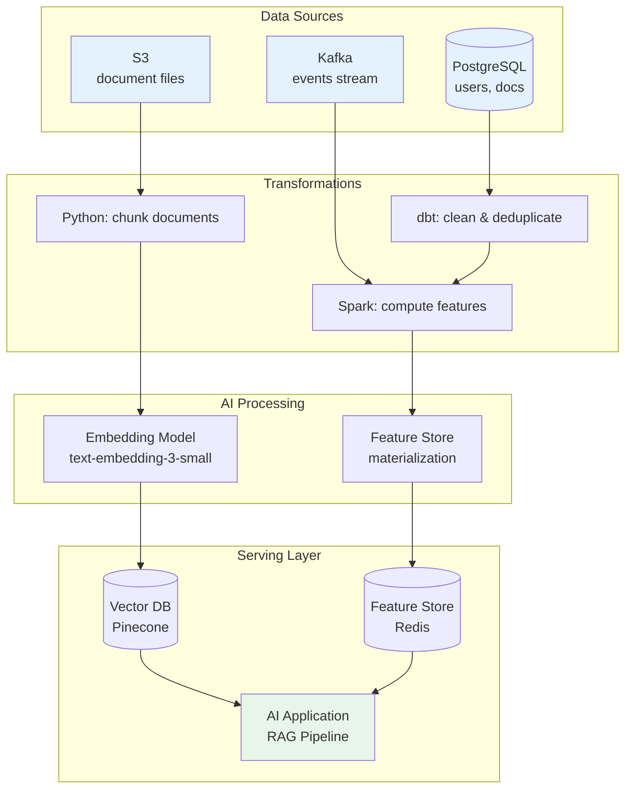

# Data Lineage and Observability for AI Systems

## What Is Data Lineage?

Data lineage tracks the complete journey of data from source through every transformation to final consumption. For AI systems, it answers:

- **Where did this data come from?** (provenance)
- **What transformations were applied?** (processing history)
- **What depends on this data?** (impact analysis)
- **Why did my model's output change?** (root cause tracing)

```
Lineage Graph (simplified):
━━━━━━━━━━━━━━━━━━━━━━━━━━━━━━━━━━━━━━━━━━━━━━

[PostgreSQL: users]──→[Clean: deduplicate]──→[Feature: user_activity_30d]
                                                        │
[Kafka: clicks]──→[Aggregate: session_clicks]──→────────┤
                                                        ↓
                                              [Model: search_ranker_v3]
                                                        │
[S3: documents]──→[Chunk]──→[Embed: ada-002]──→────────┤
                                                        ↓
                                              [Pinecone: search_index]
                                                        │
                                                        ↓
                                              [API: /search endpoint]
```

---

## Why Lineage Matters for AI

### The Debugging Problem

```
Incident: Search quality dropped 8% on Tuesday

Without lineage (3 weeks to debug):
  Day 1: Notice quality drop in metrics
  Day 3: Rule out model changes (no deploys)
  Day 5: Check feature store - features look normal
  Day 8: Check embedding pipeline - still running
  Day 12: Find that document source changed format
  Day 15: Trace to upstream team's schema migration
  Day 18: Identify 30% of documents got empty embeddings
  Day 21: Fix deployed

With lineage (3 hours to debug):
  Hour 1: Notice quality drop → check lineage for changes
  Hour 2: Lineage shows: document source schema changed Tuesday AM
  Hour 3: Trace impact: 30% embeddings affected → fix deployed
```

### AI-Specific Lineage Needs

| Question | Standard Lineage | AI Lineage (Extended) |
|----------|-----------------|----------------------|
| What tables does this use? | Yes | Yes |
| What model produced this? | No | Yes (model version, params) |
| What embedding model? | No | Yes (model + version) |
| What chunking strategy? | No | Yes (chunk size, overlap) |
| What prompt template? | No | Yes (template version) |
| Training data included? | No | Yes (dataset version, split) |

---

## Lineage Types

### Dataset-Level Lineage

```
Granularity: entire datasets/tables
Tracks: which datasets feed into which datasets
Example: users_table → user_features_table → search_model

Use: High-level impact analysis
     "If users_table goes down, what breaks?"
```

### Column-Level Lineage

```
Granularity: individual columns/fields
Tracks: which source columns produce which output columns
Example: users.last_login + users.signup_date → user_features.account_age_days

Use: Precise impact analysis, PII tracking
     "If we remove users.email, which features break?"
```

### Pipeline-Level Lineage

```
Granularity: execution instances
Tracks: specific pipeline runs, timestamps, parameters
Example: pipeline_run_2024_01_15_02:00 processed 1.2M records 
         using embedding_model=ada-002-v2

Use: Debugging specific incidents
     "What exactly ran between Monday and Tuesday?"
```

---

## Lineage Graph for AI Pipeline



---

## Tools

### OpenLineage (Open Standard)

```
What: Open standard for lineage metadata collection
How: Emits lineage events from pipelines (Spark, Airflow, dbt)
Strengths:
  - Vendor neutral
  - Growing ecosystem of integrations
  - Standardized event format
Weaknesses:
  - Requires integration effort
  - No UI (need Marquez or similar)
Best for: Teams wanting portability and standard compliance
```

### Marquez (Open Source)

```
What: Lineage metadata server (reference implementation of OpenLineage)
How: Collects OpenLineage events, stores graph, provides API + UI
Strengths:
  - Free, open source
  - Good Airflow/Spark integration
  - REST API for querying lineage
Weaknesses:
  - Limited scale (not battle-tested at 10K+ datasets)
  - Basic UI
Best for: Teams starting with lineage, budget-conscious
```

### Atlan (Commercial)

```
What: Modern data catalog with lineage
How: Auto-discovers lineage from warehouse, orchestrators, BI tools
Strengths:
  - Beautiful UI
  - Auto-discovery (less manual effort)
  - Business context + lineage combined
Weaknesses:
  - Expensive ($100K+/year)
  - Less AI-pipeline-specific
Best for: Large enterprises wanting unified catalog + lineage
```

### Apache Atlas (Hadoop Ecosystem)

```
What: Metadata and governance framework
How: Collects lineage from Hadoop ecosystem tools
Strengths:
  - Deep Hadoop/Hive integration
  - Classification and governance features
Weaknesses:
  - Heavy, complex to operate
  - Hadoop-centric
Best for: Organizations with significant Hadoop investment
```

---

## Debugging with Lineage

### Regression Tracing Pattern

```
Step 1: Model regression detected
  Search quality MRR dropped from 0.72 to 0.65

Step 2: Check model lineage
  Model hasn't changed (same version, same weights)

Step 3: Check feature lineage  
  Feature values for user_activity_30d look normal
  
Step 4: Check embedding lineage
  Embeddings for document collection: 
  - 85% computed with text-embedding-3-small (correct)
  - 15% computed with text-embedding-ada-002 (WRONG - old model!)
  
Step 5: Trace to root cause
  Lineage shows: backfill job on Tuesday used wrong config
  → 15% of documents re-embedded with old model
  
Step 6: Fix
  Re-run embedding job with correct model for affected documents
  Time to fix: 4 hours (vs 3 weeks without lineage)
```

### Impact Analysis Pattern

```
Question: "If I change the document chunking strategy, what breaks?"

Lineage query:
  DOWNSTREAM_OF(pipeline: document_chunker)
  
Result:
  document_chunker
    → embeddings_collection (Pinecone)
      → search_endpoint (/api/search)
      → recommendation_model (rec_v4)
    → chunk_metadata_table
      → analytics_dashboard
      
Impact: 2 production endpoints, 1 model, 1 dashboard
Action: Coordinate with search team + rec team before changing
```

---

## Compliance Uses

### GDPR: Data Subject Access Request

```
Question: "Where is user 12345's data stored and processed?"

Lineage query:
  FIND_ALL datasets WHERE contains_entity(user_id=12345)
  
Result:
  Raw: events_kafka_topic, users_postgres
  Processed: user_features_table, user_activity_agg
  AI: user_embedding (Pinecone, id=12345)
  Serving: recommendation_cache (Redis, key=user:12345)
  Logs: api_access_log (contains user_id in request)
  
GDPR response: User's data exists in 6 systems
Deletion plan: Delete from all 6 + verify
```

### Right to Explanation

```
Question: "Why did the AI recommend X to user Y?"

Lineage trace:
  Recommendation for user Y, item X
    ← ranking_model_v3 scored 0.89
      ← features used:
        ← user_purchase_history (user Y bought similar items)
        ← item_embedding similarity = 0.92 (item X similar to past purchases)
        ← user_category_preference (user Y prefers this category)
      ← model trained on: interaction_dataset_v12
  
Explanation: "Recommended because you purchased similar items 
              and frequently browse this category"
```

### Lineage for RAG

```
Question: "Which documents influenced this AI response?"

Lineage trace:
  Response: "The quarterly revenue was $42M..."
    ← LLM generated from context:
      ← Retrieved chunks:
        ← chunk_id=abc (from Q3_report.pdf, page 4, embedded 2024-01-10)
        ← chunk_id=def (from finance_summary.docx, para 3, embedded 2024-01-12)
      ← Retrieval used:
        ← query_embedding (user question embedded with ada-002)
        ← similarity search (top-5, threshold=0.78)
        
Citation: Response is grounded in Q3_report.pdf and finance_summary.docx
Freshness: Both sources embedded within last 5 days
```

---

## Anti-Patterns

### 1. Lineage as Afterthought

```
Symptom: "We'll add lineage later after the pipeline is working"
Reality: Retrofitting lineage is 10x harder than building it in
Fix: Instrument lineage from day 1 using OpenLineage standard
Cost: Without lineage, debugging takes weeks instead of hours
```

### 2. Manual Lineage

```
Symptom: Lineage documented in Confluence pages
Reality: Stale within days, nobody maintains it
Fix: Auto-instrumented lineage from pipeline frameworks
Test: Does lineage update automatically when pipeline changes?
```

### 3. No Column-Level Tracking

```
Symptom: Know which tables connect but not which columns
Reality: Can't do PII tracking, can't do precise impact analysis
Fix: Column-level lineage (dbt provides this, Spark can be instrumented)
Cost: "If I rename this column, what breaks?" → "We don't know"
```

### 4. Lineage Without Action

```
Symptom: Beautiful lineage graph that nobody looks at
Reality: Lineage not integrated into incident response or change management
Fix: 
  - Change management: auto-notify downstream when upstream changes
  - Incident response: lineage query as step 1 in runbook
  - CI/CD: impact analysis before deploying data pipeline changes
```

---

## Staff Decision: Lineage Investment vs System Complexity

### Decision Framework

```
Minimal Lineage (dataset-level, manual catalog):
├── < 20 data pipelines
├── < 5 AI models in production
├── Single team owns everything
├── Debugging is infrequent
└── Investment: 1 engineer, 2 weeks

Standard Lineage (auto-instrumented, dataset + pipeline level):
├── 20-100 data pipelines
├── 5-20 AI models
├── Multiple teams, some cross-team dependencies
├── Monthly debugging incidents
└── Investment: 2 engineers, 2 months + ongoing

Full Lineage (column-level, real-time, compliance-ready):
├── 100+ pipelines
├── 20+ AI models
├── Heavy cross-team dependencies
├── Compliance requirements (GDPR, SOX)
├── Weekly debugging incidents
└── Investment: 3-5 engineers, 6 months + ongoing
```

### ROI Calculation

```
Cost of lineage system: $200K-500K/year (tools + engineering)

Value:
- Debugging time saved: 20 incidents/year × 3 weeks → 3 hours = 57 weeks saved
- Engineer cost: $100/hour → $228K/year saved in debugging alone
- Compliance: Avoid $10M+ GDPR fines
- Change velocity: Ship data changes 2x faster with impact analysis
- Quality: Catch issues 10x faster → less revenue impact

Typically breaks even at: > 50 data pipelines, > 10 AI models
```

---

## Key Takeaways

1. **Lineage turns multi-week debugging into multi-hour debugging**
2. **Auto-instrument from day 1** — retrofitting is 10x harder
3. **Column-level lineage enables PII tracking** — critical for compliance
4. **Lineage must be actionable** — tied to incident response and change management
5. **For RAG systems, lineage enables citations and explanations**
6. **Investment scales with system complexity** — start minimal, grow as needed
7. **OpenLineage standard provides vendor portability** — avoid lock-in
