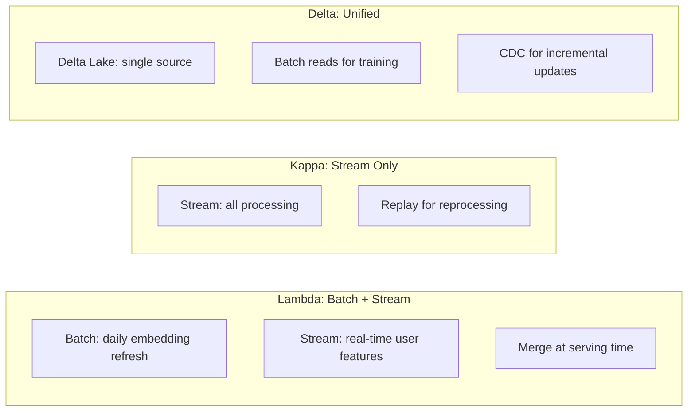
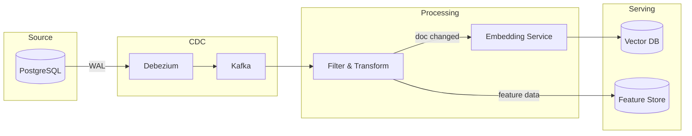

# Data Pipelines at Scale for AI Systems

## Architecture Patterns

### Lambda Architecture (Batch + Streaming)

```
                    ┌─────────────────────────────┐
                    │        Batch Layer           │
Source ──→ Queue ──→│  (Spark/dbt - complete,     │──→ Serving Layer
              │     │   high-latency, reprocessable)│         ↑
              │     └─────────────────────────────┘         │
              │     ┌─────────────────────────────┐         │
              └────→│       Speed Layer            │─────────┘
                    │  (Flink/Kafka Streams -      │
                    │   approximate, low-latency)   │
                    └─────────────────────────────┘

Serving Layer merges: batch results (complete) + speed results (recent)
```

**Pros:** Reprocessable, handles late data, proven at scale
**Cons:** Two codepaths to maintain, complexity, eventual consistency between layers

### Kappa Architecture (Streaming Only)

```
Source ──→ Kafka ──→ Stream Processor ──→ Serving Layer
              │            │
              │      (Flink/Kafka Streams)
              │            │
              └── Replay ──┘  (reprocess by replaying from offset 0)
```

**Pros:** Single codepath, simpler, lower latency
**Cons:** Expensive to reprocess (replay all history), complex joins

### Delta Architecture (Unified)

```
Source ──→ Delta Lake / Iceberg ──→ Processing ──→ Serving
                    │
           (supports both batch reads
            and streaming reads from
            the same storage)

Batch: read full table snapshot
Streaming: read change feed (CDC from lake)
```

**Pros:** Single storage, single codepath, ACID transactions, time travel
**Cons:** Requires Delta/Iceberg investment, not all tools support it

### Comparison for AI Use Cases



| Pattern | Best For | Avoid When |
|---------|----------|-----------|
| Lambda | Large-scale AI with both batch training + real-time serving | Small team, simple pipeline |
| Kappa | Event-driven AI, real-time only | Need complex batch aggregations |
| Delta | Most AI workloads (recommended default) | Streaming latency < 1 second |

---

## Orchestration

### Airflow

```
Strengths: Mature, huge ecosystem, battle-tested at scale
Weaknesses: DAGs as code is complex, scheduler bottleneck, poor dynamic DAGs
Best for: Established teams, complex DAG dependencies

AI pipeline example:
  extract_docs >> validate_quality >> chunk_documents >> 
  generate_embeddings >> index_vectors >> validate_index >> notify
```

### Dagster

```
Strengths: Software-defined assets, great testing, type system, IO managers
Weaknesses: Smaller community, less battle-tested at extreme scale
Best for: Modern teams, asset-centric thinking, strong software engineering culture

AI pipeline example:
  @asset
  def document_embeddings(cleaned_documents):
      return embed(cleaned_documents)
```

### Prefect

```
Strengths: Easy to start, good Python UX, hybrid execution
Weaknesses: Less DAG-centric (flow-based), fewer integrations
Best for: Quick iteration, Python-native teams
```

### Temporal

```
Strengths: Durable execution, retries built-in, long-running workflows
Weaknesses: Steeper learning curve, infrastructure overhead
Best for: Complex workflows with human-in-loop, multi-step AI pipelines
```

### Comparison

| Feature | Airflow | Dagster | Prefect | Temporal |
|---------|---------|---------|---------|----------|
| Paradigm | DAG scheduling | Asset-based | Flow-based | Workflow engine |
| Testing | Difficult | Excellent | Good | Good |
| Dynamic pipelines | Possible (complex) | Native | Native | Native |
| Retry/backfill | Good | Excellent | Good | Excellent |
| Scale | Proven at 10K+ DAGs | Growing | Growing | Proven |
| Learning curve | Medium | Medium | Low | High |

---

## Idempotency: Critical for AI Pipelines

### Why Idempotency Matters

```
Non-idempotent embedding pipeline:
  Run 1: embed document A → insert vector (id=1)
  Run 2 (retry): embed document A → insert vector (id=2)  ← DUPLICATE!
  
Result: Document A appears twice in search results
At scale: 1B documents × 2% retry rate = 20M duplicate vectors
Impact: Degraded search quality, wasted storage ($$$)
```

### Idempotency Patterns

**Pattern 1: Deterministic IDs**
```python
# Vector ID derived from content, not auto-generated
vector_id = hash(f"{document_id}:{chunk_index}:{embedding_model_version}")

# Upsert (insert or update) instead of insert
vector_db.upsert(id=vector_id, embedding=embedding, metadata=metadata)
```

**Pattern 2: Write-then-Swap**
```python
# Build new index completely, then atomically swap
new_index = build_index(all_embeddings)  # idempotent: always full rebuild
swap_alias("production_index", new_index)  # atomic pointer swap
delete_old_index(previous_index)
```

**Pattern 3: Checkpointing**
```python
# Track what's been processed, skip on retry
last_checkpoint = get_checkpoint("embedding_pipeline")
new_documents = get_documents_since(last_checkpoint)
for doc in new_documents:
    embed_and_index(doc)
save_checkpoint("embedding_pipeline", current_timestamp)
```

---

## Backfill Strategies

### When Backfills Are Needed

```
Triggers for backfill:
1. Embedding model upgrade (ada-002 → text-embedding-3-small)
2. Chunking strategy change (500 tokens → 1000 tokens)
3. Bug fix in preprocessing (affected historical data)
4. New feature added (need historical values)
5. Schema migration (new fields need population)
```

### Backfill Approaches

**Full Reprocessing**
```
Approach: Reprocess all historical data from scratch
When: Embedding model change (all vectors must be same model)
Cost: 500M documents × $0.0001/embedding = $50,000
Time: 500M / 3000 RPM = ~115 days at single-thread
      With 100 parallel workers: ~28 hours
```

**Incremental Backfill**
```
Approach: Only reprocess affected data
When: Bug fix affecting subset of records
How: 
  1. Identify affected records (date range, filter)
  2. Mark as "needs reprocessing"
  3. Process incrementally alongside new data
  4. Track progress
Cost: Much lower (only affected subset)
```

**Shadow Backfill**
```
Approach: Build new index alongside production, swap when complete
When: Can't afford downtime during reprocessing
How:
  1. Create new index (shadow)
  2. Backfill shadow index with new embeddings
  3. Dual-write new data to both indexes
  4. When shadow is complete, swap aliases
  5. Delete old index
Cost: 2x storage during migration, no downtime
```

---

## Error Handling

### Dead Letter Queues (DLQ)

```
Pipeline with DLQ:
━━━━━━━━━━━━━━━━━━━━━━━

Source → Process → Output
             │
             ├── Transient error → Retry (3x with backoff)
             │                         │
             │                    Still failing
             │                         ↓
             └── Permanent error → Dead Letter Queue
                                       │
                                  [Monitor DLQ depth]
                                  [Alert if > threshold]
                                  [Manual review + replay]
```

### Retry Policies

```python
retry_config = {
    "max_retries": 3,
    "initial_delay_seconds": 1,
    "backoff_multiplier": 2,  # 1s, 2s, 4s
    "max_delay_seconds": 60,
    "retryable_errors": [
        "RateLimitError",      # Embedding API throttled
        "TimeoutError",        # Network timeout
        "ServiceUnavailable",  # 503 from API
    ],
    "non_retryable_errors": [
        "InvalidInputError",   # Bad document (will never work)
        "AuthenticationError", # Wrong API key
        "ContentPolicyError",  # Blocked content
    ]
}
```

### Poison Pill Detection

```
Poison pill: A record that always fails and blocks the pipeline

Detection:
  IF same record fails > max_retries:
    Move to DLQ
    Continue processing remaining records
    Alert on-call
    
Prevention:
  - Validate input before processing
  - Size limits (reject documents > 1MB)
  - Content validation (reject binary in text pipeline)
  - Schema validation (reject malformed records)
```

---

## Scale Challenges

### The Re-Embedding Problem

```
Scenario: Upgrading embedding model for 1B documents

Math:
  Documents: 1,000,000,000
  Avg chunks per doc: 5
  Total chunks: 5,000,000,000
  Embedding API cost: $0.0001 per chunk
  Total cost: $500,000

  Throughput: 3,000 chunks/second (API limit)
  Time (single stream): 5B / 3000 = 19 days
  Time (100 parallel): ~4.6 hours
  
  Vector storage: 5B × 1536 dims × 4 bytes = 28.6 TB
  Index rebuild time: ~6 hours for HNSW
  
  Total: ~12 hours + $500,000
```

### Strategies for Scale

```
1. Prioritized re-embedding:
   - Embed most-accessed documents first (top 10% covers 80% of queries)
   - Serve mix of old and new embeddings during migration
   - Complete remaining 90% in background

2. Tiered freshness:
   - Hot data (accessed in last 7 days): re-embed immediately
   - Warm data (accessed in last 90 days): re-embed within 1 week
   - Cold data (not accessed in 90 days): re-embed within 1 month

3. Cost optimization:
   - Batch API (50% cheaper, higher latency)
   - Spot instances for compute-heavy preprocessing
   - Cache embeddings of unchanged content (skip re-embed)
```

---

## Incremental Processing: CDC for AI

### Change Data Capture Pattern

```
Instead of: Re-scan entire database every night (expensive, slow)
Do this: Capture only changes and process incrementally

Source DB → CDC (Debezium) → Kafka → AI Pipeline → Vector DB

Change types:
  INSERT → Generate embedding → Upsert to vector DB
  UPDATE → Re-generate embedding → Upsert to vector DB  
  DELETE → Remove from vector DB
```

### CDC Architecture for AI



### Benefits for AI

```
Without CDC:
  Nightly batch: 10M documents scanned, 50K actually changed
  Wasted: 99.5% of compute on unchanged documents
  Freshness: up to 24 hours stale

With CDC:
  Continuous: only 50K changed documents processed
  Compute: 99.5% reduction
  Freshness: < 5 minutes from change to searchable
```

---

## Cost Optimization

### Compute Cost Strategies

| Strategy | Savings | Trade-off |
|----------|---------|-----------|
| Spot instances for batch | 60-70% | May be interrupted |
| Reserved instances for streaming | 30-40% | 1-year commitment |
| Batch embedding API | 50% | Higher latency (24h) |
| Skip unchanged content | 80-99% | Need change detection |
| Smaller embedding model | 40% | Slightly lower quality |
| Quantized vectors (int8) | 75% storage | ~1% quality loss |

### Cost Model for 1B Document AI Pipeline

```
Monthly costs (approximate):

Ingestion:
  Kafka: $500/month (managed, 100 partitions)
  CDC (Debezium): $200/month (3 connectors)

Processing:
  Spark cluster (batch): $3,000/month (spot instances)
  Flink cluster (streaming): $2,000/month (reserved)
  
Embedding:
  API cost: $5,000/month (incremental only, ~50M chunks/month)
  GPU instances (self-hosted): $8,000/month (but handles all volume)

Storage:
  S3 (raw data): $2,000/month (100TB)
  Vector DB: $5,000/month (5B vectors, managed)
  Feature store (Redis): $3,000/month (online serving)

Orchestration:
  Airflow/Dagster: $500/month (managed)

Total: ~$21,000-29,000/month for 1B documents
```

---

## Monitoring

### Pipeline Health Metrics

```
Key metrics to track:
━━━━━━━━━━━━━━━━━━━━

1. Throughput
   - Records processed per minute
   - Embeddings generated per minute
   - Vectors indexed per minute
   Alert: < 50% of expected throughput

2. Latency
   - End-to-end: source event → searchable (target: < 15 min)
   - Embedding generation: per-chunk time (target: < 500ms)
   - Index update: write to searchable (target: < 5s)
   Alert: p99 > 2x target

3. Error Rate
   - Processing errors per hour
   - DLQ depth
   - Retry rate
   Alert: error rate > 1% or DLQ > 1000

4. Freshness
   - Stalest document in index (max age)
   - Average document age
   - % documents within freshness SLA
   Alert: any document > 24h stale (for 15-min SLA pipeline)

5. Resource Utilization
   - CPU/memory of processing nodes
   - API quota consumption rate
   - Storage growth rate
   Alert: > 80% utilization or approaching quota limits
```

---

## Anti-Patterns

### 1. No Idempotency

```
Symptom: Duplicate vectors in search results
Impact: Degraded search quality, wasted storage
Fix: Deterministic IDs + upsert operations
Test: Run pipeline twice on same input, verify no duplicates
```

### 2. Monolithic Pipeline

```
Symptom: Single pipeline does extract + clean + embed + index
Impact: Can't retry individual steps, can't scale independently
Fix: Decompose into stages with checkpoints between them
Test: Can you re-run just the embedding step without redoing extraction?
```

### 3. No Backfill Capability

```
Symptom: "We need to re-embed everything" → "That's impossible"
Impact: Can never upgrade embedding model, stuck on old quality
Fix: Design for backfill from day 1 (shadow indexes, incremental replay)
Test: Can you re-embed 100% of documents within 48 hours?
```

### 4. No Monitoring

```
Symptom: Users report bad search results → "When did this start?" → "No idea"
Impact: Issues go undetected for days/weeks
Fix: Freshness monitoring, quality metrics, alerting
Test: If pipeline stops, how quickly does someone get paged?
```

### 5. Treating AI Pipelines Like Traditional ETL

```
Symptom: Apply same patterns from data warehouse ETL to AI pipelines
Impact: Miss AI-specific concerns (embedding consistency, vector deduplication)
Differences:
  - ETL: exact computation, deterministic
  - AI: model-based (non-deterministic), version-sensitive, expensive
Fix: AI-specific patterns (shadow backfill, model version tracking, cost awareness)
```

---

## Case Study: Migrating Embedding Model (500M Vectors)

### Context

```
Current state: 500M document chunks embedded with text-embedding-ada-002
Target state: Migrate to text-embedding-3-small (better quality, lower cost)
Constraint: Zero downtime, gradual rollout
```

### Execution Plan

```
Week 1: Preparation
├── Provision shadow vector index (empty)
├── Set up dual-write pipeline (new docs go to both indexes)
├── Estimate cost: 500M × $0.00002 = $10,000
└── Allocate compute: 50 parallel workers

Week 2-3: Backfill
├── Priority 1: Top 10% most-queried docs (covers 80% of traffic)
├── Priority 2: Recently updated docs
├── Priority 3: Everything else
├── Progress: 500M / 14 days = ~35M/day = ~400/second
└── Monitor: quality metrics on shadow index

Week 4: Validation
├── Run evaluation suite on shadow index
├── Compare MRR, recall@10, latency
├── A/B test: 5% traffic to shadow index
└── Validate no regressions

Week 5: Cutover
├── Increase A/B to 50%
├── Monitor for 48 hours
├── Full cutover (swap alias)
├── Keep old index for 7 days (rollback)
└── Decommission old index

Total: 5 weeks, $10,000 embedding cost, zero downtime
```

---

## Key Takeaways

1. **Delta architecture (unified batch + streaming) is the modern default** for AI
2. **Idempotency is non-negotiable** — duplicates silently degrade AI quality
3. **Design for backfill from day 1** — you WILL need to re-embed everything
4. **CDC reduces compute by 99%** for incremental updates
5. **Shadow backfill enables zero-downtime migrations**
6. **Monitor freshness, not just uptime** — stale data is the silent AI killer
7. **Cost awareness is critical** — embedding 1B documents costs real money
8. **Decompose pipelines** — monoliths can't be debugged or scaled
