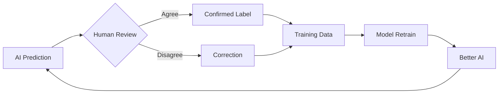

# Human-in-the-Loop Architecture Patterns

## Why HITL Systems Exist

AI systems are not 100% accurate. Even the best models make mistakes that carry real consequences—wrong medical diagnoses, unfair loan rejections, harmful content reaching users. Human-in-the-loop (HITL) design acknowledges this reality and builds systems where humans and AI collaborate, each contributing their strengths.

**AI strengths**: Speed, consistency, scale, never gets tired
**Human strengths**: Judgment, context understanding, ethical reasoning, handling edge cases

The goal is not "replace humans" or "keep humans doing everything"—it's finding the optimal collaboration point that maximizes quality while minimizing cost and latency.

## The Automation Spectrum

```
┌─────────────────────────────────────────────────────────────────────────┐
│                        AUTOMATION SPECTRUM                               │
├──────────┬──────────────┬─────────────────┬────────────────┬───────────┤
│  Fully   │  AI-Assisted │  Human-Reviewed │  Human-Audited │   Fully   │
│  Manual  │   Human      │      AI         │      AI        │ Automated │
├──────────┼──────────────┼─────────────────┼────────────────┼───────────┤
│ Human    │ AI suggests, │ AI decides,     │ AI decides,    │ AI        │
│ does all │ human acts   │ human approves  │ random audit   │ does all  │
├──────────┼──────────────┼─────────────────┼────────────────┼───────────┤
│ Cost:$$$│ Cost: $$     │ Cost: $$        │ Cost: $        │ Cost: ¢   │
│ Speed:🐌│ Speed: Med   │ Speed: Med      │ Speed: Fast    │ Speed: ⚡ │
│ Quality:A│ Quality: A   │ Quality: A-     │ Quality: B+    │ Quality: B│
└──────────┴──────────────┴─────────────────┴────────────────┴───────────┘
```

Most production AI systems sit somewhere in the middle, not at the extremes. The art of HITL architecture is choosing where on this spectrum to operate for each decision type.

## Three Core HITL Patterns

### Pattern 1: Human-on-the-Loop (Monitoring)

The AI operates autonomously, but humans monitor dashboards and can intervene when things go wrong.

**Use when**: The cost of individual errors is low, but systemic failures are dangerous.

**Examples**:
- Content recommendation systems (human monitors engagement metrics)
- Fraud detection (human reviews aggregate patterns)
- Autonomous vehicles (remote operator can take over)

**Architecture**:
```
User Request → AI Decision → Action Taken
                    ↓
              Metrics/Logs → Dashboard → Human Monitor
                                              ↓ (if anomaly)
                                         Override/Rollback
```

### Pattern 2: Human-in-the-Loop (Approval Required)

AI makes a recommendation, but a human must approve before the action is taken.

**Use when**: Individual decisions have high stakes and are irreversible.

**Examples**:
- Medical diagnosis (AI suggests, doctor confirms)
- Loan approvals over $100K (AI recommends, human approves)
- Content removal (AI flags, human removes)

**Architecture**:
```
User Request → AI Analysis → Recommendation → Human Review → Action
                                                    ↓
                                              Correction → Feedback to AI
```

### Pattern 3: Human-over-the-Loop (Policy Setting)

Humans define policies, rules, and boundaries. AI executes within those boundaries autonomously.

**Use when**: Decisions are frequent and similar, but the rules may change.

**Examples**:
- Pricing algorithms (human sets min/max, AI optimizes within)
- Email filtering (human sets rules, AI classifies)
- Trading systems (human sets risk limits, AI trades within)

**Architecture**:
```
Human → Define Policies/Thresholds/Rules
              ↓
User Request → AI Decision (within policy) → Action
              ↓
         Policy Violation? → Escalate to Human
```

## Mermaid Diagram: Three Patterns Compared

```mermaid
graph TB
    subgraph "Human-on-the-Loop"
        A1[Request] --> B1[AI Decides]
        B1 --> C1[Action Taken]
        C1 --> D1[Metrics Stream]
        D1 --> E1[Human Monitor]
        E1 -->|Anomaly| F1[Override]
    end

    subgraph "Human-in-the-Loop"
        A2[Request] --> B2[AI Recommends]
        B2 --> C2[Review Queue]
        C2 --> D2[Human Approves/Rejects]
        D2 -->|Approved| E2[Action Taken]
        D2 -->|Rejected| F2[Feedback to AI]
    end

    subgraph "Human-over-the-Loop"
        G3[Human Sets Policy] --> H3[Policy Engine]
        A3[Request] --> B3[AI Decides per Policy]
        H3 --> B3
        B3 -->|Within bounds| C3[Action Taken]
        B3 -->|Out of bounds| D3[Escalate]
    end
```



## Confidence-Based Routing

The most common HITL pattern routes decisions based on AI confidence:

```
                    ┌─────────────────────────────────┐
                    │         AI Processes Query       │
                    │     Produces: Decision + Score   │
                    └────────────────┬────────────────┘
                                     │
                    ┌────────────────┼────────────────┐
                    │                │                │
              Score > 0.95     0.7 < Score < 0.95   Score < 0.7
                    │                │                │
                    ▼                ▼                ▼
             ┌──────────┐    ┌──────────────┐  ┌──────────────┐
             │Auto-approve│   │Spot-check 10%│  │Human Review  │
             │(no human) │    │(random audit)│  │(all items)   │
             └──────────┘    └──────────────┘  └──────────────┘
```

**Threshold selection** is critical:
- Too high (0.99): almost everything goes to humans → expensive
- Too low (0.5): too much auto-approved → errors reach users
- Sweet spot: typically 0.85-0.95, depends on error cost

**Dynamic thresholds by category**:
| Decision Type | Auto Threshold | Review Threshold | Always Human |
|---|---|---|---|
| Spam filtering | > 0.90 | 0.60-0.90 | < 0.60 |
| Medical triage | > 0.98 | 0.80-0.98 | < 0.80 |
| Content moderation | > 0.95 | 0.70-0.95 | < 0.70 |
| Loan approval | Never auto | > 0.85 fast track | < 0.85 deep review |

## Queue Management

When items are routed to humans, you need queue infrastructure:

### Priority Queuing
```python
# Priority levels
CRITICAL = 0   # SLA: 5 minutes (safety issues)
HIGH = 1       # SLA: 1 hour (revenue impact)
MEDIUM = 2     # SLA: 4 hours (standard review)
LOW = 3        # SLA: 24 hours (quality improvement)
```

### Load Balancing Across Reviewers
- **Round-robin**: Simple but ignores skill level
- **Skill-based**: Route medical content to medical reviewers
- **Capacity-based**: Route to reviewer with smallest queue
- **Affinity**: Same reviewer sees related items (context helps)

### SLA Tracking
```
Queue Health Dashboard:
├── Pending items: 342
├── Average wait time: 12 minutes
├── Items approaching SLA breach: 7
├── Reviewer utilization: 78%
└── Auto-escalation triggered: 2 (reviewers overloaded)
```

## Feedback Loops

The most powerful aspect of HITL: human corrections improve the AI.



**Types of feedback**:
1. **Direct correction**: Human changes the AI's answer
2. **Implicit feedback**: Human escalation rate decreasing over time
3. **Policy feedback**: Human adjusts thresholds/rules
4. **Structured feedback**: Human labels WHY the AI was wrong (error taxonomy)

**Feedback delay problem**: If retraining takes weeks, the AI keeps making the same mistakes. Solutions:
- Real-time rule injection (bypass model for known errors)
- Few-shot prompt updates (for LLM systems)
- Online learning (continuous model updates)

## Cost-Accuracy Tradeoff

```
Quality
  ↑
  │         ╭──── Human review all ($$$$)
  │        ╱
  │      ╱──── Review uncertain cases ($$$)
  │    ╱
  │  ╱──── Spot-check random sample ($$)
  │╱
  │──── Full automation ($)
  └──────────────────────────────→ Cost

Typical numbers:
- Full human review: $0.50-5.00 per item, 99% accuracy
- AI + human review uncertain: $0.05-0.50 per item, 97% accuracy
- Full automation: $0.001-0.01 per item, 90-95% accuracy
```

**The 80/20 rule of HITL**: Often 80% of items can be auto-processed (high confidence), and reviewing the remaining 20% catches 90% of errors. This gives you:
- 80% cost reduction vs full human review
- Only 1-2% quality drop vs full human review

## Latency Impact

Adding humans adds latency:

| Pipeline | Latency | Use Case |
|---|---|---|
| Full auto | 100ms | Real-time recommendations |
| Async human review | 1-24 hours | Content publication |
| Sync human review | 5-30 minutes | Customer support escalation |
| Human-on-the-loop | 100ms (until intervention) | Trading systems |

**Design for async where possible**: Most HITL systems can tolerate hours of latency. Design the UX around this—"Your submission is being reviewed, expect a response within 4 hours."

## Anti-Patterns

### 1. All-or-Nothing Automation
**Problem**: "Either we automate 100% or we keep humans doing everything"
**Fix**: Gradual automation with confidence thresholds

### 2. No Confidence Scoring
**Problem**: AI gives binary yes/no with no uncertainty signal
**Fix**: Always produce calibrated confidence alongside decisions

### 3. Ignoring Reviewer Fatigue
**Problem**: Humans reviewing 500 items/day lose attention by item 200
**Fix**: Rotation, breaks, quality monitoring, gamification

### 4. No Feedback Pipeline
**Problem**: Humans correct AI but corrections never reach the model
**Fix**: Structured feedback → training pipeline → model improvement

### 5. Static Thresholds Forever
**Problem**: Set threshold at 0.85 on day 1, never revisit
**Fix**: Monthly threshold review based on current model performance

### 6. Treating Humans as Infallible
**Problem**: Assume human reviewer is always right
**Fix**: Multi-reviewer consensus, gold standard checks, inter-rater agreement

## Staff Decision Framework

### Where to Place Humans for Maximum ROI

```
Decision Matrix:
                        High Frequency    Low Frequency
                       ┌─────────────────┬─────────────────┐
High Stakes            │ AI + Human      │ Human Only      │
(costly errors)        │ review uncertain│ (rare, complex) │
                       ├─────────────────┼─────────────────┤
Low Stakes             │ Full Auto +     │ AI + Spot Check │
(cheap to fix)         │ monitoring      │ (low volume)    │
                       └─────────────────┴─────────────────┘
```

**Key questions for the architect**:
1. What is the cost of a wrong decision? ($1 vs $1M)
2. Is the decision reversible? (delete tweet vs administer drug)
3. What's the volume? (10/day vs 10M/day)
4. What's the acceptable latency? (100ms vs 24 hours)
5. Do you have calibrated confidence? (can you route by confidence?)

### Progressive Automation Strategy

```
Month 1: Human reviews 100% → builds training data
Month 3: AI handles 40% (high confidence) → human reviews 60%
Month 6: AI handles 70% → human reviews 30%
Month 12: AI handles 90% → human reviews 10% (hardest cases)
Month 18: AI handles 95% → human spot-checks 5%
```

This is the ideal trajectory. Track: automation rate, error rate, human agreement rate.

## Case Studies

### Meta Content Moderation
- **Scale**: 3.5M+ content reports per day
- **Architecture**: AI classifies → high confidence auto-remove → uncertain goes to human reviewers (~15,000 moderators)
- **Automation rate**: ~95% auto-handled
- **Key learning**: Reviewer mental health is a design constraint. Rotation, counseling, limiting graphic content exposure.

### Babylon Health (Medical Triage)
- **Architecture**: Patient describes symptoms → AI triages severity → low-risk: self-care advice, high-risk: escalate to doctor
- **Key design**: AI never says "you're fine"—it says "based on symptoms, likelihood of X is low, but see a doctor if..."
- **Threshold**: Very conservative (over-escalates) because cost of missing serious illness >> cost of unnecessary doctor visit

### Legal Document Review (eDiscovery)
- **Problem**: Reviewing 10M documents for relevance in litigation
- **Architecture**: AI scores relevance → human reviews top 20% + random sample from bottom 80%
- **Cost savings**: From $2/document (full human review) to $0.30/document
- **Quality**: 95% recall maintained (found 95% of relevant documents)

## Summary

| Pattern | Latency | Cost | Quality | Best For |
|---|---|---|---|---|
| Human-on-the-loop | Low | Low | Good (if AI is good) | Monitoring, rare failures |
| Human-in-the-loop | High | High | Excellent | High-stakes, irreversible |
| Human-over-the-loop | Low | Medium | Good | Policy-driven decisions |
| Confidence routing | Mixed | Medium | Very Good | Variable-difficulty tasks |

The Staff Architect's job: pick the right pattern for each decision type, set thresholds, build feedback loops, and progressively automate as the AI improves.
