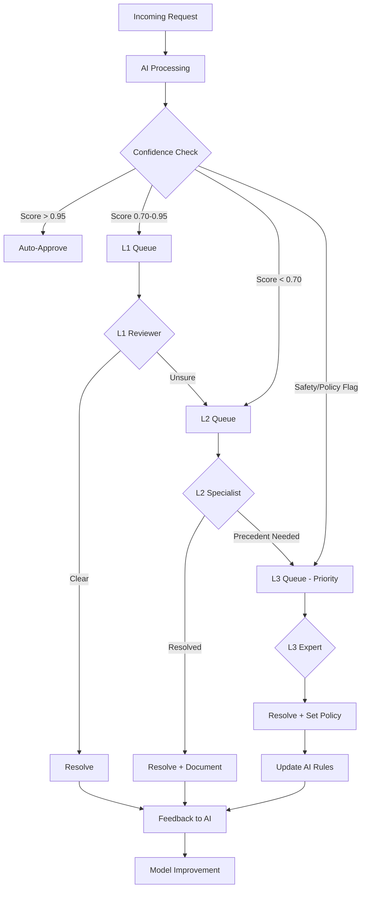
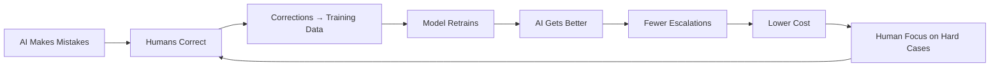

# Escalation Architecture

## When to Escalate

Escalation is the mechanism by which an AI system says "I'm not confident enough to handle this alone" and routes to a human. Good escalation design is the difference between a system that fails gracefully and one that either misses errors or drowns humans in unnecessary work.

### Triggers for Escalation

| Trigger | Example | Detection Method |
|---|---|---|
| Low confidence | Model score < threshold | Logprobs, softmax scores |
| Ambiguity | Multiple valid interpretations | Entropy of output distribution |
| High stakes | Decision affects safety/money | Rule-based classification |
| Novel input | Out of distribution | Distance from training data |
| User request | "Let me talk to a human" | Intent detection |
| Policy violation | Content matches blocklist | Rule engine |
| Conflicting signals | Model A says X, Model B says Y | Ensemble disagreement |
| System error | Model timeout, parsing failure | Error handling |

### The Confidence Gap

```
Confidence Distribution for a Typical AI System:

    Count
    │
    │ █
    │ █ █                                         █ █
    │ █ █ █                                   █ █ █ █
    │ █ █ █ █                             █ █ █ █ █ █
    │ █ █ █ █ █ █                   █ █ █ █ █ █ █ █ █
    └─────────────────────────────────────────────────→ Confidence
    0.0                  0.5                        1.0
    
    ← ESCALATE →  ← UNCERTAIN MIDDLE →  ← AUTO-APPROVE →
```

Most models are bimodal—they're either very confident or very unsure. The "uncertain middle" is where escalation design matters most.

## Multi-Tier Escalation Architecture

### Tier Structure

```
┌─────────────────────────────────────────────────────────────┐
│                    ESCALATION TIERS                          │
├──────────┬──────────────┬───────────────┬──────────────────┤
│  AI Auto │     L1       │      L2       │       L3         │
│  (Tier 0)│  Generalist  │  Specialist   │   Expert/Lead    │
├──────────┼──────────────┼───────────────┼──────────────────┤
│ Conf>0.95│ Simple cases │ Domain expert │ Precedent-setting│
│ Clear cut│ Known types  │ Ambiguous     │ Policy decisions │
│ Low risk │ Quick (<2min)│ Complex(10min)│ Thorough (1hr+)  │
├──────────┼──────────────┼───────────────┼──────────────────┤
│ 85% items│ 10% items    │ 4% items      │ 1% items         │
│ $0.001ea │ $2 each      │ $10 each      │ $50+ each        │
└──────────┴──────────────┴───────────────┴──────────────────┘
```

### Why Multiple Tiers?

Not all escalations need an expert. A simple "is this spam?" doesn't need a senior data scientist—a trained L1 reviewer handles it in 30 seconds. But "is this satire or hate speech?" might need an L2 content policy specialist.

**Cost optimization**: If you send everything to L3 experts at $50/decision, reviewing 10K items/day = $500K/day. Tiering cuts this dramatically.

## Mermaid Diagram: Multi-Tier Escalation



## Routing Logic

### Skill-Based Routing

```python
# Route to reviewer with matching skills
ROUTING_RULES = {
    "medical_content": {"required_skills": ["medical_review"], "tier": "L2"},
    "legal_content": {"required_skills": ["legal_review"], "tier": "L2"},
    "simple_spam": {"required_skills": ["content_review"], "tier": "L1"},
    "hate_speech": {"required_skills": ["policy_specialist"], "tier": "L2"},
    "novel_policy": {"required_skills": ["policy_lead"], "tier": "L3"},
}
```

### Workload Balancing

```
Reviewer Assignment Algorithm:
1. Filter: reviewers with matching skills
2. Filter: reviewers currently on shift
3. Sort by: (queue_size ASC, avg_review_time ASC, accuracy DESC)
4. Assign to top reviewer
5. If all reviewers at capacity → overflow queue → alert manager
```

### Priority Queue Implementation

```
Priority Queue Structure:
├── P0 (Critical): Safety issues, SLA 5 min
│   └── Items: 3 (oldest: 2 min ago)
├── P1 (High): Revenue-impacting, SLA 30 min
│   └── Items: 12 (oldest: 8 min ago)
├── P2 (Medium): Standard review, SLA 4 hours
│   └── Items: 87 (oldest: 45 min ago)
└── P3 (Low): Quality improvement, SLA 24 hours
    └── Items: 234 (oldest: 6 hours ago)
```

## SLA Management

### Defining SLAs

| Escalation Type | Response SLA | Resolution SLA | Breach Action |
|---|---|---|---|
| Safety/Critical | 5 minutes | 15 minutes | Page on-call lead |
| High priority | 30 minutes | 2 hours | Alert team channel |
| Standard | 4 hours | 8 hours | Dashboard warning |
| Low priority | 24 hours | 48 hours | Weekly report |

### SLA Breach Handling

```
When SLA is about to breach (80% of time elapsed):
1. Alert assigned reviewer
2. If no response in 2 minutes → reassign to next available
3. If no one available → escalate to next tier
4. If all tiers overwhelmed → activate overflow protocol:
   - Pull in off-shift reviewers (with compensation)
   - Temporarily raise auto-approve threshold (accept more risk)
   - Notify stakeholders of degraded service
```

## Graceful Degradation

What happens when humans are unavailable:

### Strategy 1: Queue and Wait
- Items wait in queue until reviewer available
- Acceptable when latency tolerance is high (content publication)

### Strategy 2: Raise Automation Threshold
- Temporarily auto-approve items with confidence > 0.85 (normally 0.95)
- Accept slightly higher error rate during peak
- Flag for post-hoc audit

### Strategy 3: Fallback Defaults
- Apply safe default action (e.g., don't show content, don't approve transaction)
- Conservative: may block legitimate items but prevents harmful ones

### Strategy 4: Deferred Review
- Take action immediately (optimistic) but queue for human review
- If human disagrees later, roll back the action
- Only works for reversible decisions

## Context Passing

The #1 complaint from human reviewers: "I don't have enough context to decide."

### What to Show the Reviewer

```
┌─────────────────────────────────────────────────────────┐
│ REVIEW ITEM #4521                    Priority: HIGH     │
├─────────────────────────────────────────────────────────┤
│ CONTENT:                                                │
│ [The actual item to review]                             │
├─────────────────────────────────────────────────────────┤
│ AI ANALYSIS:                                            │
│ • Decision: REJECT (confidence: 0.72)                   │
│ • Reasoning: Matches pattern for misleading health claim│
│ • Alternative: Could be satire (confidence: 0.28)       │
├─────────────────────────────────────────────────────────┤
│ CONTEXT:                                                │
│ • User history: 3 prior violations in 30 days           │
│ • Similar items: 5 flagged in same category today       │
│ • Policy reference: Section 4.2 - Health Misinformation│
├─────────────────────────────────────────────────────────┤
│ ACTIONS: [Approve] [Reject] [Escalate] [Need More Info] │
│ Feedback: [Why did you disagree with AI?] ________      │
└─────────────────────────────────────────────────────────┘
```

### Context Reduces Review Time

```
Without context: Average review time = 45 seconds
With AI reasoning: Average review time = 20 seconds
With AI reasoning + similar cases: Average review time = 12 seconds
```

Good context reduces costs by 3-4x while improving accuracy.

## De-Escalation: Returning to Automation

### When Humans Confirm AI Was Right

```
Scenario: AI escalated 100 items this week with confidence 0.80-0.90
Result: Humans agreed with AI on 95/100 items

Action: Consider raising auto-approve threshold from 0.90 to 0.85
Impact: 30% fewer escalations, minimal quality loss
```

### Progressive De-Escalation Protocol

```
Week 1-4: Review 100% of items in category X
Week 5-8: AI handles items > 0.90, review rest (50% reduction)
Week 9-12: AI handles items > 0.85, review rest (70% reduction)
Week 13+: AI handles items > 0.80, spot-check 10% (90% reduction)

Rollback trigger: If error rate exceeds 2%, revert to previous level
```

## Measuring Escalation Health

### Key Metrics

| Metric | Target | Alert If |
|---|---|---|
| Escalation rate | 10-15% | > 25% (AI too cautious) or < 5% (AI overconfident) |
| Human agreement with AI | > 90% | < 80% (AI miscalibrated) |
| Average resolution time | < SLA | Approaching SLA consistently |
| L1 → L2 escalation rate | < 15% | > 30% (L1 undertrained) |
| Reviewer utilization | 70-80% | > 90% (burnout risk) |
| Queue depth trend | Stable/declining | Growing for 3+ days |

### Dashboard Design

```
ESCALATION HEALTH DASHBOARD
────────────────────────────────────────
Today's Stats:
  Total processed: 45,231
  Auto-approved: 38,446 (85.0%)
  L1 reviewed: 5,428 (12.0%)
  L2 reviewed: 1,131 (2.5%)
  L3 reviewed: 226 (0.5%)

  Avg L1 resolution: 1.2 min ✓
  Avg L2 resolution: 8.4 min ✓
  SLA breaches today: 2 ⚠️

  Human-AI agreement: 93.2% ✓
  Feedback collected: 1,847 items

Trend (last 30 days):
  Escalation rate: 15% → 12.5% ↓ (improving)
  Resolution time: stable
  Agreement rate: 91% → 93% ↑ (improving)
```

## Progressive Automation

### The Self-Improving System

The ultimate HITL architecture gets better over time:



### Automation Rate Trajectory

```
Automation Rate Over Time:

100% │                              ╭─────────
     │                         ╭───╯
 80% │                    ╭───╯
     │               ╭───╯
 60% │          ╭───╯
     │     ╭───╯
 40% │╭───╯
     │╯
 20% │
     └─────────────────────────────────────→ Time
     M1   M3   M6   M9   M12  M15  M18

Typical trajectory for well-designed system:
- Month 1: 40% automation
- Month 6: 70% automation
- Month 12: 85% automation
- Month 18: 92% automation (asymptote)
```

## Anti-Patterns

### 1. Escalating Everything
**Problem**: AI confidence threshold set too high → 80% goes to humans
**Impact**: Humans overwhelmed, defeats purpose of AI
**Fix**: Start with aggressive auto-approval on low-risk items, measure error rate

### 2. No Context for Reviewers
**Problem**: Human sees raw item with no AI reasoning or history
**Impact**: Slow reviews, inconsistent decisions, reviewer frustration
**Fix**: Rich context panel (AI reasoning, confidence, similar cases, policy links)

### 3. Dead Queues
**Problem**: Items sit in queue for days because no one owns them
**Impact**: SLA breaches, stale decisions, user frustration
**Fix**: SLA monitoring, auto-reassignment, queue ownership

### 4. No Feedback Loop
**Problem**: Humans review items but corrections never reach the AI
**Impact**: AI never improves, escalation rate stays constant
**Fix**: Structured feedback → retraining pipeline → automation rate tracking

### 5. Single Tier for Everything
**Problem**: PhD expert reviews obvious spam alongside novel policy questions
**Impact**: Expert time wasted, slow resolution of hard cases
**Fix**: Multi-tier with appropriate routing

### 6. Ignoring Reviewer Accuracy
**Problem**: Assume all human decisions are correct
**Impact**: Bad reviewers introduce errors, model learns wrong patterns
**Fix**: Gold standard items, inter-rater reliability, accuracy tracking

## Staff Design: Self-Improving Escalation

### Architecture for Escalation That Reduces Over Time

```
┌─────────────────────────────────────────────────────────────┐
│                 SELF-IMPROVING ESCALATION                    │
├─────────────────────────────────────────────────────────────┤
│                                                             │
│  Production Traffic → AI → Confidence Router                │
│                              │         │                    │
│                         Auto-OK    Escalate                 │
│                              │         │                    │
│                              │    Human Review              │
│                              │         │                    │
│                              │    Structured Feedback       │
│                              │         │                    │
│                              │    ┌────┴────┐              │
│                              │    │ Feedback │              │
│                              │    │  Store   │              │
│                              │    └────┬────┘              │
│                              │         │                    │
│                              │    Weekly Retrain            │
│                              │         │                    │
│                              │    Threshold Review          │
│                              │         │                    │
│                              │    Update Router             │
│                              │         │                    │
│                              └─── Fewer Escalations ───┘    │
│                                                             │
└─────────────────────────────────────────────────────────────┘
```

### Key Design Decisions

1. **Feedback granularity**: Just agree/disagree? Or structured error taxonomy?
   - Structured is harder to collect but 10x more useful for retraining
   
2. **Retrain cadence**: Daily? Weekly? Monthly?
   - Weekly is a good default (enough data, not too much churn)

3. **Threshold adjustment**: Automatic or manual?
   - Semi-automatic: system suggests new threshold, human approves

4. **Success metric**: What does "done" look like?
   - Asymptote: when automation rate stops increasing for 3 months

### Cost Model

```
Month 1:  15% escalation × 100K items/day × $2/review = $30K/day
Month 6:  8% escalation  × 100K items/day × $2/review = $16K/day  
Month 12: 4% escalation  × 100K items/day × $2/review = $8K/day

Savings in Year 1: ~$4M compared to constant 15% escalation
ROI on building self-improving system: 10-50x
```
