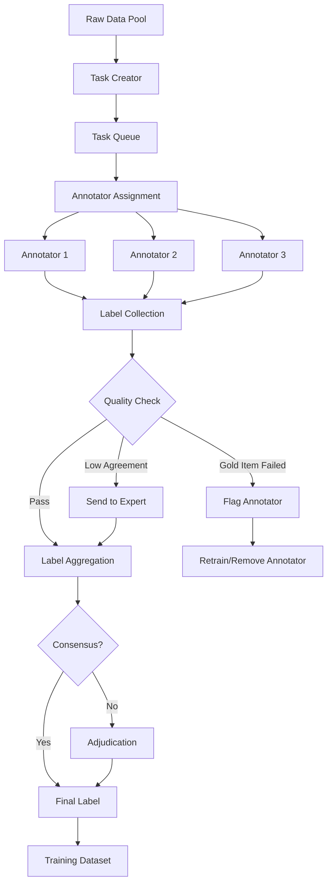
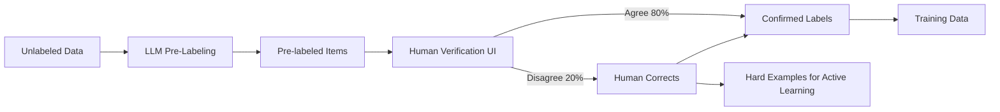

# Annotation at Scale

## Why Annotation Matters

Every AI system needs labeled data. Whether you're training a classifier, evaluating an LLM, or building a RAG system, humans must provide ground truth. Annotation is the process of creating that labeled data at scale.

**The hard truth**: Your model is only as good as your labels. Garbage labels → garbage model. And at scale, maintaining label quality is an engineering problem, not just a data science problem.

### Scale of Annotation in Industry

| Company | Annotation Volume | Cost | Purpose |
|---|---|---|---|
| Tesla | 1M+ images/week | ~$5M/month | Self-driving perception |
| OpenAI | 100K+ comparisons/month | ~$2M/month | RLHF for ChatGPT |
| Google Search | 10M+ relevance judgments/year | ~$20M/year | Search quality |
| Meta | 5M+ content labels/week | ~$10M/month | Content moderation |

## Annotation Pipeline Architecture

```
┌──────────────────────────────────────────────────────────────────┐
│                    ANNOTATION PIPELINE                            │
│                                                                  │
│  Data Source → Task Creation → Assignment → Labeling → QC → Agg │
│                                                                  │
│  ┌─────────┐  ┌──────────┐  ┌─────────┐  ┌──────┐  ┌───────┐  │
│  │Production│→ │ Create   │→ │ Assign  │→ │Label │→ │Quality│  │
│  │  Data    │  │  Tasks   │  │to Workers│  │Items │  │Control│  │
│  └─────────┘  └──────────┘  └─────────┘  └──────┘  └───┬───┘  │
│                                                          │      │
│                                              ┌───────────┼──┐   │
│                                              │Pass       │  │   │
│                                              ▼           ▼  │   │
│                                         ┌────────┐  ┌──────┐│   │
│                                         │Aggregate│  │Re-do ││   │
│                                         │ Labels  │  │Failed││   │
│                                         └────┬───┘  └──────┘│   │
│                                              │              │   │
│                                              ▼              │   │
│                                         ┌────────┐          │   │
│                                         │Training │          │   │
│                                         │  Data   │          │   │
│                                         └────────┘          │   │
│                                                             │   │
└─────────────────────────────────────────────────────────────────┘
```

## Mermaid Diagram: Annotation Pipeline with Quality Control



## Quality Control Mechanisms

### 1. Gold Standard Items (Honeypots)

Pre-labeled items inserted into the annotation stream. If an annotator gets these wrong, their other labels are suspect.

```
Task stream for annotator:
  Item 1: [real task]
  Item 2: [real task]
  Item 3: [GOLD - known answer is "positive"] ← if wrong, flag
  Item 4: [real task]
  Item 5: [real task]
  Item 6: [GOLD - known answer is "negative"]
  ...

Gold item rate: 5-10% of all items
Accuracy threshold: < 80% on golds → pause annotator, retrain
```

### 2. Inter-Annotator Agreement (IAA)

Multiple annotators label the same item. Agreement measures quality.

| Metric | Formula | Good Threshold |
|---|---|---|
| Cohen's Kappa | Accounts for chance agreement | > 0.7 |
| Fleiss' Kappa | Multi-annotator | > 0.6 |
| Krippendorff's Alpha | Any data type | > 0.667 |

```
Example:
  Item "This product is terrible but I love it ironically"
  Annotator A: Positive
  Annotator B: Negative
  Annotator C: Positive
  
  Agreement: 2/3 → send to expert adjudicator
```

### 3. Consensus Mechanisms

- **Majority vote**: 3 annotators, take majority (cheap, works for easy tasks)
- **Weighted vote**: Weight by annotator accuracy on gold items
- **Expert adjudication**: Disagreements go to senior annotator
- **Dawid-Skene model**: Statistical model of annotator reliability

### 4. Annotator Performance Tracking

```
Annotator Dashboard:
├── Annotator A: Accuracy 94%, Speed 45 items/hr, Agreement 88%
├── Annotator B: Accuracy 91%, Speed 62 items/hr, Agreement 85%
├── Annotator C: Accuracy 78%, Speed 80 items/hr, Agreement 72% ⚠️
└── Annotator D: Accuracy 96%, Speed 30 items/hr, Agreement 92%

Action: Annotator C needs retraining (high speed, low accuracy = rushing)
```

## Workforce Models

### Internal Team
- **Pros**: Domain expertise, consistent quality, IP protection
- **Cons**: Expensive ($50-100K/person/year), doesn't scale for bursts
- **Best for**: Sensitive data, complex domain-specific tasks

### Crowd Workers (Mechanical Turk, Toloka, Appen)
- **Pros**: Scales to millions of tasks, cheap ($0.01-0.50/task)
- **Cons**: Variable quality, needs heavy QC, no domain expertise
- **Best for**: Simple classification, image labeling, sentiment

### Specialized Platforms (Scale AI, Labelbox, Surge AI)
- **Pros**: Managed workforce, built-in QC, expert annotators available
- **Cons**: Expensive ($0.50-5.00/task), vendor lock-in
- **Best for**: Complex tasks, when you need guaranteed quality

### LLM-as-Annotator
- **Pros**: Instant, cheap ($0.001-0.01/task), consistent
- **Cons**: Biases, errors on edge cases, may not match human judgment
- **Best for**: Pre-labeling, easy tasks, generating initial labels for human review

## LLM-Assisted Annotation

The modern approach: AI labels first, human verifies. This is 5-10x faster than labeling from scratch.

```
Traditional:          Human sees item → thinks → labels → 45 seconds
LLM-Assisted:        AI pre-labels → Human verifies → corrects if wrong → 8 seconds

Efficiency gain: 5.6x faster
Cost reduction: From $0.50/item to $0.09/item
```

### Architecture for LLM-Assisted Annotation



### When NOT to Use LLM Pre-Labeling

- When the LLM has known biases in the domain
- When you need completely unbiased human judgment (e.g., preference data for RLHF)
- When the task requires physical world knowledge the LLM lacks

## Active Learning Integration

Don't annotate random examples—annotate the MOST valuable ones.

```
Standard approach:  Randomly select 10,000 items → annotate all → train model
Active learning:    Select 2,000 most informative items → annotate → train model
                    → Get same quality with 80% less annotation
```

Integration pattern:
1. Train initial model on small labeled set
2. Score all unlabeled items with model
3. Select items where model is most uncertain
4. Send those items for annotation
5. Add labels to training set, retrain
6. Repeat until quality target met

## Annotation Task Types

### Text Classification
```
Task: "Is this review positive or negative?"
Input: "The food was great but the service was terrible"
Options: [Positive] [Negative] [Mixed] [Neutral]
Expected: Mixed
```

### Named Entity Recognition (NER)
```
Task: "Highlight all person names and organizations"
Input: "John Smith joined Microsoft in 2020"
Output: [John Smith: PERSON] [Microsoft: ORG]
```

### Relevance Judgments (for RAG/Search)
```
Task: "Is this document relevant to the query?"
Query: "How to reset password in Gmail"
Document: "Gmail password recovery steps..."
Options: [Highly Relevant] [Somewhat Relevant] [Not Relevant]
```

### Preference Pairs (for RLHF)
```
Task: "Which response is better?"
Prompt: "Explain quantum computing simply"
Response A: [technical explanation]
Response B: [simple analogy-based explanation]
Choice: [A is better] [B is better] [Tie]
```

### QA Pair Validation
```
Task: "Is this answer correct for the question?"
Question: "What year was Python created?"
Answer: "1991"
Options: [Correct] [Incorrect] [Partially Correct]
```

## Scale Challenges

### Cost at Scale

```
Budget Planning:
├── 1K labels: $100-500 (prototype/POC)
├── 10K labels: $1K-5K (initial model)
├── 100K labels: $10K-50K (production model)
├── 1M labels: $100K-500K (large-scale system)
└── 10M labels: $1M-5M (industry-leading system)

Cost levers:
- Task complexity: simple ($0.05) vs complex ($2.00)
- Quality level: single annotator vs 3x + adjudication
- Workforce: crowd ($0.10) vs expert ($2.00)
- LLM pre-labeling: reduces human cost by 50-80%
```

### Throughput at Scale

```
Throughput Planning:
├── 1 annotator: 200-500 items/day (depending on complexity)
├── 10 annotators: 2K-5K items/day
├── 100 annotators: 20K-50K items/day
├── Crowd (1000+): 100K+ items/day (with QC overhead)
└── LLM-assisted + human verify: 500K+ items/day
```

### Managing Annotation Guidelines

As you scale, guideline clarity becomes critical:

```
Guideline Document Structure:
1. Task description (what you're labeling)
2. Label definitions (precise, with examples)
3. Edge cases (the hard ones, with correct answers)
4. FAQ (common annotator questions)
5. Version history (guidelines evolve)

Guideline anti-pattern: "Label sentiment as positive or negative"
Guideline best practice: 
  "Positive: expresses satisfaction, recommendation, or happiness about the product.
   Negative: expresses dissatisfaction, complaint, or disappointment.
   Mixed: contains both positive and negative sentiments about DIFFERENT aspects.
   Neutral: factual statement with no sentiment expressed.
   
   Edge case: Sarcasm - label based on TRUE intent, not literal words.
   Example: 'Great, another broken feature' → Negative (sarcastic)"
```

## Anti-Patterns

### 1. No Quality Control
**Problem**: Accept all labels at face value
**Impact**: 10-30% label noise, model ceiling drops significantly
**Fix**: Gold items, IAA, annotator performance tracking

### 2. Biased Annotator Pool
**Problem**: All annotators from same demographic/viewpoint
**Impact**: Systematic bias in labels (e.g., cultural blind spots)
**Fix**: Diverse annotator pool, measure demographic agreement gaps

### 3. Stale Guidelines
**Problem**: Guidelines written once, never updated
**Impact**: New edge cases get inconsistent labels
**Fix**: Version guidelines, update monthly, track edge case frequency

### 4. No Annotator Feedback Channel
**Problem**: Annotators can't report confusing items or guideline gaps
**Impact**: Silent quality degradation, annotator frustration
**Fix**: Feedback button, weekly annotator sync, guideline FAQ

### 5. Annotating Random Data
**Problem**: Randomly sampling from production for annotation
**Impact**: 80% of annotations on easy cases (model already knows)
**Fix**: Active learning—annotate what the model is uncertain about

### 6. No Annotation Versioning
**Problem**: Relabel items without tracking which version of guidelines was used
**Impact**: Can't trace quality issues to guideline changes
**Fix**: Version labels with guideline version, maintain audit trail

## Staff Decision: Build vs Buy

### Build Internal Tooling When:
- Data is highly sensitive (medical, financial, classified)
- Annotation task is unique to your domain
- Volume justifies engineering investment (>100K items/month)
- You need tight integration with your ML pipeline

### Use Platform (Scale AI, Labelbox, etc.) When:
- Standard task types (classification, NER, segmentation)
- Need to scale quickly (weeks, not months)
- Don't want to manage workforce
- Budget > engineering cost of building

### Hybrid Approach (Most Common):
- Use platform for bulk annotation
- Internal team for complex edge cases and adjudication
- LLM pre-labeling + human verification for efficiency
- Custom UI only for domain-specific task types

### Cost Comparison

```
Option A: Build internally
  - Engineering: 2 engineers × 3 months = $150K
  - Annotator team: 5 people × $60K/year = $300K/year
  - Total Year 1: $450K
  - Good if: >500K items/year, sensitive data

Option B: Use platform (Scale AI)
  - Per-item cost: $0.50/item
  - 100K items: $50K
  - 500K items: $250K
  - Good if: <500K items/year, standard tasks

Option C: LLM-assisted + minimal human
  - LLM cost: $0.01/item × 500K = $5K
  - Human verification (20% corrected): $0.10 × 100K = $10K
  - Total: $15K for 500K items
  - Good if: LLM accuracy >80% on your task
```
