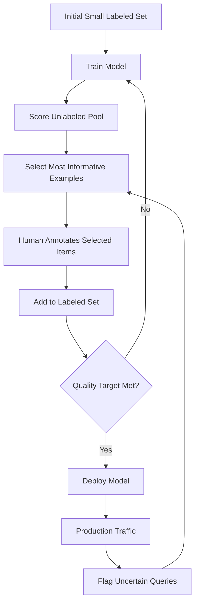

# Active Learning Systems

## What is Active Learning?

Active learning is a strategy where the AI system selects which examples should be labeled next, rather than labeling random samples. The model identifies items it's most uncertain about and asks a human to label those specifically.

**Core insight**: Not all labeled examples are equally valuable. An example the model already handles correctly teaches nothing. An example at the decision boundary teaches a lot.

```
Random Sampling:           Active Learning:
Label 10,000 random items  Label 2,000 strategic items
→ Model accuracy: 92%      → Model accuracy: 92%

Same result, 80% fewer labels, 80% cost reduction.
```

## Why Active Learning Matters

### The Label Efficiency Problem

```
Accuracy vs Labels (typical classification task):

Accuracy
100% │                    ╭─── Active Learning
     │               ╭──╯
 95% │          ╭───╯
     │     ╭───╯          ╭─── Random Sampling
 90% │╭───╯          ╭───╯
     │╯          ╭───╯
 85% │      ╭───╯
     │ ╭───╯
 80% │╯
     └──────────────────────────────────────→ Labels
     0   2K   5K   10K   20K   50K   100K

Active learning reaches 95% with 5K labels
Random sampling needs 25K labels for same 95%
Efficiency gain: 5x
```

### Real-World Impact

| Scenario | Random Sampling | Active Learning | Savings |
|---|---|---|---|
| Text classifier | 50K labels @ $0.10 = $5K | 10K labels = $1K | $4K (80%) |
| NER model | 20K sentences @ $1.00 = $20K | 5K sentences = $5K | $15K (75%) |
| Image classifier | 100K images @ $0.50 = $50K | 15K images = $7.5K | $42.5K (85%) |
| RAG relevance | 30K pairs @ $0.20 = $6K | 6K pairs = $1.2K | $4.8K (80%) |

## Active Learning Strategies

### 1. Uncertainty Sampling

Select examples where the model is most uncertain.

```
For classification with softmax outputs:
- Least Confidence: select x where max(P(y|x)) is lowest
- Margin Sampling: select x where P(y1|x) - P(y2|x) is smallest
- Entropy: select x where -Σ P(y|x) log P(y|x) is highest

Example:
  Item A: P(positive)=0.99, P(negative)=0.01 → NOT selected (confident)
  Item B: P(positive)=0.52, P(negative)=0.48 → SELECTED (uncertain)
```

**Pros**: Simple, effective, widely applicable
**Cons**: Can oversample outliers, ignores diversity

### 2. Query-by-Committee (QBC)

Train multiple models, select examples they disagree on.

```
Committee of 5 models predicts item X:
  Model 1: Positive
  Model 2: Negative
  Model 3: Positive
  Model 4: Negative
  Model 5: Positive

Vote entropy = high → This item is informative, SELECT IT

Committee agrees (5/5 positive) → Skip it, model already knows this
```

**Pros**: Works when uncertainty is hard to estimate directly
**Cons**: Need multiple models, computationally expensive

### 3. Expected Model Change

Select examples that would change the model parameters the most if labeled.

```
For each unlabeled item x:
  For each possible label y:
    Compute: how much would the gradient change if (x, y) were added?
  Expected change = Σ P(y|x) × ||gradient(x, y)||

Select items with largest expected change.
```

**Pros**: Directly optimizes for information gain
**Cons**: Computationally expensive (needs gradient computation per item)

### 4. Diversity Sampling

Ensure selected batch covers the feature space, not just uncertain regions.

```
Problem with pure uncertainty sampling:
  All uncertain items might be from same region:
  "Is this spam?" → selects 100 marketing emails about crypto
  
  Misses other uncertain regions: phishing attempts, newsletter edge cases

Diversity fix:
  1. Get top-500 most uncertain items
  2. Cluster them into 50 clusters
  3. Select 1 item from each cluster
  → Covers 50 different types of uncertainty
```

**Pros**: Avoids redundant annotations, better coverage
**Cons**: More complex to implement

### 5. Hybrid: Uncertainty + Diversity

The most practical approach combines both:

```python
def select_batch(unlabeled_pool, model, batch_size=100):
    # Step 1: Get top-K most uncertain (K >> batch_size)
    uncertainties = model.predict_uncertainty(unlabeled_pool)
    candidates = top_k(unlabeled_pool, uncertainties, k=batch_size * 5)
    
    # Step 2: From candidates, select diverse subset
    selected = diversity_sampling(candidates, n=batch_size)
    
    return selected
```

## Mermaid Diagram: Active Learning Loop



## Integration with Production

### Flagging Uncertain Production Queries

The most powerful active learning: use your production system to identify what to label next.

```
Production system processes 100K queries/day:
├── 85K queries: high confidence → auto-handle
├── 12K queries: medium confidence → escalate to human
├── 3K queries: low confidence → flag for annotation

The 3K low-confidence queries are your active learning candidates.
They represent real user needs the model struggles with.
```

### Architecture for Production-Integrated Active Learning

```
┌─────────────────────────────────────────────────────┐
│              PRODUCTION + ACTIVE LEARNING            │
│                                                     │
│  User Query → Model → Confidence Score              │
│                           │                         │
│              ┌────────────┼─────────────┐           │
│              │            │             │           │
│         Score > 0.9   0.5-0.9       < 0.5          │
│              │            │             │           │
│         Auto-serve    Escalate    Flag for AL       │
│                           │             │           │
│                      Human handles  Add to AL Pool  │
│                           │             │           │
│                      Label captured  ┌──┴──┐       │
│                           │          │Select│       │
│                           ▼          │Batch │       │
│                    ┌─────────────┐   └──┬──┘       │
│                    │Training Data│←─────┘           │
│                    └──────┬──────┘                  │
│                           │                         │
│                     Weekly Retrain                   │
│                           │                         │
│                     Better Model                    │
│                           │                         │
│                     Fewer Low-Conf                   │
└─────────────────────────────────────────────────────┘
```

## Pool-Based vs Stream-Based

### Pool-Based Active Learning
- You have a large pool of unlabeled data
- Score all items, select best batch
- Typical for offline model improvement

```
Pool: 1M unlabeled items
Each cycle: score all 1M → select top 100 → annotate → retrain
```

### Stream-Based Active Learning
- Data arrives continuously
- Must decide immediately: label this or skip?
- Typical for online/production systems

```
Stream: items arrive one-by-one
For each item: compute uncertainty → if above threshold, send for labeling
```

### When to Use Which

| Scenario | Approach | Reason |
|---|---|---|
| Building initial model | Pool-based | Have data, need to select best subset |
| Improving production model | Stream-based | New data arrives continuously |
| Periodic model refresh | Pool-based | Batch select from accumulated data |
| Real-time learning | Stream-based | Can't wait for batch |

## Batch Active Learning

In practice, you don't label one item at a time—you select batches.

### Batch Selection Problem

Selecting top-100 most uncertain items individually may give redundant items. The batch should be informative AND diverse.

```python
def batch_active_learning(pool, model, batch_size):
    """Select informative AND diverse batch."""
    # Score uncertainty
    scores = model.uncertainty(pool)
    
    # Greedy diverse selection
    selected = []
    candidates = pool.copy()
    
    for _ in range(batch_size):
        # Balance uncertainty and diversity
        if not selected:
            # First item: most uncertain
            best = argmax(scores[candidates])
        else:
            # Subsequent: uncertain + far from already selected
            diversity = min_distance_to_selected(candidates, selected)
            combined = 0.7 * scores[candidates] + 0.3 * diversity
            best = argmax(combined)
        
        selected.append(best)
        candidates.remove(best)
    
    return selected
```

### Batch Size Selection

| Batch Size | Pros | Cons |
|---|---|---|
| Small (10-50) | More cycles, better selection | High overhead per cycle |
| Medium (100-500) | Good balance | Standard choice |
| Large (1000+) | Fewer cycles, lower overhead | Less precise selection |

Rule of thumb: batch size = 1-5% of current labeled set size.

## Cold Start Problem

Active learning needs a model to score uncertainty. But initially, you have no model.

### Solutions

1. **Random seed**: Label 100-500 random items → train initial model → start active learning
2. **Diversity seed**: Cluster unlabeled data → sample from each cluster → ensures coverage
3. **Expert seed**: Domain expert picks representative examples
4. **Transfer learning**: Use pre-trained model's uncertainty even before fine-tuning

```
Cold Start Protocol:
  Step 1: Cluster unlabeled data into 20 clusters
  Step 2: Randomly sample 10 items from each cluster → 200 items
  Step 3: Annotate these 200 items (diverse seed)
  Step 4: Train initial model
  Step 5: Begin active learning cycles
```

## Stopping Criteria

When to stop labeling (diminishing returns):

### Indicators to Stop

1. **Accuracy plateau**: Last 3 batches improved accuracy by < 0.1%
2. **Uncertainty exhaustion**: No items with uncertainty > threshold
3. **Budget exhausted**: Hit the annotation budget
4. **Target met**: Reached required accuracy/F1

```
Learning Curve Analysis:

Accuracy
 96% │                    ╭──────── STOP HERE
     │               ╭──╯          (diminishing returns)
 94% │          ╭───╯
     │     ╭───╯
 92% │╭───╯
     │╯
 90% │
     └────────────────────────────→ Labels
     0    1K    2K    3K    4K

Rule: Stop when marginal improvement < 0.2% per 100 labels
```

## Active Learning for LLM Systems

### Which Prompts to Evaluate

For LLM-based systems, active learning selects which outputs to send for human evaluation:

```
Production LLM system generates 10K responses/day
Which to evaluate?
  - High perplexity responses (model uncertain)
  - Long responses (more room for errors)
  - Responses on new topics (distribution shift)
  - Responses where user asked follow-up (possible failure)
  - Random 1% baseline (unbiased quality estimate)
```

### For RAG Systems

```
Select for evaluation:
  - Queries with low retrieval confidence
  - Queries where retrieved docs seem irrelevant
  - Queries where model hedged ("I'm not sure but...")
  - New query patterns not seen in training
```

### For RLHF / Preference Data

```
Select comparison pairs where:
  - Two responses are close in quality (model can't distinguish)
  - Response touches safety boundaries
  - Response is on topic not well-covered
  - Reward model disagrees with rule-based checks
```

## Anti-Patterns

### 1. Random Sampling When Active Learning Would Help
**Problem**: Labeling random production data
**Impact**: 80% of budget wasted on items model already handles
**Fix**: Score uncertainty, select informative items

### 2. Only Uncertainty, No Diversity
**Problem**: All selected items from same type/region
**Impact**: Model improves in one area, still fails in others
**Fix**: Hybrid uncertainty + diversity selection

### 3. Never Retraining Between Cycles
**Problem**: Select 5 batches before retraining
**Impact**: Later batches based on stale uncertainty scores
**Fix**: Retrain after each batch (or at least every 2-3)

### 4. Ignoring Production Distribution
**Problem**: Active learning on offline pool that doesn't match production
**Impact**: Model improves on irrelevant data
**Fix**: Use production traffic as the unlabeled pool

### 5. No Baseline Comparison
**Problem**: Don't measure if active learning actually helps
**Impact**: May be doing extra work for no gain
**Fix**: Always compare learning curve vs random sampling

## ROI Calculation

### Template

```
WITHOUT Active Learning:
  Labels needed for 95% accuracy: 50,000
  Cost per label: $0.10
  Total: $5,000
  Time: 10 weeks (5K labels/week)

WITH Active Learning:
  Labels needed for 95% accuracy: 10,000
  Cost per label: $0.10 (same)
  Compute for uncertainty scoring: $50/cycle × 10 cycles = $500
  Engineering to build AL system: 2 weeks × 1 engineer = ~$10K (one-time)
  Total labels cost: $1,000
  Time: 3 weeks

Savings per model training: $4,000 (80%)
If you retrain quarterly: $16,000/year savings
Payback on engineering investment: < 3 months
```

### When Active Learning Isn't Worth It

- Very small datasets (< 1K labels) — just label everything
- Very cheap labels ($0.01) — not worth the engineering
- One-time labeling (no ongoing retraining) — build cost not amortized
- Task where all items are equally informative (rare)

## Staff Architecture: Active Learning Platform

### Platform Components

```
┌─────────────────────────────────────────────────────────┐
│            ACTIVE LEARNING PLATFORM                      │
├─────────────────────────────────────────────────────────┤
│                                                         │
│  ┌──────────────┐  ┌──────────────┐  ┌──────────────┐ │
│  │ Data Store   │  │ Model Store  │  │ Annotation   │ │
│  │ (unlabeled   │  │ (current     │  │ Backend      │ │
│  │  pool)       │  │  models)     │  │ (queue mgmt) │ │
│  └──────┬───────┘  └──────┬───────┘  └──────┬───────┘ │
│         │                  │                  │         │
│         ▼                  ▼                  ▼         │
│  ┌─────────────────────────────────────────────────┐   │
│  │           Active Learning Engine                 │   │
│  │  • Uncertainty scorer                           │   │
│  │  • Diversity selector                           │   │
│  │  • Batch composer                               │   │
│  │  • Stopping criteria checker                    │   │
│  └──────────────────────────┬──────────────────────┘   │
│                              │                          │
│                              ▼                          │
│  ┌─────────────────────────────────────────────────┐   │
│  │           Orchestrator                           │   │
│  │  • Schedule cycles                              │   │
│  │  • Trigger retraining                           │   │
│  │  • Monitor learning curves                      │   │
│  │  • Alert on diminishing returns                 │   │
│  └─────────────────────────────────────────────────┘   │
│                                                         │
└─────────────────────────────────────────────────────────┘
```

### Key Design Decisions

1. **Scoring frequency**: Score entire pool each cycle (expensive) or incremental?
2. **Batch handoff**: How do selected items reach annotators? (API, queue, UI)
3. **Retraining trigger**: After each batch? After N labels? On schedule?
4. **Multi-model support**: One AL system serving multiple models?
5. **Experiment tracking**: Compare strategies (random vs uncertainty vs hybrid)
