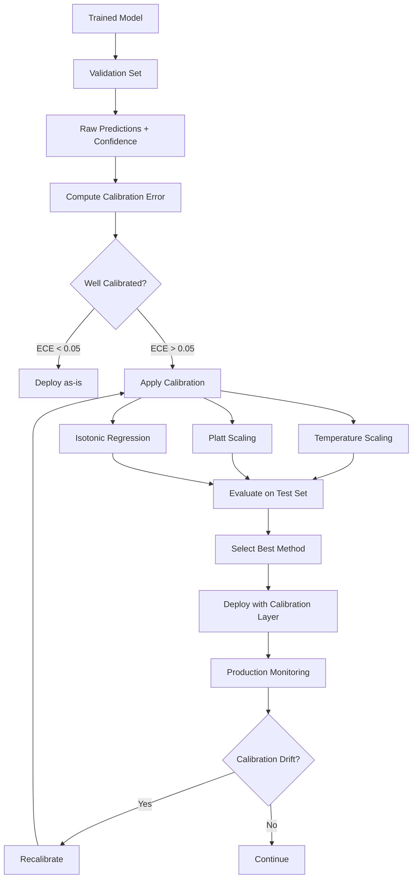

# Confidence Calibration

## What is Calibration?

Calibration answers: "When my model says it's 80% confident, is it actually right 80% of the time?"

A calibrated model's confidence scores are meaningful probabilities. An uncalibrated model might say "90% confident" but only be right 60% of the time (overconfident) or say "60% confident" but be right 90% of the time (underconfident).

```
Calibrated Model:
  Says 50% confident → right 50% of the time ✓
  Says 70% confident → right 70% of the time ✓
  Says 90% confident → right 90% of the time ✓

Overconfident Model (common):
  Says 50% confident → right 50% of the time ✓
  Says 70% confident → right 55% of the time ✗
  Says 90% confident → right 70% of the time ✗ ← dangerous!

Underconfident Model:
  Says 50% confident → right 70% of the time (wastes human review)
  Says 70% confident → right 88% of the time
  Says 90% confident → right 98% of the time
```

## Why Calibration Matters for HITL

Calibration directly drives escalation quality:

| Scenario | Impact |
|---|---|
| Overconfident model | Auto-approves items it's wrong about → errors reach users |
| Underconfident model | Escalates too much → wastes human time and money |
| Well-calibrated model | Thresholds work as intended → optimal human/AI balance |

**Real cost example**:
- Model processes 100K items/day
- Threshold: auto-approve if confidence > 0.90
- Overconfident model: says 0.90 but real accuracy is 0.75 → 25% error rate on "auto-approved" items
- After calibration: model's 0.90 corresponds to true 0.90 → only 10% error rate

## Calibration Methods

### 1. Temperature Scaling

The simplest and most effective post-hoc calibration. Divide logits by a learned temperature T.

```
Original: softmax(logits) = [0.92, 0.05, 0.03]  (overconfident)
After T=1.5: softmax(logits/1.5) = [0.78, 0.12, 0.10]  (calibrated)

T > 1: reduces confidence (fixes overconfidence)
T < 1: increases confidence (fixes underconfidence)
T = 1: no change
```

**How to find T**: Optimize T on a held-out validation set to minimize negative log-likelihood (NLL).

**Pros**: Single parameter, preserves ranking, fast
**Cons**: Assumes miscalibration is uniform across all confidence levels

### 2. Platt Scaling

Learn a logistic regression on top of model outputs:

```
calibrated_prob = sigmoid(a * raw_score + b)

Learn a, b on validation set to minimize calibration error.
```

**Pros**: Handles non-uniform miscalibration
**Cons**: Two parameters, can overfit on small validation sets

### 3. Isotonic Regression

Non-parametric: learns a monotonic mapping from raw scores to calibrated probabilities.

```
Raw scores:        [0.5, 0.6, 0.7, 0.8, 0.9, 0.95]
Actual accuracy:   [0.4, 0.5, 0.6, 0.7, 0.8, 0.85]
Isotonic mapping:  0.9 → 0.8, 0.8 → 0.7, etc.
```

**Pros**: Most flexible, handles any shape of miscalibration
**Cons**: Needs more validation data, can overfit, non-smooth

### Comparison

| Method | Parameters | Data Needed | Flexibility | Best For |
|---|---|---|---|---|
| Temperature | 1 | 1K+ items | Low | Neural networks (uniform overconfidence) |
| Platt | 2 | 2K+ items | Medium | Binary classification |
| Isotonic | N/A | 5K+ items | High | Complex miscalibration patterns |

## Mermaid Diagram: Calibration Pipeline



## Measuring Calibration

### Expected Calibration Error (ECE)

The standard metric. Bin predictions by confidence, compare predicted confidence to actual accuracy.

```
ECE Calculation:
  Bin predictions into buckets by confidence:
  
  Bucket [0.0-0.1]: 50 items, avg confidence 0.05, actual accuracy 0.04 → |diff|=0.01
  Bucket [0.1-0.2]: 80 items, avg confidence 0.15, actual accuracy 0.14 → |diff|=0.01
  ...
  Bucket [0.8-0.9]: 200 items, avg confidence 0.85, actual accuracy 0.72 → |diff|=0.13 ← bad!
  Bucket [0.9-1.0]: 500 items, avg confidence 0.95, actual accuracy 0.88 → |diff|=0.07 ← bad!
  
  ECE = weighted average of |diff| across bins
  ECE = Σ (n_bucket/n_total) × |avg_confidence - actual_accuracy|
  
  Good: ECE < 0.05
  Acceptable: ECE < 0.10
  Poor: ECE > 0.10
```

### Reliability Diagrams

Visual tool showing calibration quality:

```
Reliability Diagram (Perfect = diagonal):

Actual    │
Accuracy  │                              ╱ Perfect
1.0 │                           ╱╱
    │                        ╱╱
0.8 │                  ●  ╱╱     ← overconfident here
    │               ● ╱╱         (says 0.9 but accuracy 0.8)
0.6 │          ●  ╱╱
    │       ● ╱╱
0.4 │    ● ╱╱
    │  ●╱╱
0.2 │●╱╱
    │╱
0.0 └──────────────────────────→ Predicted Confidence
    0.0  0.2  0.4  0.6  0.8  1.0

Points below diagonal = overconfident
Points above diagonal = underconfident
Points on diagonal = perfectly calibrated
```

## Calibration for LLMs

LLMs present unique calibration challenges:

### Method 1: Logprob-Based Confidence

```
LLM generates: "The answer is Paris"
Token logprobs: "Paris" = -0.05 → P = exp(-0.05) = 0.95

Problem: Token probability ≠ answer correctness
  - "Paris" might have high probability because it's a common word
  - Multi-token answers: how to aggregate token probs?
```

### Method 2: Self-Reported Confidence

```
Prompt: "Answer the question and rate your confidence 1-10"
Response: "The answer is Paris. Confidence: 8/10"

Problem: LLMs are poorly calibrated self-reporters
  - Often overconfident
  - Sensitive to prompt phrasing
  - Can be improved with calibration prompts
```

### Method 3: Ensemble Disagreement

```
Ask the same question with 5 different prompt variations:
  Variation 1: "Paris"
  Variation 2: "Paris"  
  Variation 3: "Paris"
  Variation 4: "London" ← disagreement!
  Variation 5: "Paris"

Agreement: 4/5 = 0.80 → moderate confidence
If 5/5 agree → high confidence
If 3 different answers → low confidence
```

### Method 4: Consistency Checking

```
Ask the LLM the same question 5 times at temperature > 0:
  Response 1: "Paris" 
  Response 2: "Paris"
  Response 3: "Paris"
  Response 4: "Paris"
  Response 5: "Paris"
  
  Consistency: 5/5 = very confident
  
vs:
  Response 1: "42"
  Response 2: "43"
  Response 3: "42"
  Response 4: "41"
  Response 5: "42"
  
  Consistency: 3/5 on "42" = moderate confidence
```

## Dynamic Thresholds

### Risk-Based Threshold Adjustment

Different decisions warrant different confidence requirements:

```python
THRESHOLDS = {
    "content_recommendation": {
        "auto_approve": 0.80,   # Low risk, can show wrong rec
        "human_review": 0.50,    # Below this, don't show at all
    },
    "medical_triage": {
        "auto_approve": 0.98,   # Very high bar for auto
        "human_review": 0.70,    # Wide review band
    },
    "financial_transaction": {
        "auto_approve": 0.95,
        "human_review": 0.60,
    },
    "content_moderation": {
        "auto_remove": 0.97,    # High bar to auto-remove (false positive costly)
        "auto_approve": 0.90,   # High bar to auto-approve (false negative costly)
        "human_review": "everything_else",
    }
}
```

### Time-of-Day Adjustment

```
During business hours (humans available):
  auto_threshold = 0.95 (more goes to humans, fast response)

After hours (limited humans):
  auto_threshold = 0.85 (more auto-processed, accept slightly higher risk)

Weekends:
  auto_threshold = 0.80 (minimal human coverage)
  BUT safety items always queue for Monday
```

## A/B Testing Thresholds

### Methodology

```
Experiment: What threshold maximizes quality × throughput?

Group A: threshold = 0.90
  - Auto rate: 70%
  - Error rate on auto: 3%
  - Human load: 30% of traffic
  
Group B: threshold = 0.85
  - Auto rate: 82%
  - Error rate on auto: 5%
  - Human load: 18% of traffic

Group C: threshold = 0.95
  - Auto rate: 55%
  - Error rate on auto: 1%
  - Human load: 45% of traffic

Decision: Group B if error cost is low
          Group C if error cost is high
          Group A as balanced default
```

### Optimizing the Threshold

```
Objective: minimize Total Cost = error_cost × error_rate + human_cost × review_rate

For each threshold t:
  auto_rate(t) = fraction of items with confidence > t
  error_rate(t) = actual error rate on items with confidence > t
  review_rate(t) = 1 - auto_rate(t)
  
  total_cost(t) = C_error × error_rate(t) × auto_rate(t) + C_human × review_rate(t)

Find t* that minimizes total_cost.
```

## Production Monitoring

### Detecting Calibration Drift

Models lose calibration over time as data distribution shifts.

```
Weekly Calibration Report:
─────────────────────────────
Week    ECE     Auto-Rate   Error-Rate
─────────────────────────────
W1      0.03    82%         2.1%        ✓ baseline
W2      0.04    82%         2.3%        ✓ normal
W3      0.05    82%         3.1%        ⚠️ drift starting
W4      0.08    82%         4.5%        ❌ RECALIBRATE
─────────────────────────────

Alert: ECE increased from 0.03 to 0.08
Action: Recalibrate on last 2 weeks of production data
```

### Monitoring Architecture

```
Production predictions → Log (confidence, actual outcome)
                              ↓
                    Nightly calibration check
                              ↓
                    Compute ECE per category
                              ↓
                    If ECE > threshold → alert
                              ↓
                    Auto-recalibrate (if approved)
```

## Anti-Patterns

### 1. Using Raw Logprobs as Confidence
**Problem**: Neural network softmax outputs are notoriously overconfident
**Impact**: Threshold at 0.90 lets through items model is only 70% accurate on
**Fix**: Always calibrate post-hoc before using for routing

### 2. Static Thresholds Forever
**Problem**: Set threshold once, never revisit
**Impact**: As distribution shifts, threshold becomes suboptimal
**Fix**: Monthly threshold review, automated drift detection

### 3. Same Threshold for All Categories
**Problem**: One threshold for medical (high stakes) and recommendations (low stakes)
**Impact**: Either too conservative on low-risk or too aggressive on high-risk
**Fix**: Category-specific thresholds based on error cost

### 4. No Monitoring After Deployment
**Problem**: Deploy calibrated model, assume it stays calibrated
**Impact**: Silent degradation, increasing errors without alerts
**Fix**: Continuous ECE monitoring, automated alerts

### 5. Calibrating on Wrong Distribution
**Problem**: Calibrate on test set, deploy on different distribution
**Impact**: Calibration doesn't transfer to production data
**Fix**: Calibrate on recent production data, update regularly

## Staff Decision Framework

### How to Set Initial Thresholds

```
Step 1: Deploy model with NO automation (100% human review) for 2 weeks
Step 2: Collect (confidence, human_label) pairs (need 5K+ items)
Step 3: Plot reliability diagram → assess calibration quality
Step 4: If ECE > 0.05, apply temperature scaling
Step 5: After calibration, set initial thresholds:
  - Auto-approve: confidence where accuracy > 95% (look at reliability diagram)
  - Human review: everything below auto-approve threshold
Step 6: A/B test threshold for 2 weeks
Step 7: Iterate monthly based on accumulated data
```

### Iteration Protocol

```
Monthly Review:
1. Pull last month's (confidence, outcome) pairs
2. Recompute reliability diagram
3. Check if ECE has drifted
4. If drift > 0.02: recalibrate
5. Check if threshold is still optimal (error rate vs automation rate)
6. Adjust threshold if needed
7. Document decision and rationale
```

### When Calibration Isn't Enough

Sometimes you need more than confidence scores:
- **Rule-based overrides**: Certain patterns always escalate regardless of confidence
- **Business rules**: Transactions > $10K always get human review
- **Ensemble agreement**: Even if one model is confident, check others
- **Human feedback signals**: If users frequently complain about auto-decisions in category X, lower threshold for X
