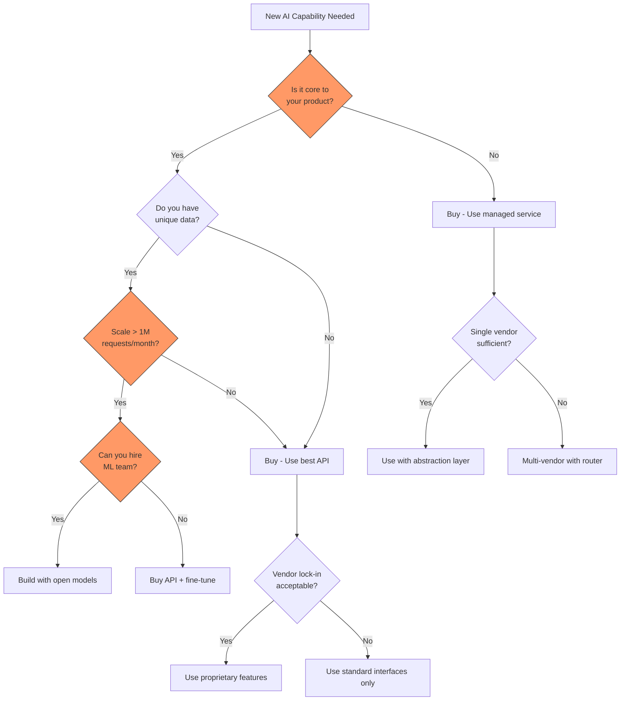

# Vendor Landscape Strategy for AI Systems

## The Staff Architect's Role in Vendor Strategy

Staff Architects don't just pick vendors—they design vendor strategies that balance
innovation velocity, cost efficiency, risk mitigation, and organizational autonomy.
The AI vendor landscape moves faster than any previous technology wave, making vendor
decisions simultaneously more critical and more reversible than traditional enterprise software.

**The core tension**: AI vendors provide extraordinary capability that would take years
to build internally, but over-dependence on any single vendor creates existential risk
when that vendor changes pricing, policies, or direction.

---

## The AI Vendor Landscape (2024-2025)

### Category Map

```
┌─────────────────────────────────────────────────────────────────────┐
│                    AI VENDOR LANDSCAPE                                │
├─────────────────────────────────────────────────────────────────────┤
│                                                                       │
│  FOUNDATION MODELS          INFRASTRUCTURE           TOOLS/PLATFORMS  │
│  ┌───────────────┐         ┌───────────────┐       ┌──────────────┐ │
│  │ OpenAI (GPT)  │         │ AWS Bedrock   │       │ LangChain    │ │
│  │ Anthropic     │         │ Azure OpenAI  │       │ LlamaIndex   │ │
│  │ Google (Gemini│         │ GCP Vertex AI │       │ Semantic K.  │ │
│  │ Meta (Llama)  │         │ vLLM (self)   │       │ Haystack     │ │
│  │ Mistral       │         │ TGI (self)    │       │ DSPy         │ │
│  │ Cohere        │         │ Anyscale      │       │ Custom       │ │
│  └───────────────┘         └───────────────┘       └──────────────┘ │
│                                                                       │
│  VECTOR DATABASES           EVALUATION              GUARDRAILS       │
│  ┌───────────────┐         ┌───────────────┐       ┌──────────────┐ │
│  │ Pinecone      │         │ Braintrust    │       │ Azure AI CS  │ │
│  │ Weaviate      │         │ LangSmith     │       │ Guardrails AI│ │
│  │ Qdrant        │         │ Arize Phoenix │       │ NeMo Guard.  │ │
│  │ Milvus        │         │ Weights&Biases│       │ Lakera       │ │
│  │ pgvector      │         │ Custom        │       │ Custom       │ │
│  │ ChromaDB      │         │               │       │              │ │
│  └───────────────┘         └───────────────┘       └──────────────┘ │
└─────────────────────────────────────────────────────────────────────┘
```

---

## Foundation Model Providers: Detailed Assessment

### Tier 1: Frontier Models

| Provider | Models | Strengths | Weaknesses | Pricing (approx 2024) |
|----------|--------|-----------|------------|----------------------|
| OpenAI | GPT-4o, GPT-4-turbo, o1 | Ecosystem, multi-modal, largest community | Closed, unpredictable roadmap | $2.50-$15/1M input tokens |
| Anthropic | Claude 3.5 Sonnet/Opus | Safety, long context, coding | Smaller ecosystem | $3-$15/1M input tokens |
| Google | Gemini 1.5 Pro/Flash | Long context (1M+), multi-modal, speed | API stability, enterprise trust | $1.25-$5/1M input tokens |

### Tier 2: Competitive / Specialized

| Provider | Models | Strengths | Weaknesses | Pricing (approx 2024) |
|----------|--------|-----------|------------|----------------------|
| Meta | Llama 3.1 (8B-405B) | Open weights, self-hostable, no API cost | Need infra, no support SLA | Infra cost only |
| Mistral | Mistral Large, Mixtral | European, open models, efficient | Smaller scale, less battle-tested | $2-$8/1M input tokens |
| Cohere | Command R+ | Enterprise RAG, embeddings | Narrower use case | $1-$3/1M input tokens |

### Key Insight: No Single Winner

```
Task Performance Comparison (approximate, 2024):

Complex Reasoning:  Claude 3.5 Opus ████████████ > GPT-4o █████████ > Gemini ████████
Code Generation:    Claude 3.5 Sonnet ███████████ > GPT-4o █████████ > Gemini ████████
Creative Writing:   GPT-4o ██████████ > Claude ████████ > Gemini ███████
Speed (TTFT):       Gemini Flash ████████████ > GPT-4o-mini ████████ > Claude Haiku ███████
Long Context:       Gemini 1.5 Pro ████████████ > Claude ██████████ > GPT-4 ██████
Cost Efficiency:    Gemini Flash ████████████ > GPT-4o-mini █████████ > Haiku ████████
```

---

## Infrastructure Providers

### Managed AI Platforms

| Platform | Models Available | Differentiator | Lock-in Risk |
|----------|-----------------|----------------|--------------|
| AWS Bedrock | Anthropic, Meta, Cohere, Stability | Multi-model, AWS integration | Medium (API differences) |
| Azure OpenAI | OpenAI (exclusive enterprise) | Enterprise compliance, Azure integration | High (OpenAI API only) |
| GCP Vertex AI | Gemini, Anthropic, Meta, Mistral | Model Garden variety, data integration | Medium |
| Together AI | Open models (100+) | Fast inference, fine-tuning | Low (OpenAI-compatible) |
| Fireworks AI | Open models, custom | Speed, custom model hosting | Low |

### Self-Hosted Options

| Framework | Use Case | Complexity | Cost Model |
|-----------|----------|------------|------------|
| vLLM | High-throughput serving | Medium | GPU compute |
| TGI (HuggingFace) | General serving | Medium | GPU compute |
| Ollama | Local development | Low | Local hardware |
| Ray Serve | Distributed inference | High | Cluster compute |

---

## Vendor Decision Matrix



---

## Multi-Vendor Strategy: Why Single-Vendor Is a Risk

### The Single-Vendor Failure Modes

1. **Price Increase**: OpenAI raised GPT-4 prices by removing the "preview" discount
2. **Outage**: AWS us-east-1 outages affect all Bedrock customers
3. **Deprecation**: OpenAI deprecated models with 6 months notice
4. **Policy Change**: Vendor changes data retention, usage rights, or ToS
5. **Acquisition**: Vendor gets acquired, roadmap changes dramatically
6. **Rate Limiting**: Popular vendor can't scale, you hit throughput limits
7. **Quality Regression**: Model update degrades performance on your use case

### Multi-Vendor Architecture Benefits

```
┌─────────────────────────────────────────────────┐
│              YOUR APPLICATION                     │
├─────────────────────────────────────────────────┤
│         ABSTRACTION LAYER (your code)            │
│    ┌──────────────────────────────────────┐      │
│    │  Common Interface: chat(), embed(),  │      │
│    │  generate(), classify()              │      │
│    └──────────────────────────────────────┘      │
├─────────────────────────────────────────────────┤
│         MODEL ROUTER / GATEWAY                   │
│    ┌────────┐  ┌────────┐  ┌────────┐          │
│    │Primary │  │Secondary│  │Fallback│          │
│    │(Claude)│  │(GPT-4o) │  │(Llama) │          │
│    └────────┘  └────────┘  └────────┘          │
└─────────────────────────────────────────────────┘
```

---

## Negotiation Leverage: Getting Better Pricing

### Strategies That Work

1. **Volume Commitments**: Commit to $50K+/month for 20-40% discount
2. **Multi-Year Deals**: 2-3 year commitment for significant reduction
3. **Competitive Pressure**: "We're evaluating Anthropic and Google" (must be credible)
4. **Design Partner**: Offer to be a case study or design partner
5. **Prepay Credits**: Pay upfront for larger discounts
6. **Batch vs Real-time**: Use batch APIs (50% cheaper) where latency allows

### Pricing Optimization Tactics

```python
# Approximate cost comparison for 1M requests/month
# Average 500 input tokens, 200 output tokens per request

costs_per_million_requests = {
    "gpt-4o":           {"input": 500 * 2.50,  "output": 200 * 10.00, "total": 3250},  # $3,250
    "gpt-4o-mini":      {"input": 500 * 0.15,  "output": 200 * 0.60,  "total": 195},   # $195
    "claude-3.5-sonnet":{"input": 500 * 3.00,  "output": 200 * 15.00, "total": 4500},  # $4,500
    "claude-3-haiku":   {"input": 500 * 0.25,  "output": 200 * 1.25,  "total": 375},   # $375
    "gemini-1.5-flash": {"input": 500 * 0.075, "output": 200 * 0.30,  "total": 97},    # $97
    "llama-3.1-70b":    {"input": 500 * 0.90,  "output": 200 * 0.90,  "total": 630},   # $630 (hosted)
    "llama-3.1-8b":     {"input": 500 * 0.20,  "output": 200 * 0.20,  "total": 140},   # $140 (hosted)
}
# Key insight: 10-50x cost difference between tiers
# 80% of queries may work fine with the cheapest option
```

---

## Vendor Evaluation Criteria

### The QLCRS Framework

| Criterion | Weight | What to Measure | How to Measure |
|-----------|--------|-----------------|----------------|
| **Q**uality | 30% | Output accuracy for YOUR use cases | Eval suite on YOUR data |
| **L**atency | 15% | P50, P95, P99 response times | Load test from YOUR regions |
| **C**ost | 20% | $/request at YOUR volume | Calculate with YOUR token distribution |
| **R**eliability | 20% | Uptime, error rates, degradation | Monitor for 30+ days |
| **S**ecurity | 15% | Data policies, compliance, certifications | Legal/security review |

### Additional Factors (non-weighted but critical)

- **Roadmap alignment**: Will they build what you need next?
- **Support quality**: Response time for production issues
- **Documentation**: Can your team self-serve?
- **Community**: Size, activity, resources available
- **Data residency**: Where is data processed and stored?
- **Exit cost**: How hard is it to leave?

---

## The "Good Enough" Threshold

### When Cheaper Models Meet Requirements

```
Quality Requirements vs Model Cost:

                    ┌─────────────────────────────────────────┐
Quality Score       │                                         │
(0-100)            │        *** Frontier (GPT-4o, Claude)    │
    100 ┤          │       *                                  │
        │          │      *     "Diminishing Returns Zone"    │
     90 ┤──────────│─────*─── Requirement Threshold ─────────│
        │          │    *                                     │
     80 ┤          │   *   ** Mid-tier (GPT-4o-mini, Haiku) │
        │          │  *   *                                   │
     70 ┤          │ *   *                                    │
        │          │*   *                                     │
     60 ┤          │   * ** Small models (8B, Flash)         │
        │          │  *                                       │
     50 ┤          │ *                                        │
        └──────────┴─────────────────────────────────────────┘
                   $0.10  $0.50  $1   $5   $10   $15
                        Cost per 1K tokens (output)

Key Insight: If your requirement threshold is 85/100,
and GPT-4o-mini scores 87, there's no business case for GPT-4o at 94.
```

### Decision Rule

```
IF cheaper_model.quality >= requirement_threshold
AND cheaper_model.latency <= latency_requirement
THEN use cheaper_model (save 10-50x cost)
ELSE use expensive_model only for queries that need it
```

---

## Risk Assessment: Scenario Planning

### For Each Vendor, Ask:

| Scenario | Impact | Mitigation | Timeline to Switch |
|----------|--------|------------|-------------------|
| Price increases 3x | Budget blown | Multi-vendor, open model fallback | 2-4 weeks |
| 24-hour outage | Revenue loss | Automatic fallback to secondary | Immediate (if pre-built) |
| Acquired by competitor | Uncertain future | Abstraction layer, data portability | 3-6 months |
| Changes ToS (data training) | Compliance risk | Contract review, opt-out, switch | 1-2 months |
| Deprecates your model | Forced migration | Version pinning, eval suite for new model | 2-4 weeks |
| Quality degrades silently | User complaints | Continuous evaluation, quality monitoring | 1-2 weeks |
| Rate limits your account | Throughput bottleneck | Multi-vendor routing, batch processing | 1 week |

### Risk Score Formula

```
Vendor Risk Score = 
    (Probability of disruption × Impact severity × Time to mitigate)
    / Mitigation readiness

Where:
- Probability: 1 (unlikely) to 5 (very likely within 2 years)
- Impact: 1 (minor inconvenience) to 5 (business-critical failure)
- Time to mitigate: 1 (hours) to 5 (months)
- Mitigation readiness: 1 (no plan) to 5 (tested failover)
```

---

## Anti-Patterns in Vendor Strategy

### 1. All-In on One Vendor
```
❌ "We're an OpenAI shop"
✅ "We use OpenAI as primary, with Anthropic as secondary and Llama as fallback"
```

### 2. Choosing by Hype, Not Evaluation
```
❌ "GPT-4 is the best, everyone says so" (no evaluation on your data)
✅ "We tested 4 models on 500 representative queries from production"
```

### 3. Ignoring Data Residency
```
❌ "We'll figure out compliance later"
✅ "European data must be processed in EU regions — this eliminates vendors X and Y"
```

### 4. No Monitoring of Vendor Performance
```
❌ Assuming vendor maintains quality after you sign the contract
✅ Continuous evaluation pipeline comparing vendor output quality weekly
```

### 5. Negotiating Without Leverage
```
❌ "We need OpenAI and have no alternative"
✅ "We've validated Anthropic can serve 80% of our traffic" (then negotiate with OpenAI)
```

### 6. Treating Vendor Choice as Permanent
```
❌ "We chose Pinecone 18 months ago, we're stuck"
✅ Quarterly vendor review with documented switching costs and triggers
```

---

## Staff Deliverable: Vendor Assessment Scorecard

### Template

```markdown
# Vendor Assessment: [Vendor Name]
## Date: [Date] | Assessor: [Name] | Use Case: [Description]

## 1. Evaluation Summary
| Criterion | Weight | Score (1-10) | Weighted Score |
|-----------|--------|--------------|----------------|
| Quality   | 30%    |              |                |
| Latency   | 15%    |              |                |
| Cost      | 20%    |              |                |
| Reliability| 20%   |              |                |
| Security  | 15%    |              |                |
| **TOTAL** |        |              | **__/10**      |

## 2. Evaluation Methodology
- Test dataset: [N samples from production]
- Evaluation period: [dates]
- Metrics used: [specific metrics]
- Comparison baseline: [current solution or competitor]

## 3. Cost Projection
| Volume | Monthly Cost | Annual Cost | vs. Alternative |
|--------|-------------|-------------|-----------------|
| Current (X req/mo) | $ | $ | |
| 6-month projected | $ | $ | |
| 12-month projected | $ | $ | |

## 4. Risk Assessment
| Risk | Probability | Impact | Mitigation |
|------|------------|--------|------------|
| Price increase | | | |
| Outage | | | |
| Deprecation | | | |
| Policy change | | | |

## 5. Lock-in Analysis
- Switching cost estimate: $[amount] + [time]
- Proprietary features used: [list]
- Data portability: [assessment]
- Exit strategy: [documented? tested?]

## 6. Recommendation
[ ] Approve as primary vendor
[ ] Approve as secondary/fallback
[ ] Reject - [reason]
[ ] Needs further evaluation - [what's missing]

## 7. Review Schedule
- Next review: [date]
- Trigger for early review: [conditions]
```

---

## Quarterly Vendor Review Process

### What Staff Architects Do Every Quarter

1. **Performance Review**: Has vendor quality changed? Check eval metrics.
2. **Cost Review**: Are we on track with projections? Any surprise charges?
3. **Market Scan**: Any new vendors worth evaluating? (Takes 1-2 days of testing)
4. **Contract Review**: Any upcoming renewals, commitments, or opt-outs?
5. **Risk Update**: Has any risk materialized or increased?
6. **Roadmap Alignment**: Does vendor roadmap still align with our needs?

### Decision Triggers for Vendor Change

- Quality drops >5% on eval suite for 2+ consecutive weeks
- Cost exceeds projection by >30% for 2+ consecutive months
- Uptime falls below 99.5% in any month
- Critical security vulnerability or policy change
- Better alternative validated at >20% improvement on key metric

---

## Key Takeaways for Staff Architects

1. **Vendor strategy is a living document** — review quarterly, update constantly
2. **Always have a credible alternative** — this is leverage AND risk mitigation
3. **Evaluate on YOUR data** — benchmarks are marketing, your eval suite is truth
4. **Cost model before commit** — project costs at 3x, 10x current volume
5. **The cheapest adequate model wins** — over-provisioning quality wastes money
6. **Lock-in is a spectrum** — some is acceptable, total dependence is not
7. **Negotiate from strength** — multi-vendor readiness IS negotiation leverage

---

## Further Reading

- Category 35: Production monitoring (vendor performance tracking)
- Category 28: Cost optimization (model cost management)
- Category 33: Security and compliance (vendor data policies)
