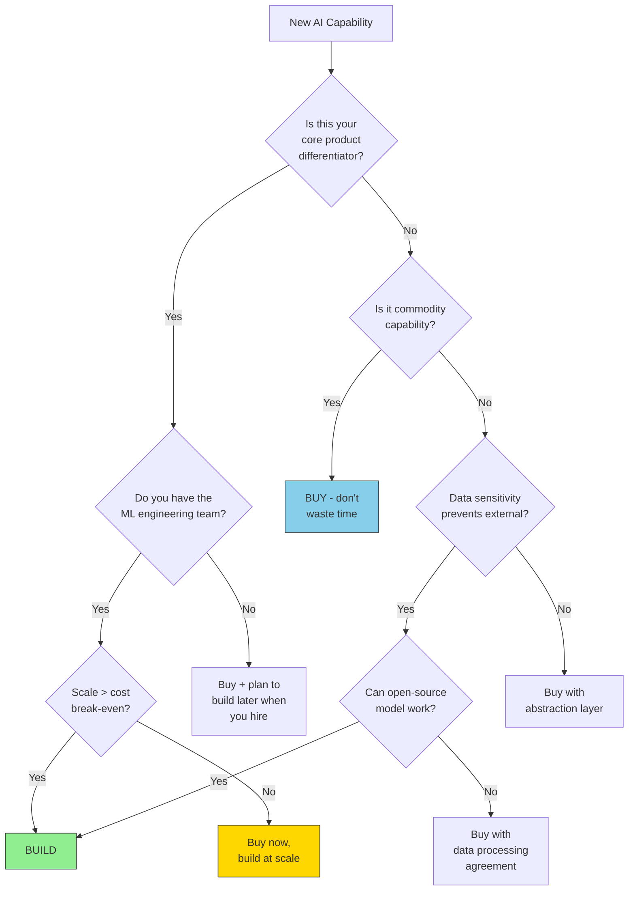

# Build vs Buy Framework for AI Systems

## The Fundamental Question

Every AI capability your system needs presents a choice: build it yourself or buy
from a vendor. This decision has massive implications for cost, speed, control,
and organizational capability. Staff Architects must have a rigorous framework—
not gut instinct—for making these calls.

**The naive approach**: "Just use the API" or "Just build it ourselves"
**The Staff approach**: Analyze along multiple dimensions, decide per-component,
revisit as scale and strategy change.

---

## The Decision Framework

### Build When:

| Signal | Example | Reasoning |
|--------|---------|-----------|
| Core differentiator | Custom ranking model for your marketplace | This IS your product |
| Unique data advantage | Model trained on your proprietary data | No vendor has this |
| Cost at extreme scale | 100M+ embeddings/month | Self-hosting is 5-10x cheaper |
| Data sensitivity | Healthcare/finance with strict residency | Can't send data externally |
| Vendor doesn't exist | Novel capability no one offers | No choice but to build |
| Control over quality | Need to iterate daily on model behavior | Vendor update cycle too slow |

### Buy When:

| Signal | Example | Reasoning |
|--------|---------|-----------|
| Commodity capability | Spell-check, basic summarization | Not worth engineering time |
| Time-to-market critical | MVP needs to ship in 2 weeks | Can't build fast enough |
| Team lacks expertise | Need ML infra, don't have ML engineers | Hiring takes 6+ months |
| Not your core business | Internal chatbot for HR questions | Doesn't differentiate you |
| Vendor is 10x better | Frontier model reasoning | Can't match with any budget |
| Rapidly evolving space | Foundation models improving quarterly | Your build is obsolete quickly |

---

## Decision Tree



---

## Total Cost of Ownership (TCO) Analysis

### Buy: True Cost

```
Annual TCO (Buy) = 
    API/License fees (per-token or per-seat)
  + Integration engineering (initial + ongoing)
  + Vendor management overhead (contracts, reviews, escalations)
  + Risk premium (what if they raise prices? go down? sunset feature?)
  + Compliance cost (security reviews, DPA, audits)
  + Feature limitations (workarounds for what vendor doesn't support)
```

### Build: True Cost

```
Annual TCO (Build) = 
    Engineering salaries (ML + Platform, fully loaded)
  + Infrastructure (GPU compute, storage, networking)
  + Maintenance (on-call, bug fixes, security patches)
  + Opportunity cost (what else could this team build?)
  + Knowledge risk (what if key engineers leave?)
  + Technical debt (model monitoring, retraining, evaluation)
```

---

## Specific AI Component Analysis

### 1. Embeddings: Buy vs Build

```
BUY: OpenAI text-embedding-3-small
  - $0.02 per 1M tokens
  - At 10M embeddings/month (avg 200 tokens each): ~$40/month
  - At 100M embeddings/month: ~$400/month
  - At 1B embeddings/month: ~$4,000/month
  
BUILD: Self-hosted sentence-transformers (e.g., E5-large)
  - 1x A10G GPU: ~$1,000/month (can serve ~50M embeddings/month)
  - Engineering setup: 2 weeks
  - Ongoing maintenance: 2-4 hours/month
  - At 100M/month: ~$2,000/month (2 GPUs)
  - At 1B/month: ~$20,000/month (20 GPUs) vs $4,000 API

BREAK-EVEN: ~500M embeddings/month (but consider:)
  - Build has fixed cost regardless of volume
  - Build requires ML ops expertise
  - Buy has zero ops overhead
  - VERDICT: Buy until >200M/month AND you have ML ops team
```

### 2. RAG Pipeline: Buy vs Build

```
BUY: Platform (e.g., Azure AI Search + OpenAI, Pinecone + plugin)
  - Monthly: $500-5,000 depending on scale
  - Setup: Days
  - Customization: Limited to platform capabilities
  - Quality ceiling: Platform's retrieval logic
  
BUILD: Custom (embeddings + vector DB + reranker + prompt engineering)
  - Monthly: $200-2,000 for infrastructure
  - Setup: 2-6 weeks
  - Customization: Unlimited (hybrid search, custom chunking, etc.)
  - Quality ceiling: Your engineering investment

VERDICT: Almost always build if AI is core to your product.
  - RAG quality depends heavily on YOUR data, YOUR chunking strategy,
    YOUR retrieval logic. Generic platforms can't optimize for your domain.
  - Exception: Internal tools where "good enough" is fine.
```

### 3. Guardrails / Content Safety: Buy vs Build

```
BUY: Azure AI Content Safety, Lakera Guard
  - $1-2 per 1K requests
  - Pre-built categories (hate, violence, self-harm, sexual)
  - Regular updates as threats evolve
  - Compliance-friendly (vendor maintains, you configure)

BUILD: Custom classifiers
  - Training data collection: Expensive, sensitive
  - Model training/fine-tuning: 2-4 weeks
  - Ongoing maintenance: Threat landscape evolves
  - Custom categories possible (brand-specific, domain-specific)

VERDICT: Buy for standard categories, build for domain-specific.
  - Hybrid: Buy standard safety, add custom classifiers for your domain.
  - PII detection: Consider both (vendor for standard, custom for domain entities)
```

### 4. Vector Database: Managed vs Self-Hosted

```
BUY (Managed): Pinecone
  - Starter: Free (100K vectors)
  - Standard: $70/month (1M vectors)
  - Enterprise: $0.096/hour per pod → ~$2,000-10,000/month at scale
  - Zero ops, auto-scaling, managed backups
  
BUILD (Self-Hosted): Qdrant on Kubernetes
  - Small: 1 node, 16GB RAM → ~$200/month
  - Medium: 3-node cluster → ~$800/month
  - Large: Sharded, replicated → ~$3,000-5,000/month
  - Requires: K8s ops, backup strategy, scaling plan
  
BREAK-EVEN: ~$3,000-5,000/month Pinecone spend
  - Below that: Pinecone's zero-ops wins
  - Above that: Self-hosted saves 40-60% (if you have K8s ops)
  - Consider pgvector if <5M vectors and you already have PostgreSQL
```

### 5. LLM Inference: API vs Self-Hosted

```
BUY: OpenAI API / Anthropic API
  - Pay per token, zero infra management
  - Always latest models, highest quality
  - Rate limits may bite at scale
  - No control over model behavior changes
  
BUILD: Self-hosted open model (Llama 3.1 70B on vLLM)
  - 4x A100 80GB: ~$12,000/month (cloud)
  - Throughput: ~200 requests/second
  - At API-equivalent pricing: ~$0.50/1M tokens
  - vs. GPT-4o at $2.50-10/1M tokens → 5-20x savings

BREAK-EVEN: ~$10,000/month API spend on frontier models
  - Below: API wins (zero ops, better quality)
  - Above: Self-hosting saves massively IF open model quality suffices
  - Key question: Does Llama 70B meet your quality bar?
```

---

## The Hybrid Approach: Buy → Build Migration Path

### Phase Strategy

```
Phase 1: VALIDATE (Month 1-3)
├── Buy everything via APIs
├── Prove product-market fit
├── Measure actual volumes and patterns
└── Identify what's truly differentiating

Phase 2: OPTIMIZE (Month 3-9)
├── Add abstraction layers
├── Implement model routing (cheap for simple, expensive for complex)
├── Start evaluating open-source alternatives
└── Build evaluation infrastructure

Phase 3: SELECTIVE BUILD (Month 9-18)
├── Self-host embeddings (first to hit cost threshold)
├── Deploy open model for simple queries (70-80% of traffic)
├── Keep API for complex queries only
└── Build custom components for differentiators

Phase 4: MATURE (Month 18+)
├── Full multi-model with intelligent routing
├── Custom fine-tuned models for core use cases
├── Vendors only for frontier capability and fallback
└── Continuous evaluation driving routing decisions
```

---

## Migration Costs: The Hidden Tax

### Switching From Buy to Build

| Cost Category | Typical Range | Often Forgotten? |
|---------------|---------------|------------------|
| Engineering time to build | 2-12 engineer-months | No |
| Data migration | 1-4 weeks | Sometimes |
| Re-evaluation (ensure quality parity) | 2-4 weeks | YES |
| Dual-running period (both systems) | 1-3 months cost | YES |
| Retraining team on new system | 1-2 weeks | YES |
| Updating monitoring/alerting | 1 week | YES |
| Documentation and runbooks | 1 week | YES |
| Edge cases discovered in migration | 2-4 weeks | ALWAYS |

### The 3x Rule

```
Actual migration cost ≈ 3x your initial estimate

Why:
- Edge cases in production that don't exist in your test set
- Integration points you forgot about
- Performance tuning for production load
- Team learning curve
- Parallel running to validate
```

---

## Anti-Patterns

### 1. NIH Syndrome (Not Invented Here)

```
❌ "We should build our own vector database because we need full control"
   Reality: You'll spend 6 months building what Qdrant does, poorly.
   
✅ "Vector search is commodity infrastructure. We'll use Qdrant and focus
   our engineering on the retrieval logic and ranking that differentiates us."
```

### 2. Premature Build

```
❌ Building custom inference infrastructure before you have 1,000 users
   Reality: You don't know your scale patterns yet.
   
✅ "We'll use APIs until we hit $X/month, then evaluate self-hosting.
   Our abstraction layer makes this switch possible."
```

### 3. No Exit Plan

```
❌ "We'll use [Vendor X] and figure out switching later if needed"
   Reality: By then you're deeply integrated and switching costs are 10x higher.
   
✅ "For each vendor, we document: switch trigger, alternative vendor, 
   migration runbook, estimated effort, and maximum acceptable switching time."
```

### 4. False Economy

```
❌ "We saved $5K/month by self-hosting!" 
   (While spending $20K/month in engineer time maintaining it)
   
✅ Include ALL costs: engineering time, ops burden, opportunity cost.
   Only count savings if engineers actually get reallocated to higher-value work.
```

### 5. Decision Paralysis

```
❌ Spending 3 months evaluating vector databases for a prototype
   
✅ "For prototype: use pgvector (already have Postgres). 
   Revisit at 1M vectors or when search quality becomes a bottleneck."
```

---

## Staff Deliverable: Build vs Buy Decision Document

### Template

```markdown
# Build vs Buy Decision: [Capability Name]
## Date: [Date] | Decision Owner: [Name] | Status: [Draft/Approved/Revisit by X]

## 1. Capability Description
What does this component do? Why do we need it?

## 2. Strategic Classification
- [ ] Core differentiator (directly impacts competitive advantage)
- [ ] Important but not differentiating (needs to work well, not uniquely)
- [ ] Commodity (any solution that works is fine)

## 3. Buy Option Analysis
| Vendor | Monthly Cost | Setup Time | Quality Score | Lock-in Risk |
|--------|-------------|------------|---------------|--------------|
|        |             |            |               |              |

**Buy TCO (3 year)**: $___
**Buy Risks**: [list]
**Buy Constraints**: [what can't we do?]

## 4. Build Option Analysis
| Approach | Monthly Infra | Dev Time | Team Required | Quality Ceiling |
|----------|--------------|----------|---------------|-----------------|
|          |              |          |               |                 |

**Build TCO (3 year)**: $___
**Build Risks**: [list]  
**Build Opportunity Cost**: [what else could team do?]

## 5. Decision Matrix
| Factor | Weight | Buy Score | Build Score |
|--------|--------|-----------|-------------|
| Time to market | 20% | | |
| Long-term cost | 25% | | |
| Quality/control | 20% | | |
| Team capability | 15% | | |
| Risk | 20% | | |
| **Weighted Total** | | **__** | **__** |

## 6. Decision
[ ] BUY from [vendor] — revisit when [trigger]
[ ] BUILD — estimated delivery [date]
[ ] HYBRID — buy [X], build [Y]
[ ] DEFER — decide by [date] when [information available]

## 7. Exit Strategy (if Buy)
- Switch trigger: [condition]
- Alternative: [vendor or build plan]
- Migration estimate: [time + cost]
- Data portability: [assessment]

## 8. Success Metrics
- [ ] Cost within [X]% of projection after 6 months
- [ ] Quality meets [threshold] on eval suite
- [ ] Migration possible within [timeframe] if needed
```

---

## Decision Heuristics for Staff Architects

### Quick Rules of Thumb

1. **If API cost < one engineer's time to build/maintain** → Buy
2. **If it touches your core IP** → Lean toward build
3. **If you don't know your scale yet** → Buy, add abstraction
4. **If vendor is >2 years ahead of what you could build** → Buy
5. **If switching vendors is easy** → Buy (low lock-in = low risk)
6. **If you're spending >$50K/month on a vendor** → Seriously evaluate build
7. **If it's changing rapidly** (models, techniques) → Buy (let vendor keep up)
8. **If it needs to be highly customized to your domain** → Build

### The 18-Month Rule

```
Ask: "In 18 months, will I regret this decision?"

Buy regret: "We're locked in, it's expensive, and we can't customize"
Build regret: "We spent 6 months building what we could have bought for $500/month"

The worse regret should drive your decision.
```

---

## Key Takeaways

1. **Build vs buy is not permanent** — it's a spectrum that shifts with scale
2. **Always have an exit plan** — even for "buy" decisions
3. **TCO includes people cost** — engineers maintaining a "free" open-source system aren't free
4. **Core differentiators deserve build investment** — everything else is a distraction
5. **The hybrid path is usually optimal** — buy to start, build what matters at scale
6. **Evaluate quarterly** — the break-even points shift as vendor pricing and open-source quality change
