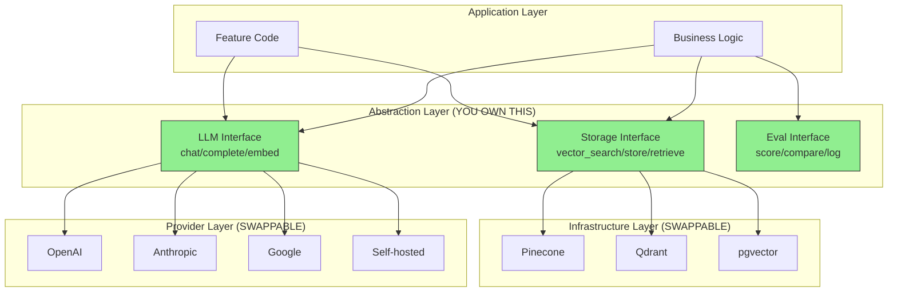

# Avoiding Lock-In in AI Systems

## Why Lock-In Is the #1 Strategic Risk in AI

The AI vendor landscape is the most volatile technology market in decades.
Models improve 10x yearly, pricing drops 90% in 18 months, and today's leader
may be tomorrow's also-ran. Lock-in to any single vendor is not just a cost
risk—it's a strategic risk that limits your ability to adopt better technology.

**Staff Architect principle**: Design for optionality. The cost of abstraction
is almost always less than the cost of being trapped.

---

## Types of Lock-In

### 1. API Lock-In
Using vendor-specific API patterns, parameters, and features that don't exist elsewhere.

```
Example: OpenAI function calling format vs Anthropic tool use format
- Different JSON schemas
- Different response structures  
- Different streaming formats
- If you code to one, switching requires rewriting every call site
```

### 2. Data Format Lock-In
Storing data in vendor-proprietary formats that can't be easily exported.

```
Example: Prompts stored in vendor UI (OpenAI Playground, etc.)
- No version control
- No portability
- No way to A/B test across vendors
- Lost when you switch
```

### 3. Model Capability Lock-In
Building features that depend on capabilities unique to one model.

```
Example: Relying on GPT-4's specific JSON mode behavior
- Other models may produce different JSON structures
- Model updates may change behavior
- You've coupled your logic to model quirks, not capabilities
```

### 4. Platform Lock-In
Deep integration with a vendor's ecosystem that touches everything.

```
Example: Azure OpenAI + Azure AI Search + Azure Functions + Cosmos DB
- Each component works best with the others
- Switching one means rearchitecting connections
- Vendor can increase prices knowing you can't easily leave
```

### 5. Knowledge Lock-In
Your team only knows one vendor's tools and patterns.

```
Example: Team trained on LangChain, entire codebase uses LangChain abstractions
- LangChain changes API → your code breaks
- Better framework emerges → can't switch without retraining
- Team resists change because familiar tool "works"
```

---

## Abstraction Architecture



---

## Model-Agnostic Design Patterns

### Pattern 1: Common LLM Interface

```python
# The abstraction layer YOUR code calls
class LLMProvider(Protocol):
    def chat(self, messages: list[Message], **kwargs) -> ChatResponse: ...
    def embed(self, texts: list[str]) -> list[list[float]]: ...
    def stream(self, messages: list[Message], **kwargs) -> Iterator[str]: ...

# Concrete implementations are swappable
class OpenAIProvider(LLMProvider): ...
class AnthropicProvider(LLMProvider): ...
class SelfHostedProvider(LLMProvider): ...

# Your business code NEVER imports from openai or anthropic directly
# It only uses LLMProvider
```

### Pattern 2: OpenAI Format as De Facto Standard

The OpenAI chat completions format has become the industry standard:
- Anthropic's Messages API is similar but different
- vLLM and TGI offer OpenAI-compatible endpoints
- Most open-source tools support OpenAI format

**Strategy**: Use OpenAI message format internally, translate at the provider boundary.

```python
# Internal standard format (OpenAI-like)
messages = [
    {"role": "system", "content": "You are a helpful assistant."},
    {"role": "user", "content": "Explain X."},
]

# Provider adapter translates to Anthropic format if needed:
# system message → system parameter
# assistant_prefill → different mechanism
```

### Pattern 3: Prompt Templates That Work Across Models

```
❌ Model-specific prompt (locked to GPT-4 behavior):
"You must respond in JSON. Use ```json code fences. 
 Always include a 'reasoning' field before 'answer'."
 (This works because GPT-4 learned this pattern, other models may not)

✅ Model-agnostic prompt:
"Respond with a JSON object containing two fields:
 - reasoning: your step-by-step thinking
 - answer: your final answer
 Do not include any text outside the JSON object."
 (Clear instruction that any competent model can follow)
```

### Pattern 4: Evaluation That Measures Capability, Not Model Quirks

```python
# ❌ Brittle test (tied to specific model output format)
assert response.startswith("Based on my analysis")

# ✅ Capability test (works for any model)
assert eval_relevance(response, expected_topic) > 0.8
assert eval_factual(response, ground_truth) > 0.9
assert json.loads(response)  # Valid JSON, regardless of format details
```

---

## Data Portability

### Vector Database Portability

```
Standard Embedding Storage:
┌─────────────────────────────────────────────┐
│  Document ID (UUID)                          │
│  Vector (float32 array, standard dimension)  │
│  Metadata (JSON)                             │
│  Raw text (for re-embedding if needed)       │
└─────────────────────────────────────────────┘

Rules:
1. Store raw text alongside vectors (can re-embed with different model)
2. Use standard dimensions (384, 768, 1024, 1536)
3. Metadata in JSON (portable across all vector DBs)
4. AVOID proprietary features (vendor-specific filtering, hybrid modes)
   OR at minimum, have a fallback that works without them
```

### Training Data Portability

```
✅ Open formats:
- JSONL for instruction data
- Parquet for large datasets
- Standard schema: {"input": "...", "output": "...", "metadata": {...}}

❌ Platform-locked:
- Data stored only in vendor's fine-tuning UI
- Format that only works with one provider's fine-tuning API
- No export capability
```

### Prompt Library Management

```
✅ Version-controlled prompts:
prompts/
├── summarization/
│   ├── v1.yaml        # Prompt template + metadata
│   ├── v2.yaml        # Newer version
│   └── eval_results/  # Performance per model
├── classification/
│   ├── v1.yaml
│   └── eval_results/
└── config.yaml        # Which version is active per environment

❌ Vendor-locked prompts:
- Stored in OpenAI Playground
- Only accessible through vendor's UI
- No version history
- No cross-model testing
```

---

## Infrastructure Portability

### Container-Based Deployment

```yaml
# Your AI service is a container — runs anywhere
apiVersion: apps/v1
kind: Deployment
metadata:
  name: ai-service
spec:
  containers:
  - name: ai-service
    image: your-registry/ai-service:v1.2.3
    env:
    - name: LLM_PROVIDER
      value: "openai"  # Change to "anthropic" or "self-hosted" via config
    - name: VECTOR_DB_PROVIDER
      value: "qdrant"  # Change to "pinecone" or "pgvector" via config
```

### Cloud-Agnostic Patterns

| Capability | Cloud-Agnostic | Cloud-Specific (avoid) |
|-----------|----------------|----------------------|
| Compute | Kubernetes | ECS, Cloud Run (hard to move) |
| Storage | S3-compatible (MinIO) | Vendor-specific blob APIs |
| Queue | NATS, RabbitMQ | SQS, Pub/Sub |
| Secrets | Vault | AWS Secrets Manager |
| Monitoring | Prometheus + Grafana | CloudWatch, Cloud Monitoring |

**Pragmatic note**: Pure cloud-agnosticism has costs. The goal isn't to avoid
all cloud services—it's to avoid lock-in where the switching cost is
disproportionate to the benefit.

---

## Exit Strategy Template

### For Each Vendor, Document:

```markdown
# Exit Strategy: [Vendor Name]
## Last Updated: [Date]

## 1. What We Use Them For
- [Capability 1]: [volume/month]
- [Capability 2]: [volume/month]

## 2. Alternative Vendors (Tested)
| Capability | Alternative | Quality Delta | Cost Delta | Migration Effort |
|-----------|-------------|---------------|------------|------------------|
|           |             |               |            |                  |

## 3. Migration Runbook (30-Day Plan)
Week 1:
- [ ] Spin up alternative vendor account
- [ ] Deploy abstraction layer pointing to new vendor
- [ ] Run eval suite against new vendor (confirm quality)

Week 2:
- [ ] Shadow traffic: send 10% of requests to new vendor (don't serve results)
- [ ] Compare quality metrics side-by-side
- [ ] Identify any gaps or issues

Week 3:
- [ ] Route 10% of production traffic to new vendor
- [ ] Monitor error rates, latency, user feedback
- [ ] Scale to 50% if metrics are acceptable

Week 4:
- [ ] Scale to 100% on new vendor
- [ ] Decommission old vendor integration
- [ ] Update documentation and runbooks
- [ ] Cancel old vendor contract

## 4. Data to Migrate
- [ ] [Data type 1]: [format, size, migration method]
- [ ] [Data type 2]: [format, size, migration method]

## 5. Trigger Conditions
Switch if:
- Price increases > [X]%
- Uptime falls below [X]% for [N] consecutive months
- Quality degrades > [X]% on eval suite
- Critical security/compliance issue unresolved for [N] days

## 6. Estimated Effort
- Engineering time: [person-weeks]
- Dual-running cost: [$/month for overlap period]
- Risk: [assessment]
```

---

## Cost of Abstraction

### Be Honest About Trade-offs

| Cost | Magnitude | Mitigation |
|------|-----------|------------|
| Engineering time to build abstraction | 1-2 weeks initially | Pays for itself at first vendor switch |
| Performance overhead | 1-5ms per call (negligible) | Thin adapter, no heavy processing |
| Feature lag | Days to weeks behind vendor features | Prioritize features that matter |
| Complexity | More code to maintain | Good abstractions reduce total complexity |
| Lowest-common-denominator | May miss vendor-specific optimizations | Allow escape hatches for critical paths |

### The Escape Hatch Pattern

```python
class LLMProvider:
    def chat(self, messages, **kwargs) -> Response:
        """Standard interface — works with any provider."""
        ...
    
    def native_call(self, **kwargs) -> Any:
        """Escape hatch: direct vendor API call.
        
        Use ONLY when:
        1. Vendor-specific feature is critical for this use case
        2. No portable alternative exists
        3. You document the lock-in explicitly
        
        Every use of native_call is a conscious lock-in decision.
        """
        ...
```

---

## When Lock-In Is Acceptable

### The 10x Rule

Lock-in is acceptable when:
1. The vendor provides **10x advantage** over alternatives
2. The **switching cost is bounded** (can leave in <3 months)
3. You've **documented the lock-in** explicitly
4. You have **budget for the switch** if needed
5. The vendor is **stable** (well-funded, large customer base)

### Examples of Acceptable Lock-In

```
✅ Using OpenAI's o1 for complex reasoning (no equivalent exists)
   - Documented: "We use o1 because no alternative matches reasoning quality"
   - Exit plan: "If alternative matches, switch via abstraction layer in 2 weeks"
   - Risk: Low (can fall back to Claude/GPT-4 with quality degradation)

✅ Using Azure's compliance features for regulated industry
   - Required: "SOC2 + HIPAA compliance requires Azure AI Services"
   - Exit plan: "GCP offers similar compliance, migration estimated 2 months"
   - Risk: Medium (platform lock-in) but compliance requirement is non-negotiable

❌ Using vendor's proprietary workflow builder for all orchestration
   - High switching cost, no standard alternative, deeply embedded
   - Exit plan: "Rewrite everything" (not a plan, it's a catastrophe)
```

---

## Anti-Patterns

### 1. No Abstraction Layer

```
❌ Direct vendor imports scattered across codebase:
   from openai import OpenAI  # In 47 different files
   
✅ Single integration point:
   from our_company.ai import get_completion  # Everywhere
   # Only our_company/ai/providers/openai.py imports from openai
```

### 2. Using Every Proprietary Feature

```
❌ Using OpenAI Assistants API (threads, runs, files, code interpreter)
   - Deeply proprietary, no equivalent elsewhere
   - If you switch models, you rebuild everything
   
✅ Build your own thin orchestration:
   - Message history: your database
   - Tool execution: your code
   - File handling: your storage
   - LLM calls: through your abstraction
```

### 3. Vendor UI as System of Record

```
❌ Prompts stored in OpenAI Playground / Anthropic Console
   - No version control
   - No CI/CD
   - No multi-model testing
   - Lost if you switch vendors
   
✅ Prompts in your Git repository:
   - Version controlled
   - Reviewed in PRs
   - Tested against multiple models in CI
   - Deployed through your pipeline
```

### 4. Embedding Lock-In

```
❌ Only storing vectors (no raw text):
   - If you change embedding model, you must re-process all source documents
   - If source documents are gone, your vectors are worthless with a new model
   
✅ Store both:
   - Raw text (or reference to source) alongside vectors
   - Can re-embed with any model when needed
   - Migration becomes a batch job, not a crisis
```

---

## Staff Playbook: Annual Vendor Lock-In Audit

### Quarterly Checklist

```markdown
## Vendor Lock-In Audit — Q[X] [Year]

### For Each Vendor:

#### [Vendor Name]
- [ ] Exit strategy document is current (updated within 90 days)
- [ ] Alternative vendor has been tested within past 6 months
- [ ] Abstraction layer covers all features we use
- [ ] No new proprietary features adopted without explicit lock-in decision
- [ ] Data is exportable (tested export within past 6 months)
- [ ] Prompts/configs are in version control (not vendor UI)
- [ ] Contract reviewed: any auto-renewal, price change clauses?
- [ ] Switching cost estimate still accurate?

### Lock-In Risk Score (per vendor):
| Vendor | Features Used | Proprietary Deps | Exit Time | Risk (1-5) |
|--------|--------------|-------------------|-----------|------------|
|        |              |                   |           |            |

### Actions Required:
- [ ] [Action items from audit]

### Next Audit: [Date]
```

---

## Practical Implementation: The Layered Approach

### Layer 1: Provider Adapters (Day 1)

Even if you only use one vendor today, wrap it:

```python
# Takes 2 hours to implement, saves weeks later
class AIService:
    def __init__(self, provider: str = "openai"):
        self._provider = self._init_provider(provider)
    
    def complete(self, prompt: str, **kwargs) -> str:
        return self._provider.complete(prompt, **kwargs)
```

### Layer 2: Configuration-Driven Routing (Month 3)

```yaml
# config.yaml — change vendors without code changes
providers:
  primary: anthropic
  fallback: openai
  embedding: openai  # Still best price/quality for embeddings
  
routing:
  simple_queries: haiku  # Cheap model
  complex_queries: sonnet  # Better model
  fallback_chain: [anthropic, openai, self-hosted]
```

### Layer 3: Intelligent Multi-Vendor (Month 6+)

Full model router with quality-aware routing (see concept 04).

---

## Key Takeaways

1. **Wrap every vendor on day 1** — 2 hours of work, weeks of future savings
2. **Store raw data, not just vendor output** — re-processable with any provider
3. **Prompts in Git, not vendor UI** — version control is non-negotiable
4. **Test alternatives quarterly** — ensures exit strategies are real, not theoretical
5. **Document every lock-in decision** — conscious trade-offs are fine, accidental ones aren't
6. **The escape hatch pattern** — allow vendor-specific features with explicit opt-in
7. **Lock-in is acceptable when bounded** — 10x advantage + documented exit = fine
