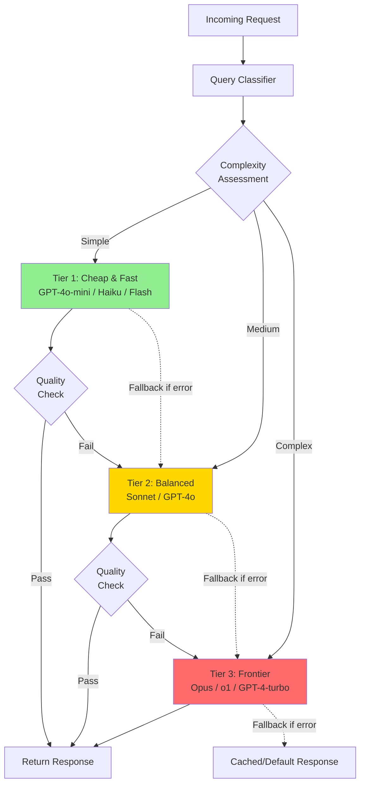

# Multi-Model Orchestration

## Why Multi-Model: No Single Model Wins Everything

The AI landscape in 2024-2025 has a critical property: **no single model is best
at all tasks**. Claude excels at code and reasoning, GPT-4o at creative tasks,
Gemini Flash at speed and cost, and small open models at simple classification.

A Staff Architect who routes everything to GPT-4o is like a carpenter who uses a
sledgehammer for every nail—technically it works, but at 10-50x the cost and with
worse results for many tasks.

**The multi-model thesis**: An intelligent router that selects the right model per
query can achieve 90%+ of frontier quality at 20-30% of frontier cost.

---

## Multi-Model Architecture



---

## Routing Strategies

### Strategy 1: Cost-Based Routing

Route based on query complexity → model cost tier.

```
Classification Rules:
┌─────────────────────────────────────────────────────────────┐
│ SIMPLE (Tier 1 — $0.10-0.50 per 1M tokens)                  │
│ - FAQ-style questions with clear answers                     │
│ - Simple extraction (name, date, number)                     │
│ - Basic classification (sentiment, category)                 │
│ - Formatting/reformatting tasks                              │
│ - Short summarization (<500 word source)                     │
│                                                              │
│ MEDIUM (Tier 2 — $2-5 per 1M tokens)                        │
│ - Multi-step reasoning                                       │
│ - Long document analysis                                     │
│ - Code generation (standard patterns)                        │
│ - Creative writing with constraints                          │
│ - Nuanced classification requiring judgment                  │
│                                                              │
│ COMPLEX (Tier 3 — $10-60 per 1M tokens)                     │
│ - Novel problem solving                                      │
│ - Complex code architecture                                  │
│ - Multi-document synthesis                                   │
│ - Tasks where errors are very costly                         │
│ - Adversarial/tricky inputs                                  │
└─────────────────────────────────────────────────────────────┘
```

### Strategy 2: Capability-Based Routing

Route based on task type → model strength.

| Task Type | Best Model (2024) | Reason |
|-----------|-------------------|--------|
| Code generation | Claude 3.5 Sonnet | Consistently top on benchmarks |
| Creative writing | GPT-4o | Strong creative voice |
| Structured output | GPT-4o (JSON mode) | Reliable JSON formatting |
| Long context (>100K) | Gemini 1.5 Pro | 1M+ context window |
| Fast classification | Gemini Flash | Lowest latency |
| Math/reasoning | o1 | Chain-of-thought specialized |
| Multilingual | GPT-4o | Broadest language support |
| Safety-critical | Claude | Constitutional AI training |

### Strategy 3: Cascade (Try Cheap First)

```
1. Send query to cheapest appropriate model
2. Evaluate response quality (automated check)
3. If quality passes threshold → serve response (cost: $0.001)
4. If quality fails → escalate to next tier
5. Repeat until quality passes or frontier model reached

Result: 70-80% of queries served by cheapest model
        15-20% served by mid-tier
        5-10% served by frontier
        Average cost: 70-80% less than always using frontier
```

### Strategy 4: Ensemble

For critical decisions, query multiple models and aggregate:

```
Query → [Model A, Model B, Model C]
     → [Response A, Response B, Response C]
     → Aggregation logic (majority vote, union, synthesis)
     → Final response

Use cases:
- Medical/legal where errors are catastrophic
- Content moderation (multiple perspectives)
- Fact-checking (cross-reference)

Cost: 3x a single call, but quality approaches 99%+ accuracy
```

---

## Quality-Cost Pareto Frontier

```
Quality                          The Pareto Frontier
(eval score)                    /
   100 ┤                      * o1-preview ($60/1M out)
       │                    *
    95 ┤                  * Claude Opus ($75/1M out)
       │                *
    90 ┤             * GPT-4o ($10/1M out)
       │           * Claude Sonnet ($15/1M out)
    85 ┤        *
       │      * GPT-4o-mini ($0.60/1M out)
    80 ┤    *
       │   * Gemini Flash ($0.30/1M out)
    75 ┤  * Claude Haiku ($1.25/1M out)
       │ *
    70 ┤* Llama-3.1-8B ($0.10/1M out, self-hosted)
       │
    65 ┤
       └────┬───┬───┬───┬───┬───┬───┬───┬───┬──
          $0.1  $0.5  $1   $5  $10  $15  $30  $60
                     Cost per 1M output tokens

Key Insight: The frontier is NOT linear.
Going from 80→90 quality costs 10-20x more than 70→80.
Most applications need 85, not 95.
```

---

## A/B Testing Models in Production

### Framework

```
Production Traffic
    │
    ├── 90% → Current best model (control)
    │
    └── 10% → Candidate model (treatment)
            │
            ├── Same queries, both responses scored
            ├── Metrics: quality, latency, cost, user satisfaction
            └── Statistical significance after N samples
            
Decision criteria:
- Candidate quality >= control quality - 2% (within tolerance)
- Candidate cost < control cost by >= 20% (worth switching)
- Candidate latency <= control latency + 100ms
→ Switch if all criteria met for 1000+ samples
```

### Shadow Mode Testing

```
For risky transitions (new model version, new provider):

Production Traffic
    │
    ├── 100% → Current model → Serve to user
    │
    └── 100% → New model → Log only (don't serve)
            │
            └── Compare offline: quality scores, edge cases, failures
            
Cost: 2x inference cost during shadow period (1-2 weeks)
Benefit: Zero risk to users, full production data comparison
```

---

## Fallback Chains

### Architecture

```
Request → Primary Provider (Anthropic Claude)
              │
              ├── Success → Return
              │
              └── Failure (timeout/error/rate-limit)
                      │
                      ▼
              Secondary Provider (OpenAI GPT-4o)
                      │
                      ├── Success → Return
                      │
                      └── Failure
                              │
                              ▼
                      Tertiary Provider (Self-hosted Llama)
                              │
                              ├── Success → Return
                              │
                              └── Failure
                                      │
                                      ▼
                              Cached/Default Response
                              "Sorry, please try again"
```

### Fallback Configuration

```yaml
fallback_chains:
  chat_completion:
    - provider: anthropic
      model: claude-3-5-sonnet
      timeout_ms: 10000
      retry: 2
    - provider: openai
      model: gpt-4o
      timeout_ms: 15000
      retry: 1
    - provider: self_hosted
      model: llama-3.1-70b
      timeout_ms: 30000
      retry: 1
    - type: cached_response
      strategy: most_similar_previous_response
      
  embedding:
    - provider: openai
      model: text-embedding-3-small
      timeout_ms: 5000
    - provider: self_hosted
      model: e5-large-v2
      timeout_ms: 10000
    # No cache fallback — embedding failures should error
```

---

## Model Version Management

### The Version Pinning Problem

```
❌ What happens without version pinning:
Day 1: You deploy with gpt-4-0613, everything works
Day 30: OpenAI silently updates gpt-4 → your prompts break
Day 31: Customer complaints spike, you don't know why

✅ Version management strategy:
- Pin to specific model versions (gpt-4-0613, not gpt-4)
- Test new versions in shadow mode before switching
- Maintain eval suite that catches regressions
- Document which model version each prompt was optimized for
```

### Version Transition Process

```
1. New model version available (e.g., claude-3-5-sonnet-20241022)
2. Run full eval suite against new version (automated)
3. If eval passes (within 2% of current): proceed to shadow
4. Shadow mode: 1 week, log new version responses alongside current
5. Review edge cases where versions disagree
6. If acceptable: gradual rollout (10% → 50% → 100%)
7. If regression: stay on current, document issues, report to vendor
```

---

## Cost Optimization: The 80/20 Rule

### Real Production Distribution

```
Typical query complexity distribution:

Simple (can use cheapest model):      ████████████████████ 65%
Medium (needs mid-tier):              ██████████ 25%  
Complex (needs frontier):             ███ 8%
Critical (needs ensemble/frontier):   █ 2%

Cost with single frontier model (Claude Sonnet at $15/1M out):
  1M queries × avg 200 output tokens = $3,000/month

Cost with intelligent routing:
  650K × $0.30 (Flash)  = $195
  250K × $5.00 (Sonnet) = $1,250  
  80K × $15.00 (Opus)   = $1,200
  20K × $30.00 (ensemble)= $600
  Total:                   $3,245  ← Wait, that's MORE?

Revised (right-sized):
  650K × $0.30 (Flash)   = $39    ← 200 tokens out
  250K × $3.00 (mini)    = $150   
  80K × $15.00 (Sonnet)  = $240
  20K × $75.00 (Opus)    = $300
  Total:                    $729   ← 76% savings!
  
(Correction: per-query cost depends heavily on token counts.
At 200 output tokens per query, costs are per 1M tokens × 0.2)
```

### Key Insight

The savings come from the fact that **most queries don't need the best model**.
A customer asking "what are your business hours" doesn't need GPT-4o.

---

## Monitoring: Per-Model Metrics

### Dashboard Requirements

| Metric | Per-Model | Alert Threshold |
|--------|-----------|-----------------|
| Request count | By model, by hour | N/A (informational) |
| Latency P50/P95/P99 | By model | P95 > 5s |
| Error rate | By model, by error type | > 1% |
| Quality score | By model (from eval) | Drop > 5% |
| Cost per request | By model | Unexpected spike > 20% |
| Fallback trigger rate | By model | > 5% (model unreliable) |
| Escalation rate | Cascade success by tier | Tier 1 escalation > 40% |
| Token usage | Input/output by model | N/A (for cost tracking) |

### Alerting Strategy

```
CRITICAL (page on-call):
- All providers in fallback chain failing (no model available)
- Primary provider error rate > 10% for 5 minutes

WARNING (Slack notification):
- Primary provider error rate > 2% for 15 minutes
- Quality score dropped > 5% (detected by eval pipeline)
- Cost per request increased > 30% vs 7-day average

INFO (dashboard only):
- New model version available from provider
- Fallback triggered (single occurrence)
- Provider latency increased 20-50%
```

---

## Anti-Patterns

### 1. Always Using the Most Expensive Model

```
❌ "We use GPT-4o for everything because quality matters"
   Cost: $15K/month for 1M queries
   
✅ "We use GPT-4o for the 10% of queries that need it"
   Cost: $2K/month for same 1M queries, same user satisfaction
```

### 2. No Fallback Strategy

```
❌ Single provider, when it goes down your product goes down
   OpenAI had 5+ major outages in 2024
   
✅ Automatic failover to secondary provider within 10 seconds
   Users barely notice the switch
```

### 3. Manual Routing Decisions

```
❌ "Let the developer decide which model to use per feature"
   - Inconsistent, no optimization, no adaptation to new models
   
✅ Automated router that makes decisions based on:
   - Query characteristics
   - Model performance data
   - Current cost and latency
   - Continuously updated as models improve
```

### 4. No Quality Gate in Cascade

```
❌ Cheap model always serves response (even when it's wrong)
   
✅ Cheap model response checked by lightweight quality classifier:
   - Confidence score > threshold → serve
   - Below threshold → escalate to better model
   - Quality gate costs $0.001 per check, saves $0.10+ on bad responses
```

---

## Staff Design: The Model Selection Policy

### Template Document

```markdown
# Model Selection Policy
## Version: [X.Y] | Owner: [Staff Architect] | Last Review: [Date]

## 1. Available Models

### Approved for Production
| Model | Provider | Tier | Max Tokens | Use Cases |
|-------|----------|------|-----------|-----------|
| claude-3-5-sonnet-20241022 | Anthropic | 2 | 200K | Code, analysis, complex |
| gpt-4o-2024-08-06 | OpenAI | 2 | 128K | Creative, structured output |
| gpt-4o-mini-2024-07-18 | OpenAI | 1 | 128K | Simple queries, classification |
| gemini-1.5-flash | Google | 1 | 1M | Long context, speed-critical |
| llama-3.1-70b | Self-hosted | 2 | 128K | Fallback, data-sensitive |

### Not Approved (and why)
| Model | Reason |
|-------|--------|
| gpt-4-turbo | Deprecated in favor of gpt-4o |
| claude-3-opus | Cost too high for marginal quality gain |

## 2. Routing Rules

### Default Routing (applies unless overridden)
- Token count < 100 AND task = classification → Tier 1
- Token count < 1000 AND task = summarization → Tier 1  
- Task = code_generation → claude-3-5-sonnet (capability-based)
- Task = structured_output → gpt-4o (JSON mode)
- All other → Tier 2 default (claude-3-5-sonnet)

### Cascade Configuration
- Tier 1 confidence threshold: 0.85
- Escalation: Tier 1 → Tier 2 → Tier 3 (if configured)
- Max cascade depth: 2 (don't escalate more than once)

## 3. Fallback Chain
Primary: Anthropic → Secondary: OpenAI → Tertiary: Self-hosted

## 4. Cost Guardrails
- Monthly budget cap: $[X]
- Per-request cost alert: > $0.50
- Daily spend alert: > $[X] (150% of average)

## 5. Quality Requirements
- Minimum eval score for production: 85/100
- Continuous monitoring: weekly eval runs
- Regression threshold for alert: -5 points

## 6. Review Schedule
- Model roster review: Monthly
- Routing rules review: Quarterly  
- Full policy review: Semi-annually
- Ad-hoc: When new model releases or pricing changes
```

---

## Implementation Checklist

For Staff Architects implementing multi-model:

1. **Start simple**: Single model + fallback (week 1)
2. **Add abstraction**: Provider-agnostic interface (week 2)
3. **Add monitoring**: Per-model metrics and alerting (week 3)
4. **Add routing**: Cost-based tiers (week 4)
5. **Add cascade**: Quality-aware escalation (week 5-6)
6. **Add evaluation**: Continuous quality monitoring (week 6-8)
7. **Optimize**: A/B testing, shadow mode for new models (ongoing)

---

## Key Takeaways

1. **Multi-model is not optional at scale** — single model is a cost and reliability risk
2. **Start with 2 models**: one cheap (80% of traffic) and one good (20%)
3. **Cascade saves 60-80%** of cost with minimal quality loss
4. **Fallback chains are reliability** — not just cost optimization
5. **Pin versions** — silent model updates cause silent quality regressions
6. **Monitor per-model** — you can't optimize what you don't measure
7. **The router is your competitive advantage** — better routing = better cost/quality ratio
