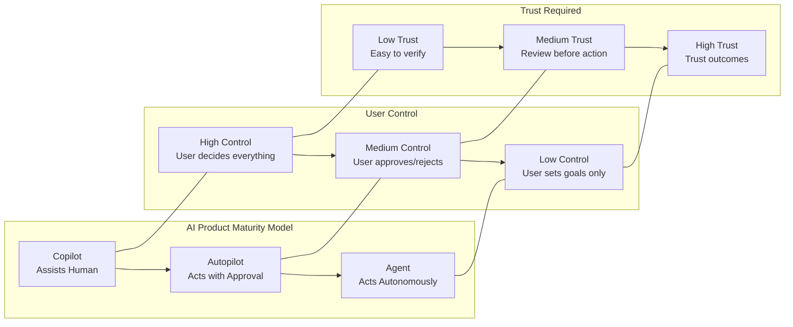

# AI Product Thinking for Staff Architects

## Introduction: Why AI Products Are Different

Traditional software is deterministic: given the same input, you always get the same output.
AI products break this fundamental assumption. This creates challenges across product design,
user trust, quality assurance, and expectation management.

As a Staff Architect, you bridge the gap between what AI can technically do and what product
managers promise to customers. This requires a unique blend of technical depth and product sense.

---

## How AI Products Differ from Traditional Software

| Dimension | Traditional Software | AI Software |
|-----------|---------------------|-------------|
| Output consistency | Deterministic | Non-deterministic |
| Correctness | Binary (right/wrong) | Spectrum (confidence) |
| Testing | Unit tests sufficient | Eval suites + human review |
| User expectations | "It should work" | "It should mostly work" |
| Failure mode | Crash/error | Subtle wrongness |
| Improvement | Bug fixes | Data + model iteration |
| Edge cases | Enumerable | Infinite |
| Documentation | Spec-driven | Example-driven |

### The Non-Determinism Problem

```
Traditional API:
  calculateTax(income=100000, state="CA") → always returns $9,300

AI API:
  summarize("Today the market rose 2%...") → different summary each time
  - Run 1: "Markets gained 2% today"
  - Run 2: "Stock markets saw a 2% increase"
  - Run 3: "The market experienced moderate gains of 2%"
```

**Why users hate non-determinism:**
1. They can't predict behavior → loss of control
2. They can't reproduce results → frustration when "it worked yesterday"
3. They can't trust the system → requires constant verification
4. They can't automate workflows → results vary between runs

### Managing Non-Determinism Architecturally

```python
# Strategy 1: Seed-based reproducibility (where supported)
response = llm.generate(prompt=user_input, seed=42, temperature=0)

# Strategy 2: Caching identical inputs
cache_key = hash(prompt + model_version + parameters)
if cache_key in cache:
    return cache[cache_key]

# Strategy 3: Consensus (expensive but reliable)
responses = [llm.generate(prompt) for _ in range(3)]
return majority_vote(responses)
```

---

## User Trust Building

### The Trust Equation for AI Products

```
Trust = (Credibility + Reliability + Transparency) / Self-Interest
```

**Credibility**: Does the AI seem competent?
- Show confidence scores when appropriate
- Cite sources for factual claims
- Acknowledge limitations proactively

**Reliability**: Does it work consistently?
- Consistent response quality (even if content varies)
- Predictable latency
- Graceful degradation when unsure

**Transparency**: Can users understand what's happening?
- Explain reasoning when asked
- Show what data influenced the answer
- Make the "thinking" visible (streaming, chain-of-thought)

### Trust-Building Patterns

```
Level 1: Show what you did
  "I searched 3 documents and found 2 relevant sections"

Level 2: Show confidence
  "I'm 92% confident this answer is correct"

Level 3: Show alternatives
  "Here's my best answer, but you might also consider..."

Level 4: Show limitations
  "I don't have information after October 2024"

Level 5: Show reasoning
  "I concluded X because A + B + C suggest..."
```

---

## The AI Product Spectrum



### Copilot Pattern (Assists)
- **Examples**: GitHub Copilot, Grammarly, Gmail Smart Compose
- **Architecture**: Suggestion engine → user accepts/rejects
- **Key metric**: Acceptance rate
- **Risk**: Low (human always in the loop)
- **UX pattern**: Inline suggestion, easy dismiss

### Autopilot Pattern (Acts with Approval)
- **Examples**: Notion AI (rewrites), Cursor (apply changes), email drafts
- **Architecture**: Generate → preview → user approves → execute
- **Key metric**: Approval rate, edit distance after approval
- **Risk**: Medium (user might miss problems in preview)
- **UX pattern**: Diff view, confirm dialog, undo

### Agent Pattern (Autonomous)
- **Examples**: Devin (coding agent), AutoGPT, customer service bots
- **Architecture**: Goal → plan → execute → report
- **Key metric**: Task completion rate, human escalation rate
- **Risk**: High (actions may be irreversible)
- **UX pattern**: Activity log, guardrails, escalation triggers

---

## Working with Product Managers

### The Translation Problem

What the AI team says vs what the PM hears:

| AI Team Says | PM Hears | Reality |
|-------------|----------|---------|
| "90% accuracy" | "Works 9/10 times" | "Fails unpredictably on 10% of inputs" |
| "We need more data" | "It'll be better later" | "Current quality is unacceptable" |
| "It hallucinates sometimes" | "Minor bug" | "It confidently makes things up" |
| "Latency is 3 seconds" | "A bit slow" | "Users will abandon after 2s" |
| "Works well on English" | "Ships globally" | "Terrible on other languages" |

### How Staff Architects Bridge the Gap

```
Step 1: Quantify capabilities honestly
  "On our eval set, the model achieves 87% accuracy on simple queries,
   72% on complex queries, and 45% on multi-step reasoning"

Step 2: Map to user impact
  "This means 1 in 8 simple questions will get a wrong answer.
   For complex questions, nearly 1 in 3 will be wrong."

Step 3: Define acceptable quality bar
  "For our use case (customer support), we need >90% on simple queries
   before shipping. Complex queries can use human escalation."

Step 4: Propose architectural solutions
  "We can hit 95% on simple queries by adding RAG with our knowledge base.
   Complex queries route to human agents with AI-suggested answers."
```

### Scoping AI Features: The Accuracy Conversation

When a PM says "Can AI do X?" the Staff Architect asks:

1. **What's the consequence of a wrong answer?** (Annoyance vs financial loss vs safety risk)
2. **How will users know it's wrong?** (Obvious vs subtle vs undetectable)
3. **What's the fallback?** (Human escalation vs retry vs manual process)
4. **What accuracy makes this valuable?** (60% suggestion vs 99% automation)
5. **How do we measure accuracy in production?** (User feedback vs automated eval)

---

## Managing Expectations

### The "Perfect AI" Myth

Users expect AI to be:
- Always correct (impossible with probabilistic systems)
- Consistent (contradicts creativity/variation)
- Fast (contradicts quality/reasoning depth)
- Cheap (contradicts model capability)
- Private (contradicts learning from data)

### The Expectation Framework

```
[Set Expectations] → [Deliver Consistently] → [Exceed Occasionally]
       ↓                      ↓                        ↓
  "AI-assisted"        Reliable quality          Surprising quality
  "May make errors"    Clear confidence          Proactive help
  "Beta feature"       Graceful failures         Learning from feedback
```

### Communication Patterns for PMs

**Instead of**: "Our AI can answer any question"
**Say**: "Our AI answers questions about our product with 90%+ accuracy. For out-of-scope questions, it clearly says it doesn't know."

**Instead of**: "AI-powered search"
**Say**: "AI-enhanced search that improves result relevance by 40% for complex queries. Simple keyword searches are unchanged."

**Instead of**: "Fully automated with AI"
**Say**: "AI handles 80% of cases automatically. The remaining 20% are routed to humans with AI-suggested responses."

---

## User Feedback as Training Signal

### Feedback Architecture

```
┌─────────────┐     ┌──────────────┐     ┌─────────────┐
│   User      │────▶│   Feedback   │────▶│   Training  │
│ Interaction │     │   Collector  │     │   Pipeline  │
└─────────────┘     └──────────────┘     └─────────────┘
       │                    │                     │
       ▼                    ▼                     ▼
  [AI Response]      [Thumbs Up/Down]      [Model Update]
  [Suggestion]       [Correction]          [Prompt Tune]
  [Action]           [Preference]          [Eval Update]
```

### Types of Feedback

| Type | Signal Strength | Collection Cost | Example |
|------|----------------|-----------------|---------|
| Implicit acceptance | Weak | Free | User uses suggestion |
| Implicit rejection | Weak | Free | User ignores/dismisses |
| Thumbs up/down | Medium | Low | Rating button |
| Correction | Strong | Medium | User edits AI output |
| Explicit preference | Strong | High | "This answer is better" |
| Bug report | Very strong | High | "This is wrong because..." |

### Architectural Considerations for Feedback

```python
# Feedback should be:
# 1. Non-blocking (don't slow the experience)
# 2. Contextual (attached to specific interaction)
# 3. Actionable (leads to measurable improvement)
# 4. Private (user consent for training use)

feedback_event = {
    "interaction_id": "uuid",
    "timestamp": "2024-01-15T10:30:00Z",
    "signal": "thumbs_down",
    "context": {
        "prompt": "...",
        "response": "...",
        "model_version": "v2.3",
        "user_segment": "enterprise"
    },
    "user_comment": "Answer was outdated",
    "consent_for_training": True
}
```

---

## Progressive Disclosure of AI Capabilities

### The Onboarding Ladder

```
Week 1: Basic AI features (autocomplete, suggestions)
Week 2: Intermediate features (summarization, rewriting)
Week 3: Advanced features (analysis, multi-step workflows)
Week 4: Power features (agents, automation, custom prompts)
```

### Implementation Pattern

```python
def get_available_ai_features(user):
    base_features = ["autocomplete", "spell_check"]
    
    if user.ai_interactions > 10:
        base_features += ["summarize", "rewrite"]
    
    if user.ai_interactions > 50 and user.feedback_ratio > 0.7:
        base_features += ["analyze", "generate"]
    
    if user.is_power_user and user.opted_into_beta:
        base_features += ["agent", "automation"]
    
    return base_features
```

---

## Anti-Patterns

### 1. Promising 100% Accuracy
**Problem**: Setting impossible expectations, then losing trust when AI fails
**Fix**: Frame as "AI-assisted" with clear accuracy expectations

### 2. No Fallback UX
**Problem**: When AI fails, user is stuck with no path forward
**Fix**: Always design the "AI unavailable" path first, then add AI on top

### 3. Ignoring Edge Cases
**Problem**: Demo works great, production fails on diverse inputs
**Fix**: Adversarial testing, input validation, graceful degradation

### 4. Building AI Without Feedback Loops
**Problem**: No way to improve quality after launch
**Fix**: Instrument every AI interaction for implicit/explicit feedback

### 5. One-Size-Fits-All AI
**Problem**: Same AI behavior for all users regardless of expertise
**Fix**: Progressive disclosure, user preferences, adaptive behavior

### 6. AI Feature Without Kill Switch
**Problem**: Can't disable when quality drops in production
**Fix**: Feature flags with automated quality-based kill triggers

---

## Staff Architect Decision Framework

### When to Use AI vs Traditional Logic

```
Use AI when:
  ✓ Problem is fuzzy/subjective (summarization, recommendation)
  ✓ Input space is infinite (natural language, images)
  ✓ "Good enough" is acceptable (suggestions, drafts)
  ✓ Human verification is easy (user can judge quality)

Use traditional logic when:
  ✗ Correctness is critical (financial calculations, access control)
  ✗ Auditability is required (regulatory compliance)
  ✗ Consistency is mandatory (same input must give same output)
  ✗ Latency budget is <100ms (real-time systems)
```

### The Staff Architect's AI Product Checklist

- [ ] Quality bar defined and measurable
- [ ] Fallback UX designed for AI failure
- [ ] Feedback mechanism integrated
- [ ] Feature flag for rollback
- [ ] SLA defined (latency, quality, cost)
- [ ] Edge cases documented and handled
- [ ] Progressive disclosure planned
- [ ] PM aligned on realistic capabilities
- [ ] User trust signals designed
- [ ] Monitoring and alerting configured

---

## Case Studies

### GitHub Copilot (Suggestion Model)
- **Pattern**: Copilot (inline suggestions)
- **Trust mechanism**: Ghost text that's easy to accept/reject
- **Non-determinism handling**: Users expect variation (it's creative)
- **Feedback**: Acceptance rate (implicit), thumbs up/down (explicit)
- **Key insight**: Low-cost suggestions can tolerate lower accuracy because rejection is cheap

### ChatGPT (Conversation)
- **Pattern**: Agent-like (conversational autonomy)
- **Trust mechanism**: Streaming (shows thinking), disclaimers, citations
- **Non-determinism handling**: Temperature control, system prompts
- **Feedback**: Thumbs up/down, regenerate, model comparison
- **Key insight**: Conversational context builds trust over time

### Cursor (IDE Integration)
- **Pattern**: Hybrid copilot + autopilot
- **Trust mechanism**: Diff view before applying changes
- **Non-determinism handling**: Cmd+Z (undo is always available)
- **Feedback**: Accept/reject diffs, inline edits after apply
- **Key insight**: Tight feedback loop (edit code → see result) enables faster trust building

### Notion AI
- **Pattern**: Autopilot (generate/rewrite with approval)
- **Trust mechanism**: Preview before insert, easy undo
- **Non-determinism handling**: "Try again" button (explicit regeneration)
- **Feedback**: Usage frequency, "not helpful" dismissal
- **Key insight**: AI works best when embedded in existing workflows, not as separate feature

---

## Key Takeaways for Staff Architects

1. **You are the translator** between AI capability and product promise
2. **Quantify everything** — vague claims ("it's pretty good") cause misalignment
3. **Design for failure first** — the fallback UX matters more than the happy path
4. **Trust is earned incrementally** — start with low-risk copilot, graduate to agent
5. **Feedback is your improvement engine** — instrument everything from day one
6. **Non-determinism is a feature** — frame it as creativity/variation, not inconsistency
7. **The PM relationship is critical** — weekly calibration on what AI can/can't do

---

## Further Reading

- "Designing Human-AI Experiences" — Google PAIR guidelines
- "Building AI Products" — Lenny's Newsletter / AI product frameworks
- "The AI Product Manager's Handbook" — practical PM-Engineer collaboration
- See: `02-ai-slas-and-contracts.md` for defining quality guarantees
- See: `04-ai-ux-architecture.md` for implementing trust patterns in UX
