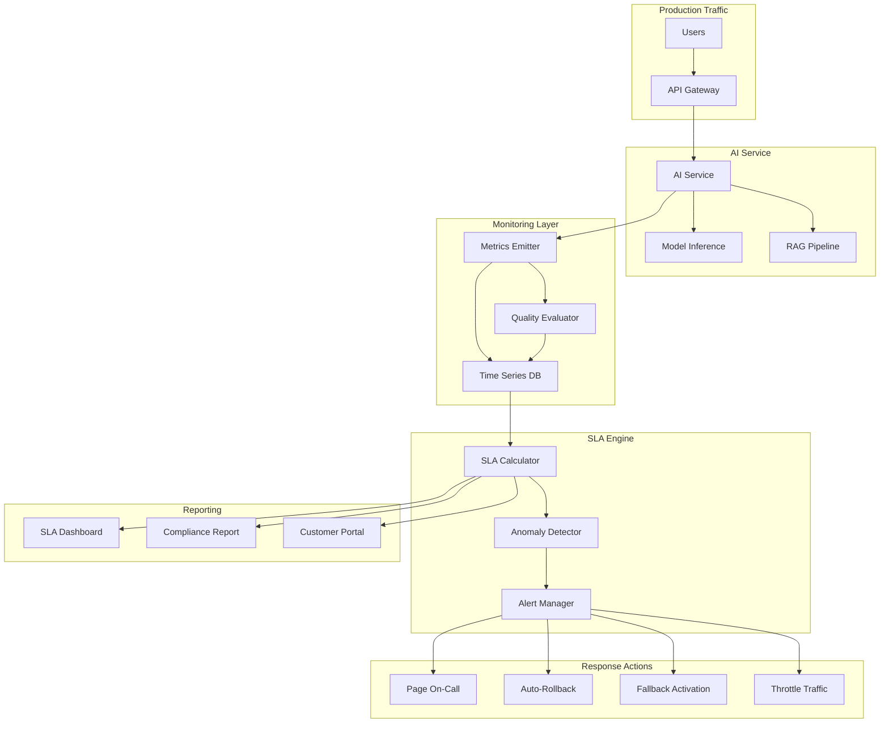

# AI SLAs and Contracts

## Introduction: Why Traditional SLAs Fail for AI

Traditional SLAs measure binary states: the service is up or down, the response is within
latency budget or not. AI systems introduce a new dimension: **quality** — and quality is
subjective, non-deterministic, and context-dependent.

A traditional API returning wrong data is a bug. An AI system returning a mediocre response
is... expected? Acceptable? A breach? This ambiguity is why Staff Architects must define
AI-specific SLAs with precision.

---

## AI-Specific SLA Dimensions

### The Five Pillars of AI SLAs

| Dimension | Traditional | AI-Specific | Why It's Different |
|-----------|------------|-------------|-------------------|
| Availability | 99.9% uptime | 99.9% uptime | Same concept |
| Latency | P99 < 200ms | P50 < 2s, P99 < 8s | Generative AI is inherently slow |
| Quality | N/A | Accuracy > 85% | New dimension entirely |
| Safety | N/A | Harmful content < 0.01% | AI can produce dangerous output |
| Cost | Fixed pricing | < $0.05/interaction | Variable cost per request |

### Dimension 1: Availability

```
Standard availability SLA:
  - 99.9% = 8.76 hours downtime/year
  - 99.95% = 4.38 hours downtime/year
  - 99.99% = 52.6 minutes downtime/year

AI-specific considerations:
  - Model inference failures (OOM, timeout) count as downtime
  - Fallback to smaller model ≠ downtime (degraded service)
  - Rate limiting ≠ downtime (capacity management)
  - Scheduled model updates should have maintenance windows
```

### Dimension 2: Latency

```
Generative AI latency budget:
  ┌─────────────────────────────────────────────┐
  │ Component          │ Budget    │ Notes       │
  ├────────────────────┼───────────┼─────────────┤
  │ Input processing   │ 100ms     │ Tokenize    │
  │ RAG retrieval      │ 300ms     │ Vector DB   │
  │ Model inference    │ 1-5s      │ Generation  │
  │ Output processing  │ 100ms     │ Filters     │
  │ Network overhead   │ 100ms     │ Round trip  │
  ├────────────────────┼───────────┼─────────────┤
  │ Total (P50)        │ < 2s      │ Target      │
  │ Total (P95)        │ < 5s      │ Acceptable  │
  │ Total (P99)        │ < 8s      │ Maximum     │
  └─────────────────────────────────────────────┘

Streaming changes the perception:
  - Time to first token (TTFT): < 500ms
  - Tokens per second: > 30 tok/s
  - Users perceive streaming as faster even if total time is same
```

### Dimension 3: Quality

```
Quality metrics for different AI use cases:

Summarization:
  - Factual consistency: > 90% (no hallucinated facts)
  - Completeness: > 80% (covers key points)
  - Conciseness: < 30% of original length

Question Answering:
  - Accuracy: > 85% (correct answers)
  - Hallucination rate: < 5% (made-up information)
  - Relevance: > 0.8 (cosine similarity to ground truth)
  - "I don't know" rate: 10-20% (appropriate uncertainty)

Code Generation:
  - Compilation rate: > 95% (syntactically valid)
  - Test pass rate: > 70% (functionally correct)
  - Security issues: < 1% (no vulnerabilities introduced)

Classification:
  - Precision: > 90%
  - Recall: > 85%
  - F1 score: > 87%
```

### Dimension 4: Safety

```
Safety SLA metrics:
  - Harmful content generation: < 0.01% of responses
  - PII leakage: 0% (hard requirement)
  - Bias incidents: < 0.1% (measured via fairness audits)
  - Prompt injection success: < 0.01%
  - Off-topic responses: < 5% (stays within domain)

Severity levels:
  P0 (Critical): PII leak, dangerous instructions, illegal content
  P1 (High): Biased output, misinformation on sensitive topics
  P2 (Medium): Mild hallucination, off-topic response
  P3 (Low): Stylistic issues, minor inaccuracies
```

### Dimension 5: Cost

```
Cost SLA structure:
  - Average cost per interaction: < $0.05
  - P99 cost per interaction: < $0.50
  - Monthly cost per active user: < $5.00
  - Cost per quality-adjusted interaction: < $0.10

Cost optimization levers:
  - Model routing (simple → small model, complex → large model)
  - Caching (identical prompts → cached response)
  - Prompt optimization (fewer tokens → lower cost)
  - Batching (group requests for efficiency)
```

---

## AI SLA Monitoring Architecture



---

## SLA Tiers

### Tiered Quality for Different Customers

```
┌─────────────────────────────────────────────────────────────┐
│ Tier        │ Availability │ Latency(P95) │ Quality │ Cost  │
├─────────────┼──────────────┼──────────────┼─────────┼───────┤
│ Free        │ 99%          │ 10s          │ 75%     │ $0    │
│ Pro         │ 99.9%        │ 5s           │ 85%     │ $$    │
│ Enterprise  │ 99.95%       │ 3s           │ 90%     │ $$$   │
│ Dedicated   │ 99.99%       │ 2s           │ 95%     │ $$$$  │
└─────────────────────────────────────────────────────────────┘

Implementation:
  - Free: Shared infrastructure, smaller models, best-effort quality
  - Pro: Priority queue, standard models, quality monitoring
  - Enterprise: Dedicated capacity, best models, SLA guarantees
  - Dedicated: Isolated infrastructure, fine-tuned models, custom SLAs
```

---

## Measuring AI Quality in Production

### Automated Evaluation

```python
# Real-time quality sampling
class QualityMonitor:
    def __init__(self, sample_rate=0.05):  # Sample 5% of traffic
        self.sample_rate = sample_rate
    
    def evaluate(self, request, response):
        if random.random() > self.sample_rate:
            return  # Skip non-sampled requests
        
        scores = {
            "relevance": self.score_relevance(request, response),
            "coherence": self.score_coherence(response),
            "safety": self.score_safety(response),
            "groundedness": self.score_groundedness(request, response),
        }
        
        self.emit_metrics(scores)
        
        if scores["safety"] < 0.95:
            self.trigger_alert("safety_violation", severity="P0")
```

### Human Evaluation Pipeline

```
Production traffic (100%)
    │
    ▼ (5% sampled)
Automated eval (fast, cheap, approximate)
    │
    ▼ (1% of sampled, or flagged by auto-eval)
Human eval queue (slow, expensive, accurate)
    │
    ▼
Ground truth labels → Update automated eval
```

### User Feedback as Quality Signal

```
Implicit signals:
  - Response regenerated → likely bad quality
  - Response copied/used → likely good quality
  - Session abandoned after response → possibly bad quality
  - Follow-up "that's wrong" → definitely bad quality

Explicit signals:
  - Thumbs up/down → direct quality signal
  - "Report issue" → strong negative signal
  - Edit/correction → shows exactly what was wrong
```

---

## SLA Breach Response

### Severity-Based Response Matrix

| Metric | Warning | Breach | Critical |
|--------|---------|--------|----------|
| Availability | < 99.95% | < 99.9% | < 99% |
| Latency P95 | > 5s | > 8s | > 15s |
| Quality | < 85% | < 80% | < 70% |
| Safety | > 0.005% | > 0.01% | > 0.1% |
| Cost | > $0.06 | > $0.08 | > $0.15 |

### Automated Response Actions

```
Warning → Alert team + increase monitoring frequency
Breach → Page on-call + activate fallback model + notify customers
Critical → Kill-switch + full rollback + incident declared + exec notification
```

### Breach Playbook

```
1. DETECT: Automated monitoring catches SLA violation
2. CLASSIFY: Determine severity (warning/breach/critical)
3. MITIGATE: Automated response (fallback, rollback, throttle)
4. INVESTIGATE: Root cause analysis
5. COMMUNICATE: Customer notification (if breach)
6. REMEDIATE: Fix root cause
7. PREVENT: Update monitoring/guardrails
8. REPORT: Post-incident review with SLA credit calculation
```

---

## Contractual SLAs for Enterprise Customers

### What to Promise

```
SAFE to promise:
  ✓ Availability (standard uptime SLA)
  ✓ Latency (measurable, controllable)
  ✓ Safety guardrails (content filtering exists)
  ✓ Data handling (privacy, retention, isolation)
  ✓ Incident response time (process commitment)

RISKY to promise:
  ⚠ Specific accuracy numbers (quality varies by use case)
  ⚠ Zero hallucinations (impossible to guarantee)
  ⚠ Specific cost per interaction (depends on usage patterns)

NEVER promise:
  ✗ "AI will always be correct"
  ✗ "No harmful content will ever be generated"
  ✗ "Responses will be consistent across calls"
```

### Contract Language Patterns

```
GOOD: "The AI service will maintain an availability of 99.9% measured
monthly, excluding scheduled maintenance windows communicated 48 hours
in advance."

GOOD: "Response quality is measured via automated evaluation scoring.
Provider targets a quality score above 85% as measured by the Provider's
evaluation framework. Quality metrics are reported monthly."

GOOD: "AI-generated content may contain inaccuracies. The service
includes confidence scoring and source attribution to assist customer
in verification. Provider does not guarantee factual accuracy of
generated content."

BAD: "AI responses will be accurate and reliable."
BAD: "The system will never produce harmful content."
```

---

## The "AI Disclaimer" Architecture

### When to Show Uncertainty

```python
def should_show_disclaimer(response, context):
    # Always show for high-stakes domains
    if context.domain in ["medical", "legal", "financial"]:
        return True, "AI-generated. Verify with a professional."
    
    # Show when confidence is low
    if response.confidence < 0.7:
        return True, "I'm not very confident about this answer."
    
    # Show when sources are weak
    if response.source_quality < 0.5:
        return True, "Based on limited information."
    
    # Show for novel/unusual queries
    if response.query_novelty > 0.8:
        return True, "This is an unusual question. Please verify."
    
    return False, None
```

---

## Monitoring and Alerting

### Real-Time Quality Dashboard

```
┌──────────────────────────────────────────────┐
│  AI SLA Dashboard - Last 24 Hours            │
├──────────────────────────────────────────────┤
│  Availability: 99.97% ✅ (SLA: 99.9%)       │
│  Latency P95:  4.2s   ✅ (SLA: 5s)          │
│  Quality:      87.3%  ✅ (SLA: 85%)         │
│  Safety:       0.003% ✅ (SLA: < 0.01%)     │
│  Avg Cost:     $0.042 ✅ (SLA: < $0.05)     │
├──────────────────────────────────────────────┤
│  Trend: Quality declining 0.5%/day ⚠️        │
│  Action: Investigate data drift              │
└──────────────────────────────────────────────┘
```

---

## Anti-Patterns

### 1. Only Measuring Uptime
**Problem**: Service is "up" but returning garbage
**Fix**: Quality metrics are as important as availability

### 2. Unmeasurable Promises
**Problem**: "High quality AI responses" — what does that mean?
**Fix**: Define specific, measurable quality metrics with thresholds

### 3. No Breach Playbook
**Problem**: SLA breached but nobody knows what to do
**Fix**: Documented response procedures, automated mitigations

### 4. Same SLA for All Use Cases
**Problem**: Summarization and code generation have same quality bar
**Fix**: Use-case-specific SLAs with appropriate metrics

### 5. No Cost Guardrails
**Problem**: Runaway costs from prompt injection or abuse
**Fix**: Per-user and per-request cost limits with automatic cutoff

---

## Staff Deliverable: AI SLA Template

```yaml
# AI Service Level Agreement Template
service_name: "AI Assistant API"
version: "1.0"
effective_date: "2024-01-01"

sla_dimensions:
  availability:
    target: 99.9%
    measurement: "Successful responses / Total requests"
    exclusions: ["scheduled maintenance", "force majeure"]
    
  latency:
    p50: "2000ms"
    p95: "5000ms"
    p99: "8000ms"
    measurement: "End-to-end from request receipt to response complete"
    note: "Streaming responses measured by time-to-first-token (500ms)"
    
  quality:
    overall_score: 85%
    measurement: "Automated eval on 5% sample + monthly human eval"
    sub_metrics:
      relevance: "> 0.8"
      factual_accuracy: "> 0.85"
      hallucination_rate: "< 0.05"
    reporting: "Monthly quality report to customer"
    
  safety:
    harmful_content_rate: "< 0.01%"
    pii_leakage: "0%"
    measurement: "Content safety classifier on all outputs"
    
  cost:
    average_per_interaction: "$0.05"
    monthly_cap: "As per contract"

breach_response:
  warning:
    threshold: "Within 5% of SLA limit"
    action: "Internal alert, increased monitoring"
  breach:
    threshold: "SLA limit exceeded"
    action: "Customer notification within 4 hours, mitigation within 24 hours"
  critical:
    threshold: "SLA exceeded by >20%"
    action: "Immediate escalation, service credit, RCA within 48 hours"

credits:
  availability_breach: "10% monthly fee per 0.1% below SLA"
  latency_breach: "5% monthly fee if P95 exceeded for >1 hour"
  quality_breach: "Reviewed case-by-case, credit at provider discretion"
  
disclaimers:
  - "AI-generated content may contain inaccuracies"
  - "Quality metrics are statistical measures across all interactions"
  - "Individual interaction quality may vary"
  - "Customer responsible for final verification of critical outputs"
```

---

## Key Takeaways

1. **AI SLAs need quality dimensions** — uptime alone is meaningless
2. **Quality is measurable** — with automated eval, sampling, and user feedback
3. **Tier your SLAs** — free users get best-effort, enterprise gets guarantees
4. **Automate breach response** — humans are too slow for production issues
5. **Be careful in contracts** — promise measurable things, disclaim the impossible
6. **Cost is a dimension** — runaway AI costs can kill margins silently
7. **Monitor trends** — a quality drop from 87% to 85% is a warning, not "still passing"

---

## Further Reading

- See: `01-ai-product-thinking.md` for framing quality expectations with PMs
- See: `03-feature-flags-for-ai.md` for rollback mechanisms when SLAs breach
- See: `programs/sla-monitor/main.py` for a working SLA monitoring simulation
