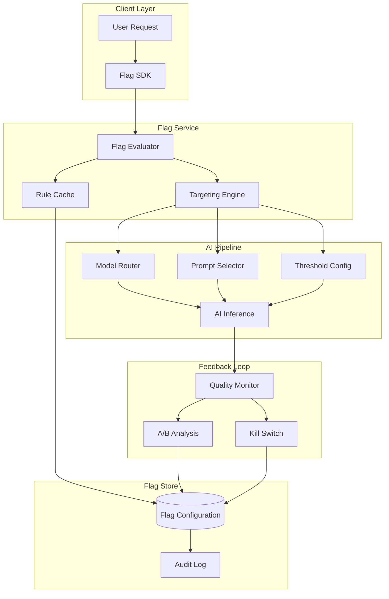

# Feature Flags for AI Systems

## Introduction: Why Feature Flags Are Critical for AI

In traditional software, a bug is deterministic — you can reproduce it, fix it, and verify the fix.
In AI systems, quality degradation can be subtle, gradual, and user-specific. Feature flags
provide the control plane you need to:

- **Gradually roll out** new models without all-or-nothing deployments
- **A/B test** different prompts, models, and parameters
- **Kill-switch** an AI feature instantly when quality drops
- **Segment users** for different AI experiences
- **Manage risk** of non-deterministic system changes

---

## Types of AI Feature Flags

### 1. Model Version Flags

```python
# Route users to different model versions
model_version = get_flag("ai.model.version", user_context)
# Returns: "gpt-4o", "gpt-4o-mini", "claude-3.5-sonnet"

# Use case: Gradually migrate from GPT-4o to GPT-4o-mini
# Start: 100% GPT-4o
# Week 1: 10% GPT-4o-mini (internal users)
# Week 2: 25% GPT-4o-mini (beta users)
# Week 3: 50% GPT-4o-mini (monitor quality)
# Week 4: 100% GPT-4o-mini (if quality holds)
```

### 2. Prompt Version Flags

```python
# A/B test different prompt templates
prompt_template = get_flag("ai.prompt.summarize.version", user_context)
# Returns: "v1_concise", "v2_detailed", "v3_structured"

# Each version is a different system prompt approach
PROMPTS = {
    "v1_concise": "Summarize in 2-3 sentences.",
    "v2_detailed": "Provide a detailed summary with key points.",
    "v3_structured": "Summarize with: TL;DR, Key Points, Action Items."
}
```

### 3. Feature Enablement Flags

```python
# Toggle AI sub-features
use_rag = get_flag("ai.features.rag_enabled", user_context)  # bool
use_tools = get_flag("ai.features.tool_calling", user_context)  # bool
use_memory = get_flag("ai.features.conversation_memory", user_context)  # bool

# Compose the AI pipeline dynamically
pipeline = build_pipeline(
    rag=use_rag,
    tools=use_tools,
    memory=use_memory
)
```

### 4. Quality Threshold Flags

```python
# Adjust confidence thresholds per segment
confidence_threshold = get_flag("ai.quality.confidence_threshold", user_context)
# Returns: 0.7 for free tier, 0.85 for enterprise

if response.confidence < confidence_threshold:
    return fallback_response()  # Or escalate to human
```

---

## Feature Flag Architecture for AI Systems



---

## Targeting Strategies

### By User Segment

```python
targeting_rules = {
    "ai.model.version": {
        "rules": [
            {"segment": "internal_employees", "value": "experimental-v3"},
            {"segment": "beta_users", "value": "stable-v2"},
            {"segment": "enterprise_tier", "value": "stable-v2"},
            {"segment": "free_tier", "value": "efficient-v1"},
        ],
        "default": "stable-v2"
    }
}
```

### By Geography

```python
# Different models for different regions (data residency, latency)
geo_rules = {
    "EU": {"model": "eu-hosted-model", "reason": "GDPR compliance"},
    "CN": {"model": "cn-hosted-model", "reason": "Data residency"},
    "US": {"model": "us-primary-model", "reason": "Lowest latency"},
}
```

### By Percentage Rollout

```python
# Deterministic percentage based on user ID hash
def get_rollout_bucket(user_id, flag_name):
    hash_value = hash(f"{user_id}:{flag_name}") % 100
    return hash_value  # 0-99

# Rollout: 25% gets new model
if get_rollout_bucket(user.id, "new_model") < 25:
    return "new_model_v2"
else:
    return "current_model_v1"
```

---

## Integration with A/B Testing

### Feature Flag as Experiment Assignment

```python
class AIExperiment:
    def __init__(self, name, variants, metrics):
        self.name = name
        self.variants = variants  # {"control": config_a, "treatment": config_b}
        self.metrics = metrics    # ["quality_score", "latency", "user_satisfaction"]
    
    def assign(self, user_context):
        # Flag service handles assignment
        variant = get_flag(f"experiment.{self.name}", user_context)
        
        # Log assignment for analysis
        log_experiment_assignment(
            experiment=self.name,
            user=user_context.user_id,
            variant=variant,
            timestamp=now()
        )
        
        return self.variants[variant]

# Usage
experiment = AIExperiment(
    name="prompt_v2_test",
    variants={
        "control": {"prompt": "v1", "model": "gpt-4o"},
        "treatment": {"prompt": "v2", "model": "gpt-4o"},
    },
    metrics=["quality_score", "acceptance_rate", "latency_p95"]
)
```

### Statistical Significance for AI Experiments

```
Challenge: AI outputs are non-deterministic, so you need MORE samples
than traditional A/B tests to reach significance.

Rule of thumb:
  - Traditional feature: ~1,000 samples per variant
  - AI feature: ~5,000 samples per variant (higher variance)
  
Key metrics to compare:
  1. Quality score distribution (not just mean)
  2. Tail behavior (P5 quality — worst 5% of responses)
  3. User engagement after AI interaction
  4. Regeneration rate (proxy for dissatisfaction)
```

---

## Safety Flags: Kill-Switch Patterns

### Automated Kill-Switch

```python
class AIKillSwitch:
    def __init__(self, feature_name, thresholds):
        self.feature_name = feature_name
        self.thresholds = thresholds
    
    def check(self, current_metrics):
        for metric, threshold in self.thresholds.items():
            if current_metrics[metric] > threshold:
                self.activate(reason=f"{metric} exceeded: {current_metrics[metric]}")
                return True
        return False
    
    def activate(self, reason):
        set_flag(self.feature_name, enabled=False)
        alert_oncall(f"Kill-switch activated for {self.feature_name}: {reason}")
        log_incident(feature=self.feature_name, reason=reason)

# Configuration
kill_switch = AIKillSwitch(
    feature_name="ai.chat.enabled",
    thresholds={
        "harmful_content_rate": 0.001,   # > 0.1% harmful
        "error_rate": 0.05,              # > 5% errors
        "latency_p99": 15000,            # > 15s P99
        "cost_per_request": 0.50,        # > $0.50 per request
    }
)
```

### Multi-Level Kill-Switch

```
Level 1 (Degrade): Disable advanced features, use simpler model
  Trigger: Quality drops 5% below baseline
  Action: set_flag("ai.model", "fallback-small")

Level 2 (Restrict): Limit AI to low-risk operations only
  Trigger: Safety metric breached
  Action: set_flag("ai.allowed_operations", ["summarize", "classify"])

Level 3 (Disable): Turn off AI completely, show static fallback
  Trigger: Critical safety incident
  Action: set_flag("ai.enabled", False)
```

---

## Configuration Management via Flags

### Prompt Parameters as Flags

```python
# Instead of hardcoding, make everything configurable
ai_config = {
    "temperature": get_flag("ai.params.temperature", ctx),      # 0.0 - 1.0
    "max_tokens": get_flag("ai.params.max_tokens", ctx),        # 256 - 4096
    "top_p": get_flag("ai.params.top_p", ctx),                  # 0.0 - 1.0
    "frequency_penalty": get_flag("ai.params.freq_penalty", ctx), # 0.0 - 2.0
    "system_prompt": get_flag("ai.params.system_prompt", ctx),   # string
}

# This enables:
# - Hot-fixing prompt issues without deployment
# - Per-segment tuning (enterprise gets temperature=0, creative gets 0.8)
# - Quick experimentation with parameters
```

---

## Operational Patterns

### Ring Deployment

```
Ring 0: Internal (employees, dogfooding)
  ├── Duration: 2 days minimum
  ├── Users: ~100
  ├── Success criteria: No P0 issues, quality >= baseline
  │
Ring 1: Beta (opted-in users)
  ├── Duration: 5 days minimum  
  ├── Users: ~5,000
  ├── Success criteria: Quality within 2% of baseline, no safety issues
  │
Ring 2: Canary (random 10%)
  ├── Duration: 3 days minimum
  ├── Users: ~50,000
  ├── Success criteria: All SLAs met, no anomalies
  │
Ring 3: General Availability (100%)
  ├── Monitor for 7 days
  └── Auto-rollback if SLA breach detected
```

### Flag Lifecycle

```
┌──────────┐    ┌──────────┐    ┌──────────┐    ┌──────────┐
│ Created  │───▶│  Active  │───▶│  Stable  │───▶│ Retired  │
└──────────┘    └──────────┘    └──────────┘    └──────────┘
                     │                                │
                     ▼                                ▼
                ┌──────────┐                    ┌──────────┐
                │ Disabled │                    │ Removed  │
                │(kill-sw) │                    │(cleanup) │
                └──────────┘                    └──────────┘

Lifecycle rules:
  - Flags must have an owner and expiration date
  - Flags older than 90 days without activity → review
  - Flags at 100% rollout for 30+ days → remove (make permanent)
  - Track "flag debt" like tech debt
```

---

## Tools and Platforms

| Tool | AI-Specific Strength | Limitation |
|------|---------------------|------------|
| LaunchDarkly | Strong targeting, AI config support | Expensive at scale |
| Unleash | Open-source, self-hosted | Less polished UI |
| Flagsmith | Good API, remote config | Smaller ecosystem |
| ConfigCat | Simple, fast evaluation | Less targeting power |
| Custom | Full control, AI-native | Maintenance burden |

### AI-Specific Considerations for Tool Selection

- **Evaluation speed**: Flag checks happen on every AI request (must be <5ms)
- **Configuration size**: Prompt templates can be large (need blob support)
- **Audit trail**: Regulatory requirement to know which model/prompt served when
- **Integration**: Must work with ML pipeline, not just web app
- **Real-time updates**: Model rollback must propagate in seconds, not minutes

---

## Anti-Patterns

### 1. Hardcoded Model Versions
**Problem**: Changing models requires deployment
**Fix**: Model version as a feature flag, hot-swappable

### 2. No Kill-Switch
**Problem**: Can't disable AI when quality drops in production
**Fix**: Every AI feature gets a kill-switch flag from day one

### 3. Flags Without Cleanup Plan
**Problem**: Hundreds of stale flags, nobody knows what's active
**Fix**: Expiration dates, ownership, quarterly flag review

### 4. Testing Only in Production
**Problem**: Flag combinations tested only when live
**Fix**: Staging environment with all flag combinations tested

### 5. Binary Flags for Gradual Changes
**Problem**: on/off when you need 10% → 25% → 50% → 100%
**Fix**: Percentage rollout flags with monitoring gates

---

## Staff Pattern: AI Feature Flag Governance Framework

```yaml
# Every AI feature flag must have:
flag_definition:
  name: "ai.feature.{feature_name}"
  owner: "team-name"
  created: "2024-01-15"
  expires: "2024-04-15"  # 90 days max without review
  
  purpose:
    type: "rollout | experiment | kill-switch | config"
    description: "What this flag controls and why"
    
  rollout_plan:
    ring_0: {date: "2024-01-15", criteria: "no P0"}
    ring_1: {date: "2024-01-17", criteria: "quality >= baseline"}
    ring_2: {date: "2024-01-22", criteria: "SLA met"}
    ring_3: {date: "2024-01-25", criteria: "all clear"}
    
  rollback_criteria:
    - "quality_score drops below 80%"
    - "error_rate exceeds 5%"
    - "safety incident detected"
    
  cleanup_plan:
    permanent_at: "2024-02-15"  # Remove flag, make permanent
    fallback_if_removed: "previous stable version"
```

---

## Key Takeaways

1. **Every AI feature needs a flag** — non-negotiable for production AI
2. **Flags enable safe experimentation** — A/B test models/prompts without risk
3. **Kill-switches are mandatory** — automated, fast, multi-level
4. **Ring deployment reduces risk** — internal → beta → canary → GA
5. **Flags have lifecycles** — create, use, stabilize, cleanup
6. **Configuration > deployment** — prompt/model changes via flags, not deploys
7. **Monitor flag impact** — every flag change should be correlated with metrics

---

## Further Reading

- See: `02-ai-slas-and-contracts.md` for what metrics trigger flag changes
- See: `04-ai-ux-architecture.md` for how flags affect user experience
- See: `programs/feature-flag-engine/main.py` for a working simulation
