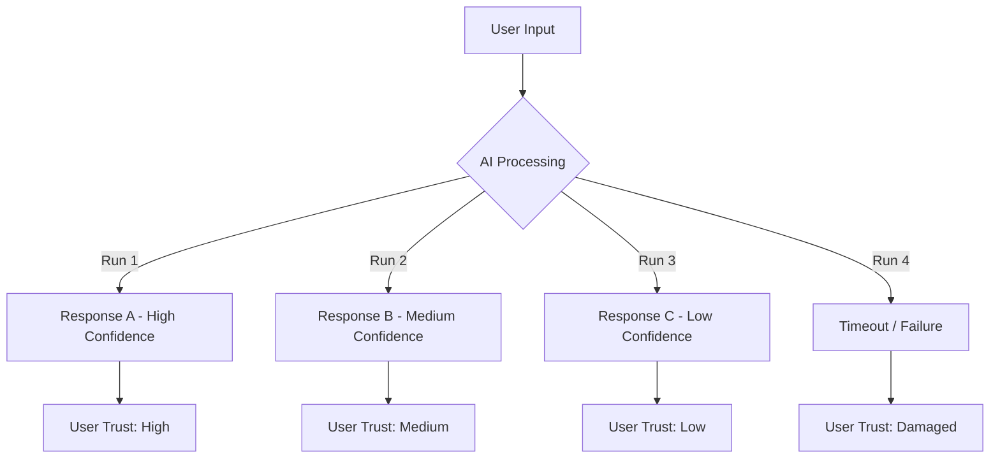
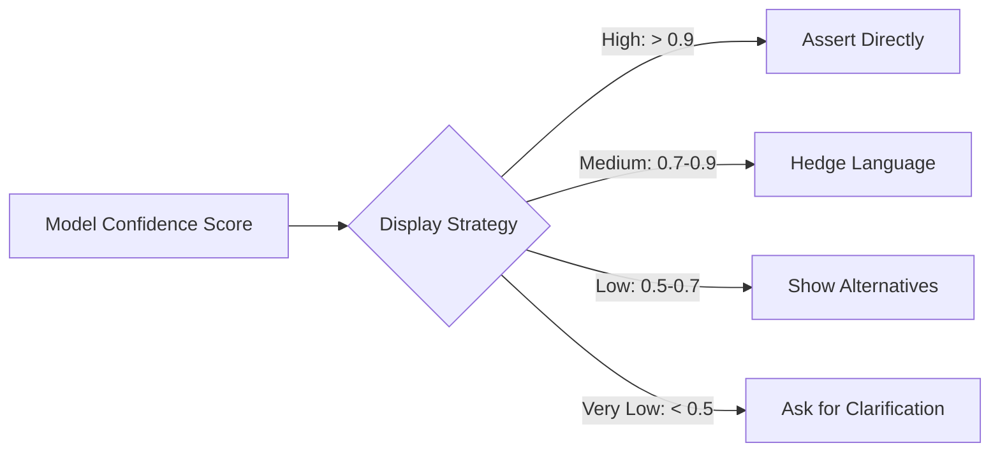
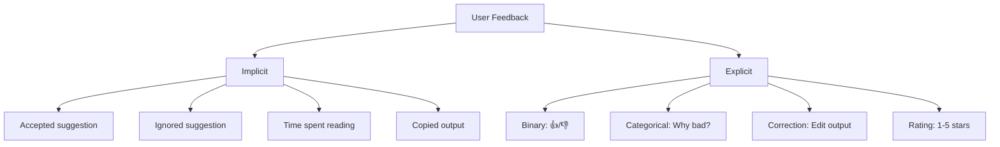
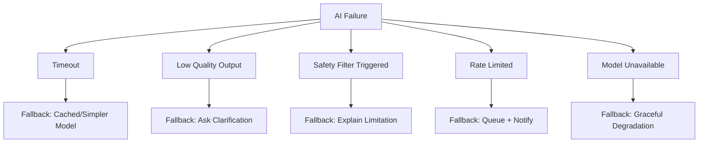
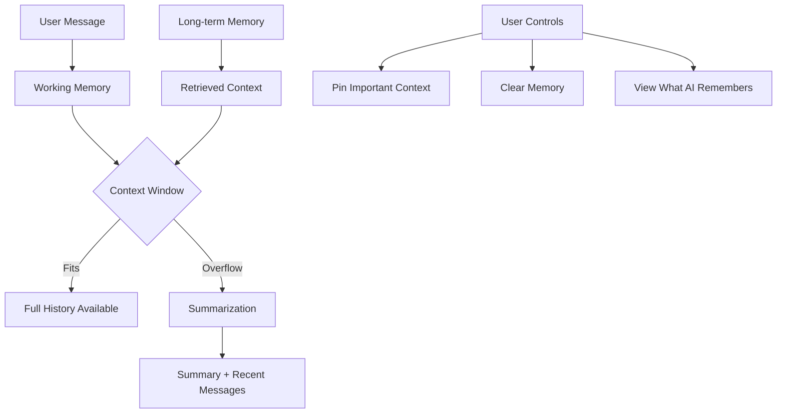
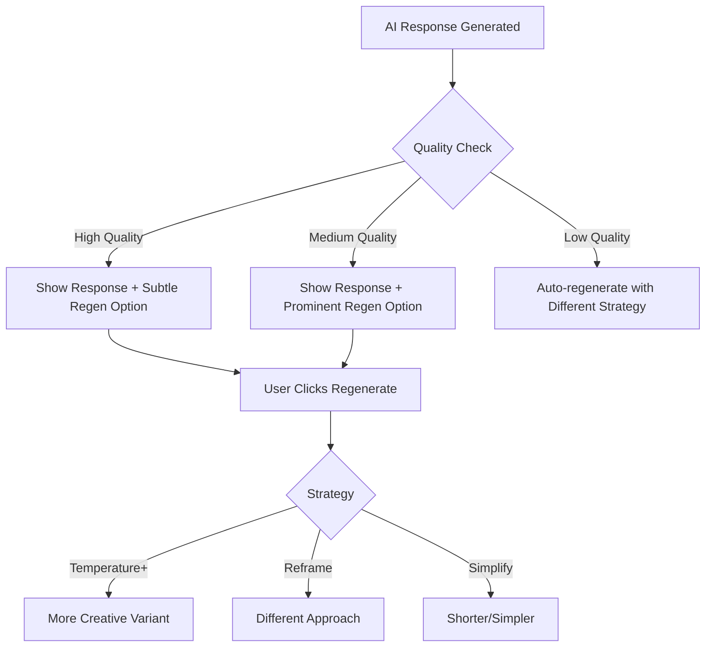
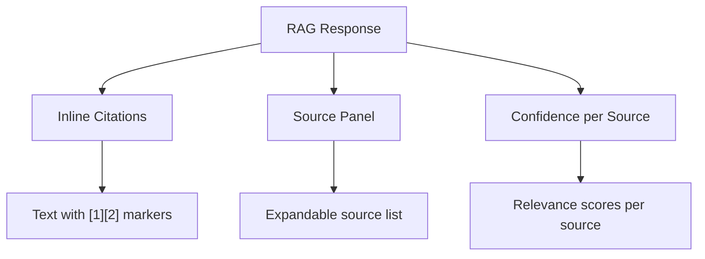
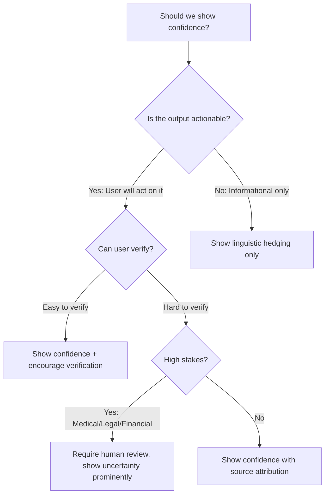

# AI UX Architecture: Designing for Non-Deterministic Systems

## Introduction

AI systems break fundamental UX assumptions. Traditional software is deterministic—the same
input always produces the same output. AI systems are probabilistic, variable-latency, and
can fail in novel ways. This demands new UX patterns that communicate uncertainty, manage
expectations, and maintain user trust even when the system behaves unpredictably.

## Core Challenge: Non-Determinism in UX



### Why Traditional UX Fails for AI

| Traditional Assumption | AI Reality | UX Impact |
|----------------------|-----------|-----------|
| Same input = same output | Same input = variable output | Users confused by inconsistency |
| Fast response (< 200ms) | Variable latency (1-30s) | Need progressive disclosure |
| Binary success/failure | Spectrum of quality | Need confidence communication |
| Errors are bugs | "Errors" are inherent | Need graceful degradation |
| UI state is predictable | Output shape varies | Need flexible layouts |

---

## 1. Loading States for AI

### The Spectrum of AI Latency

```mermaid
gantt
    title AI Response Latency Patterns
    dateFormat X
    axisFormat %s

    section Fast Path
    Cache Hit           : 0, 100
    
    section Medium Path
    Small Model         : 0, 2000
    
    section Slow Path
    Large Model         : 0, 8000
    
    section Very Slow
    Multi-step Agent    : 0, 30000
```



### Pattern: Streaming Responses

Stream tokens as they arrive rather than waiting for complete response.

```
┌─────────────────────────────────────────┐
│ User: Explain microservices             │
├─────────────────────────────────────────┤
│ AI: Microservices are an architectural  │
│ style that structures an application    │
│ as a collection of loosely coupled█     │
│                                         │
│ [Generating... 45 tokens/sec]           │
└─────────────────────────────────────────┘
```

**Implementation Guidelines:**
- Start rendering after first token (typically < 500ms)
- Show typing indicator during inter-token pauses > 200ms
- Buffer partial words to avoid rendering fragments
- Allow user to stop generation mid-stream

### Pattern: Progressive Disclosure

For multi-step AI workflows, reveal progress incrementally.

```
┌─────────────────────────────────────────┐
│ Analyzing your codebase...              │
│                                         │
│ ✓ Parsing 142 files                     │
│ ✓ Building dependency graph             │
│ ⟳ Identifying patterns (3/5 modules)   │
│ ○ Generating recommendations           │
│ ○ Formatting report                     │
│                                         │
│ [━━━━━━━━━━░░░░░] 60% · ~12s remaining │
└─────────────────────────────────────────┘
```

### Pattern: Skeleton + Enhancement

Show structure immediately, fill in AI content as it arrives.

```
Phase 1 (0ms):        Phase 2 (800ms):       Phase 3 (2000ms):
┌──────────────┐     ┌──────────────┐       ┌──────────────┐
│ Summary      │     │ Summary      │       │ Summary      │
│ ░░░░░░░░░░░░ │     │ Your code... │       │ Your code has│
│ ░░░░░░░░░░░░ │     │ ░░░░░░░░░░░░ │       │ 3 issues and │
├──────────────┤     ├──────────────┤       ├──────────────┤
│ Details      │     │ Details      │       │ Details      │
│ ░░░░░░░░░░░░ │     │ ░░░░░░░░░░░░ │       │ 1. Memory... │
│ ░░░░░░░░░░░░ │     │ ░░░░░░░░░░░░ │       │ 2. Thread... │
└──────────────┘     └──────────────┘       └──────────────┘
```

### Anti-Pattern: Spinner of Uncertainty

Never show a plain spinner with no context for AI operations. Users have no mental model
for how long AI takes. A spinner without progress indication creates anxiety after 3 seconds
and abandonment after 10 seconds.

---

## 2. Showing Confidence to Users

### Confidence Display Strategies



### Pattern: Linguistic Hedging

Map confidence scores to natural language:

| Confidence | Language Pattern | Example |
|-----------|----------------|---------|
| > 0.95 | Direct assertion | "The bug is in line 42." |
| 0.85-0.95 | High confidence | "This is most likely a null pointer issue." |
| 0.70-0.85 | Moderate hedge | "This could be related to the connection pool." |
| 0.50-0.70 | Low confidence | "I'm not certain, but this might be..." |
| < 0.50 | Explicit uncertainty | "I don't have enough context. Could you..." |

### Pattern: Visual Confidence Indicators

```
┌─────────────────────────────────────────┐
│ Classification Results                   │
├─────────────────────────────────────────┤
│ ████████████████████░░ 92% - Cat        │
│ ███░░░░░░░░░░░░░░░░░░  6% - Dog        │
│ █░░░░░░░░░░░░░░░░░░░░  2% - Other      │
└─────────────────────────────────────────┘
```

### Pattern: Confidence-Driven Layout

Adjust UI prominence based on confidence:
- **High confidence**: Full-width, primary styling, direct action buttons
- **Medium confidence**: Standard display with "verify" nudge
- **Low confidence**: Collapsed by default, warning styling, manual review required

### Anti-Pattern: False Precision

Never show raw floating-point confidence (e.g., "87.3421% confident"). This implies
a precision that doesn't exist. Round to meaningful buckets or use qualitative labels.

---

## 3. Feedback Mechanisms

### The Feedback Taxonomy



### Pattern: Lightweight Binary Feedback

Minimal friction, maximum signal:

```
┌─────────────────────────────────────────┐
│ AI: Here's the refactored function...   │
│                                         │
│ def process_data(items):                │
│     return [transform(i) for i in items]│
│                                         │
│                          [👍] [👎] [📋] │
└─────────────────────────────────────────┘
```

**Design Rules:**
- Place feedback controls at the end of AI output
- Don't interrupt the flow to ask for feedback
- Make feedback optional, never blocking
- Acknowledge feedback instantly ("Thanks!")

### Pattern: Structured Negative Feedback

When user gives thumbs-down, offer categorized reasons:

```
┌─────────────────────────────────────┐
│ What was wrong?                      │
│                                      │
│ ○ Incorrect / factually wrong        │
│ ○ Not relevant to my question        │
│ ○ Too verbose / too brief            │
│ ○ Harmful or inappropriate           │
│ ○ Other: [________________]          │
│                                      │
│ [Submit]  [Skip]                     │
└─────────────────────────────────────┘
```

### Pattern: Inline Corrections

Allow users to edit AI output directly, capturing the delta as training signal:

```
Before (AI output):     After (User correction):
"Deploy to staging"  →  "Deploy to production"
                         ↑ Captured as feedback
```

### Anti-Pattern: Feedback Fatigue

Don't ask for feedback on every interaction. Use sampling (e.g., ask every 5th response)
or only ask when the system detects potential quality issues.

---

## 4. Fallback UX When AI Fails

### Failure Mode Taxonomy



### Pattern: Graceful Degradation Ladder

```
Level 0: Primary model responds normally
         ↓ (timeout after 10s)
Level 1: Switch to faster/smaller model
         ↓ (also fails)
Level 2: Return cached similar response
         ↓ (no cache hit)
Level 3: Show template-based response
         ↓ (not applicable)
Level 4: Show helpful error with manual path
```

### Pattern: Transparent Failure Communication

```
┌─────────────────────────────────────────┐
│ ⚠ I wasn't able to fully answer this    │
│                                          │
│ What I could determine:                  │
│ • Your query is about database indexing  │
│ • You're using PostgreSQL 14             │
│                                          │
│ What went wrong:                         │
│ • The analysis timed out on your schema  │
│                                          │
│ You can:                                 │
│ [Try Again] [Simplify Query] [Get Help]  │
└─────────────────────────────────────────┘
```

### Anti-Pattern: Silent Failure

Never silently return a low-quality response when the AI fails. Users prefer knowing
something went wrong over receiving unreliable output they might act on.

### Anti-Pattern: Technical Error Messages

"Error: model inference timeout at layer 32, token 847" means nothing to users.
Translate all failures into actionable guidance.

---

## 5. Conversation Memory UX

### Memory Architecture from UX Perspective



### Pattern: Memory Transparency

Show users what the AI "remembers" from the conversation:

```
┌─────────────────────────────────────────┐
│ 🧠 Context (what I remember):           │
│                                          │
│ • You're building a Go microservice      │
│ • Using PostgreSQL with pgx driver       │
│ • Deploying to Kubernetes on AWS         │
│ • Previous issue: connection pooling     │
│                                          │
│ [Edit Context] [Clear All]              │
└─────────────────────────────────────────┘
```

### Pattern: Explicit Context Anchoring

Let users pin important context that persists across the conversation:

```
📌 Pinned Context:
- Project: E-commerce platform, Python/Django
- Constraint: Must support 10K concurrent users
- Style: Prefer composition over inheritance
```

### Pattern: Memory Boundary Indicators

When context is about to be lost, notify the user:

```
┌─────────────────────────────────────────┐
│ ℹ This conversation is getting long.     │
│ Earlier messages may be summarized.      │
│                                          │
│ Currently remembering:                   │
│ • Last 15 messages in full              │
│ • Summary of first 40 messages          │
│                                          │
│ [Start New Thread] [Continue]           │
└─────────────────────────────────────────┘
```

### Anti-Pattern: Pretending Infinite Memory

Never let the AI imply it remembers everything when context has been truncated.
Users lose trust when the AI "forgets" something it previously discussed.

---

## 6. Regeneration Patterns

### When to Offer Regeneration



### Pattern: Variant Regeneration

Offer multiple regeneration strategies:

```
┌─────────────────────────────────────────┐
│ [🔄 Regenerate ▾]                       │
│ ┌─────────────────────┐                 │
│ │ 🎲 Try different     │                 │
│ │ 📝 Make shorter      │                 │
│ │ 📚 More detailed     │                 │
│ │ 🔧 More technical    │                 │
│ │ 💬 More casual       │                 │
│ └─────────────────────┘                 │
└─────────────────────────────────────────┘
```

### Pattern: Version History

Keep previous generations accessible:

```
┌─────────────────────────────────────────┐
│ Response (Version 3 of 3)               │
│                                          │
│ [content here...]                        │
│                                          │
│ ◀ Version 2  │  Current  │  ▶ N/A       │
│ [Use This] [Regenerate Again]           │
└─────────────────────────────────────────┘
```

### Anti-Pattern: Regeneration Without Memory

When regenerating, the system should remember why the user rejected the previous
version. Producing the same or very similar output on regeneration destroys trust.

---

## 7. Citation and Attribution for RAG

### Citation Display Hierarchy



### Pattern: Inline Source References

```
┌─────────────────────────────────────────┐
│ The connection pool should be sized at   │
│ 10x your core count [1]. For PostgreSQL  │
│ specifically, the formula accounts for   │
│ disk I/O parallelism [2][3].            │
│                                          │
│ ─────────────────────────────────────── │
│ Sources:                                 │
│ [1] PostgreSQL Wiki - Connection Pool    │
│     docs.pg.org/wiki/pool · 94% match   │
│ [2] HikariCP Docs - Pool Sizing          │
│     github.com/hikari/... · 87% match   │
│ [3] AWS RDS Best Practices               │
│     docs.aws.amazon.com/... · 81% match │
└─────────────────────────────────────────┘
```

### Pattern: Source Confidence Visualization

```
Source Relevance:
[1] ████████████████████ 94% - Highly relevant
[2] █████████████████░░░ 87% - Relevant  
[3] ████████████████░░░░ 81% - Somewhat relevant
[4] █████████░░░░░░░░░░░ 52% - Tangential
```

### Pattern: Expandable Source Preview

Allow users to peek at source content without leaving the conversation:

```
┌─────────────────────────────────────────┐
│ [1] PostgreSQL Wiki - Connection Pool ▾  │
│ ┌─────────────────────────────────────┐ │
│ │ "...the optimal pool size is        │ │
│ │ determined by: connections =        │ │
│ │ ((core_count * 2) + disk_spindles)" │ │
│ │                                     │ │
│ │ [Open Full Document ↗]             │ │
│ └─────────────────────────────────────┘ │
└─────────────────────────────────────────┘
```

### Anti-Pattern: Uncited Confidence

Never present RAG-retrieved information without attribution. Users cannot verify
claims without knowing the source, and hallucinated citations are worse than none.

---

## 8. Accessibility Considerations for AI

### Core Accessibility Requirements

| AI Pattern | Accessibility Challenge | Solution |
|-----------|----------------------|----------|
| Streaming text | Screen readers re-read content | Use aria-live="polite" with debouncing |
| Confidence bars | Visual-only information | Add aria-label with percentage |
| Regeneration | Context loss for screen readers | Announce "New response generated" |
| Loading states | Animated spinners inaccessible | aria-busy + descriptive status text |
| Feedback buttons | Icon-only (👍/👎) | aria-label="Rate as helpful/unhelpful" |
| Citations | Superscript links hard to target | Minimum 44x44px tap target in source panel |

### Pattern: Screen Reader-Friendly Streaming

```html
<!-- Bad: Screen reader reads every token -->
<div aria-live="assertive">{{streaming_text}}</div>

<!-- Good: Batched updates, polite announcements -->
<div aria-live="polite" aria-atomic="false">
  <p aria-label="AI is generating a response. Will announce when complete.">
    {{buffered_paragraph}}
  </p>
</div>
<div role="status" class="sr-only">
  Response complete. 3 paragraphs generated.
</div>
```

### Pattern: Reduced Motion for AI Animations

For users with vestibular disorders, provide alternatives to:
- Typing animations → Instant display with "New" badge
- Streaming text → Complete paragraphs appearing at once
- Progress animations → Static progress percentage
- Skeleton shimmer → Static placeholder with "Loading" text

### Pattern: Keyboard Navigation for AI Interfaces

```
Tab order for AI chat:
1. Input field (primary)
2. Send button
3. Most recent AI response
4. Feedback buttons (👍 👎)
5. Regenerate button
6. Source citations (if present)
7. Previous messages (reverse chronological)
```

---

## 9. Staff Decision Framework: AI UX Choices

### Decision Matrix: When to Stream vs. Batch

| Factor | Stream | Batch |
|--------|--------|-------|
| Response > 3s | ✓ | |
| Response < 1s | | ✓ |
| User needs to read sequentially | ✓ | |
| User needs to compare options | | ✓ |
| Mobile/low-bandwidth | | ✓ |
| Creative/exploratory task | ✓ | |
| Precision/critical task | | ✓ |

### Decision Matrix: Confidence Display Strategy



### Decision Matrix: Memory Strategy

| Conversation Type | Memory Strategy | Rationale |
|------------------|----------------|-----------|
| Single-turn Q&A | No memory needed | Stateless is simpler |
| Multi-turn debugging | Session memory | Need full context |
| Ongoing project | Long-term + retrieval | Accumulates knowledge |
| Sensitive topics | Ephemeral only | Privacy requirement |

---

## 10. Comprehensive Anti-Patterns

### Anti-Pattern Collection

1. **The Overconfident AI**: Presenting all outputs with equal certainty regardless
   of actual model confidence. Erodes trust when users discover errors.

2. **The Needy AI**: Asking for feedback after every single interaction. Causes
   feedback fatigue and trained dismissal.

3. **The Amnesiac AI**: Forgetting context without warning. User repeats themselves,
   blames the product.

4. **The Black Box**: No explanation of why a response was generated or what sources
   informed it. Users can't calibrate trust.

5. **The Slow Spinner**: Generic loading indicator with no progress information
   for operations taking > 3 seconds.

6. **The Hallucination Presenter**: Showing AI-generated content with the same
   visual treatment as verified/factual content.

7. **The Inaccessible Innovator**: Building novel AI UX patterns that break
   screen readers, keyboard navigation, or color contrast requirements.

8. **The Context Hoarder**: Silently retaining all conversation history without
   user visibility or control, creating privacy and relevance issues.

---

## Summary: AI UX Design Principles

1. **Transparency over polish** — Show the system's uncertainty honestly
2. **Progressive disclosure** — Reveal information as it becomes available
3. **User control** — Always offer regeneration, editing, and feedback paths
4. **Graceful degradation** — Every failure mode has a designed fallback
5. **Memory respect** — Be transparent about what is and isn't remembered
6. **Attribution always** — Never present retrieved information without sources
7. **Accessibility first** — AI novelty doesn't excuse accessibility failures
8. **Feedback without friction** — Capture signal without interrupting flow

These principles ensure AI products maintain user trust even when the underlying
systems behave non-deterministically.
