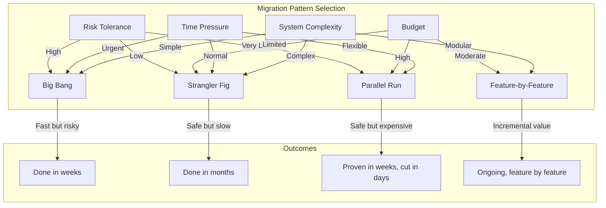

# Migration Strategy Patterns: Legacy ML to Modern AI

## Why Migration Matters

Every organization with ML systems faces the same reckoning: your carefully built
rule-based systems and custom ML pipelines are being outperformed by foundation models
that took someone else an afternoon to integrate. The question isn't whether to migrate,
but how to do it without destroying the value you've already built.

Migration is not replacement. It's evolution. The goal is to capture new capabilities
while preserving institutional knowledge embedded in your existing systems.

## The Three Generations of Automation

```
Generation 1: Rules & Heuristics (2000-2015)
├── if/else logic, regex, keyword matching
├── Perfectly predictable, zero learning
├── Breaks on anything unexpected
└── Still powers 60% of production systems

Generation 2: Classical ML (2015-2022)
├── Trained models: classification, NER, regression
├── Requires labeled data, feature engineering
├── Good at narrow tasks, terrible at generalization
└── Expensive to maintain, drift-prone

Generation 3: Foundation Models / LLMs (2022+)
├── Pre-trained on broad knowledge
├── Few-shot, zero-shot capabilities
├── Non-deterministic, expensive at scale
└── Requires new evaluation, monitoring, guardrails
```

## Common Migration Scenarios

### Scenario 1: Rule-Based → ML → LLM

The most common path. Your intent classifier started as regex, became a BERT model,
and now you're wondering if GPT-4 can replace both.

**Legacy system characteristics:**
- Hundreds of regex patterns maintained by hand
- Custom trained classifiers with proprietary label taxonomies
- Business logic tightly coupled to model outputs

**Migration challenges:**
- Rules encode business decisions that nobody documented
- ML model training data represents years of labeling effort
- Edge cases in rules represent real incidents that caused the rules

### Scenario 2: Custom NLP → Foundation Models

You built custom NER, sentiment analysis, summarization pipelines. Foundation models
do all of these out of the box, often better.

**What you're replacing:**
- SpaCy/NLTK pipelines with custom entity types
- Fine-tuned BERT models for domain-specific tasks
- Preprocessing pipelines (tokenization, stemming, normalization)

**What you gain:**
- Zero-shot capability for new entity types
- Multi-language support without retraining
- Better handling of context and nuance

**What you lose:**
- Deterministic outputs for the same input
- Guaranteed latency (< 50ms vs 500ms+)
- Full control over model behavior

### Scenario 3: Single Model → Multi-Model Gateway

You have one model doing everything. You want a gateway that routes to specialized
models based on the task.

```
Before: All queries → Single BERT model → Single response format

After:  All queries → Router → GPT-4 (complex reasoning)
                            → Claude (long documents)
                            → Mistral (simple/fast queries)
                            → Legacy model (specific tasks)
```

### Scenario 4: On-Premise ML → Cloud AI Services

Your models run on-premise. You want to leverage cloud AI services for capability,
scale, and maintenance reduction.

**Challenges:**
- Data residency and compliance
- Network latency for real-time inference
- Vendor lock-in concerns
- Cost unpredictability (per-token pricing vs fixed infrastructure)

### Scenario 5: Monolithic ML Pipeline → Modular AI Platform

Your ML pipeline is a single DAG that does everything from data ingestion to serving.
You want modular, independently deployable AI components.

**Monolith characteristics:**
- Single repository with all models
- Shared feature store tightly coupled to all models
- One deployment = all models redeploy
- Single point of failure

**Target architecture:**
- Independent model services with clear APIs
- Shared infrastructure (vector stores, caches) as platform
- Independent deployment and versioning per model
- Circuit breakers and fallbacks

## Migration Patterns

### Pattern 1: Big Bang Migration

Replace everything at once on a specific date.

```
Day N-1:  [====== Legacy System ======] → All traffic
Day N:    [====== New AI System ======] → All traffic
```

**When to use:**
- System is simple with few integrations
- Legacy system is completely non-functional
- Regulatory deadline forces immediate switch
- Team has extremely high confidence in new system

**Pros:**
- Fast: one cut, done
- No maintenance of two systems simultaneously
- Clean break, no compatibility concerns

**Cons:**
- Highest risk: if new system fails, everything fails
- No gradual learning from production traffic
- No quality comparison possible
- Rollback is complex (data may have diverged)

**Risk level: EXTREME**

### Pattern 2: Strangler Fig (Recommended)

Gradually route traffic from legacy to new system, feature by feature.

```
Phase 1: [===Legacy===] ←95%── Proxy ──5%→  [New]
Phase 2: [===Legacy===] ←70%── Proxy ──30%→ [==New==]
Phase 3: [=Legacy=]     ←30%── Proxy ──70%→ [====New====]
Phase 4:                 ←0%── Proxy ──100%→ [======New======]
```

**When to use:**
- Complex system with many features/consumers
- Need to validate quality incrementally
- Can't afford downtime or quality regression
- Team needs time to learn new system in production

**Pros:**
- Lowest risk: problems affect small % of traffic
- Learn from production incrementally
- Rollback is trivial (route back to legacy)
- Quality comparison is built-in

**Cons:**
- Slow: full migration takes months
- Must maintain two systems simultaneously
- Proxy adds complexity and latency
- "Last 10%" problem: legacy handles edge cases

**Risk level: LOW**

### Pattern 3: Parallel Run

Both systems process every request. Compare results. Serve from legacy until
new system proves itself.

```
Every request → [Legacy System] → Serve to user
            └→ [New AI System] → Log & compare (don't serve)
```

**When to use:**
- Quality is critical (healthcare, finance, legal)
- Need statistical evidence that new system is better
- Have budget for running both systems at full capacity
- Regulatory requirement for validation before switch

**Pros:**
- Definitive quality comparison on real traffic
- Zero risk to users during comparison phase
- Rich dataset for understanding differences
- Evidence-based decision to cut over

**Cons:**
- 2x infrastructure cost during comparison
- Comparison logic itself is complex for AI (fuzzy matching)
- Can run indefinitely without decision if criteria aren't clear
- Doesn't test new system under real load patterns

**Risk level: VERY LOW (but expensive)**

### Pattern 4: Feature-by-Feature Replacement

Identify independent features. Replace them one at a time with new system.

```
Feature A: [Legacy] → [New] ✓ (migrated month 1)
Feature B: [Legacy] → [New] ✓ (migrated month 2)
Feature C: [Legacy]          (still on legacy)
Feature D: [Legacy] → [New] ✓ (migrated month 3)
```

**When to use:**
- System has clearly separable features
- Some features benefit more from new AI than others
- Want quick wins to build confidence and momentum
- Different features have different risk profiles

**Pros:**
- Natural prioritization by value/risk
- Each feature is a contained migration
- Quick wins build organizational confidence
- Can stop migration if value isn't there

**Cons:**
- Features may not be as independent as they seem
- Shared state between features complicates isolation
- Different migration patterns per feature = complexity
- May end up with permanent hybrid system

**Risk level: LOW-MEDIUM**

## Pattern Comparison



## Risk Assessment Framework

### What Can Go Wrong

| Risk Category | Example | Impact | Mitigation |
|---|---|---|---|
| Quality Regression | LLM gives worse answers than rules for edge cases | Users lose trust | Parallel run, quality gates |
| Latency Increase | 50ms → 2000ms response time | UX degradation | Caching, async patterns |
| Cost Explosion | Per-token costs 10x infrastructure costs | Budget overrun | Cost monitoring, caps |
| Data Loss | Legacy training data not migrated | Can't reproduce old behavior | Data migration first |
| Integration Break | Downstream systems expect old output format | System outage | Compatibility layer |
| Compliance Violation | New system doesn't meet audit requirements | Legal/regulatory risk | Compliance review upfront |
| Knowledge Loss | Nobody remembers why legacy rules exist | Repeat old mistakes | Document before migrating |

### Risk Matrix Template

```
Likelihood →     Low        Medium      High
Impact ↓
High        | Monitor   | Mitigate  | Block    |
Medium      | Accept    | Monitor   | Mitigate |
Low         | Accept    | Accept    | Monitor  |
```

**Migration blockers (must resolve before proceeding):**
- No rollback mechanism
- No quality baseline established
- No monitoring for new system
- Compliance not validated
- No consumer communication plan

## Planning: Dependency Mapping

Before migration, map every dependency:

```
Legacy System Dependencies:
├── Upstream (who sends us data)
│   ├── Customer service platform (real-time)
│   ├── Batch ETL pipeline (nightly)
│   └── Mobile app (REST API)
├── Downstream (who consumes our output)
│   ├── Dashboard service (expects JSON schema v2)
│   ├── Alerting system (expects confidence scores)
│   └── Data warehouse (expects structured records)
├── Shared State
│   ├── Feature store (read/write)
│   ├── User preference DB (read)
│   └── Model registry (read)
└── Operational
    ├── Monitoring (Datadog dashboards)
    ├── Alerting (PagerDuty rules)
    └── Logging (structured log format)
```

Every dependency is a potential breaking point during migration.

## Team Considerations

### Skills Gap Analysis

```
Legacy System Skills          New System Skills
├── Python/scikit-learn       ├── Prompt engineering
├── Feature engineering       ├── RAG architecture
├── Model training/tuning     ├── Vector databases
├── Batch processing          ├── Streaming/async
├── SQL/data pipelines        ├── API integration
└── A/B testing (models)      └── LLM evaluation
```

**Reality:** Very few engineers are expert in both. Plan for:
- Training time (2-4 weeks minimum)
- Pair programming during transition
- External expertise for architecture decisions
- Keeping legacy experts engaged (don't let them leave before migration completes)

### The Bus Factor Problem

If one person understands both the legacy system AND the new system, they are
a single point of failure for the migration. Ensure at least 2 people deeply
understand each system.

## Timeline Estimation

**Why AI migrations take 2x longer than expected:**

1. **Quality evaluation is harder** — You can't just run unit tests. You need human evaluation, statistical significance, edge case discovery.

2. **The long tail** — First 80% migrates in 20% of the time. Last 20% takes 80% of the time because edge cases live there.

3. **Non-determinism surprises** — Legacy system always returns the same thing. New system sometimes returns something unexpected. Each surprise needs investigation.

4. **Consumer adaptation** — Downstream systems need changes to handle new output formats, latencies, or behaviors.

5. **Organizational inertia** — Stakeholders want guarantees that AI can't provide. Approval processes weren't designed for probabilistic systems.

**Rule of thumb:** Take your estimate. Double it. Add 30% for unknowns. That's your realistic timeline.

```
Optimistic estimate:  3 months
Realistic estimate:   6 months
Actual (typical):     8-12 months for complex systems
```

## Anti-Patterns

### 1. No Parallel Run
Switching without ever comparing outputs. You have no evidence the new system
is actually better.

### 2. Killing Legacy Before New is Proven
Decommissioning the old system before the new one handles 100% of cases.
When edge cases appear, you have nothing to fall back to.

### 3. No Rollback Plan
"We'll figure it out if something goes wrong." You won't. Under pressure,
you'll make worse decisions.

### 4. Migrating Without Baselines
If you don't measure legacy system quality before migration, you can't prove
the new system is better (or catch regressions).

### 5. Ignoring the Long Tail
Celebrating when 90% of traffic is migrated. That remaining 10% represents
the hardest cases and will take disproportionate effort.

### 6. Technology-Driven Migration
Migrating because "LLMs are cool" rather than because there's a measurable
business benefit. Some systems don't need migration.

## Staff Deliverable: Migration Plan Template

```markdown
# AI System Migration Plan

## Executive Summary
- Current system: [description, age, maintenance cost]
- Target system: [description, expected benefits]
- Migration pattern: [strangler fig / parallel run / etc.]
- Timeline: [start → complete, with milestones]
- Budget: [infrastructure, team, tools]
- Risk level: [with justification]

## Current State Assessment
- System architecture diagram
- Quality baselines (accuracy, latency, cost)
- Consumer inventory (who depends on this)
- Dependency map (what this depends on)
- Technical debt inventory
- Knowledge documentation gaps

## Target State Architecture
- Architecture diagram
- Expected quality improvements
- New capabilities enabled
- Cost model (per-request, infrastructure)
- Monitoring and observability plan

## Migration Approach
- Pattern selected and justification
- Phase breakdown with success criteria per phase
- Traffic routing strategy
- Quality comparison methodology
- Rollback triggers and procedure

## Risk Register
| Risk | Likelihood | Impact | Mitigation | Owner |
|------|-----------|--------|------------|-------|
| ...  | ...       | ...    | ...        | ...   |

## Timeline
- Phase 0: Preparation (baselines, monitoring, proxy) [X weeks]
- Phase 1: Shadow mode (new system, no serving) [X weeks]
- Phase 2: Canary (5% traffic to new) [X weeks]
- Phase 3: Gradual rollout (5% → 50%) [X weeks]
- Phase 4: Majority (50% → 95%) [X weeks]
- Phase 5: Completion (95% → 100%) [X weeks]
- Phase 6: Legacy decommission [X weeks]

## Success Criteria
- Quality: [metric] >= [threshold]
- Latency: p99 <= [target]
- Cost: per-request <= [budget]
- Reliability: uptime >= [target]
- Consumer impact: zero breaking changes

## Team & Skills
- Migration lead: [name]
- Legacy expert: [name]
- New system expert: [name]
- Training plan for skills gaps

## Communication Plan
- Stakeholder updates: [frequency]
- Consumer notifications: [timeline]
- Escalation path: [who to call]
- Go/no-go decision makers: [names]
```

---

## Key Takeaways

1. **Strangler fig is almost always the right pattern** for AI system migration
2. **Establish baselines before migrating** — you can't prove improvement without measurement
3. **Plan for 2x your estimate** — AI migrations are harder than they look
4. **The last 10% takes 50% of the effort** — budget accordingly
5. **Rollback must be trivial** — if rollback is hard, your architecture is wrong
6. **Keep legacy running until new is proven** — don't burn bridges
7. **Migration is a team sport** — requires skills from both old and new worlds
