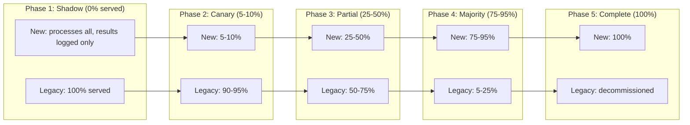

# Strangler Fig Pattern for AI Systems

## The Pattern

The strangler fig is a tropical tree that grows around a host tree, gradually replacing
it until the host dies and the fig stands alone. In software, we wrap the legacy system
with a proxy that gradually routes more traffic to the new system until the legacy
system can be decommissioned.

For AI systems, this pattern is particularly powerful because:
- AI quality can only be validated at scale with real traffic
- Non-deterministic systems need statistical validation, not unit tests
- Rollback must be instant (route back to legacy)
- Consumer trust is built incrementally

## Architecture

```
┌─────────────────────────────────────────────────┐
│                Migration Proxy                    │
│                                                   │
│  ┌───────────┐    ┌──────────┐    ┌───────────┐ │
│  │  Router   │───→│ Compare  │───→│  Decide   │ │
│  │ (traffic  │    │ Engine   │    │ (serve    │ │
│  │  split)   │    │          │    │  which?)  │ │
│  └─────┬─────┘    └──────────┘    └───────────┘ │
│        │                                          │
└────────┼──────────────────────────────────────────┘
         │
    ┌────┴────┐
    │         │
    ▼         ▼
┌────────┐  ┌────────┐
│ Legacy │  │  New   │
│ System │  │ System │
│(rules/ │  │(LLM/  │
│  ML)   │  │ RAG)  │
└────────┘  └────────┘
```

## Migration Progression



### Phase Transitions: Quality Gates

Each phase transition requires passing quality gates:

```
Phase 1 → 2 (Shadow → Canary):
  ✓ New system agreement with legacy >= 85%
  ✓ New system latency p99 <= 2x legacy
  ✓ No critical failures in 7 days of shadow mode
  ✓ Human evaluation: new system quality >= legacy on sample

Phase 2 → 3 (Canary → Partial):
  ✓ No quality regression detected in canary traffic
  ✓ User satisfaction metrics stable or improved
  ✓ Error rate <= legacy error rate
  ✓ Cost per request within budget

Phase 3 → 4 (Partial → Majority):
  ✓ Statistical significance: new system >= legacy on key metrics
  ✓ All consumer integrations validated
  ✓ Edge case handling validated
  ✓ Operational runbooks updated

Phase 4 → 5 (Majority → Complete):
  ✓ Zero known cases where legacy is definitively better
  ✓ Long tail edge cases documented and handled
  ✓ Legacy decommission plan approved
  ✓ Cost savings validated
```

## Decision Criteria: What to Migrate First

### Priority Matrix

```
                    Easy to Migrate
                    ↑
        Quick Wins  │  Strategic Wins
        (do first)  │  (do second)
                    │
Low Value ──────────┼──────────── High Value
                    │
        Don't       │  Hard but
        Bother      │  Necessary
        (do last)   │  (do third)
                    │
                    ↓
                    Hard to Migrate
```

### Criteria for "Easy to Migrate"
- Clear input/output contract
- Low integration complexity
- Good test coverage or easy to evaluate
- Low risk if quality dips temporarily
- High volume (more data for comparison)

### Criteria for "High Value"
- Current system quality is poor
- High maintenance cost on legacy
- New capabilities would unlock business value
- Users are requesting improvements
- Cost savings are significant

### Recommended Migration Order

1. **High-volume, low-risk queries** — Gives you the most data for comparison with least downside
2. **Features where legacy is weakest** — Easiest to show improvement
3. **Features with clear evaluation criteria** — Easiest to validate
4. **Complex, high-risk features** — Last, with maximum confidence from earlier phases

## Shadow Mode

Shadow mode is the critical first phase where the new system processes everything
but serves nothing. All responses come from legacy.

```
User Request
    │
    ├──→ Legacy System ──→ Response to User
    │
    └──→ New System ──→ Log result
                    ──→ Compare with legacy result
                    ──→ Record metrics
                    ──→ Flag disagreements for review
```

### What to Measure in Shadow Mode

| Metric | Purpose |
|--------|---------|
| Agreement rate | How often do legacy and new give same/similar answers? |
| Quality delta | When they disagree, which is better? (human eval) |
| Latency comparison | Is new system fast enough? |
| Cost per request | Is new system within budget? |
| Error rate | Does new system fail more often? |
| Coverage | Does new system handle all input types? |

### Shadow Mode Duration

Minimum: 2 weeks of production traffic
Recommended: 4-6 weeks
Required sample size: statistically significant for your traffic patterns

## Comparison Engine

The hardest part of strangler fig for AI: comparing outputs that aren't identical
but may both be correct.

### Comparison Strategies

**1. Exact Match (rare for AI)**
```python
# Only works for classification/structured output
legacy_result = "category_a"
new_result = "category_a"
match = legacy_result == new_result
```

**2. Semantic Similarity**
```python
# For text generation, compare meaning not exact words
from sentence_transformers import SentenceTransformer
similarity = cosine_similarity(embed(legacy), embed(new))
agreement = similarity > 0.85
```

**3. Functional Equivalence**
```python
# Both answers solve the user's problem, even if different
# Requires human evaluation or LLM-as-judge
judge_prompt = f"""
Given the user question: {question}
Legacy answer: {legacy_answer}
New answer: {new_answer}
Which better addresses the user's need? Or are they equivalent?
"""
```

**4. Structured Comparison**
```python
# Extract structured fields and compare individually
legacy_intent = extract_intent(legacy_response)
new_intent = extract_intent(new_response)
legacy_entities = extract_entities(legacy_response)
new_entities = extract_entities(new_response)
# Compare field by field
```

### Disagreement Triage

When legacy and new disagree:
1. **Auto-classify severity** — Minor difference vs fundamental disagreement
2. **Sample for human review** — Don't review all, review representative sample
3. **Track patterns** — Are disagreements random or systematic?
4. **Build regression tests** — Every reviewed disagreement becomes a test case

## Gradual Cutover Strategies

### By Feature/Intent
```
Week 1: FAQ queries → new system
Week 3: Simple lookups → new system
Week 5: Complex reasoning → new system
Week 8: Edge cases → new system
```

### By User Segment
```
Week 1: Internal users → new system
Week 3: Beta users (opt-in) → new system
Week 5: 10% of general users → new system
Week 8: All users → new system
```

### By Confidence Level
```
If new_system.confidence > 0.95: serve new system
Elif new_system.confidence > 0.80: serve new system, log for review
Else: fall back to legacy
```

### By Time of Day / Load
```
Off-peak hours: new system (lower risk, easier to monitor)
Peak hours: legacy (proven stability under load)
Gradually expand new system hours
```

## Data Migration

### Training Data
Legacy ML models have training data that represents institutional knowledge:
- Move labeled datasets to new format
- Convert legacy labels to prompts/few-shot examples
- Preserve edge case annotations

### Embeddings and Indexes
- Legacy: TF-IDF, Word2Vec embeddings
- New: Dense embeddings (OpenAI, Cohere, etc.)
- Cannot directly transfer — must re-embed all content
- Plan for re-indexing time and cost

### User Context / State
- Legacy: session state in custom format
- New: conversation history, context windows
- Migration: convert session state to conversation format
- Handle: mid-migration sessions (user started on legacy, continues on new)

## Handling Output Differences

Legacy and new systems often return fundamentally different output shapes.

### Legacy Returns Structured Data
```json
{
  "intent": "billing_inquiry",
  "confidence": 0.94,
  "entities": [{"type": "account_id", "value": "12345"}],
  "response_template": "billing_check",
  "slots": {"account": "12345"}
}
```

### New System Returns Unstructured Text
```
"I can help you check your billing. Let me look up account 12345
for you. Your current balance is $47.50 and your next payment
is due on March 15th."
```

### Compatibility Layer
```python
class CompatibilityAdapter:
    """Makes new system output look like legacy format for consumers."""
    
    def adapt(self, new_response: str, context: dict) -> dict:
        # Extract structured fields from unstructured response
        return {
            "intent": self.classify_intent(new_response),
            "confidence": self.estimate_confidence(new_response, context),
            "entities": self.extract_entities(new_response),
            "response_text": new_response,
            # New field — consumers can opt into unstructured
            "raw_response": new_response
        }
```

## API Compatibility Layer

The proxy must make the new system speak the old API contract:

```python
class MigrationProxy:
    def handle_request(self, request):
        # Parse in legacy format
        legacy_input = self.parse_legacy_request(request)
        
        # Route decision
        if self.should_use_new_system(legacy_input):
            # Convert to new system format
            new_input = self.convert_input(legacy_input)
            new_output = self.new_system.process(new_input)
            # Convert back to legacy format
            return self.convert_output_to_legacy(new_output)
        else:
            return self.legacy_system.process(legacy_input)
```

## Monitoring During Migration

### Quality Comparison Dashboard

```
┌─────────────────────────────────────────────────────┐
│ Migration Dashboard                                   │
├─────────────────────────────────────────────────────┤
│ Traffic Split:  Legacy 65% ████████████░░░░░ New 35% │
│                                                       │
│ Quality (7-day rolling):                              │
│   Legacy accuracy:  87.3% ████████████████░░░        │
│   New accuracy:     91.7% ██████████████████░        │
│                                                       │
│ Latency p99:                                          │
│   Legacy:  180ms   ████░░░░░░░░░░░░░░░░░░░░         │
│   New:     850ms   ██████████████████░░░░░░         │
│                                                       │
│ Error Rate:                                           │
│   Legacy:  0.3%                                       │
│   New:     0.8%    ⚠️ Above threshold                 │
│                                                       │
│ Cost per 1000 requests:                               │
│   Legacy:  $0.02                                      │
│   New:     $1.47   ⚠️ 73x more expensive              │
│                                                       │
│ Disagreement Rate: 12.4% (↓ from 18.7% last week)   │
└─────────────────────────────────────────────────────┘
```

### Key Metrics to Track

1. **Agreement rate** — Trending up means systems are converging
2. **Quality by segment** — New system may excel at some queries, struggle at others
3. **Latency distribution** — Not just average, watch for tail latency spikes
4. **Error patterns** — Are new system errors random or systematic?
5. **User satisfaction** — Direct signal, especially for A/B segments
6. **Cost trajectory** — Will costs be sustainable at 100% traffic?

## The Long Tail Problem

The last 10% of migration takes 50% of the effort. This is universal in AI migration.

**Why:**
- Edge cases that legacy handles through accumulated patches
- Rare but critical scenarios (error messages nobody tested)
- Integration quirks that only appear under specific conditions
- Cultural/domain-specific knowledge embedded in rules

**Strategies:**
1. **Accept imperfection** — 95% migrated may be good enough
2. **Hybrid permanent state** — Keep legacy for specific edge cases
3. **Invest in edge case handling** — Build guardrails and fallbacks
4. **Document and accept risk** — Some edge cases aren't worth the effort

## Anti-Patterns

### 1. Migrating Without Comparison Baseline
If you didn't measure legacy quality before starting, you can't prove the new
system is better. Establish baselines first.

### 2. No Rollback Capability
If routing back to legacy requires a code deployment, your rollback isn't fast
enough. Rollback should be a configuration change (seconds, not minutes).

### 3. Big-Bang Cutover After Shadow
Running shadow mode then switching 0% → 100% defeats the purpose. The gradual
increase IS the validation.

### 4. Ignoring Latency Differences
Legacy: 50ms. New system: 2000ms. You can't just swap these without consumer
changes. Plan for latency tolerance.

### 5. Comparing Averages Instead of Distributions
Average quality may be higher, but the new system might have terrible worst-case
performance. Compare distributions, not means.

### 6. No Exit Criteria
Running shadow mode indefinitely because nobody defined "good enough" to proceed.
Set criteria before you start.

## Case Study: Customer Support Bot Migration

### Before (Legacy)
- Intent classifier: custom BERT model, 47 intents
- Entity extractor: SpaCy with custom rules
- Response generator: template-based with slot filling
- Accuracy: 78% intent accuracy, 85% entity accuracy
- Latency: 120ms average
- Maintenance: 2 engineers full-time

### Target (New)
- Single LLM handling classification + response generation
- RAG for knowledge base lookup
- Guardrails for response safety
- Expected accuracy: 90%+ on intent-equivalent tasks
- Latency: 800ms average
- Maintenance: 0.5 engineer

### Migration Timeline

**Month 1: Shadow Mode**
- Deploy new system processing all queries in shadow
- Build comparison engine for intent/entity/response quality
- Results: 72% agreement on intent, new system better in 60% of disagreements
- Decision: Proceed to canary

**Month 2: Canary (5% traffic)**
- Route 5% of simple FAQ queries to new system
- Monitor user satisfaction, escalation rate
- Results: 15% fewer escalations on new system, 4.2 vs 3.8 satisfaction
- Issue found: new system struggles with account-specific queries
- Decision: Expand to 20% for FAQ, keep account queries on legacy

**Month 3-4: Partial Rollout (30% traffic)**
- FAQ queries: 100% on new system
- Simple account queries: 50% on new system  
- Complex issues: still on legacy
- Results: Overall satisfaction up 8%, cost up 3x
- Issue: new system occasionally gives incorrect billing info
- Fix: Add RAG retrieval for account data, add guardrail for financial claims

**Month 5-6: Majority (70% traffic)**
- Most query types on new system
- Legacy handles: regulatory queries, escalation flows, rare intents
- Results: 91% accuracy (vs 78% legacy), 2x latency (acceptable)
- Remaining: 12 edge case categories still on legacy

**Month 7-8: Completion (95%+ traffic)**
- Built specific handling for 10 of 12 edge cases
- Accepted 2 edge cases as "graceful fallback to human"
- Legacy receiving < 2% of traffic (monitoring for stragglers)
- Decision: Decommission legacy in month 9

**Month 9: Decommission**
- Legacy system shut down
- Proxy simplified (no more routing logic)
- Savings: $180K/year infrastructure + 1.5 engineer headcount

### Lessons Learned
1. Shadow mode was invaluable — caught issues before any user impact
2. Account-specific queries were hardest (needed RAG, not just LLM)
3. 8-month timeline (original estimate: 4 months)
4. 2 edge cases never migrated — accepted as human escalation
5. Cost reduction only materialized after legacy decommission

---

## Key Takeaways

1. **Shadow mode is non-negotiable** — Always run shadow before serving any traffic
2. **Define quality gates before starting** — Know exactly what "good enough" means
3. **Route by confidence, not just percentage** — Let the system self-select what it handles
4. **Build the comparison engine first** — It's the foundation of the entire migration
5. **Plan for the long tail** — Budget 50% of your time for the last 10% of traffic
6. **Rollback must be instant** — One config change, not a deployment
7. **Monitor continuously** — Quality can regress at any phase
