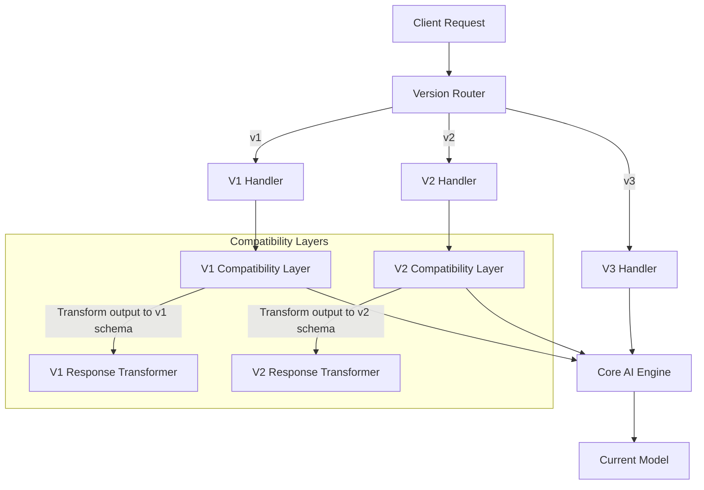

# Backward Compatibility for AI Systems

## Why Backward Compatibility Matters

When you run an AI service, other teams build on top of your outputs. They parse your
response formats, depend on your latency characteristics, and train their systems on
your behavior patterns. Breaking these contracts breaks their systems — often silently.

AI systems are especially prone to breaking consumers because:
- Model upgrades change output style, length, and quality
- Non-determinism means "same behavior" is hard to define
- Quality improvements can still break consumers expecting old patterns
- New capabilities may change default behavior

## Versioning Strategies for AI APIs

### Strategy 1: URL Path Versioning

```
POST /v1/completions    ← Original API
POST /v2/completions    ← New response format
POST /v3/completions    ← Added streaming, different structure
```

**Pros:** Explicit, easy to route, easy to monitor per-version
**Cons:** URL proliferation, consumers must update URLs to upgrade

### Strategy 2: Header Versioning (Date-Based)

```
POST /completions
X-API-Version: 2024-01-15    ← Behavior as of this date
X-API-Version: 2024-06-01    ← Newer behavior
```

**Pros:** Clean URLs, easy to pin to specific behavior snapshot
**Cons:** Harder to discover available versions, requires header parsing

**This is what OpenAI and Anthropic use.** It works well for AI APIs because
behavior changes are continuous, not discrete.

### Strategy 3: Feature/Capabilities Negotiation

```json
POST /completions
{
  "model": "gpt-4",
  "capabilities": ["structured_output", "tool_use"],
  "response_format": {"type": "json_schema", "schema": {...}}
}
```

**Pros:** Granular control, consumers get exactly what they need
**Cons:** Complex, combinatorial explosion of capability combinations

### Strategy 4: Hybrid (Recommended)

```
POST /v2/completions                    ← Major version in URL
X-API-Version: 2024-06-01              ← Behavior pinning within major
X-Capabilities: structured_output       ← Feature flags
```

## API Versioning Architecture



**Key insight:** Run one core engine, wrap with compatibility layers per version.
Don't maintain separate engines per version (unsustainable).

## Breaking Changes in AI Systems

### Type 1: Output Format Changes

**Example:** Response field renamed from `text` to `content`

```json
// V1 response
{"text": "Hello, how can I help?", "confidence": 0.95}

// V2 response  
{"content": "Hello, how can I help?", "metadata": {"confidence": 0.95}}
```

**Impact:** Consumers parsing `response.text` get null/error
**Mitigation:** Versioned response schemas, deprecation period with both fields

### Type 2: Quality Characteristic Changes

**Example:** Model upgrade produces longer, more detailed responses

```
V1 (old model): "The capital of France is Paris."
V2 (new model): "The capital of France is Paris, which is also known as 
                 the City of Light. Located on the Seine River, Paris has 
                 been the capital since..."
```

**Impact:** Consumers with UI space constraints, token budgets, or post-processing
that assumes short responses break.
**Mitigation:** `max_tokens` parameter, response length guidelines in API contract

### Type 3: Behavior Changes

**Example:** Model upgrade changes personality/style

```
V1: Formal, concise, never uses first person
V2: Conversational, uses "I", asks follow-up questions
```

**Impact:** Consumers who built UX around specific AI personality
**Mitigation:** System prompt versioning, behavior pinning via API version

### Type 4: Capability Changes

**Example:** New model supports tool use, old model didn't

```
V1: Text in → text out only
V2: Text in → text out OR tool calls OR structured JSON
```

**Impact:** Consumers not handling new response types get unexpected formats
**Mitigation:** Capabilities must be explicitly opted into, never default-on

### Type 5: Removal of Features

**Example:** Deprecated model no longer available

```
V1: model="text-davinci-003" → works
V2: model="text-davinci-003" → error: model deprecated
```

**Impact:** Consumers pinned to specific model stop working
**Mitigation:** Long deprecation timeline, automatic migration path, clear errors

## Deprecation Lifecycle

```
┌──────────┐    ┌──────────┐    ┌──────────┐    ┌──────────┐
│ Announce │───→│  Sunset  │───→│  Soft    │───→│  Hard    │
│          │    │  Period  │    │  Delete  │    │  Delete  │
└──────────┘    └──────────┘    └──────────┘    └──────────┘
   Day 0          +6 months      +9 months       +12 months

Announce: Blog post, email, API warning headers, docs update
Sunset:   API returns deprecation warnings in response headers
Soft:     API returns errors for new integrations, existing still work
Hard:     API returns errors for all requests
```

### Deprecation Headers

```http
HTTP/1.1 200 OK
Deprecation: true
Sunset: Sat, 01 Mar 2025 00:00:00 GMT
Link: <https://docs.example.com/migration/v1-to-v2>; rel="successor-version"
X-Deprecation-Notice: "v1 API will be removed March 2025. Migrate to v2."
```

### Timeline Guidelines for AI APIs

| Change Type | Minimum Notice | Recommended Notice |
|---|---|---|
| Model deprecation | 6 months | 12 months |
| API version sunset | 6 months | 12 months |
| Breaking schema change | 3 months | 6 months |
| Behavior change (major) | 3 months | 6 months |
| New default behavior | 1 month | 3 months |
| Bug fix (changes output) | 2 weeks | 1 month |

## Migration Support for Consumers

### Migration Guides
For every breaking change, provide:
1. What's changing and why
2. Exact before/after examples
3. Code snippets for common languages
4. Timeline with milestones
5. Support channel for questions

### Compatibility Shims

```python
# Provide a library that auto-translates
from your_ai_sdk import CompatibilityClient

# Old code keeps working
client = CompatibilityClient(version="v1")
result = client.complete(prompt="...")  # Returns v1 format

# Under the hood, calls v2 and transforms response
```

### Testing Tools

```python
# Provide a compatibility checker
from your_ai_sdk.migration import CompatibilityChecker

checker = CompatibilityChecker(
    old_version="v1",
    new_version="v2"
)

# Run consumer's test suite against both versions
results = checker.compare(test_cases=[
    {"input": "...", "expected_fields": ["text", "confidence"]},
])

# Report: which tests pass on both, which break
checker.report(results)
```

## Semantic Versioning for AI

Traditional semver: MAJOR.MINOR.PATCH

For AI systems, what constitutes each?

### MAJOR (breaking)
- Response schema changes (field removal/rename)
- Model replacement that changes fundamental behavior
- API contract changes (new required fields)
- Removal of capabilities

### MINOR (new features, backward compatible)
- New optional response fields
- New capabilities (opt-in only)
- Quality improvements (same schema, better content)
- New model options added

### PATCH (fixes)
- Bug fixes that improve correctness
- Latency improvements
- Safety improvements (blocking harmful outputs)
- Documentation corrections

### The AI Versioning Problem

Semver assumes deterministic behavior. AI systems are non-deterministic. A "patch"
that fixes a safety issue might change 5% of outputs. Is that breaking?

**Practical approach:**
- Version the API contract (schema, capabilities) with semver
- Version model behavior with date-based snapshots
- Let consumers pin to behavior snapshots independently of API version

```
API Version: v2.3.1 (semver, changes rarely)
Model Snapshot: 2024-06-15 (date-based, changes with model updates)
Consumer pins: API v2 + snapshot 2024-06-15
```

## Consumer Contract Testing

Consumers should be able to verify their integration works:

### Provider-Side Contract Tests

```python
class AIServiceContractTests:
    """Tests that the AI service maintains its contracts."""
    
    def test_v1_response_schema(self):
        """V1 response must have 'text' and 'confidence' fields."""
        response = self.client.v1_complete("test input")
        assert "text" in response
        assert "confidence" in response
        assert isinstance(response["confidence"], float)
    
    def test_v2_response_schema(self):
        """V2 response must have 'content' and 'metadata' fields."""
        response = self.client.v2_complete("test input")
        assert "content" in response
        assert "metadata" in response
    
    def test_v1_backward_compatible(self):
        """V1 still works after v2 deployment."""
        response = self.client.v1_complete("What is 2+2?")
        assert response["text"]  # Non-empty response
        assert 0 <= response["confidence"] <= 1
```

### Consumer-Side Contract Tests

```python
class MyAppAIIntegrationTests:
    """Tests that my app's AI integration still works."""
    
    def test_response_parseable(self):
        """AI response can be parsed by my application."""
        response = ai_client.complete("categorize: refund request")
        category = my_parser.extract_category(response)
        assert category in VALID_CATEGORIES
    
    def test_response_length_acceptable(self):
        """AI response fits in my UI component."""
        response = ai_client.complete("summarize: ...")
        assert len(response.text) <= 500  # My UI limit
    
    def test_latency_acceptable(self):
        """AI response arrives within my timeout."""
        start = time.time()
        response = ai_client.complete("quick question")
        assert time.time() - start < 5.0  # My timeout
```

## Anti-Patterns

### 1. Breaking Consumers Silently
Deploying model upgrades without versioning. Consumers discover breakage in production.

**Fix:** All behavior changes go through versioning. Default version never changes
without explicit consumer action.

### 2. No Deprecation Period
Removing old API version with < 1 week notice.

**Fix:** Minimum 6-month deprecation period for any version removal. Communicate
early and often.

### 3. Forced Upgrades
"We're removing v1 next week, upgrade to v3." Consumer has no time or resources.

**Fix:** Provide migration tools, compatibility shims, and sufficient timeline.
Offer help migrating.

### 4. Version Sprawl
Supporting v1, v2, v3, v4, v5, v6, v7... indefinitely.

**Fix:** Maximum 3 supported versions. Old versions get clear end-of-life dates.
Make upgrade path easy.

### 5. Undocumented Behavior as Contract
Consumers depend on undocumented response patterns (specific wording, formatting).
You change it, they break.

**Fix:** Clearly document what is contract (guaranteed) vs implementation detail
(may change). Provide schema validation.

### 6. Different Model = Different Version
Every model update gets a new major version. Consumers never know which to use.

**Fix:** Separate model versioning from API versioning. API version = contract.
Model version = behavior snapshot.

## Staff Pattern: API Lifecycle Policy

```markdown
# AI Service API Lifecycle Policy

## Versioning Scheme
- API versions: URL path (v1, v2, v3)
- Behavior snapshots: Date-based headers (X-API-Version: YYYY-MM-DD)
- Maximum supported versions: 3 (current + 2 previous)

## Compatibility Guarantees
- PATCH updates: No consumer-visible changes to response schema
- MINOR updates: New optional fields only, existing fields unchanged
- MAJOR updates: New URL path, 12-month support for previous major

## Breaking Change Process
1. RFC published with rationale and migration guide
2. Consumer impact assessment (who uses affected features)
3. Migration tooling provided (SDK updates, compatibility shims)
4. Announcement: blog + email + API deprecation headers
5. Sunset period: 6 months minimum
6. Monitoring: track consumer migration progress
7. Soft delete: block new integrations on old version
8. Hard delete: return helpful error with migration link

## Model Update Process
- Quality improvements: deploy as new date-based snapshot
- Current consumers unaffected (pinned to their snapshot)
- New consumers get latest snapshot by default
- Old snapshots supported for 6 months after newer snapshot available

## Consumer Support
- Migration guides for every breaking change
- Compatibility checker tool (compare behavior across versions)
- Dedicated support channel during migration periods
- Office hours for migration questions

## Monitoring
- Track active consumers per version
- Alert when version approaching end-of-life still has active consumers
- Dashboard showing migration progress per consumer
- Automated tests for all supported version contracts

## Emergency Changes
- Security fixes may bypass normal timeline (minimum 48-hour notice)
- Safety fixes (harmful outputs) may bypass normal timeline
- Both still require versioning — old behavior not preserved if unsafe
```

---

## Key Takeaways

1. **Version your API contract and model behavior separately**
2. **Never break consumers silently** — all changes go through versioning
3. **Deprecation needs 6+ months** — consumers have their own release cycles
4. **Provide migration tools** — don't just tell consumers to upgrade, help them
5. **Contract tests are essential** — both provider and consumer should test contracts
6. **AI versioning is harder than software versioning** — non-determinism means "same behavior" is fuzzy
7. **Maximum 3 supported versions** — otherwise maintenance becomes unsustainable
