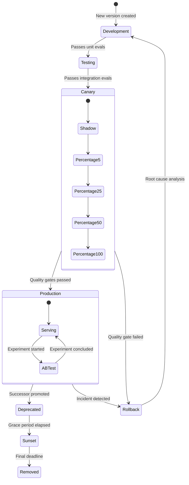

# Model Versioning Strategy for AI Systems

## Why Model Versioning Is Uniquely Hard

Traditional software versioning tracks source code changes. AI systems have a fundamentally
different challenge: behavior changes without code changes. A model retrained on new data,
a prompt tweak, or an updated guardrail all alter system behavior while the "code" may
remain identical.

This creates a versioning problem that spans multiple dimensions simultaneously.

---

## What Constitutes a "Version"

### The Version Surface Area

An AI system version is defined by the combination of:

```
Model Version = f(weights, prompt, parameters, tools, guardrails, data)
```

Each dimension can change independently:

| Component | Example Change | Behavioral Impact |
|-----------|---------------|-------------------|
| Weights | Retrained model, fine-tuned checkpoint | Fundamental capability shift |
| Prompt | System prompt update, few-shot examples | Behavioral steering change |
| Parameters | Temperature, top_p, max_tokens | Output distribution shift |
| Tools | New function added, tool schema changed | Capability expansion/contraction |
| Guardrails | Updated content filter, new safety rule | Output constraint change |
| Data | RAG index updated, knowledge cutoff moved | Factual accuracy shift |

### Composite Version Identity

```yaml
version:
  id: "chat-v2.3.1-20240115"
  components:
    weights:
      model: "gpt-4-turbo"
      fine_tune_id: "ft:gpt-4:org:custom:abc123"
      checkpoint: "step-5000"
    prompt:
      system_prompt_hash: "sha256:a1b2c3..."
      few_shot_version: "examples-v3"
    parameters:
      temperature: 0.7
      top_p: 0.95
      max_tokens: 4096
    tools:
      schema_version: "tools-v2.1"
      enabled: ["search", "calculator", "code_exec"]
    guardrails:
      content_filter: "safety-v4.2"
      output_validator: "schema-v1.3"
    data:
      rag_index: "knowledge-2024-01-10"
      embeddings_model: "text-embedding-3-small"
```

### The Granularity Decision

**Fine-grained versioning** (each component independently):
- Pro: Precise rollback, clear change attribution
- Con: Combinatorial explosion, complex compatibility matrix

**Coarse-grained versioning** (entire system as one unit):
- Pro: Simple to reason about, easy rollback
- Con: Cannot isolate changes, forces full redeployment

**Staff recommendation**: Use coarse-grained versions for external consumers,
fine-grained internally for debugging and gradual rollout.

---

## Version Naming Strategies

### Semantic Versioning (SemVer)

```
MAJOR.MINOR.PATCH

- MAJOR: Breaking behavioral changes (output format change, capability removal)
- MINOR: New capabilities, non-breaking behavioral improvements
- PATCH: Bug fixes, safety patches, minor quality improvements
```

**Challenges for AI systems**:
- What constitutes "breaking"? A better answer is still different
- Probabilistic outputs make compatibility guarantees fuzzy
- Consumer expectations vary wildly

### Date-Based Versioning

```
model-YYYY-MM-DD

Examples:
  gpt-4-2024-01-15
  claude-3-opus-20240229
```

**Advantages**:
- Clear temporal ordering
- No subjective "breaking vs non-breaking" decisions
- Aligns with continuous training cycles

**Disadvantages**:
- No signal about change magnitude
- Multiple releases per day need disambiguation

### Hash-Based Versioning

```
model-{short_hash}

Examples:
  chat-a1b2c3d
  assistant-{sha256_first_8}
```

**Advantages**:
- Content-addressable (same config = same hash)
- Guarantees reproducibility
- No ordering assumptions

**Disadvantages**:
- Not human-readable
- No magnitude signal
- Requires registry lookup for context

### Hybrid Approach (Recommended)

```
{name}-v{major}.{minor}-{date}-{short_hash}

Example: assistant-v2.3-20240115-a1b2c3d

External label: assistant-v2.3 (consumers pin to this)
Internal label: assistant-v2.3-20240115-a1b2c3d (for debugging)
```

---

## Configuration as Code

### Model Configuration Repository

```
model-configs/
├── production/
│   ├── assistant-v2.3.yaml
│   ├── assistant-v2.2.yaml      # previous version
│   └── assistant-v2.1.yaml      # deprecated
├── canary/
│   └── assistant-v2.4-rc1.yaml
├── schemas/
│   └── config-schema.json
├── tests/
│   ├── compatibility_tests.py
│   └── regression_tests.py
└── CHANGELOG.md
```

### Configuration Schema

```yaml
# assistant-v2.3.yaml
apiVersion: ml.platform/v1
kind: ModelDeployment
metadata:
  name: assistant
  version: "2.3"
  created: "2024-01-15T10:00:00Z"
  author: "ml-team"
  description: "Improved reasoning with tool use"
spec:
  model:
    provider: "openai"
    name: "gpt-4-turbo"
    fine_tune: "ft:gpt-4:org:custom:abc123"
  inference:
    temperature: 0.7
    top_p: 0.95
    max_tokens: 4096
    stop_sequences: ["</response>"]
  prompt:
    system: |
      You are a helpful assistant...
    few_shot_examples: "s3://prompts/examples-v3.json"
  tools:
    - name: "web_search"
      version: "1.2"
      enabled: true
    - name: "calculator"
      version: "1.0"
      enabled: true
  guardrails:
    content_filter: "safety-v4.2"
    max_retries: 3
    fallback_version: "assistant-v2.2"
  deployment:
    min_replicas: 3
    max_replicas: 50
    canary_percentage: 0
    regions: ["us-east-1", "eu-west-1"]
  compatibility:
    min_client_version: "sdk-v1.5"
    deprecated_features: []
    breaking_changes: []
```

### GitOps Workflow

```
1. Engineer creates branch: feature/assistant-v2.4
2. Modifies config YAML
3. CI runs:
   - Schema validation
   - Compatibility checks against pinned consumers
   - Automated eval suite
4. PR review (requires ML + platform approval)
5. Merge triggers canary deployment
6. Gradual rollout via config update (canary_percentage: 5 → 25 → 50 → 100)
```

---

## Reproducibility Strategies

### The Reproducibility Spectrum

| Level | What's Guaranteed | Cost |
|-------|------------------|------|
| Exact | Bit-identical outputs | Very high (deterministic mode, pinned everything) |
| Statistical | Same distribution of outputs | Medium (same model, same params) |
| Behavioral | Same functional behavior | Low (same prompt strategy, similar model) |

### Achieving Exact Reproducibility

```yaml
reproducibility:
  seed: 42
  temperature: 0  # deterministic
  model_snapshot: "pinned"  # no provider-side updates
  prompt_frozen: true
  tool_versions_locked: true
```

**Reality check**: Most providers don't guarantee exact reproducibility even with
seed pinning. Statistical reproducibility is usually the practical target.

### Reproducibility Checklist

- [ ] Model weights/version pinned (not "latest")
- [ ] Prompt text stored in version control
- [ ] Parameters explicitly set (not defaults)
- [ ] Tool schemas versioned
- [ ] RAG data snapshot identified
- [ ] Random seed set (where supported)
- [ ] Provider API version pinned
- [ ] Pre/post-processing code versioned

---

## A/B Testing Between Versions

### Traffic Splitting Architecture

```
                    ┌─────────────┐
                    │   Router    │
                    │  (A/B Split)│
                    └──────┬──────┘
                           │
              ┌────────────┼────────────┐
              │            │            │
              ▼            ▼            ▼
       ┌──────────┐ ┌──────────┐ ┌──────────┐
       │ Version A│ │ Version B│ │ Control  │
       │  (80%)   │ │  (15%)   │ │   (5%)   │
       └──────────┘ └──────────┘ └──────────┘
              │            │            │
              └────────────┼────────────┘
                           ▼
                    ┌─────────────┐
                    │  Metrics    │
                    │  Collector  │
                    └─────────────┘
```

### A/B Test Configuration

```yaml
experiment:
  name: "assistant-v2.4-eval"
  start_date: "2024-01-20"
  end_date: "2024-02-03"
  variants:
    - name: "control"
      version: "assistant-v2.3"
      traffic_percentage: 80
    - name: "treatment"
      version: "assistant-v2.4-rc1"
      traffic_percentage: 15
    - name: "baseline"
      version: "assistant-v2.2"
      traffic_percentage: 5
  metrics:
    primary: "task_completion_rate"
    secondary:
      - "user_satisfaction_score"
      - "average_latency_ms"
      - "error_rate"
      - "cost_per_query"
  guardrails:
    max_error_rate: 0.05
    max_latency_p99_ms: 5000
    auto_rollback: true
  assignment:
    strategy: "sticky_user"  # same user always sees same variant
    hash_key: "user_id"
```

### Statistical Rigor for AI A/B Tests

Key differences from traditional A/B testing:
- Output variance is much higher (same input → different outputs)
- Need larger sample sizes for significance
- Quality metrics are often subjective (human eval needed)
- Latency and cost are as important as quality

---

## Rollback Patterns

### Instant Rollback

```yaml
# Traffic shift: 100% to previous known-good version
rollback:
  trigger: "error_rate > 5% for 5 minutes"
  target_version: "assistant-v2.2"  # last known good
  strategy: "instant"  # no gradual shift
  notification:
    - channel: "#ml-ops-alerts"
      message: "Rolled back assistant from v2.3 to v2.2"
```

### Graduated Rollback

```
Phase 1: Stop canary traffic to new version
Phase 2: Shift 50% back to old version
Phase 3: Monitor for 15 minutes
Phase 4: Complete rollback to 100% old version
Phase 5: Post-mortem trigger
```

### Rollback Complications

| Scenario | Challenge | Mitigation |
|----------|-----------|------------|
| State accumulated | New version created data old version can't process | Version-aware data migration |
| Consumer adapted | Clients depend on new behavior | Deprecation window |
| Tool changes | New tools called, old version doesn't have them | Tool version compatibility layer |
| Prompt leakage | Users learned to exploit new prompt | Monitor for prompt-specific patterns |

---

## Long-Running Session Handling

### The Session Continuity Problem

When a model version changes mid-conversation:

```
User message 1 → Version A processes → Response 1
User message 2 → Version A processes → Response 2
--- VERSION CHANGE HAPPENS ---
User message 3 → Version B processes → Response 3 (context mismatch?)
```

### Strategies

**Pin sessions to version**:
```yaml
session_policy:
  strategy: "pin_to_start_version"
  max_session_duration: "24h"
  force_upgrade_after: "7d"
  notification: "Your assistant has been updated. Start a new conversation for improvements."
```

**Graceful migration**:
```yaml
session_policy:
  strategy: "migrate_at_natural_boundary"
  boundary_detection:
    - "topic_change"
    - "explicit_reset"
    - "idle_timeout_5m"
  context_transfer:
    summary_previous: true
    carry_forward_tools: true
```

**Dual-run during transition**:
```yaml
session_policy:
  strategy: "dual_run"
  duration: "48h"
  comparison: "shadow_mode"  # new version runs but old version's output is served
```

---

## Consumer Pinning and Deprecation

### API Version Pinning

```
# Consumer specifies version in request
POST /v1/chat/completions
Headers:
  X-Model-Version: assistant-v2.3
  X-Min-Version: assistant-v2.0
```

### Deprecation Lifecycle

```
┌──────────┐    ┌──────────┐    ┌──────────┐    ┌──────────┐
│  Active  │───▶│Deprecated│───▶│  Sunset  │───▶│  Removed │
│          │    │ (warnings)│    │(read-only)│    │          │
└──────────┘    └──────────┘    └──────────┘    └──────────┘
    │                │                │                │
 Normal          30-90 days       30 days          Gone
 operation       + migration      + errors
                 guide
```

### Deprecation Communication

```yaml
deprecation:
  version: "assistant-v2.1"
  deprecated_date: "2024-01-15"
  sunset_date: "2024-04-15"
  removal_date: "2024-05-15"
  migration_guide: "https://docs.example.com/migrate-v2.1-to-v2.3"
  breaking_changes:
    - "Tool schema format changed from v1 to v2"
    - "Temperature default changed from 1.0 to 0.7"
  response_headers:
    Deprecation: "true"
    Sunset: "Sat, 15 Apr 2024 00:00:00 GMT"
    Link: '<https://docs.example.com/migrate>; rel="successor-version"'
```

---

## Model Version Lifecycle



---

## Anti-Patterns

### 1. "Latest" as a Version

```yaml
# WRONG: No reproducibility, no rollback capability
model: "gpt-4-latest"

# RIGHT: Pin to specific version
model: "gpt-4-0125-preview"
```

### 2. Undifferentiated Versioning

Treating every change as equal importance:
- Prompt typo fix gets same version bump as architecture change
- Consumers cannot assess update urgency
- Alert fatigue from constant version notifications

### 3. Config Drift

```yaml
# Production has manual hotfix not in version control
# "Just change temperature to 0.5 on prod-server-3"
# Result: Unreproducible behavior, impossible debugging
```

### 4. Big Bang Version Transitions

Switching 100% of traffic to new version simultaneously:
- No comparison data
- No gradual quality validation
- Rollback affects all users

### 5. Ignoring the Prompt-Model Coupling

```yaml
# Prompt optimized for GPT-4 used verbatim with Claude
# Works "fine" in testing, subtle failures in production
# Each model version needs prompt validation
```

### 6. Version Without Eval

Releasing a new version without corresponding evaluation results:
- No baseline comparison
- Cannot detect regressions
- "It seemed fine in my testing" is not evidence

---

## Staff Decision Frameworks

### When to Bump Major Version

Ask these questions:
1. Will existing consumers need to change their code? → Major
2. Will output format change in ways that break parsers? → Major
3. Will the model refuse requests it previously accepted? → Major
4. Could this change user-visible behavior significantly? → Major

### When to Version vs. Feature Flag

| Use Versioning When | Use Feature Flags When |
|--------------------|-----------------------|
| Change is permanent | Change is experimental |
| External consumers affected | Internal only |
| Rollback needs to be instant | Gradual rollout desired |
| Audit trail required | Quick iteration needed |

### Choosing a Rollback Strategy

```
Is the issue causing harm? ──── Yes ──→ Instant rollback
         │
         No
         │
Can users tolerate degradation? ── No ──→ Graduated rollback (fast)
         │
         Yes
         │
Is root cause understood? ──── Yes ──→ Fix forward
         │
         No
         │
         └──→ Graduated rollback + investigation
```

### Version Retirement Criteria

A version can be retired when:
- [ ] Successor has been stable for > 30 days
- [ ] < 5% of traffic still on old version
- [ ] All pinned consumers notified (2x)
- [ ] Migration guide published and validated
- [ ] No regulatory hold requiring preservation
- [ ] Sunset warnings active for > 30 days

---

## Summary

Model versioning for AI systems requires treating the entire inference configuration
as a versioned artifact. The key principles:

1. **Version everything**: Weights, prompts, params, tools, guardrails, data
2. **Pin explicitly**: Never rely on "latest" or defaults
3. **Roll out gradually**: Canary → percentage → production
4. **Measure before promoting**: Automated evals gate every transition
5. **Support rollback**: Every deployment must have a tested rollback path
6. **Communicate deprecation**: Give consumers time and guidance to migrate
7. **Configuration as code**: All config in version control, reviewed, tested
