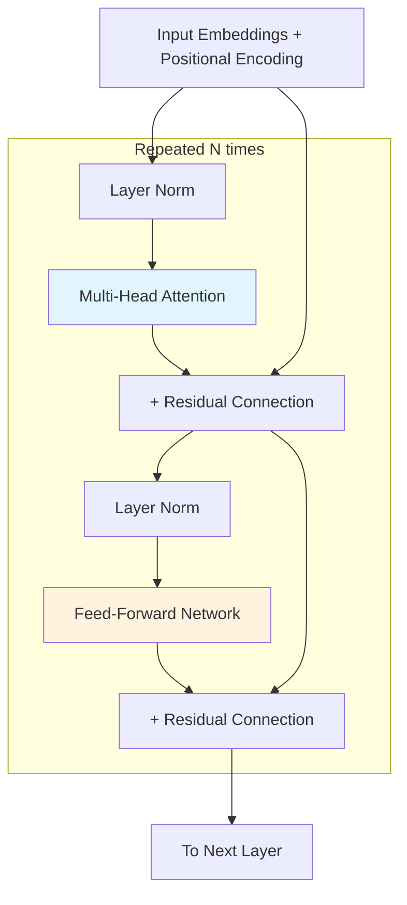

# Transformer Architecture Deep Dive

## Why Architects Need to Understand Transformers

You don't need to implement a transformer from scratch. But if you're making decisions about:
- **Context window sizing** → you need to understand O(n²) attention
- **Latency budgets** → you need to understand autoregressive decoding
- **Cost estimation** → you need to understand parameter counts and activation patterns
- **Model selection** → you need to understand encoder vs decoder tradeoffs

Without this knowledge, you'll make expensive mistakes: choosing 128K context when your attention mechanism can't handle it efficiently, underestimating memory for KV cache, or assuming models "understand" when they're doing pattern matching.

---

## The Transformer Architecture

The transformer (Vaswani et al., 2017) replaced RNNs with pure attention mechanisms. Three variants exist:

### Encoder-Only (BERT, RoBERTa)
- Bidirectional attention: every token attends to every other token
- Use case: classification, embeddings, understanding
- Architecture decision: use for embedding models, semantic search

### Decoder-Only (GPT, Llama, Claude, Mistral)
- Causal (left-to-right) attention: tokens only attend to previous tokens
- Use case: text generation, reasoning, general-purpose
- Architecture decision: this is what you're using 95% of the time

### Encoder-Decoder (T5, BART)
- Encoder processes input bidirectionally, decoder generates output causally
- Use case: translation, summarization with fixed input
- Architecture decision: rarely used in modern LLM deployments

```
┌─────────────────────────────────────────────────────────┐
│ Why Decoder-Only Won                                     │
├─────────────────────────────────────────────────────────┤
│ 1. Simpler architecture → easier to scale               │
│ 2. Single forward pass for both understanding + generation│
│ 3. Better scaling laws (Chinchilla, GPT-4)              │
│ 4. In-context learning emerges naturally                 │
│ 5. Same architecture handles all tasks (no task-specific │
│    encoder needed)                                       │
└─────────────────────────────────────────────────────────┘
```

---

## Self-Attention Mechanism: Step by Step

Self-attention is the core innovation. Here's how it works:

### Step 1: Input Embeddings

Each token is converted to a vector of dimension `d_model`:
- GPT-3: d_model = 12288
- Llama 2 70B: d_model = 8192
- Mistral 7B: d_model = 4096

### Step 2: Query, Key, Value Projections

For each token embedding `x`, compute three vectors:

```
Q = x × W_Q    (What am I looking for?)
K = x × W_K    (What do I contain?)
V = x × W_V    (What information do I provide?)
```

- W_Q, W_K, W_V are learned weight matrices
- Q, K have dimension d_k (typically d_model / num_heads)
- V has dimension d_v (typically same as d_k)

### Step 3: Attention Scores

```
Attention(Q, K, V) = softmax(Q × K^T / √d_k) × V
```

Breaking this down:

1. **Q × K^T**: Dot product between query and all keys → similarity scores
2. **/ √d_k**: Scale factor prevents softmax saturation (gradients vanishing)
3. **softmax(...)**: Normalize to probability distribution (all scores sum to 1)
4. **× V**: Weighted sum of values based on attention scores

### Step 4: Multi-Head Attention

Instead of one attention computation, run `h` parallel attention heads:

```
MultiHead(Q, K, V) = Concat(head_1, head_2, ..., head_h) × W_O

where head_i = Attention(Q × W_Q_i, K × W_K_i, V × W_V_i)
```

Why multiple heads?
- Each head can attend to different aspects (syntax, semantics, position)
- GPT-3: 96 heads × 128 dimensions each = 12288 total
- Llama 2 70B: 64 heads × 128 dimensions each = 8192 total

---

## Transformer Block Architecture



**Number of layers (N):**
- GPT-3 175B: 96 layers
- Llama 2 70B: 80 layers
- Mistral 7B: 32 layers
- GPT-4 (estimated): 120+ layers

---

## Positional Encoding

Transformers have no inherent notion of order. Positional encodings add position information.

### Sinusoidal (Original Transformer)

```
PE(pos, 2i) = sin(pos / 10000^(2i/d_model))
PE(pos, 2i+1) = cos(pos / 10000^(2i/d_model))
```

- Fixed, deterministic
- Theoretically generalizes to unseen lengths (but doesn't in practice)

### Rotary Position Embedding (RoPE) — Used by Llama, Mistral, Qwen

- Rotates Q and K vectors based on position
- Relative position encoded in dot product
- Can be extended to longer contexts via interpolation (NTK-aware scaling)
- **Architecture implication**: RoPE models can be extended to 4x their training context with fine-tuning

### ALiBi (Attention with Linear Biases) — Used by MPT, BLOOM

- Adds linear bias to attention scores based on distance
- No learned parameters
- Better length generalization than RoPE
- **Architecture implication**: ALiBi models generalize to longer contexts without fine-tuning

### Architecture Decision: Positional Encoding

| Encoding | Context Extension | Models Using It | Best For |
|----------|------------------|-----------------|----------|
| RoPE | Fine-tuning needed | Llama, Mistral, Qwen | Most general purpose |
| ALiBi | Zero-shot extension | MPT, BLOOM | When you need flexible context |
| Learned | Fixed length | GPT-2 | Legacy only |

---

## Feed-Forward Networks: The "Memory"

Each transformer layer has a feed-forward network (FFN):

```
FFN(x) = activation(x × W_1 + b_1) × W_2 + b_2
```

- W_1 projects from d_model to d_ff (typically 4× d_model)
- W_2 projects back from d_ff to d_model
- Activation: ReLU (original), GELU (GPT), SwiGLU (Llama, Mistral)

### Why FFN Matters for Architects

The FFN is where **factual knowledge is stored**. Research shows:
- Attention heads handle **relationships and patterns**
- FFN layers store **factual associations** ("Paris is the capital of France")
- Larger FFN = more memorized knowledge
- This is why RAG helps: supplements the FFN's limited memory

### SwiGLU (State of the Art)

```
SwiGLU(x) = (x × W_gate ⊙ swish(x × W_up)) × W_down
```

- Used by Llama 2, Mistral, Gemma
- 3 weight matrices instead of 2 → ~50% more FFN parameters
- Better performance per parameter

**Staff insight**: When evaluating "does this model know X?", you're really asking "did the FFN memorize X during training?" — this is why fine-tuning on domain knowledge works.

---

## Layer Normalization

### Pre-Norm (Modern Standard)

```
output = x + Attention(LayerNorm(x))
output = output + FFN(LayerNorm(output))
```

- Used by GPT-2+, Llama, Mistral, all modern models
- More stable training at scale
- **Architecture implication**: pre-norm models are easier to scale to 100B+ params

### Post-Norm (Original Transformer)

```
output = LayerNorm(x + Attention(x))
output = LayerNorm(output + FFN(output))
```

- Used in original transformer, BERT
- Requires careful learning rate warmup
- Harder to train at scale

### RMSNorm (Current Best Practice)

```
RMSNorm(x) = x / RMS(x) × γ
```

- Llama, Mistral, Gemma use RMSNorm
- Simpler than LayerNorm (no mean subtraction)
- Slightly faster inference

---

## Residual Connections

Every sub-layer has a residual (skip) connection:

```
output = x + SubLayer(x)
```

Why this matters:
1. **Gradient flow**: Information flows directly from early to late layers
2. **Depth**: Without residuals, training beyond ~6 layers fails
3. **Ensemble effect**: Each layer adds refinement to the "residual stream"

**Staff mental model**: Think of the residual stream as a "shared workspace" that each layer reads from and writes to. Attention reads relationships, FFN adds knowledge.

---

## Token Prediction

### Causal (Autoregressive) — GPT-style

```
P(token_t | token_1, token_2, ..., token_{t-1})
```

- Each token can only attend to previous tokens
- Generation: predict one token at a time
- **Latency implication**: generating 1000 tokens requires 1000 sequential forward passes through attention

### Bidirectional — BERT-style

```
P(token_t | token_1, ..., token_{t-1}, token_{t+1}, ..., token_n)
```

- Each token attends to all tokens
- Cannot generate text naturally
- Used for embeddings, classification

### Prefill vs Decode (Critical for Serving)

```
┌─────────────────────────────────────────────────────────┐
│ Prefill Phase (processing prompt):                       │
│ - All prompt tokens processed in parallel               │
│ - Compute-bound (matrix multiplications)                │
│ - Latency: proportional to prompt length                │
│                                                          │
│ Decode Phase (generating response):                      │
│ - One token at a time, sequentially                     │
│ - Memory-bound (reading KV cache)                       │
│ - Latency: proportional to output length                │
│                                                          │
│ TTFT = prefill time                                     │
│ TPS = decode speed                                      │
└─────────────────────────────────────────────────────────┘
```

**Architecture decision**: Prefill and decode have different bottlenecks. This is why disaggregated serving (separate prefill and decode GPUs) exists.

---

## Architectural Implications for Staff Architects

### 1. Context Length Scales Quadratically

Attention computes all-pairs dot products: O(n²) time and memory.

| Context Length | Relative Compute | Relative Memory |
|---------------|-----------------|-----------------|
| 4K | 1× | 1× |
| 8K | 4× | 4× |
| 32K | 64× | 64× |
| 128K | 1024× | 1024× |

**Reality check**: Flash Attention makes this ~2-4× better constant factor, but still O(n²). This is why 128K context is expensive.

**KV Cache memory per request**:
```
KV cache = 2 × num_layers × num_kv_heads × head_dim × context_length × bytes_per_param

Llama 2 70B (fp16, 4K context):
= 2 × 80 × 8 × 128 × 4096 × 2 bytes
= 1.34 GB per request

Llama 2 70B (fp16, 128K context):
= 2 × 80 × 8 × 128 × 131072 × 2 bytes
= 42.9 GB per request  ← Can't even fit ONE request!
```

### 2. More Heads = More Nuanced Understanding

- More attention heads → captures more relationship types
- But more heads → more compute per token
- GQA reduces this by sharing KV heads (see next chapter)

### 3. Larger FFN = More Memorized Knowledge

- Larger FFN ratio → more factual knowledge capacity
- But larger FFN → more parameters → more memory
- This is why RAG is often better than a bigger model for domain knowledge

---

## Why Decoder-Only Dominates

| Factor | Encoder-Decoder | Decoder-Only |
|--------|----------------|--------------|
| Architecture complexity | Higher (two stacks) | Lower (one stack) |
| Scaling efficiency | Less studied | Chinchilla-optimal |
| In-context learning | Limited | Emergent |
| Task flexibility | Need task framing | Natural instruction following |
| Serving complexity | Two-phase | Single forward pass |
| KV cache | Two caches | One cache |

The simplicity advantage compounds: easier to scale, easier to serve, easier to optimize, easier to study.

---

## Anti-Patterns in Understanding

### Anti-Pattern 1: "LLMs are databases"

**Wrong**: "The model stores all of Wikipedia, so it knows everything."
**Right**: The FFN stores compressed, lossy representations. It will hallucinate on specific facts.
**Implication**: Always use RAG for factual accuracy.

### Anti-Pattern 2: "More context = better results"

**Wrong**: "Let's put our entire codebase in context."
**Right**: Attention has finite capacity. Information in the middle of long contexts gets less attention ("lost in the middle" phenomenon).
**Implication**: Put critical information at the beginning or end of prompts.

### Anti-Pattern 3: "The model understands my intent"

**Wrong**: "The model knows what I mean."
**Right**: The model predicts the most likely next token given the attention pattern over your input.
**Implication**: Be explicit. Prompt engineering is attention engineering.

### Anti-Pattern 4: "Bigger model = always better"

**Wrong**: "Always use GPT-4."
**Right**: A well-prompted 7B model with RAG often beats a poorly-prompted 70B model.
**Implication**: Match model size to task complexity (see scaling laws chapter).

### Anti-Pattern 5: "Context window = working memory"

**Wrong**: "128K context means the model can reason over 128K tokens equally."
**Right**: Attention degrades with distance. Models perform worse on information in the middle of long contexts.
**Implication**: Structure prompts with critical information at boundaries.

---

## What Architects MUST Know vs. Can Skip

### MUST Know (Affects Architecture Decisions)

| Concept | Why It Matters |
|---------|---------------|
| O(n²) attention | Context length cost estimation |
| KV cache size | Memory per concurrent request |
| Prefill vs decode | Latency optimization |
| Autoregressive generation | Why output is slow |
| Parameter count ↔ memory | GPU sizing |
| FFN = knowledge storage | Why RAG helps |
| Positional encoding limits | Max effective context |

### Can Skip (Implementation Details)

| Concept | Why You Can Skip It |
|---------|-------------------|
| Backpropagation math | You're not training |
| Gradient checkpointing | Training optimization |
| Weight initialization | Training detail |
| Specific activation functions | Minimal serving impact |
| Tokenizer BPE algorithm | Use provided tokenizer |
| Exact attention implementation | Use Flash Attention library |

---

## Parameter Count Reference

Understanding where parameters live:

```
Total params = num_layers × (attention_params + ffn_params) + embedding_params

Attention per layer:
  = 4 × d_model² (for Q, K, V, O projections)
  = 4 × 4096² = 67M (Mistral 7B)

FFN per layer (SwiGLU):
  = 3 × d_model × d_ff
  = 3 × 4096 × 14336 = 176M (Mistral 7B)

Embedding:
  = vocab_size × d_model
  = 32000 × 4096 = 131M (Mistral 7B)
```

**Memory rule of thumb**: 
- FP16: 2 bytes per parameter → 7B model = 14GB
- INT8: 1 byte per parameter → 7B model = 7GB
- INT4: 0.5 bytes per parameter → 7B model = 3.5GB

---

## Key Takeaways for Staff Architects

1. **Transformers are attention + FFN repeated N times** — attention handles relationships, FFN stores knowledge
2. **O(n²) attention is the fundamental constraint** — everything in efficient serving fights this
3. **KV cache dominates memory at inference** — more impactful than model weights for concurrent users
4. **Autoregressive = sequential** — you cannot parallelize output generation (only prefill)
5. **Decoder-only won** — design your systems around autoregressive generation
6. **Position matters** — both token position in context and information placement affect quality
7. **The model doesn't "know" things** — it has compressed, lossy patterns in FFN weights

---

## Further Reading

- "Attention Is All You Need" (Vaswani et al., 2017) — the original paper
- "The Illustrated Transformer" (Jay Alammar) — visual explanation
- "A Survey of Large Language Models" (Zhao et al., 2023) — comprehensive overview
- "Scaling Laws for Neural Language Models" (Kaplan et al., 2020) — foundational scaling work
