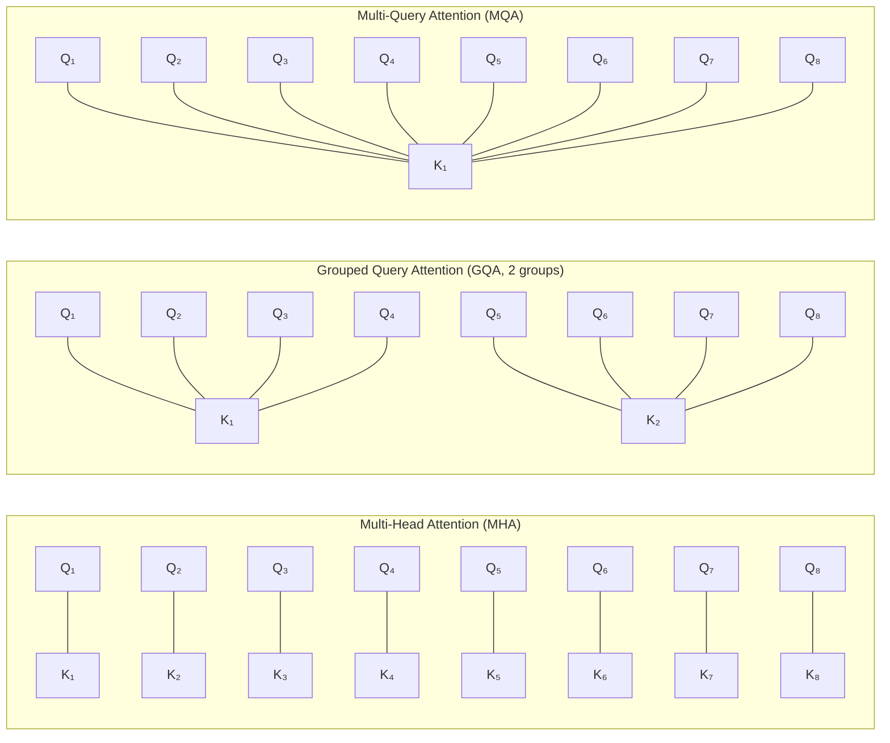

# Attention Mechanisms Evolution

## Why Attention Evolution Matters for Architects

Every improvement in attention mechanisms directly translates to:
- **Lower cost**: less compute per token
- **Longer context**: more information in a single request
- **Higher throughput**: more concurrent users per GPU
- **Lower latency**: faster time-to-first-token and tokens-per-second

If you're sizing infrastructure, estimating costs, or choosing models, you need to understand which attention variant a model uses and what that means for your deployment.

---

## Original Multi-Head Attention (MHA)

The baseline from "Attention Is All You Need":

```
For h heads, d_model dimensions:
  Each head has separate Q, K, V projections
  
  Parameters per layer:
    Q: d_model × d_model (all heads combined)
    K: d_model × d_model
    V: d_model × d_model
    O: d_model × d_model
    
  KV cache per token per layer:
    2 × num_heads × head_dim × bytes_per_param
    
  Example (Llama 1 65B): 
    2 × 64 × 128 × 2 bytes = 32 KB per token per layer
    × 80 layers = 2.56 MB per token
    × 4096 tokens = 10.5 GB per request
```

**The problem**: KV cache grows linearly with sequence length AND number of heads. At 128K context, this becomes prohibitive.

---

## Multi-Query Attention (MQA)

**Key insight**: Share K and V across all heads, keep Q separate.

```
Standard MHA:  64 Q heads, 64 K heads, 64 V heads
MQA:           64 Q heads, 1 K head, 1 V head
```

**Impact**:
- KV cache reduced by `num_heads`× (e.g., 64×)
- Slightly lower quality (shared representations are less expressive)
- Much faster decoding (less memory to read)

**Models using MQA**: PaLM, Falcon, StarCoder

**Architecture implication**: MQA models can serve 64× more concurrent requests in the same memory, but may have quality tradeoffs.

---

## Grouped Query Attention (GQA)

**Key insight**: Middle ground — group Q heads, share K/V within groups.

```
Standard MHA:  64 Q heads, 64 K heads, 64 V heads
GQA (8 groups): 64 Q heads, 8 K heads, 8 V heads  
MQA:           64 Q heads, 1 K head, 1 V head
```



**Models using GQA**:
- Llama 2 70B: 64 Q heads, 8 KV heads (8 groups)
- Llama 3: 32 Q heads, 8 KV heads
- Mistral 7B: 32 Q heads, 8 KV heads
- Gemma: 16 Q heads, 1 KV head (effectively MQA)

### KV Cache Comparison

| Model | Attention | KV Heads | Cache per Token per Layer | 4K Cache | 128K Cache |
|-------|-----------|----------|--------------------------|----------|------------|
| Llama 1 65B | MHA | 64 | 32 KB | 10.5 GB | 335 GB |
| Llama 2 70B | GQA-8 | 8 | 4 KB | 1.3 GB | 42 GB |
| Falcon 40B | MQA | 1 | 0.5 KB | 0.16 GB | 5.2 GB |

**Architecture decision**: GQA gives you 8× memory savings with minimal quality loss. This is why every modern model uses it.

---

## Flash Attention

**Key insight**: Not an approximation — exact same result as standard attention, just computed more efficiently by being aware of GPU memory hierarchy.

### The Problem Flash Attention Solves

Standard attention:
1. Compute QK^T → store full N×N matrix in HBM (slow memory)
2. Apply softmax → read/write full N×N matrix from/to HBM
3. Multiply by V → read full N×N matrix again

Flash Attention:
1. Tile the computation to fit in SRAM (fast memory)
2. Never materialize the full N×N attention matrix
3. Fuse all operations into one GPU kernel

### Performance Impact

| Operation | Standard | Flash Attention v2 |
|-----------|----------|-------------------|
| Memory | O(n²) | O(n) |
| Wall-clock speed | 1× | 2-4× faster |
| Exact result? | Yes | Yes (not approximate!) |

**Architecture implication**: Flash Attention is transparent — you get the same results faster. Always use it. It's now the default in all major frameworks.

### Flash Attention Versions

- **Flash Attention 1** (2022): Introduced IO-aware tiling
- **Flash Attention 2** (2023): Better parallelism, 2× faster than v1
- **Flash Attention 3** (2024): Hopper GPU optimizations (H100), FP8 support

---

## Ring Attention

**Key insight**: Distribute attention computation across multiple devices by passing KV blocks in a ring.

```
Device 1: Computes attention for tokens 1-32K
Device 2: Computes attention for tokens 32K-64K
Device 3: Computes attention for tokens 64K-96K
Device 4: Computes attention for tokens 96K-128K

KV blocks rotate around the ring, each device processes them in turn.
```

**Use case**: Models with extremely long contexts (1M+ tokens like Gemini)

**Architecture implication**: Ring attention enables contexts beyond what fits in single-GPU memory, but adds inter-device communication overhead.

---

## Sliding Window Attention

**Key insight**: Most tokens only need to attend to nearby tokens. Use local attention with a few global tokens.

```
Standard attention (4K context):
  Every token attends to all 4096 tokens
  
Sliding window (window=4096, on 128K context):
  Each token attends to its nearest 4096 tokens
  Information propagates through layers (receptive field grows with depth)
```

**Models using sliding window**:
- Mistral 7B: window size 4096 (but claims 32K effective through layer stacking)
- Longformer: sliding window + global tokens
- BigBird: sliding window + random + global

### Effective Context with Sliding Window

```
Effective receptive field = window_size × num_layers

Mistral 7B: 4096 × 32 = 131,072 tokens effective
(each layer propagates information one window further)
```

**Architecture decision**: Sliding window models use O(n) memory instead of O(n²), enabling very long contexts. But information from distant tokens is indirect (passed through intermediate layers), which may degrade quality for tasks requiring precise long-range retrieval.

---

## KV Cache: The Dominant Memory Consumer

### Why KV Cache Matters More Than Model Weights

For a single user, model weights dominate. But for concurrent serving:

```
Model weights (Llama 2 70B, INT4): 35 GB (shared across all requests)
KV cache per request (4K context, FP16): 1.3 GB (per user!)

10 concurrent users: 35 GB + 13 GB = 48 GB → fits on 1 A100 80GB
50 concurrent users: 35 GB + 65 GB = 100 GB → needs 2 A100s
```

### KV Cache Formula

```
KV_cache_bytes = 2 × num_layers × num_kv_heads × head_dim × seq_len × bytes_per_element

Where:
  2 = K and V
  num_layers = model depth
  num_kv_heads = number of KV heads (GQA reduces this)
  head_dim = typically 128
  seq_len = current sequence length (grows during generation)
  bytes_per_element = 2 (FP16) or 1 (INT8 KV cache)
```

### KV Cache Optimization Techniques

| Technique | Savings | Tradeoff |
|-----------|---------|----------|
| GQA | 4-8× | Minimal quality loss |
| KV cache quantization (INT8) | 2× | ~0.1% quality loss |
| PagedAttention (vLLM) | Better utilization | Implementation complexity |
| Prompt caching | Reuse prefill | Only for shared prefixes |
| KV cache eviction | Unbounded context | Quality loss for evicted tokens |

---

## Architecture Decisions Enabled by This Knowledge

### "Can we serve 128K context?"

```
Step 1: Calculate KV cache per request
  Llama 3 70B (GQA-8): 2 × 80 × 8 × 128 × 131072 × 2 = 42.9 GB per request
  
Step 2: Available memory after model weights
  A100 80GB - 35GB (INT4 weights) = 45 GB for KV cache
  
Answer: Barely 1 concurrent request at 128K. 
        Need multiple GPUs or shorter context.
```

### "Why is decoding slow?"

```
Decoding is memory-bandwidth bound:
  - Each token reads entire KV cache
  - A100 bandwidth: 2 TB/s
  - KV cache at 4K context (Llama 70B): 1.3 GB
  - Time to read: 1.3 GB / 2 TB/s = 0.65 ms per token
  - Theoretical max: ~1500 tokens/second per request
  
But also reading model weights each step:
  - 35 GB weights / 2 TB/s = 17.5 ms per token
  - Theoretical max: ~57 tokens/second per request
  
Batching helps: amortize weight reads across multiple requests
```

### "Memory budget per user session?"

```
Formula: context_length × layers × kv_heads × head_dim × 2 × 2

Llama 3 8B (GQA-4, 8K context):
  8192 × 32 × 4 × 128 × 2 × 2 = 537 MB per session

At 80 GB available: ~150 concurrent sessions
```

---

## Impact on Serving Infrastructure

### Batching Efficiency

Attention mechanism affects how well requests batch:

```
Continuous batching (vLLM, TensorRT-LLM):
  - Different requests at different sequence lengths
  - PagedAttention: non-contiguous KV cache blocks
  - Can add/remove requests dynamically

Prefill vs Decode batching:
  - Prefill is compute-bound → benefits from large batches
  - Decode is memory-bound → benefits from batching (amortize weight reads)
  - Mixed batching: prefill and decode in same batch hurts both
  - Disaggregated serving: separate prefill and decode clusters
```

### Memory Budget Template

```
Total GPU Memory Budget:
├── Model weights: params × bytes_per_param
├── KV cache: batch_size × kv_cache_per_request
├── Activation memory: ~10-20% of weights (during forward pass)
└── Framework overhead: ~1-2 GB

Example (A100 80GB, Llama 2 70B INT4, 4K context):
├── Weights: 35 GB
├── KV cache (batch=32): 32 × 1.3 GB = 41.6 GB
├── Activations: ~3 GB
└── Overhead: ~1 GB
Total: 80.6 GB → batch_size=32 is the max!
```

---

## Anti-Patterns

### Anti-Pattern: Ignoring Attention Complexity When Choosing Context Length

**Wrong**: "The model supports 128K context, so let's use it for all requests."
**Right**: 128K context costs 1024× more compute than 4K. Use the minimum context needed.
**Fix**: Implement dynamic context sizing — truncate or summarize when possible.

### Anti-Pattern: Not Accounting for KV Cache in Capacity Planning

**Wrong**: "We need 35GB for the model, so one A100 serves all users."
**Right**: KV cache per user often exceeds model weight memory.
**Fix**: Calculate max concurrent users as: (GPU_memory - weights - overhead) / kv_cache_per_user.

### Anti-Pattern: Assuming Linear Scaling of Throughput

**Wrong**: "2× GPUs = 2× throughput."
**Right**: Communication overhead for tensor parallelism, load imbalance for expert parallelism.
**Fix**: Benchmark actual throughput with realistic workloads before committing.

---

## Quick Reference: Attention Mechanism Selection

```
┌─────────────────────────────────────────────────────────────┐
│ Choosing a Model by Attention Mechanism                      │
├─────────────────────────────────────────────────────────────┤
│                                                              │
│ Need maximum quality?                                        │
│   → MHA (but expensive at long context)                     │
│                                                              │
│ Need long context + many concurrent users?                   │
│   → GQA with Flash Attention (Llama 3, Mistral)            │
│                                                              │
│ Need maximum throughput, quality acceptable?                 │
│   → MQA (Falcon, PaLM)                                     │
│                                                              │
│ Need 1M+ tokens?                                            │
│   → Ring Attention + Sliding Window (Gemini)                │
│                                                              │
│ Always use:                                                  │
│   → Flash Attention (transparent speedup)                   │
│   → PagedAttention for serving (vLLM)                       │
│   → KV cache quantization (INT8) for 2× capacity           │
└─────────────────────────────────────────────────────────────┘
```

---

## Key Takeaways

1. **GQA is the standard** — 8× KV cache reduction with minimal quality loss
2. **Flash Attention is free performance** — same result, 2-4× faster
3. **KV cache dominates serving memory** — plan for it, not just model weights
4. **Context length is not free** — O(n²) cost, budget accordingly
5. **Prefill ≠ decode** — different bottlenecks, may need different infrastructure
6. **Sliding window enables long context cheaply** — but with quality tradeoffs for distant information
