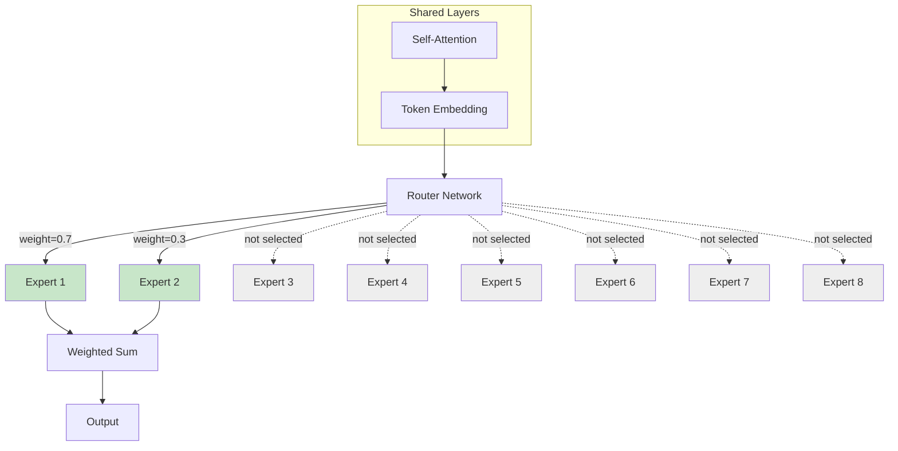

# Mixture of Experts (MoE)

## What is MoE?

A Mixture of Experts model replaces the dense feed-forward network (FFN) in each transformer layer with multiple "expert" FFNs and a router that selects which experts to activate for each token.

**Key property**: Only a subset of parameters activate per token, giving you a larger model (more capacity) at lower per-token compute cost.

---

## Why MoE Matters for Architects

| Dense Model | MoE Model |
|-------------|-----------|
| All parameters activate every token | Only top-k experts activate |
| Compute ∝ total params | Compute ∝ active params |
| Memory = total params | Memory = total params (still!) |
| Predictable latency | Slightly variable (routing) |

**The catch**: You need ALL experts in memory even though only some activate. MoE trades memory for compute efficiency.

---

## Architecture



### Components

**Router (Gate Network)**:
- Small neural network: `gate(x) = softmax(x × W_gate)`
- Selects top-k experts based on input token
- Outputs routing weights for weighted combination

**Experts**:
- Each expert is a standard FFN (same architecture as dense model FFN)
- Typically 8-64 experts per layer
- Each expert specializes in different token patterns

**Load Balancing Loss**:
- Auxiliary loss to prevent all tokens routing to same expert
- Without it: "expert collapse" — some experts never train

---

## Key Concepts

### Router Mechanisms

| Type | Description | Used By |
|------|-------------|---------|
| Top-k routing | Select k experts with highest gate scores | Mixtral (k=2) |
| Expert choice | Each expert selects its top tokens | Switch Transformer |
| Soft routing | All experts activated with learned weights | Soft MoE |

### Expert Granularity

```
Mixtral 8x7B:
  - 8 experts per MoE layer
  - Top-2 routing (2 active per token)
  - Each expert ≈ 7B FFN parameters
  - Total params: ~47B
  - Active params per token: ~13B
  
DBRX:
  - 16 experts per MoE layer
  - Top-4 routing
  - Finer-grained experts
  - Total params: 132B
  - Active params: ~36B

GPT-4 (rumored):
  - 16 experts
  - ~1.8T total params (estimated)
  - ~280B active per token (estimated)
```

---

## Models Using MoE

| Model | Total Params | Active Params | Experts | Top-k | Notes |
|-------|-------------|---------------|---------|-------|-------|
| Mixtral 8x7B | 47B | 13B | 8 | 2 | First open-source competitive MoE |
| Mixtral 8x22B | 141B | 39B | 8 | 2 | Matches Llama 2 70B quality |
| DBRX | 132B | 36B | 16 | 4 | Fine-grained experts |
| Switch Transformer | 1.6T | ~1B | 2048 | 1 | Research, extreme sparsity |
| Grok-1 | 314B | ~86B | 8 | 2 | xAI's model |
| DeepSeek-V2 | 236B | 21B | 160 | 6 | Very fine-grained |
| GPT-4 (rumored) | ~1.8T | ~280B | 16 | 2 | Unconfirmed |

---

## Inference Implications

### Memory: Total Params Must Fit

```
Mixtral 8x7B (FP16):
  Total memory = 47B × 2 bytes = 94 GB
  (NOT 13B × 2 = 26 GB!)
  
  You need all experts in memory because any token
  might route to any expert.

Mixtral 8x7B (INT4):
  Total memory = 47B × 0.5 bytes = 23.5 GB
  → Fits on single A100 80GB with room for KV cache
```

### Compute: Only Active Params Matter

```
Mixtral 8x7B inference speed:
  - Active params: 13B → compute cost similar to 13B dense model
  - But quality closer to 30-40B dense model
  
  Speed comparison (tokens/second on A100):
    Llama 2 13B: ~80 tok/s
    Mixtral 8x7B: ~60 tok/s (slightly slower due to routing overhead)
    Llama 2 70B: ~20 tok/s
    
  Quality comparison:
    Mixtral 8x7B ≈ Llama 2 70B on most benchmarks
```

### The MoE Value Proposition

```
┌──────────────────────────────────────────────────────┐
│ MoE: "70B quality at 13B compute, but 47B memory"   │
│                                                       │
│ Dense 70B: High quality, slow inference, 140GB memory │
│ Dense 13B: Lower quality, fast inference, 26GB memory │
│ MoE 8x7B:  High quality, fast inference, 94GB memory │
│                                                       │
│ MoE wins on: quality-per-FLOP                        │
│ MoE loses on: memory efficiency                      │
└──────────────────────────────────────────────────────┘
```

---

## Serving MoE Models

### Expert Parallelism

For models too large for one GPU, distribute experts across devices:

```
GPU 0: Experts 1-4 + shared layers
GPU 1: Experts 5-8 + shared layers

Problem: token routing may send most tokens to one GPU
Solution: load balancing + all-to-all communication
```

### Batching Challenges

```
Dense model batching:
  All tokens in batch go through same computation path
  → Perfect parallelism

MoE batching:
  Token 1 → Expert 2, 5
  Token 2 → Expert 1, 3
  Token 3 → Expert 2, 7
  Token 4 → Expert 1, 5
  
  Expert 2: processes tokens 1, 3
  Expert 7: processes only token 3
  Expert 4: processes nothing
  
  → Load imbalance → some experts idle → reduced GPU utilization
```

### Expert Offloading

For consumer hardware or cost optimization:

```
Strategy: Keep active experts on GPU, offload others to CPU/disk

Mixtral 8x7B with offloading:
  - Keep 2-3 most popular experts on GPU
  - Load others on demand from CPU RAM
  - Latency penalty: ~5-10ms per expert load
  - Enables running on 24GB GPU (but slowly)
```

---

## Quality Characteristics

### Expert Specialization

Research shows experts tend to specialize:
- Some experts handle syntax/structure
- Some experts handle specific domains (code, math, languages)
- Some experts handle common patterns (high-frequency tokens)

### Expert Collapse

**Problem**: Without load balancing, some experts receive no tokens and never learn useful patterns.

**Detection**: Monitor expert utilization — if any expert gets <5% of tokens, it may be collapsed.

**Impact on architects**: Collapsed experts waste memory. A model with 8 experts where 2 are collapsed is effectively a 6-expert model taking 8-expert memory.

### Routing Instability

During generation, similar tokens may route to different experts across batches:
- Minor non-determinism in outputs
- Usually negligible in practice
- Can matter for reproducibility requirements

---

## Architecture Decisions

### "Should we use Mixtral 8x7B or Llama 2 70B?"

```
Mixtral 8x7B:
  ✓ 3-4× faster inference
  ✓ Similar quality on most tasks
  ✗ Needs 94GB memory (FP16) vs 140GB for Llama 70B
  ✗ Less predictable latency (routing variance)
  
  Best for: High-throughput serving where speed matters
  
Llama 2 70B:
  ✓ Simpler serving (no routing)
  ✓ More predictable latency
  ✓ Better studied (more fine-tuning recipes)
  ✗ 3-4× slower per token
  
  Best for: Quality-critical applications with latency budget
```

### "Can we quantize MoE models?"

```
Yes, but with caveats:
  - Expert weights quantize well (standard FFN)
  - Router weights are small, keep at higher precision
  - INT4 Mixtral 8x7B: 23.5 GB → fits single A100
  - Quality loss similar to dense model quantization (~1-2% degradation)
  
Recommendation: INT4 quantization for MoE is well-proven. Use it.
```

### "How to handle MoE load imbalance in production?"

```
Strategies:
  1. Capacity factor: allow each expert to process at most C × (N/E) tokens
     (where N=batch tokens, E=num_experts, C=1.25 typical)
  2. Drop tokens exceeding capacity (quality risk)
  3. Use expert parallelism with good load balancing
  4. Accept ~20-30% GPU underutilization as cost of MoE flexibility
```

### "MoE for fine-tuning?"

```
Fine-tuning MoE models:
  - LoRA works: apply adapters to expert FFNs
  - Full fine-tuning: risky, can destabilize routing
  - Expert freezing: fine-tune only router + subset of experts
  
Recommendation: LoRA on all experts + router fine-tuning
Memory for fine-tuning: full model + optimizer states = 3-4× model size
```

---

## Anti-Patterns

### Anti-Pattern: Treating MoE Like Dense for Capacity Planning

**Wrong**: "Mixtral has 13B active params, so plan memory like a 13B model."
**Right**: You need 47B params in memory. Memory planning uses total params.
**Fix**: Always use total parameter count for memory budgets.

### Anti-Pattern: Assuming Uniform Expert Load

**Wrong**: "8 experts on 8 GPUs, each gets 1/8 of the work."
**Right**: Popular experts may get 3-4× more tokens than unpopular ones.
**Fix**: Over-provision popular experts, implement dynamic load balancing.

### Anti-Pattern: Ignoring Routing Overhead

**Wrong**: "Active params = 13B, so speed equals a 13B dense model."
**Right**: Routing computation + communication adds 10-30% overhead.
**Fix**: Benchmark actual throughput, don't extrapolate from dense models.

---

## Staff Decision Framework: When MoE Makes Sense

```
┌──────────────────────────────────────────────────────────┐
│ Use MoE when:                                             │
│  ✓ You need high quality AND high throughput              │
│  ✓ You have sufficient memory (can hold all experts)     │
│  ✓ Latency variance is acceptable                        │
│  ✓ Workload is diverse (benefits from specialization)    │
│                                                           │
│ Use Dense when:                                           │
│  ✓ Memory is the primary constraint                      │
│  ✓ Latency must be highly predictable                    │
│  ✓ Workload is narrow/specialized                        │
│  ✓ You need simplest possible serving infrastructure     │
│                                                           │
│ Rule of thumb:                                            │
│  MoE = "pay with memory, save on compute"                │
│  Dense = "pay with compute, save on memory"              │
└──────────────────────────────────────────────────────────┘
```

---

## Key Takeaways

1. **MoE gives you more model for less compute** — but not less memory
2. **Memory planning uses total params** — all experts must be loaded
3. **Compute planning uses active params** — only top-k experts fire per token
4. **Batching is harder** — different tokens route differently, causing load imbalance
5. **Quantization works** — INT4 MoE is practical and well-tested
6. **Expert parallelism ≠ tensor parallelism** — different distribution strategy needed
7. **Quality is competitive** — Mixtral 8x7B ≈ Llama 2 70B at 3-4× the speed
