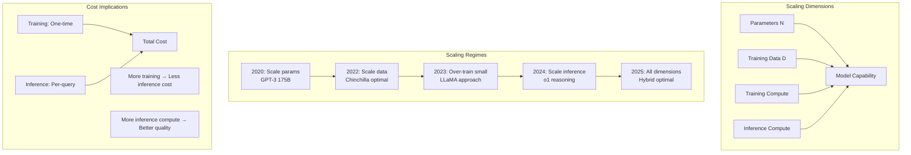

# Scaling Laws and Emergent Capabilities

## Why This Matters for System Architects

Understanding scaling laws lets you **predict model capabilities before spending millions on training**,
make informed build-vs-buy decisions, and size infrastructure appropriately. Emergence tells you
which capabilities require which scale — critical for deciding between hosted APIs and self-hosted models.

---

## 1. Chinchilla Scaling Laws

### The Core Insight

DeepMind's Chinchilla paper (2022) established that **optimal training** requires balancing
model parameters and training tokens in roughly a 1:20 ratio.

```
Optimal tokens ≈ 20 × parameters
```

### Historical Context

| Model | Parameters | Training Tokens | Ratio | Status |
|-------|-----------|-----------------|-------|--------|
| GPT-3 | 175B | 300B | 1.7:1 | Under-trained |
| Chinchilla | 70B | 1.4T | 20:1 | Compute-optimal |
| LLaMA | 7B | 1T | 143:1 | Over-trained (intentionally) |
| LLaMA-2 | 70B | 2T | 29:1 | Slightly over-trained |
| LLaMA-3 | 8B | 15T | 1875:1 | Massively over-trained |

### Why Over-Training is Now Standard

Chinchilla-optimal minimizes **training cost**. But in production, **inference cost dominates**.

```
Total cost = Training cost + (Inference cost × Requests × Lifetime)
```

A smaller model trained longer:
- Costs more to train (more tokens processed)
- Costs less per inference (fewer parameters to serve)
- Breaks even after ~months of production serving

This is why LLaMA-3 8B was trained on 15T tokens — it performs like a much larger
Chinchilla-optimal model but serves at 8B-parameter inference cost.

### The Kaplan vs Hoffmann Debate

| Aspect | Kaplan (OpenAI, 2020) | Hoffmann (DeepMind, 2022) |
|--------|----------------------|--------------------------|
| Optimal ratio | Params scale faster | Equal scaling |
| Recommendation | Bigger models, less data | Balanced approach |
| Industry impact | Led to GPT-3's 175B | Led to Chinchilla's 70B |
| Current consensus | Outdated | Superseded by inference-aware |

---

## 2. Compute Estimation

### The 6ND Rule

For a transformer with N parameters trained on D tokens:

```
Training FLOPs ≈ 6 × N × D
```

The factor of 6 comes from:
- Forward pass: 2ND (multiply-accumulate for each parameter on each token)
- Backward pass: 4ND (gradient computation + parameter update)

### Real-World Examples

```
GPT-3 (175B params, 300B tokens):
  FLOPs = 6 × 175×10⁹ × 300×10⁹ = 3.15×10²³

GPT-4 (estimated ~1.8T params MoE, ~13T tokens):
  FLOPs = 6 × 1.8×10¹² × 13×10¹² = 1.4×10²⁶
  (Active params per token much less due to MoE)

LLaMA-3 8B (8B params, 15T tokens):
  FLOPs = 6 × 8×10⁹ × 15×10¹² = 7.2×10²³
```

### Cost Estimation

```
Cost ≈ FLOPs / (GPU_FLOPS × Utilization × Seconds_per_dollar)

H100 specs:
  - BF16 tensor: ~1000 TFLOPS (10¹⁵)
  - Utilization: ~40% (MFU) in practice
  - Cost: ~$2-3/GPU-hour (cloud)

Example: Training a 7B model on 1T tokens
  FLOPs = 6 × 7×10⁹ × 10¹² = 4.2×10²²
  GPU-hours = 4.2×10²² / (10¹⁵ × 0.4 × 3600) ≈ 29,000 GPU-hours
  Cost ≈ 29,000 × $2.5 ≈ $72,500
```

---

## 3. Emergent Capabilities

### What is Emergence?

Capabilities that are **near-zero below a threshold** and **appear suddenly** above it.

```
Performance
    │
    │                          ╭─────── capability present
    │                         ╱
    │                        │
    │                       │
    │  ─────────────────────╯
    │  capability absent
    └────────────────────────────────── Scale (params × tokens)
                            ↑
                       threshold
```

### Known Emergence Thresholds (Approximate)

| Capability | Threshold | Example Models |
|-----------|-----------|---------------|
| Basic language | ~100M params | GPT-2 small |
| Coherent paragraphs | ~1B params | GPT-2 large |
| Few-shot learning | ~10B params | GPT-3 |
| Chain-of-thought reasoning | ~60-100B params | PaLM, GPT-3.5 |
| Complex code generation | ~100B+ params | Codex, GPT-4 |
| Mathematical reasoning | ~100B+ params | Minerva, GPT-4 |
| Theory of mind tasks | ~100B+ params | GPT-4 |
| Multi-step planning | ~500B+ (or reasoning models) | GPT-4, o1 |

### The Emergence Debate

Recent work suggests emergence may be a **measurement artifact**:
- With continuous metrics (instead of exact-match), improvement is often smooth
- "Emergence" may reflect task difficulty thresholds, not model phase transitions
- Practical implication: capabilities may be **coaxable** from smaller models with better prompting

### Implications for Architects

1. **Don't assume a 7B model can't do X** — try it with good prompting first
2. **Don't assume a 7B model CAN do X** — some capabilities genuinely need scale
3. **Test at target scale** — benchmarks at one scale don't predict another
4. **Reasoning models change the equation** — o1-mini (small) outperforms GPT-4 on math

---

## 4. The "Small Model + RAG" vs "Large Model" Tradeoff

### Decision Framework

```
┌─────────────────────────────────────────────────────────────┐
│                    DECISION MATRIX                           │
├─────────────────────┬───────────────────┬───────────────────┤
│ Factor              │ Small + RAG       │ Large Model       │
├─────────────────────┼───────────────────┼───────────────────┤
│ Latency             │ +retrieval time   │ Single call       │
│ Cost per query      │ Low ($0.001)      │ High ($0.01-0.10) │
│ Knowledge freshness │ Real-time         │ Training cutoff   │
│ Reasoning depth     │ Limited           │ Strong            │
│ Hallucination       │ Grounded by docs  │ Higher risk       │
│ Privacy             │ On-premise easy   │ Often cloud-only  │
│ Maintenance         │ Index + model     │ API only          │
│ Multi-hop reasoning │ Weak              │ Strong            │
│ Code generation     │ Weak at small     │ Strong            │
└─────────────────────┴───────────────────┴───────────────────┘
```

### When to Choose Each

**Small model + RAG** when:
- Domain knowledge changes frequently
- Privacy requirements mandate on-premise
- Budget is constrained at scale (>10K queries/day)
- Tasks are mostly retrieval + simple synthesis
- Latency budget allows retrieval step

**Large model (API)** when:
- Tasks require complex reasoning chains
- Code generation or mathematical reasoning needed
- Low volume, high value per query
- Rapid prototyping / time to market critical
- Multi-modal understanding required

### The Hybrid Pattern (Most Common in Production)

```
User Query
    │
    ├─── Router (small model or classifier)
    │         │
    │         ├─── Simple queries → Small model + RAG
    │         │
    │         ├─── Complex reasoning → Large model
    │         │
    │         └─── Code/math → Reasoning model (o1/o3)
    │
    └─── Response
```

---

## 5. Inference Scaling Laws

### The New Frontier (2024-2025)

Instead of only scaling training compute, **scale inference compute**:

```
Performance = f(training_compute) + g(inference_compute)
```

### How Inference Scaling Works

| Technique | Compute Multiplier | Capability Gain |
|-----------|-------------------|-----------------|
| Single pass | 1x | Baseline |
| Best-of-N sampling | N× | +5-15% on benchmarks |
| Chain-of-thought | 2-5× tokens | +20-40% on reasoning |
| Tree search (o1-style) | 10-100× | +50-100% on math/code |
| Verification loops | 2-10× | Reduced errors |

### Implications for System Design

```
Traditional: Optimize for tokens/second throughput
Reasoning era: Optimize for quality under compute budget

Budget thinking:
  - Simple query: 100 tokens generated, 0.1 seconds
  - Complex query: 10,000 tokens generated (mostly "thinking"), 30 seconds
  - Hard problem: 100,000 tokens generated, 5 minutes

Infrastructure must handle 1000x variation in compute per request.
```

### Cost Model for Reasoning

```
Cost per query = input_tokens × input_price + output_tokens × output_price

Standard GPT-4o query:
  500 input + 200 output = $0.003

o1-pro on hard math problem:
  500 input + 50,000 reasoning + 500 output = $0.80

That's a 250x cost difference for the same user question.
```

---

## 6. Scaling Curves Visualization



---

## 7. Staff-Level Framework: Model Selection Based on Scaling Laws

### Step 1: Define Requirements

```
1. What capabilities are needed?
   - Simple text generation → 7-8B sufficient
   - Code generation → 30B+ or specialized
   - Complex reasoning → 70B+ or reasoning model
   - Multi-modal → Vision-capable model

2. What are the constraints?
   - Latency: <100ms, <1s, <10s, unbounded?
   - Cost: per-query budget?
   - Privacy: can data leave premises?
   - Volume: queries per day?
   - Accuracy: what error rate is acceptable?
```

### Step 2: Estimate Total Cost of Ownership

```python
# Simplified TCO model
def estimate_tco(
    model_params_B,        # in billions
    queries_per_day,
    months,
    latency_requirement_ms
):
    # Self-hosted cost
    gpus_needed = model_params_B * 2 / 80  # 2 bytes/param, 80GB per H100
    gpu_cost_month = gpus_needed * 2500    # ~$2500/GPU/month cloud
    self_hosted = gpu_cost_month * months

    # API cost (rough)
    tokens_per_query = 1000
    api_cost_per_token = model_params_B * 0.000001  # rough scaling
    api_monthly = queries_per_day * 30 * tokens_per_query * api_cost_per_token
    api_total = api_monthly * months

    return {
        'self_hosted': self_hosted,
        'api': api_total,
        'breakeven_months': self_hosted / api_monthly if api_monthly > 0 else float('inf')
    }
```

### Step 3: Match Capability to Scale

```
┌──────────────────────────────────────────────────────┐
│ Task Complexity → Minimum Viable Model               │
├──────────────────────────────────────────────────────┤
│ Classification, extraction    → 1-3B fine-tuned      │
│ Summarization, simple QA      → 7-8B + RAG           │
│ Code completion               → 7-8B code-specialized│
│ General assistant             → 30-70B               │
│ Complex reasoning             → 70B+ or reasoning    │
│ Research-level problems       → Frontier + reasoning │
└──────────────────────────────────────────────────────┘
```

---

## 8. Anti-Patterns

### Anti-Pattern 1: "Bigger is Always Better"

```
WRONG: "Let's use GPT-4 for everything"

WHY: 
  - 90% of production queries don't need frontier capability
  - Cost difference is 10-100x
  - Latency difference is 3-10x
  - Many tasks are BETTER with smaller, fine-tuned models

RIGHT: Route by complexity, use smallest model that meets quality bar
```

### Anti-Pattern 2: "We'll Fine-Tune Our Way to GPT-4"

```
WRONG: "Fine-tune 7B to match GPT-4 on reasoning"

WHY:
  - Fine-tuning teaches FORMAT, not CAPABILITY
  - You can't fine-tune emergence into existence
  - Distillation has hard limits based on student capacity

RIGHT: Fine-tune for format/domain, use large models for capability
```

### Anti-Pattern 3: "Scaling Laws are Deterministic"

```
WRONG: "10x compute = predictable improvement"

WHY:
  - Scaling laws predict LOSS, not task performance
  - Loss → capability mapping is non-linear
  - Data quality matters as much as quantity
  - Architecture choices shift the curve

RIGHT: Use scaling laws as rough guides, always benchmark on YOUR tasks
```

### Anti-Pattern 4: "Ignore Inference Cost During Model Selection"

```
WRONG: Choosing model based only on benchmark scores

WHY:
  - A model 2% better but 10x more expensive rarely wins
  - Inference cost compounds: 1M queries × $0.01 = $10K/day
  - Batch vs real-time has 5-10x cost difference

RIGHT: Score = Quality × (1 / Cost) × (1 / Latency), weighted by priorities
```

### Anti-Pattern 5: "One Model for All Tasks"

```
WRONG: Single model endpoint for classification + generation + reasoning

WHY:
  - Wastes compute on simple tasks
  - Under-serves complex tasks
  - No independent scaling
  - Single point of failure

RIGHT: Model cascade / routing architecture
```

---

## 9. Real Numbers (2024-2025 Estimates)

### Training Costs

| Model | Estimated Cost | Hardware | Time |
|-------|---------------|----------|------|
| GPT-4 | $100M+ | ~25,000 A100s | ~3 months |
| LLaMA-3 405B | ~$50M | 16,000 H100s | ~2 months |
| LLaMA-3 70B | ~$10M | 6,000 H100s | ~1 month |
| LLaMA-3 8B | ~$2M | 2,000 H100s | ~2 weeks |
| Mistral 7B | ~$1-2M | ~1,000 A100s | ~2 weeks |
| Fine-tune 7B (LoRA) | $10-50 | 1 A100 | Hours |
| Fine-tune 70B (LoRA) | $100-500 | 4-8 A100s | Hours |
| Fine-tune 7B (full) | $500-5,000 | 8 A100s | Days |

### Inference Costs (per 1M tokens, 2025 API pricing)

| Model | Input | Output | Reasoning |
|-------|-------|--------|-----------|
| GPT-4o | $2.50 | $10.00 | N/A |
| GPT-4o-mini | $0.15 | $0.60 | N/A |
| o1 | $15.00 | $60.00 | Included in output |
| o3-mini | $1.10 | $4.40 | Included |
| Claude 3.5 Sonnet | $3.00 | $15.00 | N/A |
| Claude 3 Haiku | $0.25 | $1.25 | N/A |
| LLaMA-3 70B (self-hosted) | ~$0.50 | ~$0.50 | N/A |
| LLaMA-3 8B (self-hosted) | ~$0.05 | ~$0.05 | N/A |

### Hardware for Self-Hosting

```
Rule of thumb: Model needs ~2× parameters in bytes of GPU memory (BF16)

7B model:   14GB → 1× RTX 4090 or 1× A100-40GB
13B model:  26GB → 1× A100-40GB
34B model:  68GB → 1× A100-80GB or 2× A100-40GB
70B model:  140GB → 2× A100-80GB or 4× A100-40GB
405B model: 810GB → 10-12× H100-80GB

With quantization (INT4):
7B model:   3.5GB → Consumer GPU, even CPU
13B model:  6.5GB → 1× RTX 3060 12GB
70B model:  35GB → 1× A100-40GB
405B model: 200GB → 3× H100-80GB
```

---

## 10. Key Takeaways

1. **Chinchilla is outdated** — modern practice over-trains small models for inference efficiency
2. **6ND gives training FLOPs** — use it to sanity-check cost estimates
3. **Emergence is real but fuzzy** — always benchmark your specific task
4. **Inference scaling is the new frontier** — budget 10-100x tokens for reasoning tasks
5. **Route by complexity** — use the smallest model that meets your quality bar
6. **Total cost = training + inference × volume × time** — inference usually dominates
7. **Fine-tuning teaches format, not capability** — don't expect miracles from small models
8. **Quantization is free performance** — INT4 with minimal quality loss for most tasks
9. **The landscape changes every 6 months** — re-evaluate model choices quarterly
10. **Scaling laws are guides, not gospel** — always validate on your specific workload

---

## References

- Kaplan et al., "Scaling Laws for Neural Language Models" (2020)
- Hoffmann et al., "Training Compute-Optimal Large Language Models" (Chinchilla, 2022)
- Wei et al., "Emergent Abilities of Large Language Models" (2022)
- Schaeffer et al., "Are Emergent Abilities a Mirage?" (2023)
- Snell et al., "Scaling LLM Test-Time Compute" (2024)
- Meta, "LLaMA 3 Technical Report" (2024)
