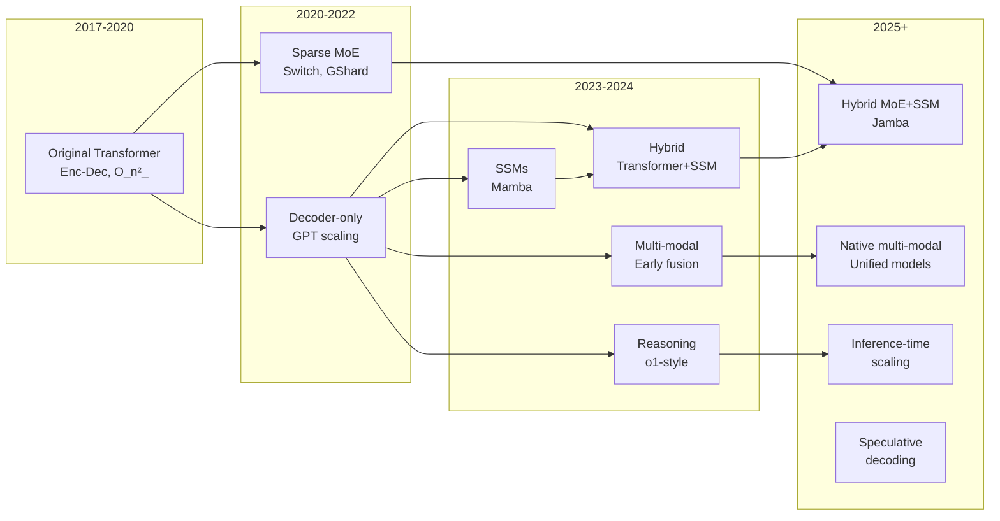

# Model Architecture Trends (2025)

## Why This Matters for System Architects

Architecture choices determine **latency, memory, cost, and capability ceiling**. Understanding
current trends helps you predict which models will dominate, design infrastructure that adapts,
and make informed bets on emerging approaches.

---

## 1. State Space Models (SSMs) — The Mamba Revolution

### The Problem with Transformers

Standard attention is O(n²) in sequence length:
- 4K context: manageable
- 128K context: 1024× more compute than 4K
- 1M context: 62,500× more compute than 4K

### How SSMs Work

State Space Models process sequences in **O(n) time and O(1) memory per step**:

```
Traditional RNN:     h_t = f(h_{t-1}, x_t)     — sequential, can't parallelize
Transformer:         y = Attention(Q, K, V)     — parallel, but O(n²)
SSM (Mamba):         h_t = A·h_t-1 + B·x_t     — parallel training, O(n) inference
                     y_t = C·h_t
```

### Mamba's Key Innovation: Selective State Spaces

Unlike fixed-parameter SSMs, Mamba makes A, B, C **input-dependent**:

```
Standard SSM: A, B, C are fixed matrices (like a fixed filter)
Mamba: A, B, C = f(input) — selective, content-aware

This gives Mamba the "in-context learning" ability that made transformers powerful,
while keeping the linear-time complexity of SSMs.
```

### Complexity Comparison

| Operation | Transformer | Mamba | Practical Impact |
|-----------|-------------|-------|-----------------|
| Training (sequence) | O(n²·d) | O(n·d·s) | Mamba 2-5× faster at long sequences |
| Inference (per token) | O(n·d) grows with context | O(d·s) constant | Mamba wins at long context |
| Memory (KV cache) | O(n·d) grows | O(d·s) fixed | Mamba: no cache explosion |
| Parallelism | Excellent | Good (scan) | Transformer slightly better on GPU |

Where: n = sequence length, d = model dimension, s = state size

### When SSMs Make Sense

```
USE SSMs WHEN:
  ✓ Very long sequences (>100K tokens)
  ✓ Streaming/real-time processing
  ✓ Memory-constrained deployment
  ✓ Audio, genomics, time-series
  ✓ Continuous input processing

USE TRANSFORMERS WHEN:
  ✓ Complex reasoning (attention patterns matter)
  ✓ In-context learning is critical
  ✓ Retrieval-heavy tasks (needle-in-haystack)
  ✓ Existing ecosystem/tooling matters
  ✓ Short-medium sequences (<32K)
```

---

## 2. Hybrid Architectures (Transformer + SSM)

### The Best of Both Worlds

Pure Mamba struggles with tasks requiring precise recall from context.
Pure Transformers are expensive at long sequences. Solution: **combine them**.

### Jamba Architecture (AI21, 2024)

```
Layer pattern: [Mamba] [Mamba] [Attention] [Mamba] [Mamba] [Attention] ...

Ratio: ~7:1 Mamba-to-Attention layers

Benefits:
  - 80% of layers are O(n) → fast for long sequences
  - 20% attention layers → precise recall when needed
  - KV cache 8× smaller than pure transformer equivalent
  - Throughput 3× higher at 256K context
```

### Zamba Architecture (Zyphra, 2024)

```
Shared attention layer interleaved with Mamba blocks:

[Mamba₁] → [Shared Attention] → [Mamba₂] → [Shared Attention] → ...

Key insight: One attention layer (shared weights) gives most of the
recall benefit while keeping parameter count low.
```

### Design Implications

```
Infrastructure for hybrid models:
  - Memory planning: KV cache is smaller but non-zero
  - Batch scheduling: SSM layers have different compute profiles
  - Hardware: SSM layers favor memory bandwidth, attention favors compute
  - Quantization: May need different strategies per layer type
```

---

## 3. Multi-Modal Architectures

### Early Fusion vs Late Fusion

```
EARLY FUSION (Gemini-style):
  ┌──────────────┐
  │ Image tokens │──┐
  │              │  │    ┌───────────────────┐
  └──────────────┘  ├───►│ Unified           │──► Output
  ┌──────────────┐  │    │ Transformer       │
  │ Text tokens  │──┘    └───────────────────┘
  └──────────────┘

  - All modalities share the same attention layers
  - Can learn cross-modal relationships deeply
  - Expensive: all modalities compete for context window
  - Examples: Gemini, Fuyu

LATE FUSION (GPT-4V-style):
  ┌──────────────┐     ┌─────────────┐
  │ Image        │────►│ Vision      │──┐
  │              │     │ Encoder     │  │  ┌──────────────┐
  └──────────────┘     └─────────────┘  ├─►│ Language     │──► Output
  ┌──────────────┐                      │  │ Model (LLM)  │
  │ Text         │──────────────────────┘  └──────────────┘
  └──────────────┘

  - Separate encoders per modality
  - Cross-modal connection via projection layers
  - Cheaper: vision encoder processes image once
  - Examples: LLaVA, GPT-4V, Claude Vision
```

### Multi-Modal Architecture Patterns

| Pattern | Training Cost | Inference Cost | Cross-Modal Understanding |
|---------|--------------|----------------|--------------------------|
| Early fusion | Very high | High | Deep |
| Late fusion (frozen LLM) | Low | Medium | Shallow |
| Late fusion (fine-tuned) | Medium | Medium | Moderate |
| Hybrid (some shared layers) | High | Medium-High | Good |

### Audio and Video

```
Audio architectures (Whisper-style):
  Audio → Mel spectrogram → Encoder → Text decoder
  
  Trend: Direct audio tokens into LLM (GPT-4o voice)
  - No intermediate text representation
  - Preserves tone, emotion, timing
  - Enables real-time conversation

Video architectures:
  Video → Sample frames → Vision encoder → Temporal attention → LLM
  
  Challenge: 30fps × 1080p × 60sec = enormous token count
  Solutions:
    - Frame sampling (1-2 fps)
    - Temporal compression tokens
    - Hierarchical encoding
```

### Practical Implications for Architects

```
Multi-modal infrastructure needs:
  1. Preprocessing pipelines per modality
  2. Token budget management (image = 1000+ tokens)
  3. Caching strategies differ (image embeddings reusable)
  4. Latency varies by modality (image encoding: 100-500ms)
  5. Cost estimation must account for modality mix
```

---

## 4. Reasoning Models (o1-Style)

### The Paradigm Shift

Traditional LLMs: generate answer directly (System 1 thinking)
Reasoning models: think step-by-step internally, then answer (System 2 thinking)

```
Traditional:
  Input → [Model] → Output
  Tokens: ~200

Reasoning:
  Input → [Model thinks: 5,000-100,000 tokens] → Output
  Total tokens: 5,200-100,200
  
  The "thinking" tokens are the model:
    - Exploring solution approaches
    - Backtracking from dead ends
    - Verifying intermediate steps
    - Self-correcting errors
```

### How Reasoning Models Are Trained

```
1. Generate training data:
   - Use large model to solve problems step-by-step
   - Verify solutions (math: check answer, code: run tests)
   - Keep only correct reasoning chains

2. Train with reinforcement learning:
   - Reward: correct final answer
   - The model learns WHEN to think more
   - Learns to allocate compute based on difficulty

3. Result:
   - Model generates internal "thinking" tokens
   - These tokens are not shown to user (hidden CoT)
   - Quality scales with thinking budget
```

### Architecture Implications

```
Reasoning models require:
  ┌─────────────────────────────────────────────────────┐
  │ Standard model serving:                              │
  │   - Fixed compute per token                         │
  │   - Predictable latency                             │
  │   - Simple batching                                 │
  │                                                     │
  │ Reasoning model serving:                            │
  │   - Variable compute (10-1000× range)              │
  │   - Unpredictable latency (1s to 5min)            │
  │   - Complex scheduling (short vs long thinks)      │
  │   - Streaming partial results                      │
  │   - Budget limits per request                      │
  │   - Timeout handling                               │
  └─────────────────────────────────────────────────────┘
```

### Designing Systems for Reasoning Models

```
Key design decisions:

1. Token budget per request:
   - Cap thinking tokens (cost control)
   - Allow user to specify effort level
   - Auto-classify query difficulty

2. Latency management:
   - Stream "working on it" indicators
   - Speculative: try fast model first, escalate if needed
   - Async pattern: submit job, poll for result

3. Cost management:
   - Simple queries: route to non-reasoning model
   - Complex queries: reasoning model with budget
   - Critical queries: reasoning model, high budget

4. Evaluation:
   - Accuracy vs compute curve
   - Find the "elbow" — diminishing returns point
   - Different tasks have different elbows
```

---

## 5. Small Language Models (SLMs)

### The SLM Revolution (2024-2025)

| Model | Params | Key Achievement |
|-------|--------|-----------------|
| Phi-3 Mini | 3.8B | Matches Mixtral 8x7B on some benchmarks |
| Phi-3 Small | 7B | Competitive with LLaMA-2 70B |
| Gemma 2 | 2B, 9B | Strong at tiny scale |
| Qwen2 | 0.5B-72B | Full range, excellent small models |
| SmolLM | 135M-1.7B | Pushing the floor |

### Why SLMs Are Getting So Good

```
1. Data quality over quantity:
   - Phi trained on "textbook-quality" synthetic data
   - 10× less data but 10× higher quality
   - Curriculum learning: easy → hard

2. Distillation from large models:
   - Large model generates training data
   - Small model learns to mimic outputs
   - Captures "dark knowledge" from teacher

3. Better architectures at small scale:
   - Grouped Query Attention (reduce memory)
   - Shared embeddings
   - Efficient attention patterns
   - Optimized layer ratios

4. Task-specific training:
   - Don't need "general intelligence"
   - Train for specific task distribution
   - 1B model fine-tuned > 70B general for narrow task
```

### When to Use SLMs

```
IDEAL FOR SLMs:
  ✓ On-device inference (mobile, edge, IoT)
  ✓ High-throughput, low-cost serving
  ✓ Single well-defined task
  ✓ Privacy-sensitive (local processing)
  ✓ Real-time requirements (<50ms)
  ✓ Embedding/classification tasks

NOT SUITABLE:
  ✗ Complex multi-step reasoning
  ✗ Broad knowledge retrieval
  ✗ Long-form creative writing
  ✗ Multi-turn complex dialogue
  ✗ Tasks requiring world knowledge
```

### Distillation Techniques

```
Standard distillation:
  Teacher (large) → soft labels → Student (small)

Chain-of-thought distillation:
  Teacher generates reasoning → Student learns to replicate reasoning
  Result: Small model that "thinks" like large model

Progressive distillation:
  405B → 70B → 13B → 7B → 3B
  Each step preserves more than direct 405B → 3B

Task-specific distillation:
  Large model solves 100K examples of YOUR task
  Small model trains on those examples
  Often 95%+ of large model quality at 1% cost
```

---

## 6. Architecture Evolution



---

## 7. Staff Decision: Which Architecture to Bet On

### Decision Framework

```
┌────────────────────────────────────────────────────────────────┐
│ QUESTION                           │ RECOMMENDATION            │
├────────────────────────────────────┼────────────────────────────┤
│ Need broad ecosystem support?      │ Transformer (dominant)     │
│ Very long sequences (>100K)?       │ Hybrid or SSM              │
│ Memory-constrained deployment?     │ SSM or quantized SLM       │
│ Maximum reasoning capability?      │ Reasoning model (o1/o3)    │
│ Multi-modal native?                │ Early fusion (Gemini-like) │
│ Cost-sensitive high volume?        │ SLM + fine-tuning          │
│ On-device?                         │ SLM (Phi/Gemma < 4B)       │
│ Production reliability critical?   │ Transformer (battle-tested)│
└────────────────────────────────────┴────────────────────────────┘
```

### Hedging Strategy

```
Don't bet everything on one architecture:

1. Abstract the model layer:
   - Define interface: generate(prompt) → response
   - Swap models without changing application code
   - A/B test different architectures in production

2. Design for model-agnostic patterns:
   - RAG works with any model
   - Tool use works with any model  
   - Evaluation suite tests any model
   - Prompt templates are model-specific (abstract them)

3. Watch signals:
   - Frontier lab adoption (they have more data than you)
   - Hardware vendor optimization (NVIDIA, AMD, Apple)
   - Open-source momentum (community = ecosystem)
   - Benchmark performance per dollar
```

### The 2025 Landscape Assessment

```
SAFE BETS:
  - Transformers remain dominant for 2+ years
  - MoE becomes standard for large models
  - Reasoning models become standard offering
  - Multi-modal is table stakes
  - SLMs keep getting better

LIKELY (70%):
  - Hybrid (transformer + SSM) gains significant share
  - On-device models become production-ready
  - Speculative decoding becomes standard
  - 1M+ context becomes common

POSSIBLE (30%):
  - Pure SSMs match transformers at all tasks
  - New architecture paradigm emerges
  - Neuromorphic/analog compute changes the game
  - Test-time training becomes practical
```

---

## 8. Designing for Reasoning Models (10× Token Budget)

### Infrastructure Implications

```
Traditional LLM serving (e.g., chatbot):
  - Average: 500 input + 200 output tokens
  - p99 latency: 2 seconds
  - Throughput: 100 requests/second/GPU
  - Cost: $0.001/request

Reasoning model serving (e.g., o1 on hard problems):
  - Average: 500 input + 20,000 thinking + 500 output tokens
  - p99 latency: 120 seconds
  - Throughput: 2-5 requests/second/GPU
  - Cost: $0.10/request
```

### Architectural Patterns for Reasoning

```
Pattern 1: Tiered routing
  ┌─────────┐     ┌──────────┐     ┌──────────────┐
  │ Classify │────►│ Easy?    │─Yes─►│ Fast model   │
  │ difficulty│    │          │     │ (GPT-4o-mini)│
  └─────────┘     │          │     └──────────────┘
                   │          │     ┌──────────────┐
                   │          │─No──►│ Reasoning    │
                   └──────────┘     │ (o1/o3)      │
                                    └──────────────┘

Pattern 2: Progressive deepening
  Try fast model → check confidence → if low, retry with reasoning model
  
  Benefits: Only 10-20% of queries need expensive reasoning
  Challenge: Need good confidence estimation

Pattern 3: Async reasoning
  User submits hard problem → gets job ID → polls for result
  
  Benefits: No timeout issues, can batch reasoning jobs
  Challenge: UX complexity, job management
```

### Capacity Planning for Reasoning

```
Example: 10,000 queries/day, 20% need reasoning

Fast model queries: 8,000 × 700 tokens = 5.6M tokens/day
Reasoning queries:  2,000 × 21,000 tokens = 42M tokens/day

Despite being 20% of queries, reasoning is 88% of compute!

GPU planning:
  Fast model: 1-2 GPUs
  Reasoning:  8-10 GPUs
  Total: 10-12 GPUs

Without routing: Would need ~50 GPUs (all reasoning-capable)
Routing saves: 75% of infrastructure cost
```

---

## 9. Speculative Decoding

### The Technique

```
Problem: Large models generate 1 token at a time (slow)
Solution: Small model "drafts" multiple tokens, large model verifies in parallel

┌─────────┐  draft 5 tokens   ┌─────────┐  verify all 5   ┌────────┐
│ Small   │───────────────────►│ Large   │────────────────►│ Accept │
│ Model   │  (fast, cheap)     │ Model   │  (1 forward pass)│ 3-4   │
└─────────┘                    └─────────┘                  └────────┘

Acceptance rate: ~70-80% of draft tokens match large model
Speedup: 2-3× for well-matched draft/target pairs
```

### System Design Implications

```
Speculative decoding requires:
  1. Two models loaded simultaneously (memory overhead)
  2. Draft model must be VERY fast (ideally same architecture, smaller)
  3. Batch management becomes complex (variable acceptance)
  4. Best for: single-request latency optimization
  5. Not helpful for: throughput-bound scenarios (already batching)

Ideal deployment:
  - User-facing chat: speculative decoding ON (latency matters)
  - Batch processing: speculative decoding OFF (throughput matters)
```

---

## 10. Key Takeaways

1. **Transformers remain dominant** but hybrids are coming for long-context use cases
2. **SSMs solve the quadratic problem** but sacrifice some recall/reasoning ability
3. **Hybrid architectures are the pragmatic choice** — transformer attention where needed, SSM elsewhere
4. **Multi-modal is converging on early fusion** for next-gen models
5. **Reasoning models require 10-100× more inference compute** — plan infrastructure accordingly
6. **SLMs are surprisingly capable** when fine-tuned for specific tasks
7. **Abstract your model layer** — the best architecture today may not be best in 6 months
8. **Route by complexity** — most queries don't need your most powerful model
9. **Speculative decoding is free latency reduction** — adopt it for user-facing workloads
10. **The meta-trend: shift compute from training to inference** — design accordingly

---

## References

- Gu & Dao, "Mamba: Linear-Time Sequence Modeling with Selective State Spaces" (2023)
- Lieber et al., "Jamba: A Hybrid Transformer-Mamba Language Model" (2024)
- Team Gemini, "Gemini: A Family of Highly Capable Multimodal Models" (2024)
- OpenAI, "Learning to Reason with LLMs" (o1 blog post, 2024)
- Microsoft, "Phi-3 Technical Report" (2024)
- Leviathan et al., "Fast Inference from Transformers via Speculative Decoding" (2023)
- DeepSeek, "DeepSeek-V3 Technical Report" (2024)
