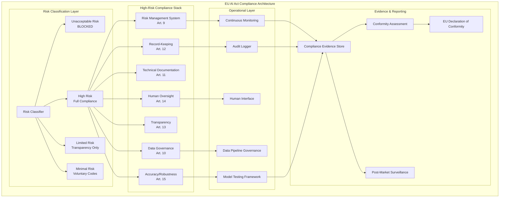

# EU AI Act Implementation Guide

## Staff Architect's Complete Compliance Framework

The EU AI Act is the world's first comprehensive AI regulation. As a Staff Architect,
you must design systems that satisfy its requirements from the ground up—not bolt
compliance on after deployment.

---

## 1. EU AI Act Overview

### Risk-Based Classification

The Act classifies AI systems into four risk tiers:

```
┌─────────────────────────────────────────────────────────────┐
│                    UNACCEPTABLE RISK                         │
│  Banned outright: social scoring, real-time biometric        │
│  surveillance (with exceptions), manipulative AI             │
├─────────────────────────────────────────────────────────────┤
│                      HIGH RISK                               │
│  Permitted with strict requirements: credit scoring,         │
│  hiring, medical devices, critical infrastructure            │
├─────────────────────────────────────────────────────────────┤
│                    LIMITED RISK                               │
│  Transparency obligations: chatbots, deepfakes,              │
│  emotion recognition                                         │
├─────────────────────────────────────────────────────────────┤
│                    MINIMAL RISK                               │
│  No specific obligations: spam filters, game AI,             │
│  recommendation engines (mostly)                             │
└─────────────────────────────────────────────────────────────┘
```

### What Qualifies as High-Risk

An AI system is high-risk if it falls under Annex III categories:

1. **Biometric identification** (remote, real-time or post)
2. **Critical infrastructure** (energy, water, transport)
3. **Education and vocational training** (exam scoring, admissions)
4. **Employment** (recruitment, performance evaluation, termination)
5. **Essential services** (credit scoring, insurance, social benefits)
6. **Law enforcement** (profiling, polygraph, evidence evaluation)
7. **Migration and border control** (visa assessment, risk indicators)
8. **Justice and democracy** (court decision support)

### High-Risk System Requirements

For high-risk systems, you must implement ALL of the following:

| Requirement | Article | Summary |
|------------|---------|---------|
| Risk Management | Art. 9 | Continuous risk identification and mitigation |
| Data Governance | Art. 10 | Training data quality, relevance, representativeness |
| Technical Documentation | Art. 11 | Full system description, design choices, performance |
| Record-Keeping | Art. 12 | Automatic logging of system operation |
| Transparency | Art. 13 | Clear info to deployers on capabilities/limitations |
| Human Oversight | Art. 14 | Humans can understand, monitor, override |
| Accuracy & Robustness | Art. 15 | Appropriate accuracy levels, resilience to errors |

---

## 2. Technical Requirements Deep Dive

### Article 9: Risk Management System

```python
# Risk Management System Structure
class RiskManagementSystem:
    """
    Must be established, implemented, documented, and maintained
    throughout the entire lifecycle of the high-risk AI system.
    """
    
    def __init__(self):
        self.identified_risks = []
        self.mitigation_measures = []
        self.residual_risks = []
        self.testing_results = []
    
    def identify_risks(self, system_context):
        """
        Identify and analyze known and reasonably foreseeable risks:
        - Risks to health, safety, fundamental rights
        - Risks from intended use AND reasonably foreseeable misuse
        - Risks from interaction with other systems
        """
        risks = []
        risks.extend(self.analyze_intended_use_risks(system_context))
        risks.extend(self.analyze_misuse_risks(system_context))
        risks.extend(self.analyze_interaction_risks(system_context))
        return risks
    
    def evaluate_residual_risk(self):
        """
        After mitigation, residual risk must be:
        - Judged acceptable given intended purpose
        - Communicated to deployers
        - Considered in user instructions
        """
        pass
    
    def continuous_monitoring(self):
        """
        Risk management is NOT a one-time activity.
        Must be updated throughout system lifecycle.
        """
        pass
```

### Article 10: Data Governance

Requirements for training, validation, and testing datasets:

1. **Design choices** — Document what data was chosen and why
2. **Data collection** — Processes, origin, purpose
3. **Relevance and representativeness** — Data must reflect deployment context
4. **Bias examination** — Identify and address possible biases
5. **Gap identification** — What's missing from the data
6. **Statistical properties** — Documented characteristics

```python
class DataGovernance:
    """Article 10 compliance for training data."""
    
    def document_dataset(self, dataset):
        return {
            "collection_purpose": "...",
            "collection_process": "...",
            "data_origin": "...",
            "size_and_scope": "...",
            "statistical_properties": self.compute_statistics(dataset),
            "bias_analysis": self.analyze_bias(dataset),
            "representativeness_assessment": self.assess_representativeness(dataset),
            "gaps_identified": self.identify_gaps(dataset),
            "preprocessing_steps": "...",
            "labeling_methodology": "...",
            "quality_metrics": self.compute_quality(dataset),
        }
    
    def analyze_bias(self, dataset):
        """
        Must examine data for biases that could lead to
        discrimination, especially for protected characteristics.
        """
        return {
            "demographic_distribution": "...",
            "protected_characteristics_analysis": "...",
            "historical_bias_assessment": "...",
            "mitigation_applied": "...",
        }
```

### Article 11: Technical Documentation

Must include BEFORE placing system on market:

- General description (intended purpose, developer info)
- Detailed system description (architecture, algorithms, data)
- Monitoring, functioning, control information
- Risk management system description
- Changes made during lifecycle
- Performance metrics and limitations
- Detailed description of the human oversight system
- Expected lifetime and maintenance schedule

### Article 12: Record-Keeping (Logging)

```python
class ComplianceLogger:
    """
    Article 12: Automatic recording of events (logs).
    Must enable monitoring of system operation.
    """
    
    REQUIRED_FIELDS = [
        "timestamp",
        "input_data_reference",
        "output_produced", 
        "system_version",
        "confidence_score",
        "human_override_occurred",
        "operating_context",
    ]
    
    def log_event(self, event):
        """
        Logs must:
        - Be proportionate to intended purpose
        - Enable post-market monitoring
        - Facilitate traceability
        - Be retained for appropriate period
        """
        record = {
            "timestamp": datetime.utcnow().isoformat(),
            "event_type": event.type,
            "input_reference": event.input_hash,
            "output": event.output,
            "confidence": event.confidence,
            "system_version": self.system_version,
            "human_oversight_status": event.oversight_status,
        }
        self.append_tamper_evident(record)
```

### Article 13: Transparency

Deployers must receive:

- Intended purpose and limitations
- Level of accuracy, robustness, cybersecurity (with metrics)
- Known circumstances that may impact performance
- Technical capabilities for human oversight
- Expected lifetime and maintenance needs
- Computational resource requirements

### Article 14: Human Oversight

```
Human Oversight Requirements:
├── Understanding: Humans can interpret system output
├── Awareness: Humans recognize automation bias risk  
├── Ability to override: "Stop button" functionality
├── Ability to intervene: Correct or reverse decisions
└── Ability to decide not to use: System can be disabled
```

Design patterns for human oversight:

1. **Human-in-the-loop (HITL)** — Human approves every decision
2. **Human-on-the-loop (HOTL)** — Human monitors and can intervene
3. **Human-in-command (HIC)** — Human sets boundaries, reviews outcomes

### Article 15: Accuracy, Robustness, Cybersecurity

```python
class AccuracyRobustness:
    """
    Systems must achieve appropriate levels of:
    - Accuracy (declared in documentation)
    - Robustness (against errors, faults, inconsistencies)
    - Cybersecurity (against adversarial attacks)
    """
    
    def accuracy_requirements(self):
        return {
            "declared_accuracy_metrics": "...",
            "validation_methodology": "...",
            "performance_per_subgroup": "...",  # Disaggregated
            "confidence_thresholds": "...",
            "known_limitations": "...",
        }
    
    def robustness_requirements(self):
        return {
            "error_handling": "graceful degradation",
            "input_validation": "reject malformed inputs",
            "adversarial_testing": "documented results",
            "feedback_loop_safety": "prevent drift amplification",
            "redundancy_measures": "fallback mechanisms",
        }
    
    def cybersecurity_requirements(self):
        return {
            "data_poisoning_protection": "...",
            "model_manipulation_defense": "...",
            "adversarial_input_detection": "...",
            "model_extraction_prevention": "...",
            "supply_chain_security": "...",
        }
```

---

## 3. Compliance Architecture



---

## 4. General-Purpose AI (GPAI) Obligations

### For GPAI Model Providers (e.g., OpenAI, Anthropic, Google)

All GPAI providers must:
- Maintain technical documentation
- Provide information to downstream providers
- Comply with Copyright Directive
- Publish training content summary

### GPAI with Systemic Risk (>10^25 FLOPs threshold)

Additional obligations:
- Model evaluation including adversarial testing
- Assess and mitigate systemic risks
- Track and report serious incidents
- Ensure adequate cybersecurity protection

### For Deployers Using GPAI

If you deploy a GPAI model in a high-risk context:
- YOU become the provider of a high-risk system
- Full Article 9-15 compliance applies to YOUR system
- You cannot shift responsibility to the model provider

```
Provider Obligations vs Deployer Obligations:

Model Provider (OpenAI/Anthropic):
├── Technical documentation of model
├── Training data summary
├── Copyright compliance
└── Systemic risk assessment (if applicable)

Deployer (Your Organization):
├── Risk classification of YOUR use case
├── Full Art. 9-15 compliance if high-risk
├── Human oversight for YOUR deployment
├── Incident monitoring and reporting
└── Transparency to end users
```

---

## 5. Conformity Assessment

### Self-Assessment (Most High-Risk Systems)

Most high-risk AI systems can self-certify:
1. Implement quality management system
2. Complete technical documentation
3. Perform conformity assessment against requirements
4. Draw up EU Declaration of Conformity
5. Affix CE marking

### Third-Party Audit (Required For)

- Biometric identification systems
- Critical infrastructure (some categories)
- Any system where harmonized standards don't exist

### Quality Management System (QMS)

```python
class QualityManagementSystem:
    """Required for all high-risk AI providers."""
    
    components = [
        "strategy_for_regulatory_compliance",
        "design_and_development_procedures",
        "testing_and_validation_procedures",
        "technical_specifications_and_standards",
        "data_management_systems",
        "risk_management_system",
        "post_market_monitoring",
        "incident_reporting_procedures",
        "communication_with_authorities",
        "record_keeping_systems",
        "resource_management",
        "accountability_framework",
    ]
```

---

## 6. Enforcement Timeline

```
Timeline: EU AI Act Phased Enforcement
═══════════════════════════════════════════════════

Feb 2, 2025:  Prohibited AI practices banned
              (social scoring, manipulative AI, etc.)

Aug 2, 2025:  GPAI obligations apply
              Codes of practice finalized
              Penalties regime active

Aug 2, 2026:  FULL enforcement of all provisions
              High-risk system requirements apply
              All conformity assessments required

Aug 2, 2027:  High-risk systems in Annex I 
              (already regulated products) fully apply
```

### Key Dates for Staff Architects

| Date | Action Required |
|------|----------------|
| NOW | Begin risk classification of all AI systems |
| NOW | Start building compliance infrastructure |
| Q1 2025 | Ensure no prohibited practices in portfolio |
| Q2 2025 | GPAI provider compliance (if applicable) |
| Q4 2025 | Complete technical documentation for high-risk |
| Q2 2026 | Conformity assessment complete |
| Aug 2026 | Full compliance operational |

---

## 7. Penalties

| Violation | Maximum Fine |
|-----------|-------------|
| Prohibited AI practices | €35M or 7% global annual turnover |
| High-risk non-compliance | €15M or 3% global annual turnover |
| Incorrect information to authorities | €7.5M or 1.5% global turnover |

For SMEs: fines are proportional but still significant.

---

## 8. Implementation Checklist for Staff Architects

### Phase 1: Assessment (Months 1-3)
- [ ] Inventory all AI systems in your organization
- [ ] Classify each system by risk tier
- [ ] Identify high-risk systems requiring full compliance
- [ ] Map existing controls to EU AI Act requirements
- [ ] Identify gaps per system

### Phase 2: Infrastructure (Months 3-6)
- [ ] Implement compliance logging infrastructure (Art. 12)
- [ ] Build or procure risk management tooling (Art. 9)
- [ ] Establish data governance processes (Art. 10)
- [ ] Design human oversight interfaces (Art. 14)
- [ ] Create technical documentation templates (Art. 11)

### Phase 3: System-Level Compliance (Months 6-12)
- [ ] Complete risk management for each high-risk system
- [ ] Document training data governance for each system
- [ ] Implement accuracy and robustness testing (Art. 15)
- [ ] Deploy monitoring and post-market surveillance
- [ ] Train deployers on transparency requirements (Art. 13)

### Phase 4: Certification (Months 12-18)
- [ ] Complete conformity assessment per system
- [ ] Prepare EU Declaration of Conformity
- [ ] Register in EU database (for high-risk)
- [ ] Establish ongoing compliance monitoring
- [ ] Prepare incident reporting processes

---

## 9. Anti-Patterns

### Anti-Pattern 1: Compliance as Checkbox
```
WRONG: "We filled out the documentation template, we're compliant."
RIGHT: Compliance requires ONGOING operational practices, not documents.
```

### Anti-Pattern 2: Last-Minute Scramble
```
WRONG: "We'll worry about EU AI Act compliance in 2026."
RIGHT: Building compliance infrastructure takes 12-18 months minimum.
       Start NOW.
```

### Anti-Pattern 3: Over-Classification
```
WRONG: "Everything is high-risk, let's apply maximum controls everywhere."
RIGHT: Accurate classification saves resources. A spam filter is minimal risk.
       Don't waste compliance budget on systems that don't need it.
```

### Anti-Pattern 4: Ignoring the Supply Chain
```
WRONG: "We use GPT-4, so OpenAI handles compliance."
RIGHT: If YOU deploy a GPAI model in a high-risk context, YOU are responsible
       for full compliance. The model provider's obligations don't cover yours.
```

### Anti-Pattern 5: No Human Oversight Design
```
WRONG: Adding a "human review" button after the system is built.
RIGHT: Human oversight must be DESIGNED IN from architecture phase.
       It affects data flows, UX, latency budgets, and staffing.
```

---

## 10. Staff Deliverable: EU AI Act Compliance Gap Assessment

### Template Structure

```markdown
# EU AI Act Compliance Gap Assessment

## System Identification
- System Name: [name]
- System Version: [version]
- Risk Classification: [Unacceptable/High/Limited/Minimal]
- Classification Rationale: [which Annex III category]
- Provider/Deployer Role: [which role does org play]

## Current State Assessment

### Article 9 - Risk Management
- Current maturity: [1-5]
- Existing controls: [list]
- Gaps identified: [list]
- Remediation effort: [Low/Medium/High]

### Article 10 - Data Governance
- Current maturity: [1-5]
- Existing controls: [list]
- Gaps identified: [list]
- Remediation effort: [Low/Medium/High]

### Article 11 - Technical Documentation
- Current maturity: [1-5]
- Existing documentation: [list]
- Gaps identified: [list]
- Remediation effort: [Low/Medium/High]

### Article 12 - Record-Keeping
- Current maturity: [1-5]
- Existing logging: [describe]
- Gaps identified: [list]
- Remediation effort: [Low/Medium/High]

### Article 13 - Transparency
- Current maturity: [1-5]
- Current transparency measures: [list]
- Gaps identified: [list]
- Remediation effort: [Low/Medium/High]

### Article 14 - Human Oversight
- Current maturity: [1-5]
- Current oversight mechanisms: [list]
- Gaps identified: [list]
- Remediation effort: [Low/Medium/High]

### Article 15 - Accuracy/Robustness/Cybersecurity
- Current maturity: [1-5]
- Current testing: [describe]
- Gaps identified: [list]
- Remediation effort: [Low/Medium/High]

## Prioritized Remediation Plan

| Priority | Gap | Article | Effort | Timeline | Owner |
|----------|-----|---------|--------|----------|-------|
| P1 | [gap] | [art] | [effort] | [date] | [owner] |
| P2 | [gap] | [art] | [effort] | [date] | [owner] |

## Resource Requirements
- Engineering: [FTE estimate]
- Legal: [hours estimate]
- Compliance: [FTE estimate]
- External audit: [if needed]

## Risk Summary
- Overall compliance readiness: [percentage]
- Critical gaps: [count]
- Estimated time to compliance: [months]
- Budget estimate: [range]
```

---

## Key Takeaways for Staff Architects

1. **Classify early** — Risk classification drives everything else
2. **Design for compliance** — Retrofitting is 3-5x more expensive
3. **Logging is foundational** — You can't prove compliance without records
4. **Human oversight is architectural** — Not a UI checkbox
5. **Supply chain matters** — Using third-party models doesn't transfer responsibility
6. **Start now** — Full enforcement is Aug 2026, but infrastructure takes time
7. **Think lifecycle** — Compliance is ongoing, not a one-time certification

---

## References

- [EU AI Act Full Text](https://eur-lex.europa.eu/eli/reg/2024/1689/oj)
- [EU AI Act Explorer](https://artificialintelligenceact.eu/)
- [European Commission AI Office](https://digital-strategy.ec.europa.eu/en/policies/ai-office)
- [NIST AI RMF Crosswalk to EU AI Act](https://www.nist.gov/artificial-intelligence)
