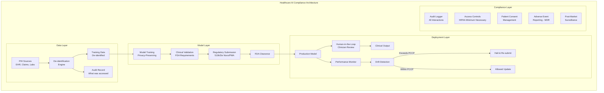

# Healthcare AI Compliance

## FDA, HIPAA, and Clinical AI Governance for Staff Architects

Healthcare AI operates under the most stringent regulatory requirements of any sector.
A single compliance failure can harm patients, trigger FDA enforcement actions, and
expose your organization to massive liability.

---

## 1. FDA Regulation of AI/ML-Based Software as Medical Device (SaMD)

### What Qualifies as SaMD

Software is a Medical Device if it:
- Is intended for one or more medical purposes
- Performs these purposes without being part of a hardware medical device

AI/ML systems that qualify as SaMD:
- Diagnostic algorithms (radiology AI, pathology AI)
- Clinical decision support that goes beyond simple information
- Monitoring and alerting systems (sepsis prediction, deterioration)
- Treatment recommendation engines
- Prognostic tools (disease progression prediction)

### What Does NOT Qualify (Typically)

- Administrative/operational AI (scheduling, billing)
- Wellness apps (unless making clinical claims)
- EHR data analytics for population health (usually)
- Clinical decision support meeting all four criteria of 21st Century Cures Act exclusion

### The Four Criteria Exclusion (21st Century Cures)

CDS software is NOT a device if ALL four are met:
1. Not intended to acquire, process, or analyze a medical image/signal
2. Intended for displaying, analyzing, or printing medical information
3. Intended for use by healthcare professionals
4. Intended for enabling the HCP to independently review the basis for recommendations

```
Decision Tree: Is Your AI a Medical Device?
═══════════════════════════════════════════

Does the software make or suggest clinical decisions?
├── No → Likely not SaMD
└── Yes → Does it meet ALL 4 CDS exclusion criteria?
    ├── Yes → Excluded from device regulation
    └── No → Likely SaMD → Classify risk level
```

---

## 2. FDA Risk Classification for AI

### International Medical Device Regulators Forum (IMDRF) Framework

```
                    Significance of Information to Healthcare Decision
                    ┌────────────────┬──────────────┬────────────────┐
                    │ Treat/Diagnose │ Drive Clinical│ Inform Clinical│
                    │                │ Management   │ Management     │
State of           ├────────────────┼──────────────┼────────────────┤
Healthcare         │                │              │                │
Situation          │                │              │                │
───────────────────┼────────────────┼──────────────┼────────────────┤
Critical           │    Class III   │  Class III   │   Class II     │
                   │  (PMA/De Novo) │ (PMA/De Novo)│   (510(k))    │
───────────────────┼────────────────┼──────────────┼────────────────┤
Serious            │   Class III    │   Class II   │   Class II     │
                   │  (PMA/De Novo) │   (510(k))   │   (510(k))    │
───────────────────┼────────────────┼──────────────┼────────────────┤
Non-Serious        │    Class II    │   Class II   │    Class I     │
                   │   (510(k))     │   (510(k))   │  (Exempt/510k)│
───────────────────┴────────────────┴──────────────┴────────────────┘
```

### Regulatory Pathways

| Pathway | When Used | Timeline | AI Examples |
|---------|-----------|----------|-------------|
| 510(k) | Substantially equivalent to predicate | 3-6 months | Most radiology AI |
| De Novo | Novel, low-moderate risk | 6-12 months | Novel diagnostic AI |
| PMA | High risk, no predicate | 1-3 years | Treatment-altering AI |

---

## 3. Predetermined Change Control Plan (PCCP)

### The Problem

Traditional FDA: any change to a cleared device requires new submission.
AI/ML reality: models need updates, retraining, performance improvements.

### FDA's Solution: PCCP

A PCCP allows pre-authorized modifications without new submissions:

```python
class PredeterminedChangeControlPlan:
    """
    FDA framework for AI/ML model updates without resubmission.
    Defined at time of initial clearance.
    """
    
    def __init__(self):
        self.description_of_modifications = []
        self.modification_protocol = None
        self.impact_assessment = None
    
    def define_allowed_changes(self):
        """What changes are pre-authorized."""
        return {
            "performance_improvements": {
                "allowed": True,
                "constraints": "Must maintain or improve sensitivity/specificity",
                "validation_required": "Per protocol defined below",
            },
            "new_training_data": {
                "allowed": True,
                "constraints": "Same data quality requirements as original",
                "validation_required": "Bias testing on defined subgroups",
            },
            "architecture_changes": {
                "allowed": False,  # Requires new submission
            },
            "new_intended_use": {
                "allowed": False,  # Always requires new submission
            },
        }
    
    def modification_protocol(self):
        """How changes are validated before deployment."""
        return {
            "data_management": "Same governance as original training",
            "retraining_protocol": "Defined hyperparameters and procedures",
            "evaluation_metrics": "Same metrics with same or better thresholds",
            "verification_testing": "On locked test set + new representative data",
            "bias_monitoring": "Subgroup analysis per original protocol",
            "documentation": "Full records of change and validation results",
        }
    
    def impact_assessment(self):
        """How to assess if a change exceeds PCCP boundaries."""
        return {
            "performance_bounds": "If metrics drop below [threshold], stop",
            "population_shift": "If patient demographics shift >X%, reassess",
            "failure_modes": "If new failure modes observed, halt and submit",
        }
```

---

## 4. HIPAA Implications for AI Systems

### Protected Health Information (PHI) in AI

PHI includes any individually identifiable health information. In AI systems:

| AI Component | PHI Risk | Mitigation |
|-------------|----------|------------|
| Training data | HIGH - may contain PHI | De-identification per Safe Harbor/Expert Determination |
| Model weights | MEDIUM - may memorize PHI | Differential privacy, membership inference testing |
| Embeddings | HIGH - can reconstruct PHI | Treat as PHI, apply same protections |
| Inference logs | HIGH - contains patient data | Encrypt, access control, retention policies |
| Prompts/queries | HIGH - may include PHI | Same protections as clinical data |
| Model outputs | HIGH - clinical information | Audit trail, access controls |

### HIPAA Minimum Necessary Rule for AI

```
Only access/use the MINIMUM PHI necessary for the AI function.

WRONG: Train on full patient records when you only need lab values.
RIGHT: Extract only needed fields, de-identify everything else.

WRONG: Log full patient context in AI inference records.
RIGHT: Log only what's needed for audit/debugging, with PHI encrypted.
```

### Business Associate Agreements (BAAs) for AI

If you use third-party AI services on PHI:
- Cloud AI services (Azure, AWS, GCP) → BAA required
- Model providers (OpenAI, Anthropic) → BAA required if PHI sent
- Annotation services → BAA required
- Your own on-premises → No BAA but same security requirements

---

## 5. Healthcare AI Compliance Architecture



---

## 6. Clinical Validation Requirements

### Levels of Clinical Evidence

```
Level 1: Analytical Validation
├── Does the algorithm perform its technical function correctly?
├── Performance on benchmark datasets
└── Sensitivity, specificity, AUC on test data

Level 2: Clinical Validation  
├── Does it produce clinically meaningful output?
├── Performance in clinical-like conditions
└── Comparison to clinical gold standard

Level 3: Clinical Utility
├── Does it improve patient outcomes?
├── Prospective clinical studies
└── Impact on clinical workflow and decisions
```

### Minimum Clinical Evidence by Risk

| Risk Level | Minimum Evidence | Study Design |
|-----------|-----------------|--------------|
| Class I | Analytical validation | Retrospective |
| Class II | Clinical validation | Retrospective + limited prospective |
| Class III | Clinical utility | Prospective clinical trial |

### Clinical Study Design for AI

```python
class ClinicalValidationStudy:
    """Framework for validating AI in clinical settings."""
    
    def design_study(self, risk_level):
        study = {
            "primary_endpoint": "Clinical performance metric",
            "sample_size": self.calculate_sample_size(),
            "population": {
                "inclusion_criteria": [...],
                "exclusion_criteria": [...],
                "demographic_requirements": "Representative of intended population",
            },
            "reference_standard": "Clinical gold standard (pathology, follow-up, etc.)",
            "subgroup_analysis": [
                "age_groups", "sex", "race_ethnicity",
                "disease_severity", "comorbidities"
            ],
            "failure_analysis": "Every false positive/negative reviewed",
            "reader_study": "Compare AI to clinicians (if applicable)",
        }
        return study
```

---

## 7. Continuous Monitoring: Post-Market Surveillance

### FDA Requirements for Marketed AI/ML Devices

```python
class PostMarketSurveillance:
    """Ongoing monitoring after FDA clearance."""
    
    def monitor(self):
        return {
            "performance_monitoring": {
                "metrics": ["sensitivity", "specificity", "PPV", "NPV"],
                "frequency": "Continuous with monthly reporting",
                "thresholds": "Alert if drops below clearance-level performance",
                "subgroup_monitoring": "Track per demographic subgroup",
            },
            "adverse_event_reporting": {
                "mdr_required": "Deaths, serious injuries, malfunctions",
                "timeline": "30 days (routine), 5 days (remedial action needed)",
                "what_counts": "AI misdiagnosis leading to patient harm",
            },
            "complaint_handling": {
                "process": "Documented procedure for user complaints",
                "analysis": "Trend analysis for systemic issues",
                "corrective_action": "CAPA process for identified problems",
            },
            "real_world_performance": {
                "tracking": "Performance vs. clinical trial results",
                "drift_detection": "Statistical tests for distribution shift",
                "update_trigger": "When to retrain within PCCP boundaries",
            },
        }
```

### Medical Device Reporting (MDR)

You MUST report to FDA when your AI:
- May have caused or contributed to a death
- May have caused or contributed to a serious injury
- Has malfunctioned and would likely cause death/serious injury if it recurred

---

## 8. Bias and Fairness in Healthcare AI

### Why Healthcare AI Bias is Critical

- Training data reflects historical healthcare disparities
- Underrepresentation of minorities in clinical datasets
- Proxy variables (zip code → race → health outcomes)
- Different disease presentation across demographics

### Required Fairness Analysis

```python
class HealthcareAIFairness:
    """Bias testing required for healthcare AI."""
    
    PROTECTED_SUBGROUPS = [
        "age_groups",
        "sex",
        "race_ethnicity", 
        "socioeconomic_status",
        "geographic_location",
        "insurance_type",
        "language",
        "disability_status",
    ]
    
    def analyze_performance_disparity(self, model, test_data):
        """
        Must demonstrate equitable performance across subgroups.
        FDA expects this in submissions.
        """
        results = {}
        for subgroup in self.PROTECTED_SUBGROUPS:
            results[subgroup] = {
                "sensitivity": self.compute_per_subgroup(model, test_data, subgroup, "sensitivity"),
                "specificity": self.compute_per_subgroup(model, test_data, subgroup, "specificity"),
                "disparity_ratio": "...",
                "statistical_significance": "...",
            }
        return results
    
    def document_limitations(self, results):
        """
        Labeling must disclose populations where performance
        has NOT been validated.
        """
        return {
            "validated_populations": [...],
            "not_validated": [...],
            "known_disparities": [...],
            "mitigation_steps": [...],
        }
```

---

## 9. De-Identification Requirements

### Safe Harbor Method (18 Identifiers Removed)

Must remove ALL of:
1. Names
2. Geographic data smaller than state
3. Dates (except year) for ages >89
4. Phone numbers
5. Fax numbers
6. Email addresses
7. SSN
8. Medical record numbers
9. Health plan beneficiary numbers
10. Account numbers
11. Certificate/license numbers
12. Vehicle identifiers
13. Device identifiers
14. Web URLs
15. IP addresses
16. Biometric identifiers
17. Full-face photos
18. Any other unique identifying number

### Expert Determination Method

A qualified statistical expert certifies that risk of re-identification is "very small."

### AI-Specific De-Identification Concerns

```
Standard de-identification may NOT be sufficient for AI:

1. Model Memorization: LLMs can memorize and regurgitate training data
   → Use differential privacy during training
   
2. Embedding Reconstruction: Dense embeddings may encode identity
   → Test with membership inference attacks
   
3. Combination Attacks: De-identified data + external data = re-identification
   → Consider k-anonymity, l-diversity in datasets
   
4. Synthetic Data: Generate synthetic data that preserves statistical 
   properties without real patient information
   → Validate synthetic data quality and privacy guarantees
```

---

## 10. Audit Trail Requirements

### Every AI Decision in Clinical Context

```python
class ClinicalAIAuditTrail:
    """
    In healthcare, every AI-assisted decision must be traceable.
    This is both a regulatory and malpractice requirement.
    """
    
    def log_clinical_ai_decision(self, event):
        record = {
            # System identification
            "system_id": "FDA-cleared device identifier",
            "system_version": "Exact model version used",
            "fda_clearance_number": "K-number or PMA number",
            
            # Clinical context (no PHI in log if possible)
            "encounter_id": "De-identified encounter reference",
            "clinical_context": "Type of decision supported",
            "patient_demographics_category": "Age/sex category (not individual)",
            
            # AI operation
            "input_summary": "What data was provided (hashed reference)",
            "output": "What the AI recommended/predicted",
            "confidence_score": 0.95,
            "model_explanation": "Why this output (SHAP/LIME summary)",
            
            # Human oversight
            "clinician_id": "Who reviewed the output",
            "clinician_action": "accepted/modified/rejected",
            "modification_details": "What was changed if modified",
            "clinical_reasoning": "Why clinician agreed/disagreed",
            
            # Timestamps
            "ai_inference_time": "2024-01-15T10:30:00Z",
            "clinician_review_time": "2024-01-15T10:32:00Z",
            "decision_finalized_time": "2024-01-15T10:33:00Z",
            
            # Outcome tracking
            "outcome_followup_scheduled": True,
            "outcome_recorded": None,  # Filled later
        }
        return self.store_immutable(record)
```

---

## 11. Anti-Patterns

### Anti-Pattern 1: Using Public Models on PHI
```
WRONG: Sending patient data to ChatGPT/Claude API for clinical support.
RIGHT: Use BAA-covered services, or on-premises models, with proper controls.
       Even with BAA, minimize PHI sent to model.
```

### Anti-Pattern 2: No Clinical Validation
```
WRONG: "Our model has 95% accuracy on our test set, ship it."
RIGHT: Clinical validation requires real-world clinical conditions,
       diverse patient populations, and comparison to standard of care.
       Benchmark accuracy ≠ clinical utility.
```

### Anti-Pattern 3: Ignoring Bias
```
WRONG: "We tested overall performance, it's good enough."
RIGHT: You MUST test across demographic subgroups. A model with 95%
       overall accuracy but 60% accuracy for Black patients is unacceptable
       and potentially illegal (civil rights implications).
```

### Anti-Pattern 4: No Post-Market Surveillance
```
WRONG: "Model cleared by FDA, deployment complete."
RIGHT: FDA clearance is the BEGINNING of obligations, not the end.
       Continuous monitoring, adverse event reporting, and performance
       tracking are required indefinitely.
```

### Anti-Pattern 5: Treating AI Output as Ground Truth
```
WRONG: Auto-acting on AI output without clinician review.
RIGHT: For almost all clinical AI, a qualified clinician must review
       and take responsibility for the final decision.
```

---

## 12. Staff Checklist: Healthcare AI Deployment

### Pre-Development
- [ ] Determine if system qualifies as SaMD
- [ ] Identify risk classification (Class I/II/III)
- [ ] Determine regulatory pathway (510(k)/De Novo/PMA)
- [ ] Identify predicate devices (for 510(k))
- [ ] Engage regulatory counsel early
- [ ] Define intended use statement precisely

### Data & Training
- [ ] De-identify all training data (Safe Harbor or Expert Determination)
- [ ] Document data governance per FDA guidance
- [ ] Ensure demographic representativeness
- [ ] Implement data quality controls
- [ ] Establish data provenance tracking

### Validation
- [ ] Design clinical validation study
- [ ] Define primary and secondary endpoints
- [ ] Ensure adequate sample size
- [ ] Test across all intended subpopulations
- [ ] Conduct bias and fairness analysis
- [ ] Document all validation results

### Regulatory Submission
- [ ] Complete technical documentation
- [ ] Prepare PCCP (if planning future updates)
- [ ] Conduct conformity assessment
- [ ] Prepare 510(k)/De Novo/PMA submission
- [ ] Define labeling (indications, limitations, warnings)

### Deployment
- [ ] Implement audit logging (all decisions)
- [ ] Deploy human oversight interface
- [ ] Establish performance monitoring
- [ ] Set up adverse event reporting process
- [ ] Train clinical users on capabilities and limitations
- [ ] Implement HIPAA controls for all PHI touchpoints

### Post-Market
- [ ] Monitor real-world performance continuously
- [ ] Track and report adverse events (MDR)
- [ ] Conduct periodic bias re-analysis
- [ ] Execute PCCP-allowed updates as needed
- [ ] Maintain complaint handling process
- [ ] Annual performance review and documentation update

---

## References

- [FDA: AI/ML-Based SaMD Action Plan](https://www.fda.gov/medical-devices/software-medical-device-samd/artificial-intelligence-and-machine-learning-aiml-enabled-medical-devices)
- [FDA: Predetermined Change Control Plans Guidance](https://www.fda.gov/regulatory-information/search-fda-guidance-documents)
- [HIPAA Privacy Rule](https://www.hhs.gov/hipaa/for-professionals/privacy/index.html)
- [FDA: Clinical Decision Support Guidance](https://www.fda.gov/regulatory-information/search-fda-guidance-documents/clinical-decision-support-software)
- [IMDRF SaMD Framework](http://www.imdrf.org/documents/documents.asp)
