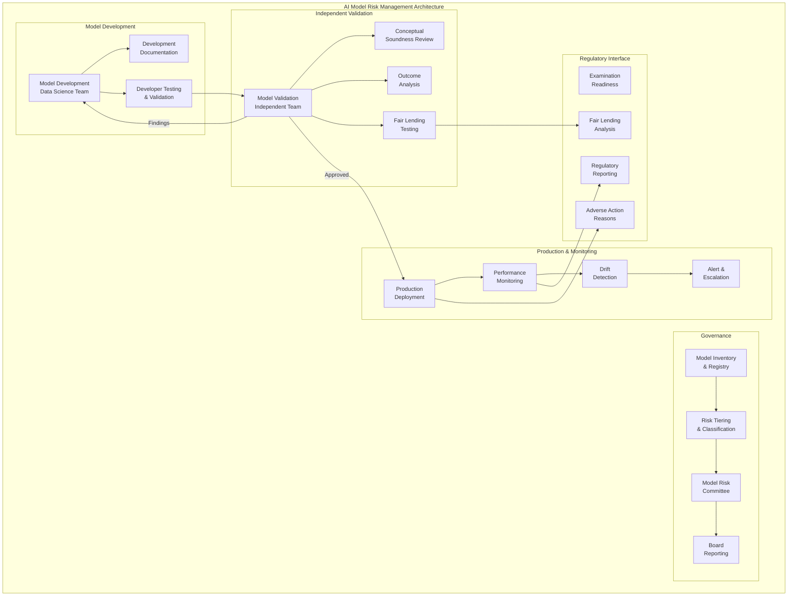

# Financial Services AI Compliance

## Model Risk Management, Fair Lending, and Regulatory Governance

Financial services is one of the most heavily regulated environments for AI deployment.
Every model that touches a consumer-facing decision is subject to multiple overlapping
regulatory frameworks, each with examination authority and enforcement power.

---

## 1. Regulatory Landscape

### Key Regulators for AI in Finance

| Regulator | Jurisdiction | AI Focus Areas |
|-----------|-------------|----------------|
| OCC | National banks, thrifts | Model risk, fair lending, BSA/AML |
| FDIC | State-chartered banks | Same + safety & soundness |
| Federal Reserve | Bank holding companies | SR 11-7, fair lending |
| SEC | Securities, investment advisors | Algorithmic trading, robo-advisors |
| FINRA | Broker-dealers | Suitability, communications |
| CFPB | Consumer financial products | Fair lending, UDAAP, explainability |
| State regulators | Insurance, lending | Varies by state |

### Overlapping Requirements

```
A single AI credit scoring model may be subject to:
├── SR 11-7 (Model Risk Management)
├── ECOA / Reg B (Fair lending)
├── FCRA (Credit reporting accuracy)
├── UDAAP (Unfair/Deceptive/Abusive acts)
├── BSA/AML (If used for suspicious activity)
├── State fair lending laws
├── GDPR/CCPA (If applicable consumers)
└── Third-party risk management guidance
```

---

## 2. Model Risk Management (SR 11-7)

### The Gold Standard

SR 11-7 (Federal Reserve Supervisory Letter) is the foundational framework for
model governance in banking. ALL models—including AI/ML—must comply.

### Definition of a Model

> "A model is a quantitative method, system, or approach that applies statistical,
> economic, financial, or mathematical theories, techniques, and assumptions to
> process input data into quantitative estimates."

This includes: ML models, deep learning, NLP systems, any AI making quantitative predictions.

### Three Pillars of SR 11-7

```python
class ModelRiskManagement:
    """SR 11-7 framework for AI model governance."""
    
    def pillar_1_model_development(self):
        """Sound model development and implementation."""
        return {
            "clear_purpose": "Documented intended use and limitations",
            "sound_methodology": "Appropriate technique for the problem",
            "data_quality": "Relevant, accurate, complete data",
            "documentation": {
                "design_rationale": "Why this approach",
                "assumptions": "All assumptions documented",
                "limitations": "Known weaknesses",
                "developer_testing": "Results before handoff",
            },
            "implementation": {
                "code_review": "Independent review of implementation",
                "testing": "Unit, integration, UAT",
                "production_equivalence": "Dev/prod parity verified",
            },
        }
    
    def pillar_2_model_validation(self):
        """Independent model validation."""
        return {
            "independence": "Validators independent from developers",
            "conceptual_soundness": "Is the approach theoretically sound?",
            "outcome_analysis": {
                "backtesting": "Performance on historical data",
                "benchmarking": "Comparison to alternatives",
                "sensitivity_analysis": "Behavior under stress",
            },
            "ongoing_monitoring": {
                "performance_tracking": "Metrics over time",
                "stability_monitoring": "Input/output distributions",
                "trigger_events": "When re-validation is required",
            },
            "effective_challenge": {
                "critical_review": "Not rubber-stamping",
                "documented_findings": "Written report",
                "remediation_tracking": "Issues must be fixed",
            },
        }
    
    def pillar_3_governance(self):
        """Model risk governance and controls."""
        return {
            "model_inventory": "Complete inventory of all models",
            "risk_tiering": "Models classified by risk level",
            "roles_responsibilities": {
                "model_owner": "Business accountability",
                "model_developer": "Technical implementation",
                "model_validator": "Independent challenge",
                "model_risk_function": "Overall oversight",
                "board_oversight": "Senior management reporting",
            },
            "policies_and_procedures": "Written MRM policy",
            "model_lifecycle": "From development to retirement",
            "exception_process": "For models not meeting standards",
            "aggregate_risk_reporting": "Enterprise-wide model risk view",
        }
```

### Model Tiering (Risk Classification)

```
Tier 1 (Critical):
├── Direct consumer impact (credit, pricing)
├── Large financial exposure
├── Regulatory scrutiny (fair lending)
├── Hard to replace quickly
└── Requirements: Annual validation, quarterly monitoring, board reporting

Tier 2 (Significant):
├── Operational decisions
├── Moderate financial impact
├── Some consumer exposure
└── Requirements: 18-month validation cycle, monthly monitoring

Tier 3 (Low):
├── Internal analytics
├── Low financial impact
├── No direct consumer impact
└── Requirements: Validation every 2-3 years, quarterly monitoring
```

### Documentation Requirements

Every AI model must have:

1. **Model Development Document** — Design, methodology, data, testing
2. **Model Validation Report** — Independent assessment findings
3. **Model Risk Rating** — Tier assignment and rationale
4. **Model Performance Report** — Ongoing monitoring results
5. **Model Change Log** — Every modification tracked
6. **Model Use Case Description** — Exactly how model is used in decisions

---

## 3. Fair Lending and AI

### Equal Credit Opportunity Act (ECOA) / Regulation B

Prohibits discrimination in credit decisions based on:
- Race, color, religion, national origin
- Sex, marital status, age
- Receipt of public assistance
- Exercise of Consumer Credit Protection Act rights

### Disparate Impact Testing for AI

```python
class FairLendingAnalysis:
    """Testing AI models for fair lending compliance."""
    
    PROTECTED_CLASSES = [
        "race", "ethnicity", "sex", "age",
        "national_origin", "marital_status"
    ]
    
    def disparate_impact_test(self, model, test_data):
        """
        Four-fifths rule: approval rate for protected class 
        must be at least 80% of rate for control group.
        """
        results = {}
        for protected_class in self.PROTECTED_CLASSES:
            control_rate = self.approval_rate(model, test_data, protected_class, "control")
            protected_rate = self.approval_rate(model, test_data, protected_class, "protected")
            
            ratio = protected_rate / control_rate if control_rate > 0 else 0
            results[protected_class] = {
                "control_approval_rate": control_rate,
                "protected_approval_rate": protected_rate,
                "impact_ratio": ratio,
                "passes_four_fifths": ratio >= 0.80,
                "statistical_significance": self.compute_significance(
                    control_rate, protected_rate, test_data
                ),
            }
        return results
    
    def proxy_variable_analysis(self, model, features):
        """
        Identify features that serve as proxies for protected classes.
        ZIP code → race, name → national origin, etc.
        """
        proxy_risks = []
        for feature in features:
            correlation = self.correlation_with_protected(feature)
            if correlation > 0.3:  # Threshold varies
                proxy_risks.append({
                    "feature": feature,
                    "correlated_with": "...",
                    "correlation_strength": correlation,
                    "recommendation": "Consider removal or debiasing",
                })
        return proxy_risks
    
    def less_discriminatory_alternative(self, model, test_data):
        """
        If disparate impact found, must show no less discriminatory
        alternative achieves same business objective.
        """
        pass
```

### Adverse Action Notices

When credit is denied (or unfavorable terms), you MUST tell the consumer WHY.

```python
class AdverseActionNotice:
    """
    ECOA/FCRA requirement: specific reasons for adverse action.
    This is where AI explainability becomes a LEGAL requirement.
    """
    
    def generate_reasons(self, model_output, applicant):
        """
        Must provide specific, actionable reasons.
        "The AI said no" is NOT acceptable.
        
        Acceptable reasons:
        - "Length of credit history is too short"
        - "Debt-to-income ratio is too high"
        - "Number of recent inquiries is too high"
        
        NOT acceptable:
        - "Model score was below threshold"
        - "Based on our proprietary algorithm"
        - "Multiple factors contributed"
        """
        # Use SHAP/LIME to identify top contributing factors
        explanations = self.explain_decision(model_output, applicant)
        
        # Map to consumer-understandable reason codes
        reason_codes = self.map_to_reason_codes(explanations)
        
        # Return top 4 reasons (regulatory standard)
        return reason_codes[:4]
```

---

## 4. Model Risk Management Architecture



---

## 5. Explainability Requirements

### Why Explainability is Non-Negotiable in Finance

1. **Adverse action notices** — Legal requirement to explain denials
2. **Fair lending exams** — Regulators will ask "why did the model do X?"
3. **Model validation** — Validators must understand model behavior
4. **SR 11-7 compliance** — Documentation requires conceptual soundness
5. **Consumer trust** — Regulators care about consumer understanding

### Explainability Approaches by Use Case

```
Credit Decisions:
├── SHAP values → Feature importance per decision
├── Reason code mapping → Consumer-friendly explanations
├── Partial dependence → How features affect outcomes
└── Counterfactual → "If X were different, outcome would change"

Fraud Detection:
├── Rule extraction → Which patterns triggered alert
├── Case-level explanation → Why this transaction flagged
├── False positive analysis → Why legitimate transactions flagged
└── Network visualization → Relationship-based explanations

Trading/Investment:
├── Factor attribution → Which factors drove the recommendation
├── Scenario analysis → How different conditions affect output
├── Backtesting transparency → Historical decision explanation
└── Risk decomposition → Sources of predicted risk
```

---

## 6. Anti-Money Laundering (AML) and AI

### Regulatory Acceptance of AI in AML

Regulators are cautiously supportive of AI for:
- Transaction monitoring (reducing false positives)
- Customer risk rating
- Suspicious activity report (SAR) prioritization
- Network analysis for money laundering patterns

### Key Requirements

```python
class AMLAICompliance:
    """Requirements for AI in AML/BSA context."""
    
    def requirements(self):
        return {
            "false_positive_reduction": {
                "permitted": True,
                "requirement": "Must not increase false negatives",
                "validation": "Demonstrate same or better detection rate",
                "documentation": "Statistical evidence of improvement",
            },
            "explainability": {
                "sar_narrative": "AI findings must be explainable in SAR",
                "examiner_questions": "Must explain why alert generated",
                "audit_trail": "Full trail from transaction to alert",
            },
            "human_oversight": {
                "requirement": "Human must review and file SAR",
                "ai_role": "Assist, prioritize, highlight - not decide",
                "escalation": "Clear path for AI-missed cases",
            },
            "model_validation": {
                "same_as_sr11_7": True,
                "additional": "Coverage analysis - what patterns does AI miss?",
                "regulatory_scenarios": "Test against known typologies",
            },
        }
```

---

## 7. Third-Party Model Risk

### Using Foundation Models (OpenAI/Anthropic/Google) in Regulated Context

```
Third-Party AI Risk Assessment Framework:
═════════════════════════════════════════

1. Model Transparency
   ├── Can you explain model decisions? (Usually NO for GPT/Claude)
   ├── Do you have access to model internals? (NO)
   ├── Can you validate independently? (Limited)
   └── RISK: High for consumer-facing decisions

2. Data Residency
   ├── Where does data go when sent to API? 
   ├── Is it used for training? (Check terms)
   ├── Can you ensure deletion?
   └── RISK: High if PII/financial data sent

3. Model Stability
   ├── Provider can change model at any time
   ├── No guarantee of consistent behavior
   ├── Version pinning may not be permanent
   └── RISK: High for validated models

4. Vendor Concentration
   ├── What if provider has outage?
   ├── What if provider changes terms?
   ├── What if provider discontinues model?
   └── RISK: Medium-High for critical functions

5. Regulatory Acceptability
   ├── Examiners may question black-box reliance
   ├── SR 11-7 requires understanding of model
   ├── Fair lending testing is difficult
   └── RISK: Very High for credit/lending decisions
```

### Acceptable Uses of Third-Party AI in Finance

| Use Case | Acceptable? | Conditions |
|----------|-------------|------------|
| Internal summarization | Yes | No PII in prompts |
| Code generation | Yes | Standard SDLC controls |
| Customer chatbot (general info) | Cautious | No financial advice |
| Credit decisioning | NO | Cannot explain, cannot validate |
| Fraud narrative generation | Maybe | Human review required |
| Marketing content | Yes | Compliance review of output |
| Document processing | Cautious | Data residency controls needed |

---

## 8. Data Residency

### Requirements by Jurisdiction

```
US Financial Data:
├── Generally no federal data localization requirement
├── BUT: State laws may apply (e.g., NY DFS)
├── OCC expects data access for examination
└── Contractual obligations with customers may restrict

EU Financial Data (under GDPR + financial regulation):
├── Strict transfer restrictions
├── Standard Contractual Clauses needed for transfers
├── Schrems II implications
└── Local processing strongly preferred

Cross-Border Considerations for AI:
├── Training data location
├── Model inference location
├── Log/audit data location
├── Backup and DR locations
└── Third-party API call destinations
```

---

## 9. Incident Reporting

### When AI Errors Must Be Reported

| Regulator | Trigger | Timeline |
|-----------|---------|----------|
| OCC/FDIC/Fed | Material model failure affecting safety & soundness | Promptly |
| SEC | Algorithm malfunction causing market impact | Same day |
| CFPB | Systematic fair lending violation | Upon discovery |
| State regulators | Consumer harm from AI error | Varies |
| Cyber agencies | Data breach involving model/training data | 36-72 hours |

### Incident Response Framework for AI

```python
class AIIncidentResponse:
    """When AI models fail in regulated finance context."""
    
    def assess_severity(self, incident):
        criteria = {
            "consumer_impact": "How many consumers affected?",
            "financial_impact": "Dollar amount of incorrect decisions?",
            "fair_lending_impact": "Disproportionate impact on protected class?",
            "duration": "How long was model producing errors?",
            "data_breach": "Was any data exposed?",
            "market_impact": "Did it affect market integrity?",
        }
        return self.score(incident, criteria)
    
    def required_actions(self, severity):
        if severity == "critical":
            return [
                "Immediately halt model",
                "Notify senior management and board",
                "Engage regulatory counsel",
                "Notify regulators (if required)",
                "Identify all affected consumers",
                "Begin remediation (reversals, corrections)",
                "Root cause analysis",
                "File SAR if suspicious activity involved",
            ]
```

---

## 10. Anti-Patterns

### Anti-Pattern 1: Black-Box Models for Credit Decisions
```
WRONG: Using deep learning for credit scoring without explainability.
RIGHT: Use interpretable models (logistic regression, gradient boosting with SHAP)
       for any decision requiring adverse action notices.
       If you must use complex models, invest heavily in post-hoc explanation.
```

### Anti-Pattern 2: No Model Validation
```
WRONG: "Data science team tested it, results look good, deploy."
RIGHT: INDEPENDENT validation is required. The team that builds the model
       CANNOT validate it. This is a regulatory requirement, not a suggestion.
```

### Anti-Pattern 3: Treating AI as Exception to MRM
```
WRONG: "AI/ML is different, SR 11-7 doesn't apply."
RIGHT: Regulators have explicitly stated AI/ML is within scope of SR 11-7.
       Same governance, same validation, same documentation requirements.
```

### Anti-Pattern 4: Ignoring Proxy Variables
```
WRONG: "We don't use race in our model, so it's fair."
RIGHT: ZIP code, education, name, and dozens of other features can serve
       as proxies for protected classes. You must test for disparate impact
       regardless of input features.
```

### Anti-Pattern 5: No Model Inventory
```
WRONG: "We have some models in production, not sure exactly how many."
RIGHT: Examiners will ask for a complete model inventory. If you can't
       produce one, that's a finding. Every model must be registered.
```

---

## 11. Staff Playbook: Deploying AI in Banking/Insurance

### Pre-Deployment Checklist

- [ ] Model registered in enterprise model inventory
- [ ] Risk tier assigned (Tier 1/2/3)
- [ ] Model development document complete
- [ ] Independent validation scheduled/complete
- [ ] Fair lending testing performed (if consumer-facing)
- [ ] Adverse action reason code mapping defined
- [ ] SR 11-7 compliance documented
- [ ] Third-party risk assessment (if using external models)
- [ ] Data residency requirements met
- [ ] Model monitoring plan defined
- [ ] Incident response plan for model failures
- [ ] Board/committee approval obtained (Tier 1 models)

### Ongoing Requirements

- [ ] Monthly/quarterly performance monitoring (per tier)
- [ ] Annual fair lending analysis
- [ ] Periodic re-validation (per tier schedule)
- [ ] Drift detection alerts operational
- [ ] Model change log maintained
- [ ] Examination readiness package current
- [ ] Vendor risk reassessment (annual for third-party models)

### Examination Preparation

What examiners will ask about your AI:
1. "Show me your model inventory."
2. "Walk me through validation for [specific model]."
3. "How do you test for fair lending impact?"
4. "Show me adverse action reason codes for AI-driven decisions."
5. "What happens when the model drifts?"
6. "Who has oversight authority to shut down a model?"
7. "Show me your model risk committee minutes."
8. "How do you manage third-party model risk?"

---

## References

- [SR 11-7: Supervisory Guidance on Model Risk Management](https://www.federalreserve.gov/supervisionreg/srletters/sr1107.htm)
- [OCC Bulletin 2011-12: Model Risk Management](https://www.occ.treas.gov/news-issuances/bulletins/2011/bulletin-2011-12.html)
- [CFPB: Chatbots in Consumer Finance](https://www.consumerfinance.gov/)
- [Interagency Statement on AI/ML](https://www.federalreserve.gov/newsevents/pressreleases/bcreg20210329a.htm)
- [ECOA / Regulation B](https://www.consumerfinance.gov/rules-policy/regulations/1002/)
- [SEC AI/ML Guidance](https://www.sec.gov/tm/reports-and-publications)
