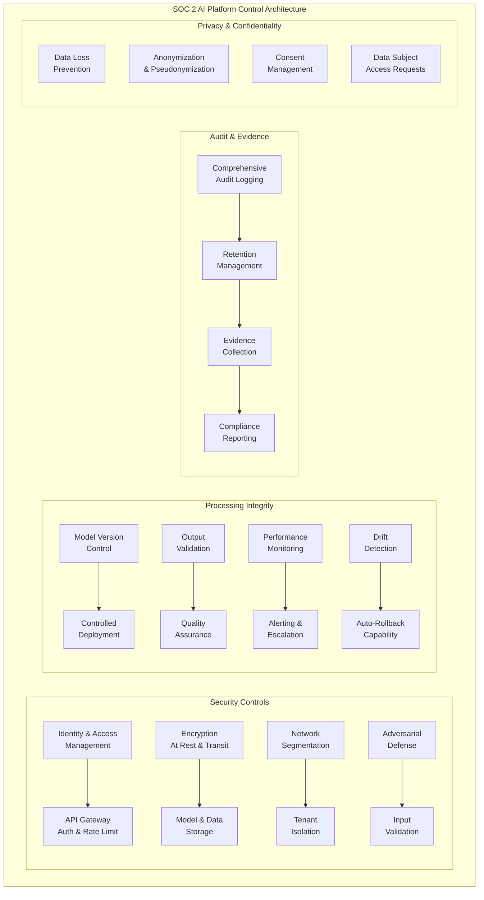

# SOC 2 and Enterprise Compliance for AI Systems

## Trust Service Criteria, ISO 27001, and NIST AI RMF Integration

Enterprise AI systems face unique compliance challenges that existing frameworks
weren't designed to address. This guide maps SOC 2, ISO 27001, and NIST AI RMF
to the specific controls AI systems require.

---

## 1. SOC 2 Trust Service Criteria Applied to AI

### Overview

SOC 2 defines five Trust Service Criteria (TSC). Each requires AI-specific controls:

```
SOC 2 Trust Service Criteria for AI:
═════════════════════════════════════

┌──────────────────────────────────────────────────────────────┐
│ SECURITY (Common Criteria - CC)                              │
│ Protecting model weights, training data, API keys,           │
│ and preventing unauthorized access or manipulation           │
├──────────────────────────────────────────────────────────────┤
│ AVAILABILITY (A)                                             │
│ AI service uptime, SLA compliance, graceful degradation,     │
│ model serving infrastructure reliability                     │
├──────────────────────────────────────────────────────────────┤
│ PROCESSING INTEGRITY (PI)                                    │
│ AI outputs are accurate, complete, timely, and authorized;   │
│ model behaves as documented                                  │
├──────────────────────────────────────────────────────────────┤
│ CONFIDENTIALITY (C)                                          │
│ Protecting input data, prompts, outputs, and any             │
│ information designated as confidential                       │
├──────────────────────────────────────────────────────────────┤
│ PRIVACY (P)                                                  │
│ Personal information handling in training, inference,         │
│ and logging aligned with privacy commitments                 │
└──────────────────────────────────────────────────────────────┘
```

---

### Security (CC) for AI Systems

| Control Area | Traditional | AI-Specific Addition |
|-------------|-------------|---------------------|
| Access Control | User/role management | Model access tiers, inference API auth |
| Change Management | Code deployment | Model deployment, weight updates |
| Vulnerability Management | CVE scanning | Adversarial attack testing, prompt injection |
| Data Protection | Encryption at rest/transit | Model weight encryption, training data protection |
| Incident Response | Security incidents | Model compromise, data poisoning response |
| Supply Chain | Vendor assessment | Model provider security, training data provenance |

```python
class AISecurityControls:
    """SOC 2 Security controls specific to AI systems."""
    
    def model_access_control(self):
        return {
            "model_weights": {
                "access": "Restricted to ML engineering team",
                "storage": "Encrypted at rest (AES-256)",
                "transfer": "Encrypted in transit (TLS 1.3)",
                "versioning": "Immutable model registry with audit trail",
            },
            "training_data": {
                "access": "Data science team only, least privilege",
                "classification": "Labeled per data classification policy",
                "retention": "Per data retention schedule",
                "deletion": "Cryptographic erasure supported",
            },
            "api_keys": {
                "rotation": "90-day maximum lifetime",
                "scope": "Per-service, least privilege",
                "monitoring": "Usage anomaly detection",
                "revocation": "Immediate capability",
            },
            "inference_api": {
                "authentication": "OAuth 2.0 / API key + mutual TLS",
                "authorization": "Per-model, per-operation permissions",
                "rate_limiting": "Per-tenant, per-model limits",
                "input_validation": "Schema validation, size limits",
            },
        }
    
    def adversarial_defense(self):
        """Prompt injection, model manipulation prevention."""
        return {
            "prompt_injection": {
                "input_sanitization": "Strip control characters, limit length",
                "system_prompt_protection": "Immutable system prompts",
                "output_filtering": "Detect and block data exfiltration",
                "monitoring": "Alert on unusual prompt patterns",
            },
            "data_poisoning": {
                "training_data_validation": "Statistical anomaly detection",
                "provenance_tracking": "Source verification for all data",
                "canary_detection": "Detect planted malicious samples",
            },
            "model_extraction": {
                "rate_limiting": "Prevent systematic querying",
                "output_perturbation": "Add noise to prevent extraction",
                "watermarking": "Detect if model is stolen",
            },
        }
```

### Availability (A) for AI Systems

```python
class AIAvailabilityControls:
    """SOC 2 Availability controls for AI services."""
    
    def sla_definition(self):
        return {
            "uptime_target": "99.9% for production inference",
            "latency_p99": "< 500ms for real-time inference",
            "throughput": "Defined per service tier",
            "degradation_policy": {
                "model_unavailable": "Fall back to previous version",
                "high_latency": "Queue requests, return within SLA",
                "capacity_exceeded": "Graceful rejection with retry-after",
            },
            "recovery_objectives": {
                "rto": "15 minutes for inference services",
                "rpo": "Zero data loss for inference logs",
                "model_recovery": "< 30 min to redeploy model",
            },
        }
    
    def capacity_management(self):
        return {
            "gpu_capacity_planning": "Monitor utilization, auto-scale",
            "model_serving_redundancy": "Multi-AZ, multi-region",
            "queue_management": "Backpressure handling for burst",
            "dependency_isolation": "Model serving independent of training",
        }
```

### Processing Integrity (PI) for AI Systems

```python
class AIProcessingIntegrity:
    """Ensuring AI outputs are accurate and as documented."""
    
    def controls(self):
        return {
            "model_validation": {
                "pre_deployment": "Performance metrics meet threshold",
                "ongoing": "Continuous monitoring vs baseline",
                "drift_detection": "Statistical tests for distribution shift",
                "accuracy_tracking": "Per-use-case accuracy metrics",
            },
            "output_validation": {
                "schema_validation": "Outputs match expected format",
                "range_checks": "Values within expected bounds",
                "consistency_checks": "Cross-reference with business rules",
                "hallucination_detection": "For generative AI outputs",
            },
            "version_management": {
                "model_versioning": "Every deployment tracked",
                "rollback_capability": "Instant revert to previous version",
                "a_b_testing": "Controlled rollout with comparison",
                "canary_deployment": "Gradual traffic shift",
            },
            "completeness": {
                "all_inputs_processed": "No silent drops",
                "timeout_handling": "Clear indication when inference fails",
                "partial_results": "Clearly labeled as incomplete",
            },
        }
```

### Confidentiality (C) for AI Systems

```
Confidentiality Controls for AI:
────────────────────────────────

Input Protection:
├── Prompts/queries encrypted in transit and at rest
├── Input data classified per sensitivity
├── No input data used for model training (unless explicit consent)
└── Input data retention per policy (auto-delete)

Output Protection:
├── Responses encrypted in transit
├── Output caching with appropriate TTL
├── No output logging of sensitive classifications
└── DLP scanning on outputs (prevent data leakage)

Model Confidentiality:
├── Model weights as trade secrets
├── Architecture details restricted
├── Training data composition confidential
└── Performance metrics (internal only)

Cross-Tenant Isolation:
├── No data leakage between tenants
├── Separate model contexts per tenant
├── No shared caching across tenants
└── Tenant-specific encryption keys
```

### Privacy (P) for AI Systems

```python
class AIPrivacyControls:
    """SOC 2 Privacy criteria for AI systems."""
    
    def privacy_controls(self):
        return {
            "notice": {
                "ai_disclosure": "Users informed AI is processing their data",
                "data_usage": "Clear what data is used and how",
                "retention_period": "How long AI logs are kept",
            },
            "choice_and_consent": {
                "opt_out": "Users can opt out of AI processing",
                "training_data_consent": "Explicit consent for training use",
                "profiling_consent": "Consent for AI-based profiling",
            },
            "collection_limitation": {
                "minimum_necessary": "Only collect what AI needs",
                "purpose_limitation": "Data used only for stated purpose",
                "no_secondary_use": "No repurposing without consent",
            },
            "data_subject_rights": {
                "access": "Users can see what AI knows about them",
                "deletion": "Right to be forgotten (including from models)",
                "correction": "Fix incorrect data fed to AI",
                "portability": "Export AI-generated insights",
                "objection": "Object to automated decision-making",
            },
            "data_minimization_in_ai": {
                "training": "Use minimum PII in training data",
                "inference": "Process minimum necessary for request",
                "logging": "Don't log PII in inference records",
                "retention": "Auto-delete per shortest applicable policy",
            },
        }
```

---

## 2. SOC 2 Control Architecture for AI



---

## 3. AI-Specific Controls Deep Dive

### Prompt Injection Prevention (Security)

```python
class PromptInjectionControls:
    """SOC 2 Security control: Prevent prompt injection attacks."""
    
    CONTROL_ID = "CC6.1-AI-001"
    CONTROL_NAME = "Prompt Injection Prevention"
    
    def implementation(self):
        return {
            "input_layer": {
                "length_limits": "Maximum prompt length enforced",
                "character_filtering": "Strip control characters, unicode tricks",
                "pattern_detection": "Known injection pattern matching",
                "semantic_analysis": "Detect attempts to override system prompt",
            },
            "system_layer": {
                "prompt_hierarchy": "System prompts cannot be overridden",
                "instruction_isolation": "User input isolated from instructions",
                "output_constraints": "Model cannot output system prompt",
                "tool_restrictions": "Limited tool access based on context",
            },
            "output_layer": {
                "output_filtering": "Detect leaked internal information",
                "format_validation": "Ensure output matches expected format",
                "confidence_threshold": "Flag low-confidence outputs",
                "human_review_trigger": "Escalate suspicious outputs",
            },
            "monitoring": {
                "injection_attempt_logging": "All attempts recorded",
                "success_rate_tracking": "% of blocked attempts",
                "new_pattern_detection": "ML-based novel attack detection",
                "incident_response": "Automatic escalation on detection",
            },
        }
    
    def evidence_for_auditor(self):
        return [
            "Input validation rules and configuration",
            "Injection attempt logs (last 12 months)",
            "Penetration testing report (adversarial)",
            "Incident response runbook for injection events",
            "Quarterly review of detection rules",
        ]
```

### Model Access Control and Authentication

```python
class ModelAccessControl:
    """SOC 2 Security: Who can access what models and how."""
    
    CONTROL_ID = "CC6.1-AI-002"
    
    def access_tiers(self):
        return {
            "tier_1_inference": {
                "who": "Application service accounts",
                "what": "Send inference requests, receive outputs",
                "controls": "API key + mutual TLS, rate limited",
            },
            "tier_2_monitoring": {
                "who": "ML Operations team",
                "what": "View metrics, logs, performance data",
                "controls": "SSO + MFA, read-only access",
            },
            "tier_3_deployment": {
                "who": "ML Engineering leads",
                "what": "Deploy models, update configurations",
                "controls": "SSO + MFA + approval workflow",
            },
            "tier_4_model_development": {
                "who": "Data Science team",
                "what": "Access training data, modify models",
                "controls": "SSO + MFA + data classification clearance",
            },
            "tier_5_admin": {
                "who": "Platform administrators",
                "what": "Infrastructure, encryption keys, policies",
                "controls": "Privileged access management (PAM)",
            },
        }
```

### Audit Logging of All AI Interactions

```python
class AIAuditLogging:
    """SOC 2 Common Criteria: Comprehensive AI audit trail."""
    
    CONTROL_ID = "CC7.2-AI-001"
    
    def required_log_fields(self):
        return {
            "every_inference": {
                "timestamp": "UTC, millisecond precision",
                "request_id": "Unique, traceable identifier",
                "caller_identity": "Who/what made the request",
                "model_version": "Exact model version used",
                "input_hash": "SHA-256 of input (not raw input if sensitive)",
                "output_hash": "SHA-256 of output",
                "latency_ms": "Processing time",
                "token_count": "Input/output tokens",
                "status": "Success/failure/timeout",
                "error_details": "If failed, why",
            },
            "model_operations": {
                "deployments": "Who deployed what, when, why",
                "rollbacks": "Who rolled back, reason",
                "configuration_changes": "Any parameter changes",
                "access_grants_revocations": "Permission changes",
            },
            "security_events": {
                "injection_attempts": "Detected attacks",
                "rate_limit_hits": "Throttled requests",
                "authentication_failures": "Failed access attempts",
                "anomalous_patterns": "Unusual usage detected",
            },
        }
    
    def retention_requirements(self):
        return {
            "inference_logs": "1 year minimum, 3 years recommended",
            "security_events": "3 years minimum",
            "model_operations": "Life of model + 3 years",
            "access_logs": "7 years (financial services)",
        }
```

### Data Retention Policies for AI Logs

```
AI Data Retention Framework:
════════════════════════════

Tier 1: Operational (0-90 days)
├── Full inference logs with inputs/outputs
├── Performance metrics (granular)
├── Real-time monitoring data
└── Purpose: Debugging, performance optimization

Tier 2: Compliance (90 days - 3 years)
├── Inference metadata (no raw inputs/outputs)
├── Aggregated performance metrics
├── Security event logs
├── Model change history
└── Purpose: Audit evidence, regulatory examination

Tier 3: Archive (3-7 years)
├── Summary records only
├── Model validation reports
├── Compliance assessment results
├── Incident records
└── Purpose: Legal hold, regulatory lookback

Tier 4: Permanent
├── Model inventory records
├── Policy documents
├── Major incident post-mortems
└── Purpose: Institutional knowledge, legal protection
```

### Vendor Management for Model Providers

```python
class AIVendorManagement:
    """SOC 2: Managing third-party AI model providers."""
    
    CONTROL_ID = "CC9.2-AI-001"
    
    def vendor_assessment(self, provider):
        return {
            "security_posture": {
                "soc2_report": "Require SOC 2 Type II",
                "penetration_testing": "Annual third-party pentest",
                "incident_history": "Review past incidents",
                "data_handling": "How they handle your data",
            },
            "contractual_requirements": {
                "data_usage": "No training on your data",
                "data_residency": "Where processing occurs",
                "data_retention": "How long they keep data",
                "breach_notification": "Timeline for notification",
                "audit_rights": "Your right to audit",
                "subprocessors": "Who else handles your data",
            },
            "operational_risk": {
                "sla_commitments": "Uptime, latency guarantees",
                "model_versioning": "Notification of changes",
                "deprecation_policy": "End-of-life notice period",
                "exit_strategy": "Data portability, model migration",
            },
            "ongoing_monitoring": {
                "frequency": "Quarterly review",
                "metrics": "SLA compliance, incident count",
                "reassessment": "Annual full reassessment",
                "escalation": "Process for vendor issues",
            },
        }
```

---

## 4. ISO 27001 Considerations for AI Systems

### Mapping AI Controls to ISO 27001 Annex A

| ISO 27001 Control | AI Application |
|-------------------|----------------|
| A.5.1 Information security policy | AI-specific security policy addendum |
| A.8.1 Asset management | Model weights, training data as assets |
| A.8.2 Information classification | AI data classification scheme |
| A.9.1 Access control | Model access tiers (defined above) |
| A.12.1 Operational procedures | Model deployment procedures |
| A.12.4 Logging and monitoring | AI audit logging framework |
| A.14.1 Security in development | Secure ML pipeline |
| A.15.1 Supplier relationships | AI vendor management |
| A.16.1 Incident management | AI-specific incident procedures |
| A.18.1 Compliance | AI regulatory compliance tracking |

### AI-Specific Risk Assessment (ISO 27001 Clause 6.1)

```
AI System Risk Assessment Additions:
├── Data poisoning risk (training phase)
├── Model theft/extraction risk
├── Adversarial input risk (inference phase)
├── Privacy breach via model memorization
├── Bias and discrimination risk
├── Hallucination/incorrect output risk
├── Supply chain compromise (pre-trained models)
├── Model drift causing incorrect decisions
├── Regulatory non-compliance risk
└── Reputational risk from AI failures
```

---

## 5. NIST AI RMF Integration

### NIST AI Risk Management Framework Core

```
NIST AI RMF Functions:
══════════════════════

GOVERN (GV):
├── Establish AI risk management policies
├── Define roles and responsibilities
├── Determine risk tolerance
├── Ensure legal compliance
└── Foster responsible AI culture

MAP (MP):
├── Identify AI system context and use
├── Categorize AI systems
├── Identify stakeholders
├── Define system boundaries
└── Document intended and actual use

MEASURE (MS):
├── Assess AI risks quantitatively
├── Track metrics over time
├── Evaluate trustworthiness characteristics
├── Test for bias and fairness
└── Monitor for emergent risks

MANAGE (MG):
├── Prioritize risks for treatment
├── Implement risk treatments
├── Monitor residual risks
├── Communicate risk status
└── Document decisions and rationale
```

### Crosswalk: NIST AI RMF → SOC 2

| NIST AI RMF | SOC 2 TSC | Integration Point |
|-------------|-----------|-------------------|
| GV-1 (Governance) | CC1.x | AI governance in control environment |
| MP-2 (Categorization) | CC3.x | AI risk assessment |
| MS-1 (Risk metrics) | CC4.x | AI monitoring activities |
| MS-2 (Bias testing) | PI1.x | Processing integrity for AI |
| MG-2 (Treatments) | CC5.x | Control activities for AI risk |
| GV-6 (Legal compliance) | CC2.x | Regulatory compliance |

---

## 6. Audit Preparation

### What Auditors Ask About AI Systems

```
Common Auditor Questions for AI:
═════════════════════════════════

Security:
1. "How do you protect model weights from unauthorized access?"
2. "What controls prevent prompt injection?"
3. "How do you secure the ML pipeline from data poisoning?"
4. "Show me access logs for model deployment systems."
5. "What's your incident response for AI-specific attacks?"

Processing Integrity:
6. "How do you validate AI outputs are accurate?"
7. "What happens when model performance degrades?"
8. "Show me your model monitoring dashboards."
9. "How do you handle model versioning and rollback?"
10. "What's your change management for model updates?"

Availability:
11. "What's your SLA for AI services?"
12. "Show me uptime records for the last 12 months."
13. "What's your DR plan for AI services?"
14. "How do you handle capacity for inference spikes?"

Confidentiality:
15. "Is customer data used for model training?"
16. "How do you ensure tenant isolation in multi-tenant AI?"
17. "Where is inference data stored and for how long?"
18. "What DLP controls exist on AI outputs?"

Privacy:
19. "Can users opt out of AI processing?"
20. "How do you handle DSAR for AI-processed data?"
21. "What PII exists in training data?"
22. "How do you implement right to deletion for AI?"
```

### Evidence Collection

```python
class ComplianceEvidenceCollection:
    """Automated evidence gathering for SOC 2 AI audit."""
    
    def collect_evidence(self, period):
        return {
            "security_evidence": {
                "access_reviews": self.export_access_reviews(period),
                "penetration_test_results": self.get_pentest_report(),
                "vulnerability_scans": self.get_scan_results(period),
                "incident_log": self.export_incidents(period),
                "change_management_records": self.export_changes(period),
            },
            "availability_evidence": {
                "uptime_reports": self.calculate_uptime(period),
                "sla_compliance": self.check_sla_compliance(period),
                "capacity_reports": self.export_capacity_metrics(period),
                "dr_test_results": self.get_dr_test_report(),
            },
            "processing_integrity_evidence": {
                "model_performance_reports": self.export_model_metrics(period),
                "drift_detection_results": self.export_drift_analysis(period),
                "validation_reports": self.get_validation_reports(period),
                "output_quality_metrics": self.export_quality_metrics(period),
            },
            "confidentiality_evidence": {
                "encryption_status": self.verify_encryption(),
                "data_classification_report": self.export_classifications(),
                "dlp_reports": self.export_dlp_events(period),
                "tenant_isolation_tests": self.get_isolation_test_results(),
            },
            "privacy_evidence": {
                "dsar_log": self.export_dsar_responses(period),
                "consent_records": self.export_consent_status(),
                "retention_compliance": self.check_retention_compliance(),
                "privacy_impact_assessments": self.get_pias(),
            },
        }
```

---

## 7. Anti-Patterns

### Anti-Pattern 1: Treating AI as "Just Another Service"
```
WRONG: "Our existing SOC 2 controls cover AI too."
RIGHT: AI introduces novel risks (adversarial attacks, bias, hallucination,
       memorization) that traditional controls don't address. You need
       AI-SPECIFIC controls mapped to each Trust Service Criterion.
```

### Anti-Pattern 2: No AI-Specific Controls
```
WRONG: "We have firewalls and encryption, AI is secured."
RIGHT: Prompt injection bypasses firewalls. Model extraction doesn't
       require network compromise. Data poisoning happens in the
       training pipeline. Traditional security is necessary but not sufficient.
```

### Anti-Pattern 3: Audit Evidence as Afterthought
```
WRONG: Scrambling to collect evidence before audit.
RIGHT: Automated, continuous evidence collection. If you can't produce
       evidence instantly, you don't have the control.
```

### Anti-Pattern 4: Ignoring Model Provider Risk
```
WRONG: "OpenAI has SOC 2, we're covered."
RIGHT: Their SOC 2 covers THEIR controls. YOUR use of their service
       requires YOUR controls: input validation, output filtering,
       data handling policies, monitoring, and incident response.
```

### Anti-Pattern 5: Static Compliance
```
WRONG: "We passed our audit last year, we're compliant."
RIGHT: AI systems change rapidly. Models update, data drifts, new
       attack vectors emerge. Compliance must be CONTINUOUS.
```

---

## 8. Staff Deliverable: SOC 2 AI Controls Matrix

### Template

```markdown
# SOC 2 AI Controls Matrix

## Organization: [Name]
## AI Platform: [Name/Version]
## Assessment Date: [Date]
## Assessor: [Name]

### Security Controls (CC6, CC7, CC8)

| Control ID | Control Description | AI-Specific Implementation | Evidence | Owner | Status |
|-----------|--------------------|-----------------------------|----------|-------|--------|
| CC6.1-AI-001 | Prompt injection prevention | Input sanitization, pattern detection, output filtering | Config files, test results, incident log | Security | ✅ |
| CC6.1-AI-002 | Model access control | 5-tier access model, PAM for admin | IAM config, access reviews | IAM Team | ✅ |
| CC6.1-AI-003 | Training data protection | Encrypted storage, access logging, classification | Encryption status, access logs | Data Eng | ⚠️ |
| CC6.1-AI-004 | Model weight protection | Encrypted registry, access restricted | Registry config, access logs | ML Ops | ✅ |
| CC7.2-AI-001 | AI audit logging | All inferences logged with required fields | Log samples, completeness metrics | Platform | ✅ |
| CC7.2-AI-002 | Security event detection | Injection attempts, anomalous patterns | SIEM rules, alert history | SOC | ✅ |
| CC8.1-AI-001 | Model change management | Approval workflow, deployment controls | Change records, approvals | ML Ops | ✅ |

### Availability Controls (A1)

| Control ID | Control Description | AI-Specific Implementation | Evidence | Owner | Status |
|-----------|--------------------|-----------------------------|----------|-------|--------|
| A1.1-AI-001 | AI service SLA | 99.9% uptime, <500ms p99 latency | Uptime reports, latency dashboards | SRE | ✅ |
| A1.1-AI-002 | Graceful degradation | Fallback to previous model version | DR test results, runbooks | SRE | ✅ |
| A1.2-AI-001 | Capacity management | Auto-scaling, GPU capacity planning | Capacity reports, scaling config | Platform | ⚠️ |

### Processing Integrity Controls (PI1)

| Control ID | Control Description | AI-Specific Implementation | Evidence | Owner | Status |
|-----------|--------------------|-----------------------------|----------|-------|--------|
| PI1.1-AI-001 | Model validation | Pre-deployment testing, threshold checks | Validation reports, metrics | ML Eng | ✅ |
| PI1.2-AI-001 | Output validation | Schema checks, range validation, consistency | Validation rules, error rates | Platform | ✅ |
| PI1.3-AI-001 | Drift detection | Statistical monitoring, automated alerts | Drift reports, alert history | ML Ops | ✅ |
| PI1.4-AI-001 | Model versioning | Immutable registry, rollback capability | Version history, rollback tests | ML Ops | ✅ |

### Confidentiality Controls (C1)

| Control ID | Control Description | AI-Specific Implementation | Evidence | Owner | Status |
|-----------|--------------------|-----------------------------|----------|-------|--------|
| C1.1-AI-001 | Input data protection | Encryption, no training use without consent | Config, policy, consent records | Privacy | ✅ |
| C1.1-AI-002 | Tenant isolation | Separate contexts, no shared caching | Isolation test results | Platform | ✅ |
| C1.2-AI-001 | Output DLP | Sensitive data detection in outputs | DLP rules, blocked output log | Security | ⚠️ |

### Privacy Controls (P1-P8)

| Control ID | Control Description | AI-Specific Implementation | Evidence | Owner | Status |
|-----------|--------------------|-----------------------------|----------|-------|--------|
| P1.1-AI-001 | AI processing notice | User informed of AI processing | UI screenshots, notice text | Legal | ✅ |
| P3.1-AI-001 | Training data consent | Explicit consent for training use | Consent records, opt-out logs | Privacy | ✅ |
| P4.1-AI-001 | Data minimization | Minimum PII in training/inference | Data inventory, PII scan results | Data Eng | ✅ |
| P6.1-AI-001 | DSAR for AI data | Process to handle AI-related DSARs | DSAR log, response samples | Privacy | ✅ |

### Gap Summary

| Priority | Gap | Control | Remediation | Timeline | Owner |
|----------|-----|---------|-------------|----------|-------|
| P1 | [gap] | [id] | [action] | [date] | [owner] |

### Certification Status
- Last SOC 2 Type II: [date]
- AI controls included: [Yes/No]
- Next assessment: [date]
- Known gaps in remediation: [count]
```

---

## References

- [AICPA SOC 2 Trust Service Criteria (2017)](https://www.aicpa.org/resources/landing/system-and-organization-controls-soc-suite-of-services)
- [NIST AI Risk Management Framework](https://www.nist.gov/itl/ai-risk-management-framework)
- [ISO/IEC 27001:2022](https://www.iso.org/standard/27001)
- [ISO/IEC 42001:2023 - AI Management System](https://www.iso.org/standard/81230.html)
- [Cloud Security Alliance: AI Safety Initiative](https://cloudsecurityalliance.org/research/ai/)
