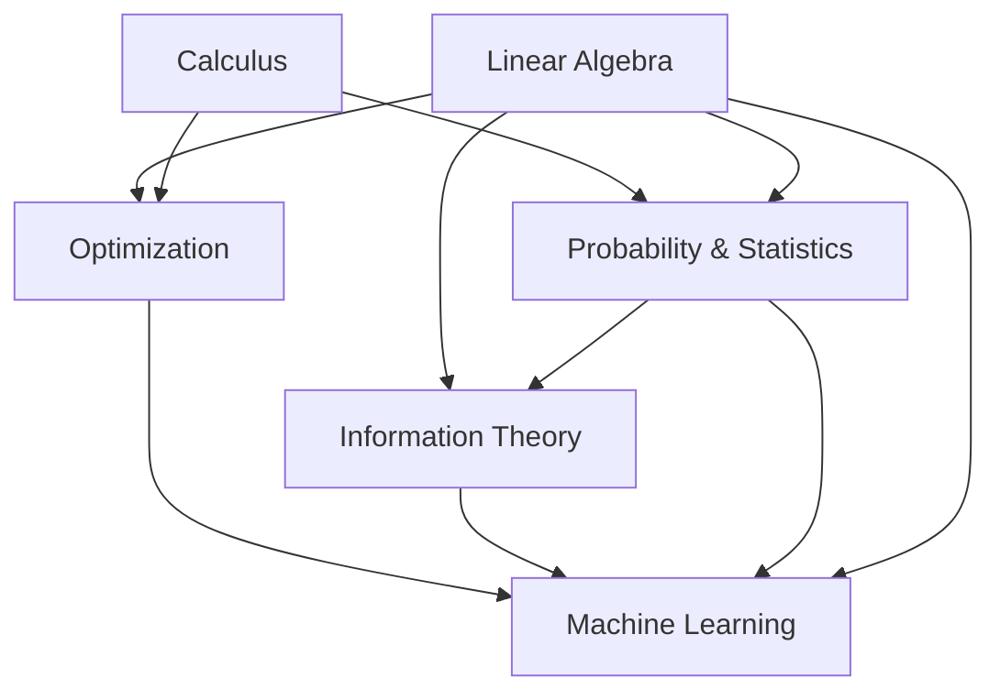

# Mathematics Prerequisites for AI/ML/Deep Learning

## Overview

Mathematics is the language of machine learning. Every algorithm, every model architecture, and every training procedure is grounded in mathematical concepts. This module covers the essential mathematical foundations you need before diving into ML/DL.

## Dependency Flow



## ASCII Dependency Diagram

```
┌─────────────────────────────────────────────────────────────────────┐
│                    MATHEMATICS FOR AI/ML/DL                          │
├─────────────────────────────────────────────────────────────────────┤
│                                                                     │
│  ┌──────────────┐     ┌──────────────┐     ┌───────────────────┐   │
│  │   LINEAR     │     │   CALCULUS   │     │   PROBABILITY &   │   │
│  │   ALGEBRA    │     │              │     │   STATISTICS      │   │
│  │              │     │              │     │                   │   │
│  │ • Vectors    │────▶│ • Gradients  │────▶│ • Distributions   │   │
│  │ • Matrices   │     │ • Chain Rule │     │ • Bayes' Theorem  │   │
│  │ • Eigenvalues│     │ • Jacobians  │     │ • MLE / MAP       │   │
│  │ • SVD        │     │ • Hessians   │     │ • Hypothesis Test │   │
│  └──────┬───────┘     └──────┬───────┘     └────────┬──────────┘   │
│         │                    │                       │              │
│         ▼                    ▼                       ▼              │
│  ┌──────────────────────────────────────────────────────────────┐   │
│  │                     OPTIMIZATION                              │   │
│  │  • Gradient Descent  • Adam/SGD  • Convex Optimization       │   │
│  └──────────────────────────────┬───────────────────────────────┘   │
│                                 │                                    │
│                                 ▼                                    │
│  ┌──────────────────────────────────────────────────────────────┐   │
│  │                  INFORMATION THEORY                            │   │
│  │  • Entropy  • Cross-Entropy  • KL Divergence                 │   │
│  └──────────────────────────────┬───────────────────────────────┘   │
│                                 │                                    │
│                                 ▼                                    │
│  ┌──────────────────────────────────────────────────────────────┐   │
│  │              MACHINE LEARNING / DEEP LEARNING                 │   │
│  └──────────────────────────────────────────────────────────────┘   │
└─────────────────────────────────────────────────────────────────────┘
```

## Module Structure

| # | Topic | Key Concepts | ML Applications |
|---|-------|--------------|-----------------|
| 01 | [Linear Algebra](./01-Linear-Algebra/README.md) | Vectors, Matrices, Eigenvalues, SVD | PCA, Embeddings, CNNs |
| 02 | [Calculus](./02-Calculus/README.md) | Derivatives, Gradients, Chain Rule | Backpropagation, Optimization |
| 03 | [Probability & Statistics](./03-Probability-and-Statistics/README.md) | Distributions, Bayes, MLE | Naive Bayes, GMMs, VAEs |
| 04 | [Optimization](./04-Optimization/README.md) | Gradient Descent, Adam, Convergence | Training Neural Networks |
| 05 | [Information Theory](./05-Information-Theory/README.md) | Entropy, Cross-Entropy, KL Divergence | Loss Functions, GANs |

## How Math Maps to ML Concepts

```
Math Concept                    ML Application
─────────────────────────────────────────────────────────
Matrix multiplication      →    Neural network forward pass
Gradient (∇f)             →    Direction to update weights
Chain rule                →    Backpropagation algorithm
Eigendecomposition        →    PCA dimensionality reduction
Probability distributions →    Model outputs (softmax)
Cross-entropy             →    Classification loss function
Convex optimization       →    Guaranteed convergence (linear/logistic regression)
Bayes' theorem            →    Posterior updates, Bayesian NNs
SVD                       →    Recommendation systems, compression
KL Divergence             →    VAE loss, GAN training
```

## Recommended Learning Order

1. **Linear Algebra** (1-2 weeks) - Foundation for everything
2. **Calculus** (1-2 weeks) - Needed for optimization
3. **Probability & Statistics** (2 weeks) - Core of ML reasoning
4. **Optimization** (1 week) - How models learn
5. **Information Theory** (3-5 days) - Loss functions and beyond

## Resources

- **3Blue1Brown** - Essence of Linear Algebra (YouTube)
- **Khan Academy** - Calculus & Statistics
- **Mathematics for Machine Learning** (Deisenroth, Faisal, Ong) - Free textbook
- **Deep Learning** (Goodfellow, Bengio, Courville) - Chapter 2-4
- **Pattern Recognition and Machine Learning** (Bishop) - Probability focus
