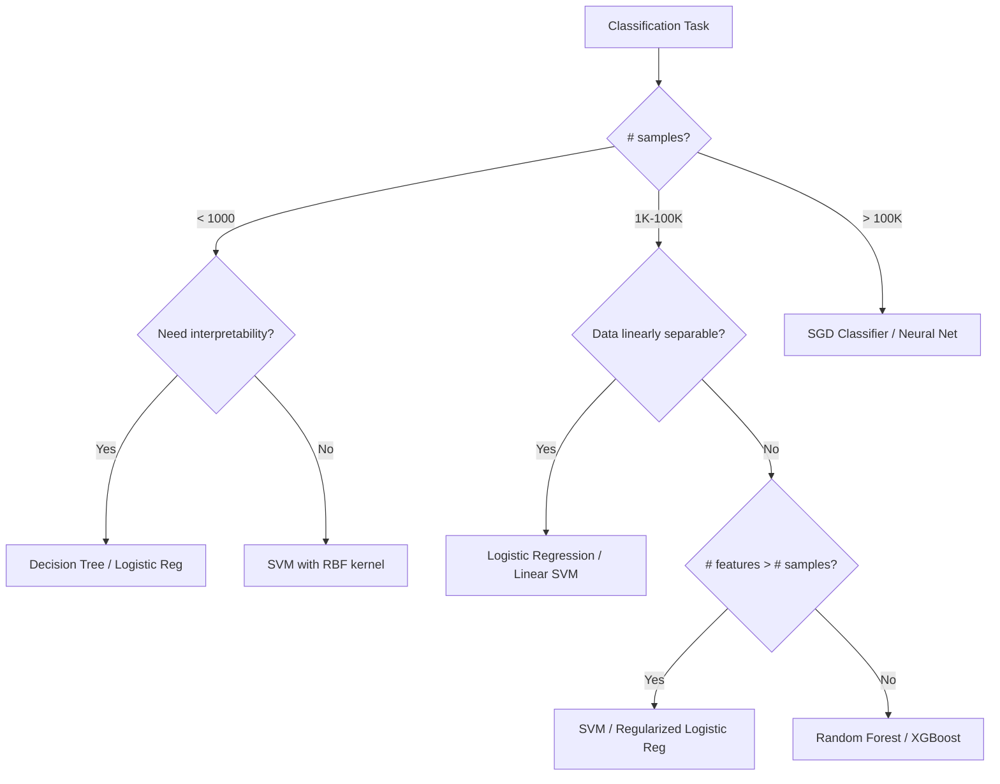

# Supervised Learning - Complete Guide

## Overview

Supervised learning learns a mapping function f: X → Y from labeled training data {(x₁,y₁), (x₂,y₂), ..., (xₙ,yₙ)}.

```
┌─────────────────────────────────────────────────────┐
│              SUPERVISED LEARNING                      │
├─────────────────────────┬───────────────────────────┤
│     REGRESSION          │     CLASSIFICATION         │
│     (Continuous Y)      │     (Discrete Y)           │
├─────────────────────────┼───────────────────────────┤
│ • Linear Regression     │ • Logistic Regression      │
│ • Polynomial Regression │ • SVM                      │
│ • Ridge/Lasso           │ • Decision Trees           │
│ • SVR                   │ • KNN                      │
│ • Decision Tree Reg.    │ • Naive Bayes              │
│ • Random Forest Reg.    │ • Random Forest            │
└─────────────────────────┴───────────────────────────┘
```

---

## 1. Linear Regression

### The Problem
Find the best linear relationship: ŷ = w₀ + w₁x₁ + w₂x₂ + ... + wₙxₙ = Xw

### Derivation from Scratch (Ordinary Least Squares)

**Objective:** Minimize the sum of squared residuals

```
L(w) = ||y - Xw||² = (y - Xw)ᵀ(y - Xw)
     = yᵀy - 2wᵀXᵀy + wᵀXᵀXw
```

**Take gradient and set to zero:**
```
∂L/∂w = -2Xᵀy + 2XᵀXw = 0
         XᵀXw = Xᵀy
         w* = (XᵀX)⁻¹Xᵀy        ← Normal Equation
```

**Geometric Interpretation:**
```
        y (true values)
        │  /
        │ / residual = y - ŷ
        │/
        ●─────────── ŷ (projection onto column space of X)
       /│
      / │
     /  │
    Column space of X

The OLS solution projects y onto the column space of X.
The residual (y - Xw*) is orthogonal to the column space.
```

### Gradient Descent Alternative

When XᵀX is too large to invert (n features >> 10000):

```python
def linear_regression_gd(X, y, lr=0.01, epochs=1000):
    m, n = X.shape
    w = np.zeros(n)
    b = 0
    
    for _ in range(epochs):
        y_pred = X @ w + b
        error = y_pred - y
        
        # Gradients
        dw = (1/m) * X.T @ error      # ∂L/∂w = (1/m) Xᵀ(Xw - y)
        db = (1/m) * np.sum(error)     # ∂L/∂b = (1/m) Σ(ŷᵢ - yᵢ)
        
        w -= lr * dw
        b -= lr * db
    
    return w, b
```

### Loss Function
```
MSE = (1/n) Σᵢ (yᵢ - ŷᵢ)²
MAE = (1/n) Σᵢ |yᵢ - ŷᵢ|
Huber Loss = { 0.5(y-ŷ)²          if |y-ŷ| ≤ δ
             { δ|y-ŷ| - 0.5δ²     otherwise
```

### Assumptions of Linear Regression
1. Linearity: Y is a linear function of X
2. Independence: Observations are independent
3. Homoscedasticity: Constant variance of errors
4. Normality: Errors are normally distributed
5. No multicollinearity: Features are not highly correlated

---

## 2. Logistic Regression

### The Problem
Binary classification: P(Y=1|X) using a linear model

### Why Not Linear Regression for Classification?
- Linear regression can output values < 0 or > 1
- We need probabilities bounded in [0, 1]
- Solution: Apply sigmoid function to linear output

### The Sigmoid Function
```
σ(z) = 1 / (1 + e⁻ᶻ)

Properties:
- σ(0) = 0.5
- σ(z) → 1 as z → +∞
- σ(z) → 0 as z → -∞
- σ'(z) = σ(z)(1 - σ(z))
- σ(-z) = 1 - σ(z)

         1 ┤                    ·········
           │                ···
           │              ··
       0.5 ┤·············●··············
           │          ··
           │       ···
         0 ┤·······
           └──────────────┼──────────────
                          0
```

### Model
```
P(Y=1|x) = σ(wᵀx + b) = 1 / (1 + exp(-(wᵀx + b)))

Log-odds (logit): log[P(Y=1)/P(Y=0)] = wᵀx + b  (linear!)
```

### Derivation: Maximum Likelihood Estimation

```
Likelihood: L(w) = Π P(yᵢ|xᵢ) = Π σ(wᵀxᵢ)^yᵢ · (1-σ(wᵀxᵢ))^(1-yᵢ)

Log-likelihood: ℓ(w) = Σ [yᵢ log(σ(wᵀxᵢ)) + (1-yᵢ) log(1-σ(wᵀxᵢ))]

Negative log-likelihood (Binary Cross-Entropy Loss):
BCE = -(1/n) Σ [yᵢ log(ŷᵢ) + (1-yᵢ) log(1-ŷᵢ)]

Gradient: ∂ℓ/∂w = Σ (yᵢ - σ(wᵀxᵢ)) · xᵢ = Xᵀ(y - ŷ)
```

### Decision Boundary
```
Decision boundary: wᵀx + b = 0  (a hyperplane)

   x₂
    │      Class 1 (Y=1)
    │    ·  ·  · /
    │   ·  ·   /  
    │  ·      /    Class 0 (Y=0)
    │   ·   /      ○  ○
    │  ·  /     ○  ○  ○
    │   /    ○   ○  ○
    │ /   ○  ○
    └──────────────── x₁
         wᵀx + b = 0
```

### Python Implementation
```python
class LogisticRegression:
    def __init__(self, lr=0.01, epochs=1000):
        self.lr = lr
        self.epochs = epochs
    
    def sigmoid(self, z):
        return 1 / (1 + np.exp(-np.clip(z, -500, 500)))
    
    def fit(self, X, y):
        m, n = X.shape
        self.w = np.zeros(n)
        self.b = 0
        
        for _ in range(self.epochs):
            z = X @ self.w + self.b
            y_pred = self.sigmoid(z)
            
            dw = (1/m) * X.T @ (y_pred - y)
            db = (1/m) * np.sum(y_pred - y)
            
            self.w -= self.lr * dw
            self.b -= self.lr * db
    
    def predict_proba(self, X):
        return self.sigmoid(X @ self.w + self.b)
    
    def predict(self, X, threshold=0.5):
        return (self.predict_proba(X) >= threshold).astype(int)
```

---

## 3. Support Vector Machines (SVM)

### Intuition: Maximum Margin Classifier

```
Find the hyperplane that maximizes the margin between classes.

   x₂
    │     + + +
    │   +   + ←─ Support Vector
    │  +  ┊   ┊
    │     ┊   ┊  margin = 2/||w||
    │     ┊   ┊
    │  ─  ┊   ┊  ─ ─
    │     ┊→  ←┊
    │  ─    ─  ─ ←─ Support Vector
    │    ─   ─
    └──────────────── x₁
          wᵀx + b = 0
```

### Hard Margin SVM (Linearly Separable)

**Optimization Problem:**
```
minimize    (1/2)||w||²
subject to  yᵢ(wᵀxᵢ + b) ≥ 1,  ∀i

Margin = 2/||w||, so maximizing margin = minimizing ||w||²
```

### Soft Margin SVM (Non-separable)

```
minimize    (1/2)||w||² + C Σᵢ ξᵢ
subject to  yᵢ(wᵀxᵢ + b) ≥ 1 - ξᵢ
            ξᵢ ≥ 0

where ξᵢ = slack variables (allow misclassification)
      C = regularization parameter (penalty for violations)
      - Large C → Less tolerance for violations (hard margin)
      - Small C → More tolerance (smoother boundary)
```

### Dual Formulation (via Lagrange Multipliers)

```
maximize    Σᵢ αᵢ - (1/2) Σᵢ Σⱼ αᵢαⱼyᵢyⱼ(xᵢᵀxⱼ)
subject to  0 ≤ αᵢ ≤ C
            Σᵢ αᵢyᵢ = 0

Solution: w* = Σᵢ αᵢyᵢxᵢ  (only support vectors have αᵢ > 0)
Prediction: f(x) = sign(Σᵢ αᵢyᵢ(xᵢᵀx) + b)
```

### The Kernel Trick

The dual form only uses dot products xᵢᵀxⱼ. Replace with kernel K(xᵢ,xⱼ) = φ(xᵢ)ᵀφ(xⱼ):

```
Common Kernels:
─────────────────────────────────────────────────────
Linear:      K(x,z) = xᵀz
Polynomial:  K(x,z) = (γ·xᵀz + r)^d
RBF/Gaussian: K(x,z) = exp(-γ||x-z||²)
Sigmoid:     K(x,z) = tanh(γ·xᵀz + r)

RBF Kernel maps to infinite-dimensional space!
```

```
Before Kernel (not separable)     After RBF Kernel (separable in higher dim)
                                  
    ─ ─ + + + ─ ─                    ─     ─
   ─   + + + +   ─                 ─         ─
    ─ ─ + + + ─ ─                      + + +
                                      + + + +
                                       + + +
                                   ─         ─
                                     ─     ─
```

### Hinge Loss Interpretation
```
SVM minimizes: (1/n) Σ max(0, 1 - yᵢ(wᵀxᵢ + b)) + λ||w||²
                         ↑ Hinge Loss                   ↑ Regularization
```

---

## 4. Decision Trees

### Core Idea
Recursively split feature space into regions, making predictions based on majority class (classification) or mean value (regression) in each region.

### Information Theory Foundations

**Entropy** (measure of impurity/uncertainty):
```
H(S) = -Σᵢ pᵢ log₂(pᵢ)

- H = 0 when all samples belong to one class (pure)
- H = 1 (for binary) when classes are equally distributed (maximum impurity)

Entropy:  1 ┤     ·····
             │   ··     ··
             │  ·         ·
             │ ·           ·
           0 ┤·─────────────·
             0     0.5      1
                   P(+)
```

**Information Gain** (reduction in entropy after split):
```
IG(S, A) = H(S) - Σᵥ (|Sᵥ|/|S|) · H(Sᵥ)

where A = attribute to split on
      v = possible values of A
      Sᵥ = subset of S where A = v
```

**Gini Impurity** (used by CART):
```
Gini(S) = 1 - Σᵢ pᵢ²

For binary: Gini = 2p(1-p)
- Gini = 0: pure node
- Gini = 0.5: maximum impurity (binary case)
```

### Tree Building Algorithm (ID3/C4.5/CART)

```
Algorithm BuildTree(S, Features):
    if all samples in S have same label:
        return Leaf(label)
    if Features is empty:
        return Leaf(majority_label)
    
    best_feature = argmax_f IG(S, f)    # or min Gini
    tree = Node(best_feature)
    
    for each value v of best_feature:
        subset = {x ∈ S | x[best_feature] = v}
        if subset is empty:
            tree.add_child(v, Leaf(majority_label))
        else:
            tree.add_child(v, BuildTree(subset, Features - {best_feature}))
    
    return tree
```

### Example Split
```
Dataset: Will play tennis?
──────────────────────────────
Outlook    | Temp  | Play?
──────────────────────────────
Sunny      | Hot   | No
Sunny      | Cool  | Yes
Overcast   | Hot   | Yes
Rain       | Mild  | Yes
Rain       | Cool  | No

H(Play) = -(3/5)log₂(3/5) - (2/5)log₂(2/5) = 0.971

Split on Outlook:
  Sunny:    {No, Yes} → H = 1.0
  Overcast: {Yes}     → H = 0.0
  Rain:     {Yes, No} → H = 1.0

IG(Play, Outlook) = 0.971 - (2/5)(1.0) - (1/5)(0.0) - (2/5)(1.0) = 0.171
```

### Visualization
```
              [Outlook?]
             /    |     \
         Sunny  Overcast  Rain
          /       |         \
    [Humidity?]  Yes    [Wind?]
      /     \            /    \
   High    Normal    Strong  Weak
    No      Yes       No     Yes
```

### Pruning
- **Pre-pruning:** Stop growing (max_depth, min_samples_split, min_samples_leaf)
- **Post-pruning:** Grow full tree, then remove branches that don't improve validation error
  - Cost-complexity pruning: minimize (error + α·|leaves|)

---

## 5. K-Nearest Neighbors (KNN)

### Algorithm
```
KNN_predict(x_query, k):
    1. Compute distance from x_query to all training points
    2. Select k nearest neighbors
    3. Classification: majority vote
       Regression: average of k neighbors' values
```

### Distance Metrics
```
Euclidean:   d(x,z) = √(Σᵢ (xᵢ - zᵢ)²)
Manhattan:   d(x,z) = Σᵢ |xᵢ - zᵢ|
Minkowski:   d(x,z) = (Σᵢ |xᵢ - zᵢ|ᵖ)^(1/p)
Cosine:      d(x,z) = 1 - (x·z)/(||x||·||z||)
```

### Effect of K
```
k=1: Complex boundary           k=15: Smooth boundary
(low bias, high variance)       (high bias, low variance)

  ·○·○·                          ·····
  ○·○·○    (noisy)              ○○○○○    (smooth)
  ·○·○·                          ·····
```

### Important Notes
- **Curse of dimensionality:** KNN degrades in high dimensions (all points become equidistant)
- **Feature scaling is critical:** Normalize/standardize features
- **Computational cost:** O(nd) per query (use KD-trees or Ball trees for speedup)

---

## 6. Naive Bayes

### Bayes' Theorem Applied to Classification
```
P(Y|X) = P(X|Y) · P(Y) / P(X)

Classify: ŷ = argmax_y P(Y=y) · P(X|Y=y)
```

### The "Naive" Assumption
Features are conditionally independent given the class:
```
P(x₁, x₂, ..., xₙ | Y) = Π P(xᵢ | Y)

This simplification makes computation tractable!
```

### Variants
```
┌────────────────────┬─────────────────────┬──────────────────┐
│ Gaussian NB        │ Multinomial NB      │ Bernoulli NB     │
├────────────────────┼─────────────────────┼──────────────────┤
│ Continuous features│ Count features      │ Binary features  │
│ P(xᵢ|y) = Normal  │ P(xᵢ|y) ∝ θᵧᵢ^xᵢ │ P(xᵢ|y)=Bernoulli│
│ Use: General       │ Use: Text (TF)      │ Use: Text (binary)│
└────────────────────┴─────────────────────┴──────────────────┘
```

### Why It Works Despite Wrong Assumption
- Classification only needs the correct **ranking** of P(Y|X), not exact values
- The independence assumption is wrong but the decision boundary may still be correct
- Works surprisingly well for text classification and spam filtering

---

## 7. Regularization

### Why Regularize?
Prevent overfitting by penalizing model complexity.

```
Regularized Loss = Original Loss + λ · Penalty

┌──────────────────────────────────────────────────────────┐
│ Type       │ Penalty    │ Effect                          │
├──────────────────────────────────────────────────────────┤
│ L1 (Lasso) │ λΣ|wᵢ|    │ Sparse weights (feature select) │
│ L2 (Ridge) │ λΣwᵢ²     │ Small weights (shrinkage)       │
│ Elastic Net│ λ₁Σ|wᵢ| + λ₂Σwᵢ² │ Combined              │
└──────────────────────────────────────────────────────────┘
```

### Geometric Interpretation
```
        w₂                          w₂
        │    ╱╲                     │    ╱╲
        │   ╱  ╲ ← Loss contours   │   ╱  ╲
        │  ╱ ◆  ╲                   │  ╱    ╲
   ┌────┼────┐   ╲             ╭────┼────╮   ╲
   │    │    │    ╲            │    │    │    ╲
───┤────●────┤─── w₁     ─────●────┼────●──── w₁
   │    │    │                 │    │    │
   └────┼────┘                 ╰────┼────╯
        │                           │
     L1: Diamond                  L2: Circle
     Corners → sparse w          Smooth → small w
     (w₁=0 or w₂=0 likely)      (all w shrink evenly)
```

### L1 vs L2 - When to Use
- **L1 (Lasso):** When you suspect many features are irrelevant (automatic feature selection)
- **L2 (Ridge):** When all features are potentially useful but you want to prevent large weights
- **Elastic Net:** When features are correlated (L1 alone picks one randomly from correlated group)

---

## 8. Loss Functions Summary

| Algorithm | Loss Function | Formula |
|-----------|--------------|---------|
| Linear Regression | MSE | (1/n)Σ(y-ŷ)² |
| Logistic Regression | Binary Cross-Entropy | -(1/n)Σ[y·log(ŷ)+(1-y)·log(1-ŷ)] |
| SVM | Hinge Loss | (1/n)Σmax(0, 1-y·f(x)) |
| Decision Tree | Gini/Entropy | Information gain based |
| KNN | None (lazy learner) | N/A |
| Naive Bayes | Log-likelihood | -Σlog P(yᵢ|xᵢ) |

---

## 9. Algorithm Selection Flowchart



---

## 10. Production Considerations

### Feature Preprocessing
```python
from sklearn.pipeline import Pipeline
from sklearn.preprocessing import StandardScaler, OneHotEncoder
from sklearn.compose import ColumnTransformer

preprocessor = ColumnTransformer([
    ('num', StandardScaler(), numerical_cols),
    ('cat', OneHotEncoder(handle_unknown='ignore'), categorical_cols)
])

pipeline = Pipeline([
    ('preprocessor', preprocessor),
    ('classifier', LogisticRegression(C=1.0, max_iter=1000))
])
```

### Algorithm-Specific Requirements
| Algorithm | Scaling Needed? | Handles Missing? | Handles Categorical? |
|-----------|:---:|:---:|:---:|
| Linear/Logistic Reg | Yes | No | No (encode) |
| SVM | Yes | No | No (encode) |
| Decision Tree | No | Yes* | Yes* |
| KNN | Yes | No | No (encode) |
| Naive Bayes | No | Yes* | Yes |
| Random Forest | No | Yes* | Yes* |
| XGBoost/LightGBM | No | Yes | Yes* |

---

## Interview Questions

**Q: Why is Logistic Regression called "Regression" if it's a classifier?**
It models the log-odds as a linear regression. The output is a continuous probability, and thresholding gives classification.

**Q: What happens if features are correlated in Linear Regression?**
Multicollinearity makes XᵀX nearly singular, causing unstable weight estimates with huge variance. Use Ridge regression or remove correlated features.

**Q: SVM vs Logistic Regression?**
- SVM maximizes margin (geometric), LR maximizes likelihood (probabilistic)
- SVM gives no probabilities (without Platt scaling), LR gives calibrated probabilities
- SVM with kernels handles non-linearity naturally
- LR is faster to train and easier to update online

**Q: When would Naive Bayes outperform Logistic Regression?**
- Very small training sets (NB has lower variance)
- Very high dimensional data (text classification)
- When features are actually independent

**Q: How does a Decision Tree handle continuous features?**
It finds the optimal split point by evaluating all possible thresholds (midpoints between sorted values) and selecting the one with maximum information gain.

**Q: What's the time complexity of KNN prediction?**
O(n·d) for brute force (n=samples, d=dimensions). With KD-tree: O(d·log n) average case but degrades to O(n·d) in high dimensions.
