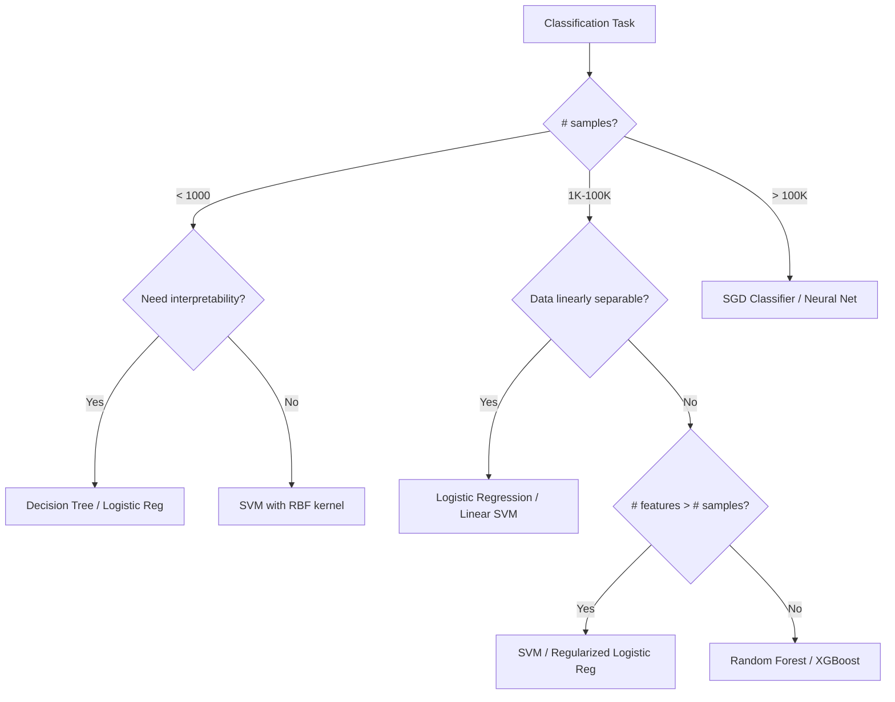

# Supervised Learning - Complete Guide

## Overview

Supervised learning learns a mapping function f: X → Y from labeled training data {(x₁,y₁), (x₂,y₂), ..., (xₙ,yₙ)}.

```
┌─────────────────────────────────────────────────────┐
│              SUPERVISED LEARNING                      │
├─────────────────────────┬───────────────────────────┤
│     REGRESSION          │     CLASSIFICATION         │
│     (Continuous Y)      │     (Discrete Y)           │
├─────────────────────────┼───────────────────────────┤
│ • Linear Regression     │ • Logistic Regression      │
│ • Polynomial Regression │ • SVM                      │
│ • Ridge/Lasso           │ • Decision Trees           │
│ • SVR                   │ • KNN                      │
│ • Decision Tree Reg.    │ • Naive Bayes              │
│ • Random Forest Reg.    │ • Random Forest            │
└─────────────────────────┴───────────────────────────┘
```

---

## 1. Linear Regression

### The Problem
Find the best linear relationship: ŷ = w₀ + w₁x₁ + w₂x₂ + ... + wₙxₙ = Xw

### Derivation from Scratch (Ordinary Least Squares)

**Objective:** Minimize the sum of squared residuals

```
L(w) = ||y - Xw||² = (y - Xw)ᵀ(y - Xw)
     = yᵀy - 2wᵀXᵀy + wᵀXᵀXw
```

**Take gradient and set to zero:**
```
∂L/∂w = -2Xᵀy + 2XᵀXw = 0
         XᵀXw = Xᵀy
         w* = (XᵀX)⁻¹Xᵀy        ← Normal Equation
```

**Geometric Interpretation:**
```
        y (true values)
        │  /
        │ / residual = y - ŷ
        │/
        ●─────────── ŷ (projection onto column space of X)
       /│
      / │
     /  │
    Column space of X

The OLS solution projects y onto the column space of X.
The residual (y - Xw*) is orthogonal to the column space.
```

### Gradient Descent Alternative

When XᵀX is too large to invert (n features >> 10000):

```python
def linear_regression_gd(X, y, lr=0.01, epochs=1000):
    m, n = X.shape
    w = np.zeros(n)
    b = 0
    
    for _ in range(epochs):
        y_pred = X @ w + b
        error = y_pred - y
        
        # Gradients
        dw = (1/m) * X.T @ error      # ∂L/∂w = (1/m) Xᵀ(Xw - y)
        db = (1/m) * np.sum(error)     # ∂L/∂b = (1/m) Σ(ŷᵢ - yᵢ)
        
        w -= lr * dw
        b -= lr * db
    
    return w, b
```

### Loss Function
```
MSE = (1/n) Σᵢ (yᵢ - ŷᵢ)²
MAE = (1/n) Σᵢ |yᵢ - ŷᵢ|
Huber Loss = { 0.5(y-ŷ)²          if |y-ŷ| ≤ δ
             { δ|y-ŷ| - 0.5δ²     otherwise
```

### Assumptions of Linear Regression
1. Linearity: Y is a linear function of X
2. Independence: Observations are independent
3. Homoscedasticity: Constant variance of errors
4. Normality: Errors are normally distributed
5. No multicollinearity: Features are not highly correlated

---

## 2. Logistic Regression

### The Problem
Binary classification: P(Y=1|X) using a linear model

### Why Not Linear Regression for Classification?
- Linear regression can output values < 0 or > 1
- We need probabilities bounded in [0, 1]
- Solution: Apply sigmoid function to linear output

### The Sigmoid Function
```
σ(z) = 1 / (1 + e⁻ᶻ)

Properties:
- σ(0) = 0.5
- σ(z) → 1 as z → +∞
- σ(z) → 0 as z → -∞
- σ'(z) = σ(z)(1 - σ(z))
- σ(-z) = 1 - σ(z)

         1 ┤                    ·········
           │                ···
           │              ··
       0.5 ┤·············●··············
           │          ··
           │       ···
         0 ┤·······
           └──────────────┼──────────────
                          0
```

### Model
```
P(Y=1|x) = σ(wᵀx + b) = 1 / (1 + exp(-(wᵀx + b)))

Log-odds (logit): log[P(Y=1)/P(Y=0)] = wᵀx + b  (linear!)
```

### Derivation: Maximum Likelihood Estimation

```
Likelihood: L(w) = Π P(yᵢ|xᵢ) = Π σ(wᵀxᵢ)^yᵢ · (1-σ(wᵀxᵢ))^(1-yᵢ)

Log-likelihood: ℓ(w) = Σ [yᵢ log(σ(wᵀxᵢ)) + (1-yᵢ) log(1-σ(wᵀxᵢ))]

Negative log-likelihood (Binary Cross-Entropy Loss):
BCE = -(1/n) Σ [yᵢ log(ŷᵢ) + (1-yᵢ) log(1-ŷᵢ)]

Gradient: ∂ℓ/∂w = Σ (yᵢ - σ(wᵀxᵢ)) · xᵢ = Xᵀ(y - ŷ)
```

### Decision Boundary
```
Decision boundary: wᵀx + b = 0  (a hyperplane)

   x₂
    │      Class 1 (Y=1)
    │    ·  ·  · /
    │   ·  ·   /  
    │  ·      /    Class 0 (Y=0)
    │   ·   /      ○  ○
    │  ·  /     ○  ○  ○
    │   /    ○   ○  ○
    │ /   ○  ○
    └──────────────── x₁
         wᵀx + b = 0
```

### Python Implementation
```python
class LogisticRegression:
    def __init__(self, lr=0.01, epochs=1000):
        self.lr = lr
        self.epochs = epochs
    
    def sigmoid(self, z):
        return 1 / (1 + np.exp(-np.clip(z, -500, 500)))
    
    def fit(self, X, y):
        m, n = X.shape
        self.w = np.zeros(n)
        self.b = 0
        
        for _ in range(self.epochs):
            z = X @ self.w + self.b
            y_pred = self.sigmoid(z)
            
            dw = (1/m) * X.T @ (y_pred - y)
            db = (1/m) * np.sum(y_pred - y)
            
            self.w -= self.lr * dw
            self.b -= self.lr * db
    
    def predict_proba(self, X):
        return self.sigmoid(X @ self.w + self.b)
    
    def predict(self, X, threshold=0.5):
        return (self.predict_proba(X) >= threshold).astype(int)
```

---

## 3. Support Vector Machines (SVM)

### Intuition: Maximum Margin Classifier

```
Find the hyperplane that maximizes the margin between classes.

   x₂
    │     + + +
    │   +   + ←─ Support Vector
    │  +  ┊   ┊
    │     ┊   ┊  margin = 2/||w||
    │     ┊   ┊
    │  ─  ┊   ┊  ─ ─
    │     ┊→  ←┊
    │  ─    ─  ─ ←─ Support Vector
    │    ─   ─
    └──────────────── x₁
          wᵀx + b = 0
```

### Hard Margin SVM (Linearly Separable)

**Optimization Problem:**
```
minimize    (1/2)||w||²
subject to  yᵢ(wᵀxᵢ + b) ≥ 1,  ∀i

Margin = 2/||w||, so maximizing margin = minimizing ||w||²
```

### Soft Margin SVM (Non-separable)

```
minimize    (1/2)||w||² + C Σᵢ ξᵢ
subject to  yᵢ(wᵀxᵢ + b) ≥ 1 - ξᵢ
            ξᵢ ≥ 0

where ξᵢ = slack variables (allow misclassification)
      C = regularization parameter (penalty for violations)
      - Large C → Less tolerance for violations (hard margin)
      - Small C → More tolerance (smoother boundary)
```

### Dual Formulation (via Lagrange Multipliers)

```
maximize    Σᵢ αᵢ - (1/2) Σᵢ Σⱼ αᵢαⱼyᵢyⱼ(xᵢᵀxⱼ)
subject to  0 ≤ αᵢ ≤ C
            Σᵢ αᵢyᵢ = 0

Solution: w* = Σᵢ αᵢyᵢxᵢ  (only support vectors have αᵢ > 0)
Prediction: f(x) = sign(Σᵢ αᵢyᵢ(xᵢᵀx) + b)
```

### The Kernel Trick

The dual form only uses dot products xᵢᵀxⱼ. Replace with kernel K(xᵢ,xⱼ) = φ(xᵢ)ᵀφ(xⱼ):

```
Common Kernels:
─────────────────────────────────────────────────────
Linear:      K(x,z) = xᵀz
Polynomial:  K(x,z) = (γ·xᵀz + r)^d
RBF/Gaussian: K(x,z) = exp(-γ||x-z||²)
Sigmoid:     K(x,z) = tanh(γ·xᵀz + r)

RBF Kernel maps to infinite-dimensional space!
```

```
Before Kernel (not separable)     After RBF Kernel (separable in higher dim)
                                  
    ─ ─ + + + ─ ─                    ─     ─
   ─   + + + +   ─                 ─         ─
    ─ ─ + + + ─ ─                      + + +
                                      + + + +
                                       + + +
                                   ─         ─
                                     ─     ─
```

### Hinge Loss Interpretation
```
SVM minimizes: (1/n) Σ max(0, 1 - yᵢ(wᵀxᵢ + b)) + λ||w||²
                         ↑ Hinge Loss                   ↑ Regularization
```

---

## 4. Decision Trees

### Core Idea
Recursively split feature space into regions, making predictions based on majority class (classification) or mean value (regression) in each region.

### Information Theory Foundations

**Entropy** (measure of impurity/uncertainty):
```
H(S) = -Σᵢ pᵢ log₂(pᵢ)

- H = 0 when all samples belong to one class (pure)
- H = 1 (for binary) when classes are equally distributed (maximum impurity)

Entropy:  1 ┤     ·····
             │   ··     ··
             │  ·         ·
             │ ·           ·
           0 ┤·─────────────·
             0     0.5      1
                   P(+)
```

**Information Gain** (reduction in entropy after split):
```
IG(S, A) = H(S) - Σᵥ (|Sᵥ|/|S|) · H(Sᵥ)

where A = attribute to split on
      v = possible values of A
      Sᵥ = subset of S where A = v
```

**Gini Impurity** (used by CART):
```
Gini(S) = 1 - Σᵢ pᵢ²

For binary: Gini = 2p(1-p)
- Gini = 0: pure node
- Gini = 0.5: maximum impurity (binary case)
```

### Tree Building Algorithm (ID3/C4.5/CART)

```
Algorithm BuildTree(S, Features):
    if all samples in S have same label:
        return Leaf(label)
    if Features is empty:
        return Leaf(majority_label)
    
    best_feature = argmax_f IG(S, f)    # or min Gini
    tree = Node(best_feature)
    
    for each value v of best_feature:
        subset = {x ∈ S | x[best_feature] = v}
        if subset is empty:
            tree.add_child(v, Leaf(majority_label))
        else:
            tree.add_child(v, BuildTree(subset, Features - {best_feature}))
    
    return tree
```

### Example Split
```
Dataset: Will play tennis?
──────────────────────────────
Outlook    | Temp  | Play?
──────────────────────────────
Sunny      | Hot   | No
Sunny      | Cool  | Yes
Overcast   | Hot   | Yes
Rain       | Mild  | Yes
Rain       | Cool  | No

H(Play) = -(3/5)log₂(3/5) - (2/5)log₂(2/5) = 0.971

Split on Outlook:
  Sunny:    {No, Yes} → H = 1.0
  Overcast: {Yes}     → H = 0.0
  Rain:     {Yes, No} → H = 1.0

IG(Play, Outlook) = 0.971 - (2/5)(1.0) - (1/5)(0.0) - (2/5)(1.0) = 0.171
```

### Visualization
```
              [Outlook?]
             /    |     \
         Sunny  Overcast  Rain
          /       |         \
    [Humidity?]  Yes    [Wind?]
      /     \            /    \
   High    Normal    Strong  Weak
    No      Yes       No     Yes
```

### Pruning
- **Pre-pruning:** Stop growing (max_depth, min_samples_split, min_samples_leaf)
- **Post-pruning:** Grow full tree, then remove branches that don't improve validation error
  - Cost-complexity pruning: minimize (error + α·|leaves|)

---

## 5. K-Nearest Neighbors (KNN)

### Algorithm
```
KNN_predict(x_query, k):
    1. Compute distance from x_query to all training points
    2. Select k nearest neighbors
    3. Classification: majority vote
       Regression: average of k neighbors' values
```

### Distance Metrics
```
Euclidean:   d(x,z) = √(Σᵢ (xᵢ - zᵢ)²)
Manhattan:   d(x,z) = Σᵢ |xᵢ - zᵢ|
Minkowski:   d(x,z) = (Σᵢ |xᵢ - zᵢ|ᵖ)^(1/p)
Cosine:      d(x,z) = 1 - (x·z)/(||x||·||z||)
```

### Effect of K
```
k=1: Complex boundary           k=15: Smooth boundary
(low bias, high variance)       (high bias, low variance)

  ·○·○·                          ·····
  ○·○·○    (noisy)              ○○○○○    (smooth)
  ·○·○·                          ·····
```

### Important Notes
- **Curse of dimensionality:** KNN degrades in high dimensions (all points become equidistant)
- **Feature scaling is critical:** Normalize/standardize features
- **Computational cost:** O(nd) per query (use KD-trees or Ball trees for speedup)

---

## 6. Naive Bayes

### Bayes' Theorem Applied to Classification
```
P(Y|X) = P(X|Y) · P(Y) / P(X)

Classify: ŷ = argmax_y P(Y=y) · P(X|Y=y)
```

### The "Naive" Assumption
Features are conditionally independent given the class:
```
P(x₁, x₂, ..., xₙ | Y) = Π P(xᵢ | Y)

This simplification makes computation tractable!
```

### Variants
```
┌────────────────────┬─────────────────────┬──────────────────┐
│ Gaussian NB        │ Multinomial NB      │ Bernoulli NB     │
├────────────────────┼─────────────────────┼──────────────────┤
│ Continuous features│ Count features      │ Binary features  │
│ P(xᵢ|y) = Normal  │ P(xᵢ|y) ∝ θᵧᵢ^xᵢ │ P(xᵢ|y)=Bernoulli│
│ Use: General       │ Use: Text (TF)      │ Use: Text (binary)│
└────────────────────┴─────────────────────┴──────────────────┘
```

### Why It Works Despite Wrong Assumption
- Classification only needs the correct **ranking** of P(Y|X), not exact values
- The independence assumption is wrong but the decision boundary may still be correct
- Works surprisingly well for text classification and spam filtering

---

## 7. Regularization

### Why Regularize?
Prevent overfitting by penalizing model complexity.

```
Regularized Loss = Original Loss + λ · Penalty

┌──────────────────────────────────────────────────────────┐
│ Type       │ Penalty    │ Effect                          │
├──────────────────────────────────────────────────────────┤
│ L1 (Lasso) │ λΣ|wᵢ|    │ Sparse weights (feature select) │
│ L2 (Ridge) │ λΣwᵢ²     │ Small weights (shrinkage)       │
│ Elastic Net│ λ₁Σ|wᵢ| + λ₂Σwᵢ² │ Combined              │
└──────────────────────────────────────────────────────────┘
```

### Geometric Interpretation
```
        w₂                          w₂
        │    ╱╲                     │    ╱╲
        │   ╱  ╲ ← Loss contours   │   ╱  ╲
        │  ╱ ◆  ╲                   │  ╱    ╲
   ┌────┼────┐   ╲             ╭────┼────╮   ╲
   │    │    │    ╲            │    │    │    ╲
───┤────●────┤─── w₁     ─────●────┼────●──── w₁
   │    │    │                 │    │    │
   └────┼────┘                 ╰────┼────╯
        │                           │
     L1: Diamond                  L2: Circle
     Corners → sparse w          Smooth → small w
     (w₁=0 or w₂=0 likely)      (all w shrink evenly)
```

### L1 vs L2 - When to Use
- **L1 (Lasso):** When you suspect many features are irrelevant (automatic feature selection)
- **L2 (Ridge):** When all features are potentially useful but you want to prevent large weights
- **Elastic Net:** When features are correlated (L1 alone picks one randomly from correlated group)

---

## 8. Loss Functions Summary

| Algorithm | Loss Function | Formula |
|-----------|--------------|---------|
| Linear Regression | MSE | (1/n)Σ(y-ŷ)² |
| Logistic Regression | Binary Cross-Entropy | -(1/n)Σ[y·log(ŷ)+(1-y)·log(1-ŷ)] |
| SVM | Hinge Loss | (1/n)Σmax(0, 1-y·f(x)) |
| Decision Tree | Gini/Entropy | Information gain based |
| KNN | None (lazy learner) | N/A |
| Naive Bayes | Log-likelihood | -Σlog P(yᵢ|xᵢ) |

---

## 9. Algorithm Selection Flowchart



---

## 10. Production Considerations

### Feature Preprocessing
```python
from sklearn.pipeline import Pipeline
from sklearn.preprocessing import StandardScaler, OneHotEncoder
from sklearn.compose import ColumnTransformer

preprocessor = ColumnTransformer([
    ('num', StandardScaler(), numerical_cols),
    ('cat', OneHotEncoder(handle_unknown='ignore'), categorical_cols)
])

pipeline = Pipeline([
    ('preprocessor', preprocessor),
    ('classifier', LogisticRegression(C=1.0, max_iter=1000))
])
```

### Algorithm-Specific Requirements
| Algorithm | Scaling Needed? | Handles Missing? | Handles Categorical? |
|-----------|:---:|:---:|:---:|
| Linear/Logistic Reg | Yes | No | No (encode) |
| SVM | Yes | No | No (encode) |
| Decision Tree | No | Yes* | Yes* |
| KNN | Yes | No | No (encode) |
| Naive Bayes | No | Yes* | Yes |
| Random Forest | No | Yes* | Yes* |
| XGBoost/LightGBM | No | Yes | Yes* |

---

## Interview Questions

**Q: Why is Logistic Regression called "Regression" if it's a classifier?**
It models the log-odds as a linear regression. The output is a continuous probability, and thresholding gives classification.

**Q: What happens if features are correlated in Linear Regression?**
Multicollinearity makes XᵀX nearly singular, causing unstable weight estimates with huge variance. Use Ridge regression or remove correlated features.

**Q: SVM vs Logistic Regression?**
- SVM maximizes margin (geometric), LR maximizes likelihood (probabilistic)
- SVM gives no probabilities (without Platt scaling), LR gives calibrated probabilities
- SVM with kernels handles non-linearity naturally
- LR is faster to train and easier to update online

**Q: When would Naive Bayes outperform Logistic Regression?**
- Very small training sets (NB has lower variance)
- Very high dimensional data (text classification)
- When features are actually independent

**Q: How does a Decision Tree handle continuous features?**
It finds the optimal split point by evaluating all possible thresholds (midpoints between sorted values) and selecting the one with maximum information gain.

**Q: What's the time complexity of KNN prediction?**
O(n·d) for brute force (n=samples, d=dimensions). With KD-tree: O(d·log n) average case but degrades to O(n·d) in high dimensions.

---

## Exercises

### Exercise 1 (Beginner)
**Problem:** Given a dataset with features [square footage, number of bedrooms], predict house prices. Write the linear regression equation and identify what w₀, w₁, w₂ represent.
**Hint:** Think about what happens when all features are zero.

<details><summary>Solution</summary>

ŷ = w₀ + w₁(sqft) + w₂(bedrooms)
- w₀ = bias/intercept (base price when sqft=0, bedrooms=0)
- w₁ = price increase per additional square foot
- w₂ = price increase per additional bedroom

</details>

### Exercise 2 (Beginner)
**Problem:** Explain why we square the errors in OLS instead of using absolute values.
**Hint:** Consider differentiability and mathematical convenience.

<details><summary>Solution</summary>

1. Squared errors are differentiable everywhere (absolute values are not at zero)
2. Squaring penalizes large errors more heavily
3. The solution has a closed-form (Normal Equation)
4. Squared loss corresponds to maximum likelihood under Gaussian noise assumption

</details>

### Exercise 3 (Beginner)
**Problem:** If XᵀX is singular (non-invertible), what does this mean and how do you fix it?
**Hint:** Think about what causes a matrix to be singular.

<details><summary>Solution</summary>

Singular XᵀX means features are linearly dependent (multicollinearity). Fixes:
1. Remove redundant features
2. Use Ridge regression: w* = (XᵀX + λI)⁻¹Xᵀy (λI ensures invertibility)
3. Use PCA to reduce dimensionality
4. Collect more data

</details>

### Exercise 4 (Intermediate)
**Problem:** Derive the gradient descent update rule for logistic regression with binary cross-entropy loss.
**Hint:** Start with L = -[y·log(σ(wᵀx)) + (1-y)·log(1-σ(wᵀx))]

<details><summary>Solution</summary>

L = -[y·log(σ(z)) + (1-y)·log(1-σ(z))] where z = wᵀx

∂L/∂w = ∂L/∂σ · ∂σ/∂z · ∂z/∂w

Key property: dσ/dz = σ(z)(1-σ(z))

∂L/∂w = (σ(z) - y) · x

Update rule: w ← w - α(σ(wᵀx) - y)x

This is remarkably similar to linear regression gradient: w ← w - α(ŷ - y)x

</details>

### Exercise 5 (Intermediate)
**Problem:** You have a dataset with 10,000 features and 500 samples. Compare Lasso vs Ridge regression for this scenario. Which is better and why?
**Hint:** Consider what happens to irrelevant features.

<details><summary>Solution</summary>

Lasso (L1) is generally better because:
1. p >> n means many features are likely irrelevant
2. Lasso performs feature selection (drives coefficients to exactly zero)
3. Ridge keeps all features with small weights, not ideal for interpretability
4. Lasso produces a sparse model, easier to interpret and less overfitting

However, if features are highly correlated, Elastic Net (L1+L2) may be best since Lasso arbitrarily picks one from correlated groups.

</details>

### Exercise 6 (Intermediate)
**Problem:** Explain the kernel trick in SVM. Why can we compute in high-dimensional space without explicitly mapping features there?
**Hint:** The optimization only needs dot products between data points.

<details><summary>Solution</summary>

The SVM dual formulation only involves dot products: xᵢᵀxⱼ

The kernel trick replaces this with K(xᵢ, xⱼ) = φ(xᵢ)ᵀφ(xⱼ)

For RBF kernel: K(x,y) = exp(-γ||x-y||²) which corresponds to an infinite-dimensional feature space, but we never compute φ(x) explicitly.

This works because:
1. The optimization only needs pairwise similarities
2. K(x,y) can be computed in O(d) time regardless of φ's dimensionality
3. Any positive semi-definite function is a valid kernel (Mercer's theorem)

</details>

### Exercise 7 (Intermediate)
**Problem:** A decision tree achieves 100% training accuracy but 60% test accuracy. Diagnose the issue and propose 3 solutions.
**Hint:** What happens when a tree is grown to maximum depth?

<details><summary>Solution</summary>

Diagnosis: Overfitting — the tree has memorized the training data.

Solutions:
1. **Pruning:** Set max_depth, min_samples_split, min_samples_leaf
2. **Ensemble:** Use Random Forest to average out individual tree overfitting
3. **Cross-validation:** Use CV to find optimal tree complexity
4. **Cost-complexity pruning:** Find the subtree that minimizes error + α|T| (tree size penalty)

</details>

### Exercise 8 (Advanced)
**Problem:** Prove that the Naive Bayes assumption (feature independence given class) leads to the decision boundary being linear in the case of Gaussian features with shared covariance.
**Hint:** Write out the log-odds ratio.

<details><summary>Solution</summary>

For two classes, decision boundary is where P(Y=1|X) = P(Y=0|X).

Log-odds: log[P(Y=1|X)/P(Y=0|X)] = log[P(X|Y=1)/P(X|Y=0)] + log[P(Y=1)/P(Y=0)]

With Gaussian features and shared Σ:
log[P(X|Y=1)/P(X|Y=0)] = -½(x-μ₁)ᵀΣ⁻¹(x-μ₁) + ½(x-μ₀)ᵀΣ⁻¹(x-μ₀)

Expanding and canceling the quadratic terms (since Σ is shared):
= (μ₁-μ₀)ᵀΣ⁻¹x - ½(μ₁ᵀΣ⁻¹μ₁ - μ₀ᵀΣ⁻¹μ₀)

This is linear in x, hence linear decision boundary.

</details>

### Exercise 9 (Advanced)
**Problem:** You have a binary classification problem with 99% negative class and 1% positive class. Discuss why accuracy is a bad metric and what alternatives you would use.
**Hint:** What accuracy does a model that always predicts "negative" achieve?

<details><summary>Solution</summary>

A naive "always negative" classifier gets 99% accuracy — useless!

Better metrics:
1. **Precision:** TP/(TP+FP) — of predicted positives, how many are correct?
2. **Recall:** TP/(TP+FN) — of actual positives, how many did we catch?
3. **F1-score:** Harmonic mean of precision and recall
4. **PR-AUC:** Area under Precision-Recall curve (better for imbalanced data than ROC-AUC)
5. **Matthews Correlation Coefficient:** Balanced measure even with imbalanced classes

Also consider: SMOTE/oversampling, class weights, anomaly detection framing.

</details>

### Exercise 10 (Advanced)
**Problem:** Derive the dual formulation of the soft-margin SVM optimization problem. Explain the role of the slack variables ξᵢ and the C parameter.
**Hint:** Start with the primal and introduce Lagrange multipliers.

<details><summary>Solution</summary>

Primal: min ½||w||² + C·Σξᵢ
s.t. yᵢ(wᵀxᵢ+b) ≥ 1-ξᵢ, ξᵢ ≥ 0

Lagrangian: L = ½||w||² + CΣξᵢ - Σαᵢ[yᵢ(wᵀxᵢ+b)-1+ξᵢ] - Σμᵢξᵢ

KKT conditions:
∂L/∂w = 0 → w = Σαᵢyᵢxᵢ
∂L/∂b = 0 → Σαᵢyᵢ = 0
∂L/∂ξᵢ = 0 → αᵢ + μᵢ = C → 0 ≤ αᵢ ≤ C

Dual: max Σαᵢ - ½ΣᵢΣⱼ αᵢαⱼyᵢyⱼxᵢᵀxⱼ
s.t. 0 ≤ αᵢ ≤ C, Σαᵢyᵢ = 0

- ξᵢ allows misclassification (point on wrong side of margin)
- C controls trade-off: large C → less tolerance for errors (may overfit), small C → wider margin (may underfit)

</details>

---

## Self-Assessment Quiz

**1. What does the Normal Equation w* = (XᵀX)⁻¹Xᵀy assume?**
- A) Data is normalized
- B) XᵀX is invertible
- C) Features are independent
- D) Errors are zero

<details><summary>Answer</summary>B) XᵀX is invertible (non-singular)</details>

**2. Ridge regression adds which penalty term?**
- A) λΣ|wᵢ|
- B) λΣwᵢ²
- C) λΣwᵢ
- D) λ√(Σwᵢ²)

<details><summary>Answer</summary>B) λΣwᵢ² (L2 penalty)</details>

**3. In logistic regression, the sigmoid function maps outputs to:**
- A) (-∞, ∞)
- B) [0, 1]
- C) [-1, 1]
- D) (0, ∞)

<details><summary>Answer</summary>B) [0, 1]</details>

**4. Which SVM kernel maps to infinite-dimensional space?**
- A) Linear
- B) Polynomial
- C) RBF (Gaussian)
- D) Sigmoid

<details><summary>Answer</summary>C) RBF (Gaussian)</details>

**5. KNN with K=1 has:**
- A) High bias, low variance
- B) Low bias, high variance
- C) High bias, high variance
- D) Low bias, low variance

<details><summary>Answer</summary>B) Low bias, high variance (memorizes training data)</details>

**6. What does the "naive" in Naive Bayes refer to?**
- A) The algorithm is simple
- B) Features are assumed independent given the class
- C) Prior probabilities are uniform
- D) The model has no parameters

<details><summary>Answer</summary>B) Features are assumed conditionally independent given the class</details>

**7. Decision trees are prone to overfitting because:**
- A) They have high bias
- B) They can grow until each leaf has one sample
- C) They use linear boundaries
- D) They require feature scaling

<details><summary>Answer</summary>B) They can grow until each leaf has one sample (zero training error)</details>

**8. Lasso regression can produce exactly zero coefficients because:**
- A) It uses L2 regularization
- B) The L1 penalty has a sharp corner at zero
- C) It minimizes absolute error
- D) It uses gradient descent

<details><summary>Answer</summary>B) The L1 penalty has non-differentiable corners at zero, allowing the optimization to "stick" at zero</details>

**9. The C parameter in SVM controls:**
- A) The kernel complexity
- B) The margin width vs. misclassification trade-off
- C) The number of support vectors
- D) The learning rate

<details><summary>Answer</summary>B) Trade-off between margin maximization and misclassification tolerance</details>

**10. Which algorithm requires feature scaling?**
- A) Decision Trees
- B) Random Forest
- C) KNN
- D) Naive Bayes

<details><summary>Answer</summary>C) KNN (uses distance metrics sensitive to feature scales)</details>

---

## Coding Challenges

### Challenge 1: Implement Linear Regression from Scratch
```python
"""
Implement OLS Linear Regression without sklearn.
Include: fit (Normal Equation), predict, and R² score.
Test on a generated dataset.
"""
import numpy as np

class LinearRegressionScratch:
    def fit(self, X, y):
        # Add bias column
        X_b = np.c_[np.ones(X.shape[0]), X]
        # Normal equation
        self.w = np.linalg.inv(X_b.T @ X_b) @ X_b.T @ y
        
    def predict(self, X):
        X_b = np.c_[np.ones(X.shape[0]), X]
        return X_b @ self.w
    
    def score(self, X, y):
        y_pred = self.predict(X)
        ss_res = np.sum((y - y_pred)**2)
        ss_tot = np.sum((y - y.mean())**2)
        return 1 - ss_res/ss_tot
```

### Challenge 2: Implement Logistic Regression with Gradient Descent
```python
"""
Implement binary logistic regression with:
- Sigmoid function
- Binary cross-entropy loss
- Gradient descent optimization
- Predict probabilities and class labels
"""
import numpy as np

class LogisticRegressionScratch:
    def __init__(self, lr=0.01, n_iters=1000):
        self.lr = lr
        self.n_iters = n_iters
    
    def sigmoid(self, z):
        return 1 / (1 + np.exp(-np.clip(z, -500, 500)))
    
    def fit(self, X, y):
        n_samples, n_features = X.shape
        self.w = np.zeros(n_features)
        self.b = 0
        
        for _ in range(self.n_iters):
            z = X @ self.w + self.b
            y_pred = self.sigmoid(z)
            
            dw = (1/n_samples) * X.T @ (y_pred - y)
            db = (1/n_samples) * np.sum(y_pred - y)
            
            self.w -= self.lr * dw
            self.b -= self.lr * db
    
    def predict_proba(self, X):
        return self.sigmoid(X @ self.w + self.b)
    
    def predict(self, X):
        return (self.predict_proba(X) >= 0.5).astype(int)
```

### Challenge 3: Implement KNN Classifier
```python
"""
Implement K-Nearest Neighbors from scratch.
Support: Euclidean and Manhattan distance, weighted voting.
"""
import numpy as np
from collections import Counter

class KNNClassifier:
    def __init__(self, k=5, distance='euclidean'):
        self.k = k
        self.distance = distance
    
    def fit(self, X, y):
        self.X_train = X
        self.y_train = y
    
    def _compute_distance(self, x1, x2):
        if self.distance == 'euclidean':
            return np.sqrt(np.sum((x1 - x2)**2))
        elif self.distance == 'manhattan':
            return np.sum(np.abs(x1 - x2))
    
    def predict(self, X):
        return np.array([self._predict_single(x) for x in X])
    
    def _predict_single(self, x):
        distances = [self._compute_distance(x, x_train) for x_train in self.X_train]
        k_indices = np.argsort(distances)[:self.k]
        k_labels = self.y_train[k_indices]
        return Counter(k_labels).most_common(1)[0][0]
```

### Challenge 4: Implement Decision Tree (ID3 with Information Gain)
```python
"""
Implement a decision tree classifier using information gain (entropy).
Support: categorical features, recursive splitting, max_depth parameter.
"""
import numpy as np

def entropy(y):
    counts = np.bincount(y)
    probs = counts[counts > 0] / len(y)
    return -np.sum(probs * np.log2(probs))

def information_gain(X_column, y, threshold):
    left_mask = X_column <= threshold
    right_mask = ~left_mask
    if left_mask.sum() == 0 or right_mask.sum() == 0:
        return 0
    
    n = len(y)
    parent_entropy = entropy(y)
    left_entropy = entropy(y[left_mask])
    right_entropy = entropy(y[right_mask])
    
    child_entropy = (left_mask.sum()/n)*left_entropy + (right_mask.sum()/n)*right_entropy
    return parent_entropy - child_entropy
```

### Challenge 5: Implement Naive Bayes for Text Classification
```python
"""
Implement Multinomial Naive Bayes for spam detection.
Include: Laplace smoothing, log probabilities to prevent underflow.
"""
import numpy as np
from collections import defaultdict

class NaiveBayesText:
    def __init__(self, alpha=1.0):
        self.alpha = alpha  # Laplace smoothing
    
    def fit(self, X, y):
        # X: list of word count vectors, y: labels
        self.classes = np.unique(y)
        self.class_log_prior = {}
        self.feature_log_prob = {}
        
        for c in self.classes:
            X_c = X[y == c]
            self.class_log_prior[c] = np.log(len(X_c) / len(X))
            
            # Word counts + smoothing
            word_counts = X_c.sum(axis=0) + self.alpha
            total = word_counts.sum()
            self.feature_log_prob[c] = np.log(word_counts / total)
    
    def predict(self, X):
        predictions = []
        for x in X:
            scores = {}
            for c in self.classes:
                scores[c] = self.class_log_prior[c] + np.sum(x * self.feature_log_prob[c])
            predictions.append(max(scores, key=scores.get))
        return np.array(predictions)
```

---

## Interview Questions

### 1. What is the bias-variance tradeoff?
<details><summary>Answer</summary>

- **Bias:** Error from incorrect assumptions (underfitting). High bias = model too simple.
- **Variance:** Error from sensitivity to training data fluctuations (overfitting). High variance = model too complex.
- **Tradeoff:** Increasing model complexity reduces bias but increases variance. Optimal is the sweet spot minimizing total error = Bias² + Variance + Irreducible noise.
- Example: Linear regression on non-linear data = high bias. Degree-100 polynomial = high variance.

</details>

### 2. When would you use L1 vs L2 regularization?
<details><summary>Answer</summary>

- **L1 (Lasso):** When you expect many irrelevant features; produces sparse models (feature selection). Good when interpretability matters.
- **L2 (Ridge):** When most features are relevant but you want to prevent large weights. Better when features are correlated (L1 arbitrarily picks one).
- **Elastic Net (L1+L2):** Best of both — feature selection + handles correlated features.

</details>

### 3. How does SVM handle non-linearly separable data?
<details><summary>Answer</summary>

Two mechanisms:
1. **Soft margin (C parameter):** Allows some misclassifications by introducing slack variables ξᵢ
2. **Kernel trick:** Maps data to higher-dimensional space where it becomes linearly separable. Common kernels: RBF, polynomial. Key insight: only need K(xᵢ,xⱼ) not explicit φ(x).

</details>

### 4. Explain the curse of dimensionality.
<details><summary>Answer</summary>

As dimensions increase:
1. Data becomes sparse — points are far apart
2. Distance metrics become meaningless (all points equidistant)
3. Need exponentially more data to maintain density
4. KNN suffers most (distances lose discriminative power)
5. Overfitting risk increases with more features than samples

Solutions: Feature selection, PCA, regularization, domain knowledge.

</details>

### 5. How do you handle missing data?
<details><summary>Answer</summary>

Depends on the mechanism (MCAR, MAR, MNAR):
1. **Deletion:** Remove rows (if MCAR and few missing) or columns (if >50% missing)
2. **Imputation:** Mean/median (simple), KNN imputation, regression imputation
3. **Model-based:** Use algorithms that handle missing values natively (XGBoost, LightGBM)
4. **Indicator variable:** Add binary "is_missing" feature
5. **Multiple imputation:** Generate several imputed datasets, combine results

</details>

### 6. What is multicollinearity and how do you detect/fix it?
<details><summary>Answer</summary>

Multicollinearity = high correlation between features, causing:
- Unstable coefficients (large variance)
- Difficulty interpreting individual feature importance

Detection: VIF (Variance Inflation Factor) > 10, correlation matrix, condition number of XᵀX

Fixes: Remove correlated features, PCA, Ridge regression (L2), combine features.

</details>

### 7. Compare generative vs discriminative classifiers.
<details><summary>Answer</summary>

- **Generative** (Naive Bayes, GMM): Model P(X|Y) and P(Y), use Bayes' rule. Can generate data, work with less data, handle missing features.
- **Discriminative** (Logistic Regression, SVM): Model P(Y|X) directly. Generally more accurate for classification with enough data.

Ng & Jordan (2002) showed: Naive Bayes converges faster but to a worse asymptotic error than logistic regression.

</details>

---

## Real-World Scenarios

### Scenario 1: Predicting Customer Churn
**Context:** You're at a telecom company with 100K customers. Monthly churn rate is 2%. You have features: tenure, monthly charges, contract type, support tickets, usage patterns.

**Questions:**
1. What algorithm would you start with and why?
2. How would you handle the class imbalance (98% non-churn)?
3. What metric would you optimize for?
4. How would you make the model actionable for the business?

<details><summary>Solution</summary>

1. **Start with:** Logistic Regression (interpretable baseline) then Gradient Boosted Trees (XGBoost/LightGBM) for performance. LR gives feature importance via coefficients.

2. **Class imbalance:**
   - Use class_weight='balanced' or SMOTE
   - Optimize threshold (not default 0.5)
   - Use stratified sampling in CV
   
3. **Metric:** Recall is important (catch churners) but precision also matters (don't waste retention budget). Use F1 or PR-AUC. Business metric: expected revenue saved.

4. **Actionable:** Output churn probability per customer. Segment into risk tiers. Calculate expected LTV × P(churn) to prioritize intervention. Identify top features driving churn per customer for targeted retention offers.

</details>

### Scenario 2: House Price Prediction
**Context:** You're building a house price prediction model for a real estate platform. You have 50K listings with 200 features (size, location, age, amenities, school ratings, crime stats, etc.).

**Questions:**
1. How would you handle features on very different scales?
2. Some features have 30% missing values. What's your strategy?
3. How do you detect and handle outliers (e.g., mansions)?
4. The client wants to know WHY a house is priced at X. How do you provide explanations?

<details><summary>Solution</summary>

1. **Scaling:** Tree-based models don't need scaling. For linear models, use StandardScaler or RobustScaler (handles outliers better).

2. **Missing values:**
   - Analyze pattern (MCAR/MAR/MNAR). E.g., "pool_size" missing likely means no pool.
   - Create "is_missing" indicators for informative missingness
   - Use iterative imputation or model-based imputation
   - XGBoost handles missing values natively

3. **Outliers:**
   - Don't remove luxury homes — they're valid data
   - Use log-transform on price (makes distribution more normal)
   - Use robust models (tree-based) or Huber loss
   - Possibly build separate models for different price segments

4. **Explanations:**
   - SHAP values (gold standard): shows each feature's contribution to a specific prediction
   - Feature importance rankings
   - Partial dependence plots
   - "Your house is priced $50K above average because: +$30K (extra bedroom), +$25K (school rating), -$5K (highway proximity)"

</details>

### Scenario 3: Fraud Detection System
**Context:** You're building a credit card fraud detection system. You have 10M transactions, 0.1% are fraudulent. Features include: amount, time, merchant category, location, user history.

**Questions:**
1. Why is this harder than typical classification?
2. Design the evaluation strategy.
3. How would you handle the extreme class imbalance?
4. The model needs to work in real-time (<100ms). How does this affect your choices?
5. How do you handle concept drift (fraud patterns change)?

<details><summary>Solution</summary>

1. **Challenges:**
   - Extreme imbalance (1:1000)
   - Adversarial nature (fraudsters adapt)
   - High cost of false negatives (missed fraud) AND false positives (blocking legitimate transactions)
   - Real-time requirement limits model complexity

2. **Evaluation:**
   - NOT accuracy (99.9% by predicting all legitimate)
   - Use PR-AUC (primary), recall@precision thresholds
   - Business metric: $ fraud caught vs $ legitimate transactions blocked
   - Time-based split (never use future data to predict past)

3. **Class imbalance:**
   - Undersampling majority with ensemble (BalancedRandomForest)
   - Anomaly detection approach (One-Class SVM, Isolation Forest)
   - Cost-sensitive learning (weight fraud 1000x)
   - Two-stage: fast filter → detailed model on flagged transactions

4. **Real-time constraints:**
   - Use lightweight model (logistic regression, small GBM) for real-time scoring
   - Pre-compute user behavior features in batch
   - Feature store for fast lookups
   - Reserve complex models for async review of flagged cases

5. **Concept drift:**
   - Monitor model performance metrics daily
   - Retrain regularly (weekly/monthly)
   - Use online learning for rapid adaptation
   - A/B test new models before full deployment
   - Maintain rule-based system as safety net

</details>
