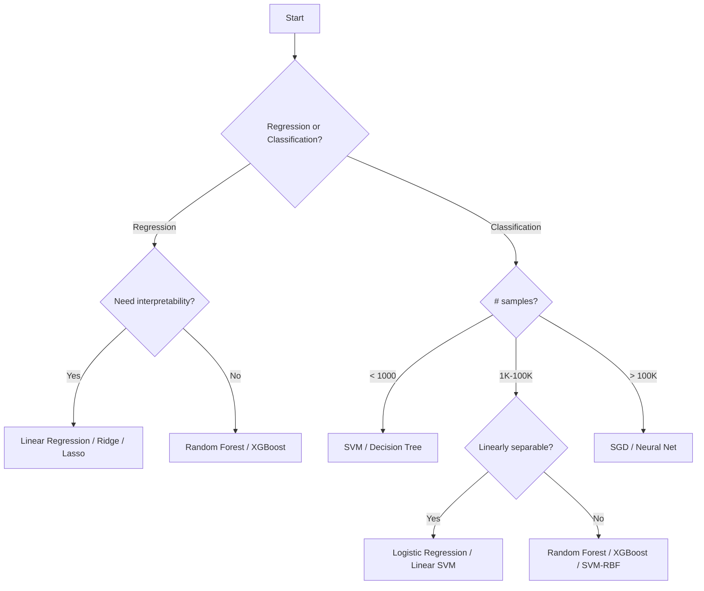

# Supervised Learning

## What is Supervised Learning?

Supervised learning learns a mapping function **f: X → Y** from labeled training data {(x₁,y₁), (x₂,y₂), ..., (xₙ,yₙ)}.

The goal: given a new input x, predict the correct output y.

## Taxonomy

```
┌─────────────────────────────────────────────────────┐
│              SUPERVISED LEARNING                      │
├─────────────────────────┬───────────────────────────┤
│     REGRESSION          │     CLASSIFICATION         │
│     (Continuous Y)      │     (Discrete Y)           │
├─────────────────────────┼───────────────────────────┤
│ • Linear Regression     │ • Logistic Regression      │
│ • Polynomial Regression │ • SVM                      │
│ • Ridge/Lasso           │ • Decision Trees           │
│ • SVR                   │ • KNN                      │
│ • Decision Tree Reg.    │ • Naive Bayes              │
│ • Random Forest Reg.    │ • Random Forest            │
└─────────────────────────┴───────────────────────────┘
```

## Algorithm Selection Flowchart



## Index of Algorithm Files

| # | File | Algorithm | One-Line Description |
|---|------|-----------|---------------------|
| 1 | [01-linear-regression.md](01-linear-regression.md) | Linear Regression | Fit a line/hyperplane minimizing squared errors |
| 2 | [02-logistic-regression.md](02-logistic-regression.md) | Logistic Regression | Binary/multi-class classification via sigmoid + MLE |
| 3 | [03-decision-trees.md](03-decision-trees.md) | Decision Trees | Recursive splitting on features using entropy/gini |
| 4 | [04-support-vector-machines.md](04-support-vector-machines.md) | SVM | Maximum margin classifier with kernel trick |
| 5 | [05-k-nearest-neighbors.md](05-k-nearest-neighbors.md) | KNN | Classify by majority vote of K closest points |
| 6 | [06-naive-bayes.md](06-naive-bayes.md) | Naive Bayes | Probabilistic classifier using Bayes theorem |
| 7 | [07-training-data-preparation.md](07-training-data-preparation.md) | Data Preparation | Splitting, scaling, encoding, imputation, pipelines |

## Algorithm Requirements Quick Reference

| Algorithm | Scaling? | Handles Missing? | Handles Categorical? | Interpretable? |
|-----------|:---:|:---:|:---:|:---:|
| Linear/Logistic Reg | Yes | No | No (encode) | High |
| SVM | Yes | No | No (encode) | Low |
| Decision Tree | No | Yes* | Yes* | High |
| KNN | Yes | No | No (encode) | Medium |
| Naive Bayes | No | Yes* | Yes | High |
| Random Forest | No | Yes* | Yes* | Medium |

## Loss Functions Summary

| Algorithm | Loss Function | Formula |
|-----------|--------------|---------|
| Linear Regression | MSE | (1/n)Σ(y-ŷ)² |
| Logistic Regression | Binary Cross-Entropy | -(1/n)Σ[y·log(ŷ)+(1-y)·log(1-ŷ)] |
| SVM | Hinge Loss | (1/n)Σmax(0, 1-y·f(x)) |
| Decision Tree | Gini/Entropy | Information gain based |
| KNN | None (lazy learner) | N/A |
| Naive Bayes | Log-likelihood | -Σlog P(yᵢ|xᵢ) |
