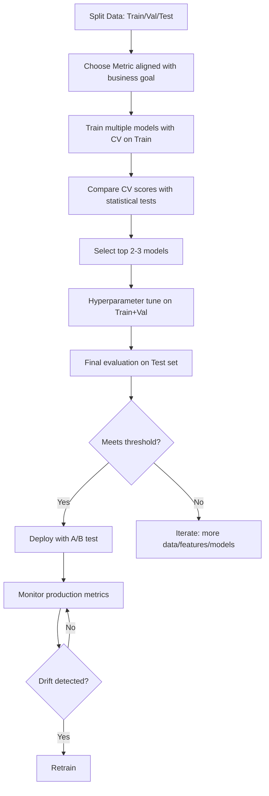

# Model Evaluation and Selection - Complete Guide

## 1. Data Splitting Strategies

### Train / Validation / Test Split

```
┌──────────────────────────────────────────────────────────┐
│                    Full Dataset                            │
├────────────────────────┬──────────┬──────────────────────┤
│     Training (60%)     │Val (20%) │    Test (20%)         │
│                        │          │                       │
│  Used to fit model     │ Tune     │  Final evaluation    │
│  parameters            │ hyper-   │  NEVER touch until   │
│                        │ params   │  the very end        │
└────────────────────────┴──────────┴──────────────────────┘

CRITICAL: Test set must be truly held out. 
If you use it for decisions, it becomes a validation set!
```

### Cross-Validation

```
K-Fold Cross-Validation (K=5):

Fold 1: [VAL] [Train] [Train] [Train] [Train] → score₁
Fold 2: [Train] [VAL] [Train] [Train] [Train] → score₂
Fold 3: [Train] [Train] [VAL] [Train] [Train] → score₃
Fold 4: [Train] [Train] [Train] [VAL] [Train] → score₄
Fold 5: [Train] [Train] [Train] [Train] [VAL] → score₅

Final score = mean(score₁...score₅) ± std(score₁...score₅)
```

### CV Variants

| Type | Use When | Description |
|------|----------|-------------|
| K-Fold | General | Standard, K=5 or 10 |
| Stratified K-Fold | Imbalanced classes | Preserves class ratio in each fold |
| Leave-One-Out (LOO) | Very small datasets | K=N, expensive but low bias |
| Repeated K-Fold | Need robust estimate | Run K-Fold multiple times |
| Time Series Split | Temporal data | Train on past, validate on future |
| Group K-Fold | Grouped data | Keeps groups together (e.g., same patient) |

### Time Series Cross-Validation

```
Fold 1: [Train] [Val]
Fold 2: [Train    ] [Val]
Fold 3: [Train        ] [Val]
Fold 4: [Train            ] [Val]
Fold 5: [Train                ] [Val]

NEVER let future data leak into training!
```

---

## 2. Classification Metrics

### Confusion Matrix

```
                    Predicted
                 Pos        Neg
Actual  Pos  [ TP=90  │  FN=10 ]   ← Type II Error (Miss)
        Neg  [ FP=20  │  TN=880]   ← Type I Error (False Alarm)
                 ↑
           False Positive
```

### Core Metrics

```
Accuracy  = (TP + TN) / (TP + TN + FP + FN) = (90+880)/1000 = 97%
Precision = TP / (TP + FP) = 90/110 = 81.8%   "Of predicted positive, how many correct?"
Recall    = TP / (TP + FN) = 90/100 = 90%      "Of actual positive, how many found?"
F1 Score  = 2·P·R / (P+R) = 2·0.818·0.9/(0.818+0.9) = 85.7%  (harmonic mean)

Specificity = TN / (TN + FP) = 880/900 = 97.8%  "Of actual negative, how many correct?"
```

### When Accuracy Fails (Imbalanced Data)

```
Dataset: 950 negative, 50 positive
Model predicts ALL negative:
  Accuracy = 950/1000 = 95%  ← Looks great!
  Recall = 0/50 = 0%         ← Actually useless!
  Precision = 0/0 = undefined
```

### Precision-Recall Tradeoff

```
                  Threshold
                     ↓
   Negative ←──── | ────→ Positive
   
   ○○○○○○○○○○●●○○○|●●●●●●●●●●●●●●
                   
   Lower threshold → More Positive predictions
                  → Higher Recall, Lower Precision
   
   Higher threshold → Fewer Positive predictions
                   → Lower Recall, Higher Precision

Precision
    1│╲
     │  ╲
     │    ╲────╲
     │          ╲
     │           ╲
    0└────────────── Recall
     0              1
```

### ROC Curve and AUC

```
ROC: True Positive Rate vs False Positive Rate at all thresholds

TPR (Recall)
    1│        ·····───────
     │      ··
     │    ··     ROC curve
     │   ·
     │  ·
     │ ·        Random classifier
     │·       (diagonal)
    0│─────────────────── 
     0    FPR          1

AUC = Area Under ROC Curve
- AUC = 1.0: Perfect classifier
- AUC = 0.5: Random classifier
- AUC < 0.5: Worse than random (flip predictions)
```

### ROC-AUC vs PR-AUC

| Metric | Use When | Why |
|--------|----------|-----|
| ROC-AUC | Balanced classes | Not affected by class imbalance |
| PR-AUC | Imbalanced (rare positive) | More informative when negatives dominate |

---

## 3. Regression Metrics

```
MSE  = (1/n) Σ (yᵢ - ŷᵢ)²           Penalizes large errors heavily
RMSE = √MSE                            Same units as target
MAE  = (1/n) Σ |yᵢ - ŷᵢ|             Robust to outliers
MAPE = (100/n) Σ |yᵢ - ŷᵢ|/|yᵢ|     Percentage error (undefined when y=0)
R²   = 1 - SS_res/SS_tot              Proportion of variance explained
     = 1 - Σ(yᵢ-ŷᵢ)²/Σ(yᵢ-ȳ)²      R²=1 perfect, R²=0 = predicting mean
```

---

## 4. Bias-Variance Tradeoff in Practice

### Learning Curves

```
Error
  │
  │╲  Training error
  │ ╲───────────────────────── (increases with complexity)
  │                      ╱─── Validation error
  │                   ╱──     (decreases then increases)
  │                ╱──
  │             ╱──
  │──────────╱──
  │
  └────────────────────────── Model Complexity
  
  Underfitting │ Sweet Spot │ Overfitting
               │     ↑      │
               │  Best model │
```

### Diagnosing with Learning Curves

```
High Bias (Underfitting):        High Variance (Overfitting):

Error                            Error
  │                                │  ╲ Validation
  │ ─────── Validation             │   ╲───────────────
  │                                │          gap
  │ ─────── Training               │   ╱───────────────
  │                                │  ╱ Training
  └──────────── Samples            └──────────── Samples

Fix: More features, complex model  Fix: More data, regularization,
     Less regularization                 simpler model, dropout
```

---

## 5. Overfitting and Underfitting

### Detection and Solutions

```
┌───────────────┬────────────────────┬────────────────────────┐
│               │ Underfitting        │ Overfitting            │
├───────────────┼────────────────────┼────────────────────────┤
│ Train error   │ High               │ Low                    │
│ Val error     │ High               │ High                   │
│ Gap           │ Small              │ Large                  │
├───────────────┼────────────────────┼────────────────────────┤
│ Solutions     │ • More features    │ • More data            │
│               │ • Complex model    │ • Regularization       │
│               │ • Less regularz.   │ • Simpler model        │
│               │ • Feature engineer │ • Dropout              │
│               │ • Longer training  │ • Early stopping       │
│               │                    │ • Data augmentation    │
│               │                    │ • Ensemble methods     │
└───────────────┴────────────────────┴────────────────────────┘
```

---

## 6. Hyperparameter Tuning

### Grid Search
```python
from sklearn.model_selection import GridSearchCV

param_grid = {
    'max_depth': [3, 5, 7, 10],
    'learning_rate': [0.01, 0.05, 0.1, 0.3],
    'n_estimators': [100, 500, 1000]
}
# Total: 4 × 4 × 3 = 48 combinations × 5 folds = 240 fits

grid = GridSearchCV(model, param_grid, cv=5, scoring='roc_auc', n_jobs=-1)
grid.fit(X_train, y_train)
```

### Random Search
```python
from sklearn.model_selection import RandomizedSearchCV
from scipy.stats import uniform, randint

param_dist = {
    'max_depth': randint(3, 15),
    'learning_rate': uniform(0.01, 0.3),
    'n_estimators': randint(100, 2000),
    'subsample': uniform(0.5, 0.5),
}

random_search = RandomizedSearchCV(model, param_dist, n_iter=100, cv=5)
```

### Bayesian Optimization (Optuna/Hyperopt)

```
Key Idea: Use past evaluations to model the objective function,
then choose next point to evaluate based on acquisition function.

Random Search:              Bayesian Optimization:
  × × ×   ×               × × (explore)
 ×  ×   ×    ×              × (exploit best region)
  ×   ×  ×                    × × × (focus on promising area)
×  ×   ×   ×                   × ×

Bayesian is more sample-efficient for expensive evaluations.
```

### Comparison

| Method | Pros | Cons | Best For |
|--------|------|------|----------|
| Grid | Exhaustive | Exponential cost | Few params, small ranges |
| Random | Better coverage | May miss optima | Many params |
| Bayesian | Most efficient | Complex setup | Expensive models |
| Successive Halving | Fast | May discard good configs early | Large search spaces |

---

## 7. Statistical Significance Testing

### When to Compare Models
Don't just compare point estimates! Use statistical tests:

```python
from scipy import stats

# Paired t-test on cross-validation scores
scores_A = cross_val_score(model_A, X, y, cv=10)
scores_B = cross_val_score(model_B, X, y, cv=10)

t_stat, p_value = stats.ttest_rel(scores_A, scores_B)
if p_value < 0.05:
    print("Statistically significant difference")
```

### McNemar's Test (for classifiers)
```
              Model B
           Correct  Wrong
Model A  ┌────────┬───────┐
Correct  │  n₀₀   │  n₀₁  │
Wrong    │  n₁₀   │  n₁₁  │
         └────────┴───────┘

χ² = (|n₀₁ - n₁₀| - 1)² / (n₀₁ + n₁₀)
Test if disagreements are symmetric.
```

---

## 8. Production Metrics vs Offline Metrics

```
┌──────────────────────┬────────────────────────────────────┐
│ Offline Metrics      │ Production Metrics                  │
├──────────────────────┼────────────────────────────────────┤
│ AUC-ROC             │ Click-through rate                  │
│ F1 Score            │ Conversion rate                     │
│ RMSE                │ Revenue per user                    │
│ Precision@K         │ User engagement time                │
│ NDCG                │ Churn rate                          │
│                     │ Latency (p50, p99)                  │
│                     │ Throughput                          │
│                     │ Model staleness                     │
└──────────────────────┴────────────────────────────────────┘

A model can have better AUC but worse business metrics!
Always validate with A/B tests in production.
```

### Model Monitoring Checklist
- Data drift detection (feature distributions changing)
- Concept drift (relationship between X and Y changes)
- Prediction distribution shifts
- Latency and throughput SLAs
- Feature pipeline failures
- Regular retraining schedule

---

## 9. Complete Evaluation Workflow



---

## Interview Questions

**Q: You have 99% accuracy but stakeholders are unhappy. What's wrong?**
Likely imbalanced classes. The model predicts the majority class always. Look at precision/recall for minority class, use PR-AUC, consider business cost of FP vs FN.

**Q: When would you use MAE over RMSE?**
MAE when you want robustness to outliers (median-like behavior). RMSE when large errors are particularly costly (penalizes them more due to squaring).

**Q: How do you detect overfitting in production?**
Monitor gap between training metrics and production metrics. Track prediction distribution over time. If model performance degrades on new data but looks good on historical data, it's overfit to past patterns.

**Q: Why not use accuracy for imbalanced datasets?**
A model predicting all majority class gets high accuracy but zero recall for minority. Use F1, PR-AUC, or weighted metrics instead.

**Q: What's the difference between cross-validation score and test score?**
CV score estimates generalization from training data (used for model selection). Test score is the unbiased final estimate (used for reporting). CV score is usually slightly optimistic.

**Q: How many folds for cross-validation?**
- K=5 or K=10: Standard (good bias-variance tradeoff for the estimate itself)
- K=N (LOO): Very small datasets (<100 samples)
- K=3: Very large datasets or expensive models (for speed)

---

## Exercises

### Exercise 1 (Beginner)
**Problem:** You train a model and get 95% accuracy on both training and test sets. Is this model good? What questions should you ask?
**Hint:** Consider class distribution and business requirements.

<details><summary>Solution</summary>

Not necessarily good. Ask:
1. **Class distribution?** If 95% of data is one class, a naive classifier gets 95% (useless).
2. **What metric matters?** Accuracy may be irrelevant — precision, recall, F1 may matter more.
3. **Is the test set representative?** Data leakage? Same distribution as production?
4. **Business threshold?** Maybe 95% isn't good enough (medical) or is overkill (recommendations).
5. **Confidence interval?** With 100 test samples, 95% ± 4.3% (wide range).

</details>

### Exercise 2 (Beginner)
**Problem:** Explain precision vs recall with a spam filter example. When would you favor each?
**Hint:** Think about the cost of false positives vs false negatives.

<details><summary>Solution</summary>

**Precision:** Of emails marked as spam, what fraction actually is spam?
- High precision → few legitimate emails in spam folder
- Favor when: false positives are costly (important email lost)

**Recall:** Of actual spam emails, what fraction did we catch?
- High recall → most spam is caught
- Favor when: false negatives are costly (user sees spam)

**Trade-off:** Spam filter should favor precision (losing important email is worse than seeing some spam). Security system should favor recall (don't miss threats).

</details>

### Exercise 3 (Beginner)
**Problem:** Why can't you use the test set for hyperparameter tuning? What happens if you do?
**Hint:** Think about what "unseen data" means.

<details><summary>Solution</summary>

If you tune hyperparameters using test set:
1. The test set becomes a validation set (information leaks into model selection)
2. Your test performance estimate becomes optimistically biased
3. You have no unbiased estimate of generalization performance
4. The model is indirectly "fit" to the test set

Proper approach: Train → Validation (tune) → Test (final evaluation, touch ONCE)
Or: Train → Cross-validation (tune) → Test (final evaluation)

</details>

### Exercise 4 (Intermediate)
**Problem:** You're comparing two models: Model A has AUC=0.92 and Model B has AUC=0.89. Can you conclude A is better? How would you determine statistical significance?
**Hint:** Consider variance in the estimate.

<details><summary>Solution</summary>

Cannot conclude A is better without statistical testing:

1. **Confidence intervals:** Bootstrap the test set, compute AUC each time. If CIs overlap, not significant.
2. **DeLong test:** Specifically designed for comparing AUC between two models on same data.
3. **McNemar's test:** Tests if models make different errors (paired test on predictions).
4. **Repeated CV:** Compare models across K folds, use paired t-test or Wilcoxon signed-rank.

Also consider:
- Sample size: with 100 test samples, AUC variance is high
- Practical significance: is 0.03 AUC difference meaningful for the business?
- Model complexity, inference time, maintainability

</details>

### Exercise 5 (Intermediate)
**Problem:** Draw and interpret a precision-recall curve. Why is it preferred over ROC for imbalanced datasets?
**Hint:** Think about what the axes represent when negatives overwhelm positives.

<details><summary>Solution</summary>

**PR curve:** x-axis = Recall, y-axis = Precision at various thresholds.

**Why preferred for imbalanced data:**
- ROC x-axis is FPR = FP/(FP+TN). With many negatives, even many FP gives low FPR
- ROC looks optimistic: a bad model can have "good" ROC-AUC with imbalanced data
- PR curve directly shows performance on the minority (positive) class
- PR-AUC baseline = fraction of positives (e.g., 0.01 for 1% positive)

**Example:** 10K negatives, 100 positives. Model predicts 200 positive (100 correct, 100 wrong):
- Precision = 100/200 = 50% (half are wrong — bad!)
- FPR = 100/10000 = 1% (looks great on ROC!)

PR curve exposes this; ROC hides it.

</details>

### Exercise 6 (Intermediate)
**Problem:** Explain the difference between macro-average, micro-average, and weighted-average F1 for multiclass classification. When would you use each?
**Hint:** Consider how each handles class imbalance.

<details><summary>Solution</summary>

For K classes:

**Macro-average:** Compute F1 per class, average equally.
- F1_macro = (1/K) Σ F1ₖ
- Treats all classes equally regardless of size
- Use when: all classes equally important

**Micro-average:** Pool all TP, FP, FN across classes, compute single F1.
- F1_micro = global_TP / (global_TP + ½(global_FP + global_FN))
- Dominated by majority class
- = accuracy for multiclass (no per-class threshold)

**Weighted-average:** Compute F1 per class, weighted by support (class frequency).
- F1_weighted = Σ (nₖ/N) × F1ₖ
- Accounts for class imbalance
- Use when: majority class performance matters more

**Use macro** for imbalanced + all classes matter equally.
**Use weighted** for imbalanced + care more about common classes.
**Use micro** when you want a single number equivalent to accuracy.

</details>

### Exercise 7 (Intermediate)
**Problem:** You have a model with 90% train accuracy and 70% test accuracy. Another model has 75% train accuracy and 72% test accuracy. Which is better and why? What do these patterns indicate?
**Hint:** Consider bias-variance tradeoff.

<details><summary>Solution</summary>

**Model 1 (90/70):** High variance (overfitting). 20% gap = memorized training data.
**Model 2 (75/72):** Lower variance, slightly higher bias. 3% gap = good generalization.

**Model 2 is better** — higher test accuracy is what matters for deployment.

**Diagnosing:**
- Large train-test gap → overfitting → reduce complexity, regularize, more data
- Low train AND test accuracy → underfitting → increase complexity, more features
- High train, low test → overfitting
- Small gap, both high → ideal

**Fix Model 1:** Regularization, dropout, early stopping, reduce depth, more data.

</details>

### Exercise 8 (Advanced)
**Problem:** Explain calibration of predicted probabilities. How do you check if a model is well-calibrated, and how do you fix poor calibration?
**Hint:** A model predicting 70% probability should be correct 70% of the time.

<details><summary>Solution</summary>

**Calibration:** P(Y=1 | model says 0.7) should ≈ 0.7

**Check calibration:**
1. **Reliability diagram:** Bin predictions (0-0.1, 0.1-0.2, ...), plot mean predicted vs mean actual
2. **Expected Calibration Error (ECE):** Weighted average of |accuracy - confidence| per bin
3. Perfectly calibrated = diagonal line on reliability plot

**Poorly calibrated models:**
- Neural networks: often overconfident
- Random Forest: pushes probabilities toward 0 and 1
- SVM: doesn't naturally output probabilities

**Fixing calibration (post-hoc):**
1. **Platt scaling:** Fit logistic regression on model outputs (2 parameters)
2. **Isotonic regression:** Non-parametric monotonic mapping (more flexible)
3. **Temperature scaling:** Divide logits by T before softmax (neural networks)

Always calibrate on held-out data (not training data).

</details>

### Exercise 9 (Advanced)
**Problem:** Design a cross-validation strategy for a time-series forecasting problem where you have 3 years of daily data and want to predict 30 days ahead.
**Hint:** You cannot use future data to predict the past.

<details><summary>Solution</summary>

**Standard K-fold is WRONG** for time series (leaks future into training).

**Time-series CV (expanding window):**
```
Fold 1: [Train: months 1-12] → [Gap: 0d] → [Test: month 13]
Fold 2: [Train: months 1-15] → [Gap: 0d] → [Test: month 16]
Fold 3: [Train: months 1-18] → [Gap: 0d] → [Test: month 19]
...
```

**Key considerations:**
1. **Gap:** Insert gap between train and test equal to forecast horizon (30 days) to prevent leakage from lagged features
2. **Test size = 30 days** (matches production forecast horizon)
3. **Minimum training size:** Enough to learn seasonal patterns (at least 1 year)
4. **Sliding vs expanding:** Expanding uses all available history; sliding window if regime changes make old data harmful
5. **Embargo:** Extra gap if features use rolling windows

**Metrics:** Use MAE, RMSE, MAPE appropriate for the scale. Report per-horizon (day 1 vs day 30 accuracy).

</details>

### Exercise 10 (Advanced)
**Problem:** You're selecting between 50 models using a validation set of 1000 samples. Why might the best model on validation not be best on test? How do you mitigate this?
**Hint:** Think about multiple hypothesis testing.

<details><summary>Solution</summary>

**Problem: Multiple comparisons / selection bias**

With 50 models and 1000 validation samples:
- By chance, some model will look good on this specific validation set
- The more models you compare, the higher the chance of "lucky" selection
- This is analogous to p-hacking in statistics

**Quantifying:** If true performance is identical, expected gap between best validation and true performance grows as O(√(log(M)/n)) where M=models, n=samples.

**Mitigation:**
1. **Nested CV:** Outer loop for model selection, inner loop for hyperparameter tuning
2. **Bonferroni correction:** Adjust confidence intervals for number of comparisons
3. **Holdout test set:** Final unbiased estimate after selection (never reuse)
4. **Reduce candidate models:** Use theory/experience to limit search space
5. **Larger validation set:** Reduces variance of performance estimates
6. **Bayesian model selection:** Naturally handles multiplicity through priors

</details>

---

## Self-Assessment Quiz

**1. K-fold cross-validation with K=N (number of samples) is called:**
- A) Holdout validation
- B) Leave-One-Out Cross-Validation
- C) Bootstrap validation
- D) Repeated random sampling

<details><summary>Answer</summary>B) Leave-One-Out Cross-Validation (LOOCV) — low bias but high variance and expensive</details>

**2. ROC-AUC of 0.5 indicates:**
- A) Perfect model
- B) Random classifier (no discriminative power)
- C) Worst possible model
- D) Perfectly calibrated model

<details><summary>Answer</summary>B) Random classifier — equivalent to flipping a coin</details>

**3. F1-score is the:**
- A) Arithmetic mean of precision and recall
- B) Geometric mean of precision and recall
- C) Harmonic mean of precision and recall
- D) Weighted sum of precision and recall

<details><summary>Answer</summary>C) Harmonic mean: F1 = 2·(P·R)/(P+R). Harmonic mean penalizes extreme imbalance between P and R.</details>

**4. Stratified K-fold ensures:**
- A) Equal number of samples in each fold
- B) Class distribution is preserved in each fold
- C) Features are normalized
- D) No duplicate samples across folds

<details><summary>Answer</summary>B) Class distribution (proportion of each class) is approximately equal in each fold</details>

**5. A learning curve shows training and validation scores vs:**
- A) Number of features
- B) Training set size
- C) Number of epochs
- D) Regularization strength

<details><summary>Answer</summary>B) Training set size — helps diagnose bias vs variance</details>

**6. Which metric is NOT affected by class imbalance?**
- A) Accuracy
- B) Matthews Correlation Coefficient
- C) Raw count of correct predictions
- D) Weighted F1

<details><summary>Answer</summary>B) MCC — ranges [-1, 1] and is balanced even with very imbalanced classes</details>

**7. Hyperparameter tuning via grid search with 5-fold CV on 4 hyperparameters with 5 values each requires:**
- A) 25 model fits
- B) 625 model fits
- C) 3125 model fits
- D) 125 model fits

<details><summary>Answer</summary>C) 5⁴ × 5 = 625 combinations × 5 folds = 3125 total model fits</details>

**8. The bias-variance decomposition states: Expected Error =**
- A) Bias + Variance
- B) Bias² + Variance + Irreducible noise
- C) Bias × Variance
- D) Bias² + Variance²

<details><summary>Answer</summary>B) Bias² + Variance + σ² (irreducible noise)</details>

**9. When should you NOT use cross-validation?**
- A) Small datasets
- B) Time series data with standard K-fold
- C) When you have limited compute
- D) Both B and C

<details><summary>Answer</summary>B) Standard K-fold violates temporal ordering in time series (use time-series split instead)</details>

**10. A confusion matrix for binary classification has how many cells?**
- A) 2
- B) 3
- C) 4
- D) Depends on the dataset

<details><summary>Answer</summary>C) 4 cells: TP, FP, FN, TN (2×2 matrix)</details>

---

## Coding Challenges

### Challenge 1: Implement K-Fold Cross-Validation from Scratch
```python
"""
Implement stratified K-fold CV.
Return mean and std of scores across folds.
"""
import numpy as np

class StratifiedKFoldScratch:
    def __init__(self, n_splits=5, shuffle=True, random_state=42):
        self.n_splits = n_splits
        self.shuffle = shuffle
        self.random_state = random_state
    
    def split(self, X, y):
        np.random.seed(self.random_state)
        classes = np.unique(y)
        fold_indices = [[] for _ in range(self.n_splits)]
        
        for cls in classes:
            cls_indices = np.where(y == cls)[0]
            if self.shuffle:
                np.random.shuffle(cls_indices)
            
            # Distribute class samples evenly across folds
            for i, idx in enumerate(cls_indices):
                fold_indices[i % self.n_splits].append(idx)
        
        for i in range(self.n_splits):
            test_idx = np.array(fold_indices[i])
            train_idx = np.concatenate([fold_indices[j] for j in range(self.n_splits) if j != i])
            yield train_idx, test_idx

def cross_val_score(model, X, y, cv=5, scoring='accuracy'):
    kf = StratifiedKFoldScratch(n_splits=cv)
    scores = []
    for train_idx, val_idx in kf.split(X, y):
        model.fit(X[train_idx], y[train_idx])
        if scoring == 'accuracy':
            score = np.mean(model.predict(X[val_idx]) == y[val_idx])
        scores.append(score)
    return np.array(scores)
```

### Challenge 2: Implement All Binary Classification Metrics
```python
"""
Implement: accuracy, precision, recall, F1, F-beta, MCC, 
confusion matrix, and classification report.
"""
import numpy as np

class BinaryMetrics:
    def __init__(self, y_true, y_pred):
        self.tp = np.sum((y_true == 1) & (y_pred == 1))
        self.fp = np.sum((y_true == 0) & (y_pred == 1))
        self.fn = np.sum((y_true == 1) & (y_pred == 0))
        self.tn = np.sum((y_true == 0) & (y_pred == 0))
    
    def accuracy(self):
        return (self.tp + self.tn) / (self.tp + self.fp + self.fn + self.tn)
    
    def precision(self):
        return self.tp / (self.tp + self.fp) if (self.tp + self.fp) > 0 else 0
    
    def recall(self):
        return self.tp / (self.tp + self.fn) if (self.tp + self.fn) > 0 else 0
    
    def f1(self):
        p, r = self.precision(), self.recall()
        return 2 * p * r / (p + r) if (p + r) > 0 else 0
    
    def fbeta(self, beta):
        p, r = self.precision(), self.recall()
        return (1 + beta**2) * p * r / (beta**2 * p + r) if (beta**2 * p + r) > 0 else 0
    
    def mcc(self):
        num = self.tp * self.tn - self.fp * self.fn
        den = np.sqrt((self.tp+self.fp)*(self.tp+self.fn)*(self.tn+self.fp)*(self.tn+self.fn))
        return num / den if den > 0 else 0
    
    def confusion_matrix(self):
        return np.array([[self.tn, self.fp], [self.fn, self.tp]])
```

### Challenge 3: Implement ROC Curve and AUC
```python
"""
Implement ROC curve computation and AUC (trapezoidal rule).
Also implement precision-recall curve.
"""
import numpy as np

def roc_curve(y_true, y_scores):
    thresholds = np.sort(np.unique(y_scores))[::-1]
    tpr_list, fpr_list = [0], [0]
    
    P = np.sum(y_true == 1)
    N = np.sum(y_true == 0)
    
    for thresh in thresholds:
        y_pred = (y_scores >= thresh).astype(int)
        tp = np.sum((y_pred == 1) & (y_true == 1))
        fp = np.sum((y_pred == 1) & (y_true == 0))
        tpr_list.append(tp / P)
        fpr_list.append(fp / N)
    
    return np.array(fpr_list), np.array(tpr_list), thresholds

def auc(x, y):
    """Trapezoidal rule for AUC."""
    sorted_idx = np.argsort(x)
    x, y = x[sorted_idx], y[sorted_idx]
    return np.trapz(y, x)

def precision_recall_curve(y_true, y_scores):
    thresholds = np.sort(np.unique(y_scores))[::-1]
    precisions, recalls = [], []
    
    for thresh in thresholds:
        y_pred = (y_scores >= thresh).astype(int)
        tp = np.sum((y_pred == 1) & (y_true == 1))
        fp = np.sum((y_pred == 1) & (y_true == 0))
        fn = np.sum((y_pred == 0) & (y_true == 1))
        
        prec = tp / (tp + fp) if (tp + fp) > 0 else 1
        rec = tp / (tp + fn) if (tp + fn) > 0 else 0
        precisions.append(prec)
        recalls.append(rec)
    
    return np.array(precisions), np.array(recalls), thresholds
```

### Challenge 4: Implement Grid Search with Cross-Validation
```python
"""
Implement GridSearchCV that searches over parameter combinations
and returns the best parameters based on CV score.
"""
import numpy as np
from itertools import product

class GridSearchCVScratch:
    def __init__(self, estimator, param_grid, cv=5, scoring='accuracy'):
        self.estimator = estimator
        self.param_grid = param_grid
        self.cv = cv
        self.scoring = scoring
    
    def fit(self, X, y):
        # Generate all parameter combinations
        keys = list(self.param_grid.keys())
        values = list(self.param_grid.values())
        combinations = list(product(*values))
        
        self.cv_results_ = []
        best_score = -np.inf
        
        for combo in combinations:
            params = dict(zip(keys, combo))
            
            # Cross-validate with these params
            scores = []
            kf = StratifiedKFoldScratch(n_splits=self.cv)
            for train_idx, val_idx in kf.split(X, y):
                model = type(self.estimator)(**params)
                model.fit(X[train_idx], y[train_idx])
                score = np.mean(model.predict(X[val_idx]) == y[val_idx])
                scores.append(score)
            
            mean_score = np.mean(scores)
            self.cv_results_.append({'params': params, 'mean_score': mean_score, 'std_score': np.std(scores)})
            
            if mean_score > best_score:
                best_score = mean_score
                self.best_params_ = params
                self.best_score_ = best_score
        
        # Refit on full data with best params
        self.best_estimator_ = type(self.estimator)(**self.best_params_)
        self.best_estimator_.fit(X, y)
        return self
```

### Challenge 5: Implement Learning Curve Analysis
```python
"""
Implement learning curve: plot train/val scores vs training set size.
Diagnose bias vs variance from the curve shape.
"""
import numpy as np

def learning_curve(estimator, X, y, train_sizes=np.linspace(0.1, 1.0, 10), cv=5):
    """
    Returns train_sizes_abs, train_scores, val_scores
    """
    n_samples = len(X)
    train_scores_mean, val_scores_mean = [], []
    train_scores_std, val_scores_std = [], []
    
    for size_frac in train_sizes:
        size = int(size_frac * n_samples * (cv-1)/cv)  # account for CV split
        fold_train_scores, fold_val_scores = [], []
        
        kf = StratifiedKFoldScratch(n_splits=cv)
        for train_idx, val_idx in kf.split(X, y):
            # Use only 'size' samples from training fold
            subset_idx = train_idx[:size]
            if len(subset_idx) < 2:
                continue
            
            model = type(estimator)(**estimator.get_params())
            model.fit(X[subset_idx], y[subset_idx])
            
            fold_train_scores.append(np.mean(model.predict(X[subset_idx]) == y[subset_idx]))
            fold_val_scores.append(np.mean(model.predict(X[val_idx]) == y[val_idx]))
        
        train_scores_mean.append(np.mean(fold_train_scores))
        val_scores_mean.append(np.mean(fold_val_scores))
        train_scores_std.append(np.std(fold_train_scores))
        val_scores_std.append(np.std(fold_val_scores))
    
    return (np.array(train_sizes) * n_samples).astype(int), \
           np.array(train_scores_mean), np.array(val_scores_mean)

# Interpretation:
# - Both low + converging = HIGH BIAS (underfitting). Fix: more complex model
# - Gap between train (high) and val (low) = HIGH VARIANCE. Fix: more data or regularize
# - Both high + converging = GOOD FIT
```

---

## Interview Questions

### 1. How do you detect data leakage?
<details><summary>Answer</summary>

Signs of data leakage:
1. **Suspiciously high performance** (e.g., 99.9% AUC on a hard problem)
2. **Large gap between CV and production performance**
3. **Feature that shouldn't be available at prediction time** (e.g., future data, target-derived)

Detection:
- Examine feature importances (leaky features often rank #1)
- Check if removing top features drops performance dramatically
- Verify temporal ordering (no future information in training)
- Check preprocessing: fit_transform on full data before split = leakage

Common sources: target encoding without CV, normalizing before split, using post-event features.

</details>

### 2. When would you use AUC-ROC vs AUC-PR?
<details><summary>Answer</summary>

**AUC-ROC:**
- Good for balanced datasets
- Threshold-independent evaluation
- Measures trade-off between TPR and FPR
- Can be misleadingly optimistic for imbalanced data

**AUC-PR:**
- Better for imbalanced datasets (focus on positive class)
- More informative when positive class is rare
- Directly shows precision-recall trade-off
- Baseline = positive class ratio (not 0.5)

**Rule:** If positive class < 10% of data, prefer PR-AUC.

</details>

### 3. Explain the difference between validation and test sets.
<details><summary>Answer</summary>

- **Validation set:** Used during development to tune hyperparameters and select models. Can be used repeatedly.
- **Test set:** Used ONCE at the end for final unbiased performance estimate. Never used for any decisions.

**Why separate?** Each time you use a dataset for a decision, you "leak" information. The test set must remain completely untouched to give a true generalization estimate.

**Analogy:** Validation = practice exam (learn from it). Test = final exam (only take once).

</details>

### 4. How do you choose between precision and recall in practice?
<details><summary>Answer</summary>

Depends on the cost of errors:
- **Cost of FP > Cost of FN → Optimize Precision**
  - Spam filter (don't lose important email)
  - Content recommendation (don't recommend offensive content)
  
- **Cost of FN > Cost of FP → Optimize Recall**
  - Cancer detection (don't miss cancer)
  - Fraud detection (don't miss fraud)
  - Security threats (don't miss attacks)

**Formal approach:** Assign costs: C_FP and C_FN. Optimal threshold minimizes:
Expected Cost = C_FP × FP_rate × P(negative) + C_FN × FN_rate × P(positive)

</details>

### 5. What is the difference between model selection and model assessment?
<details><summary>Answer</summary>

- **Model selection:** Choosing the best model/hyperparameters from candidates. Uses validation data or CV.
- **Model assessment:** Estimating how well the chosen model will perform on new data. Uses test data.

**Common mistake:** Using the same data for both → optimistic bias in assessment.

**Proper protocol:**
1. Split data: train / validation / test
2. Train multiple models on train
3. Select best on validation (model selection)
4. Report final performance on test (model assessment)

</details>

---

## Real-World Scenarios

### Scenario 1: A/B Testing an ML Model
**Context:** You've built a new recommendation model and want to deploy it. The current model serves 10M users. You need to prove the new model is better before full rollout.

**Questions:**
1. How do you design the A/B test?
2. How long should you run it?
3. What metrics do you track?
4. What are common pitfalls?

<details><summary>Solution</summary>

1. **Design:**
   - Random split users into control (old model) and treatment (new model)
   - Stratify by key segments (new/returning users, platforms)
   - Minimum 5-10% traffic for treatment (enough for power)
   - Hash user ID for consistent assignment

2. **Duration:**
   - Run power analysis: need enough samples for detectable effect size
   - Minimum 1-2 weeks (capture weekly patterns)
   - Account for novelty effect (users may initially engage differently)
   - Pre-register stopping criteria

3. **Metrics:**
   - Primary: engagement (CTR, time spent, conversion)
   - Guardrail: revenue, latency, error rates, user complaints
   - Long-term: retention (requires longer test)
   - Segment-level: ensure no group is harmed

4. **Pitfalls:**
   - Peeking at results → inflated significance (use sequential testing)
   - Network effects (user A's recommendations affect user B)
   - Simpson's paradox (overall improvement hides segment harm)
   - Not accounting for multiple comparisons
   - Too short duration misses seasonal effects

</details>

### Scenario 2: Model Monitoring in Production
**Context:** You deployed a credit scoring model 6 months ago. You need to ensure it's still performing well. You have daily predictions but ground truth labels arrive with 30-day delay.

**Questions:**
1. How do you detect model degradation without labels?
2. How do you detect it with delayed labels?
3. When should you retrain?
4. How do you handle the 30-day label delay?

<details><summary>Solution</summary>

1. **Without labels (proxy monitoring):**
   - **Input drift:** Monitor feature distributions (KS test, PSI on each feature)
   - **Prediction drift:** Distribution of model outputs shifting
   - **Data quality:** Missing values, out-of-range values spiking
   - **Concept drift proxies:** Business metrics (approval rate, default rate estimates)

2. **With delayed labels:**
   - Compute actual metrics (AUC, precision, recall) on 30-day-old cohort
   - Track metric trends: is performance degrading over time?
   - Compare predicted vs actual default rates per decile (calibration)
   - Population Stability Index (PSI) on score distributions

3. **Retrain triggers:**
   - Performance below threshold (e.g., AUC drops below 0.75)
   - Significant data drift detected (PSI > 0.2)
   - Major external event (pandemic, policy change)
   - Scheduled retraining (monthly) as baseline

4. **Handling label delay:**
   - Use leading indicators (early payment behavior, 30-day delinquency)
   - Build a "label estimation" model for early warning
   - Monitor cohort performance as labels arrive
   - Shadow deployment: run new model in parallel, compare when labels arrive

</details>

### Scenario 3: Evaluating a Multi-Label Classification System
**Context:** You're building a system that tags news articles with multiple topics (politics, sports, technology, etc.). Each article can have 1-5 tags out of 50 possible topics. You need to evaluate model performance.

**Questions:**
1. What metrics are appropriate for multi-label classification?
2. How do you handle label imbalance (some topics are rare)?
3. How do you evaluate partial correctness (got 3 of 4 tags right)?
4. How do you set per-label thresholds?

<details><summary>Solution</summary>

1. **Metrics:**
   - **Subset accuracy:** Exact match (all labels correct) — very strict
   - **Hamming loss:** Fraction of labels that are wrong (XOR)
   - **Per-label metrics:** Precision/Recall/F1 for each of 50 labels
   - **Micro/Macro averaged F1** across all labels
   - **LRAP (Label Ranking Average Precision):** Measures ranking quality

2. **Label imbalance:**
   - Use macro-average F1 (weights all labels equally)
   - Report per-label performance (rare labels may have low recall)
   - Stratify rare labels during training (class weights)
   - Consider label co-occurrence patterns

3. **Partial correctness:**
   - **Instance-level F1:** For each article, compute F1 between predicted and true label sets
   - Example: True={politics, economy}, Pred={politics, sports} → Instance F1 = 2×(1×0.5)/(1+0.5) = 0.67
   - Average across all articles

4. **Per-label thresholds:**
   - Don't use 0.5 for all labels — optimize each independently
   - For each label, find threshold maximizing F1 on validation set
   - Or use a fixed recall target per label (e.g., recall ≥ 0.9)
   - Consider label dependencies (if "NBA" predicted, "sports" should be too)

</details>
