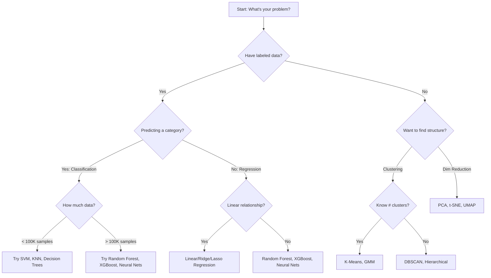

# Machine Learning - Comprehensive Guide

## What is Machine Learning?

Machine Learning is the field of study that gives computers the ability to learn without being explicitly programmed (Arthur Samuel, 1959). More formally: A computer program is said to learn from experience E with respect to some task T and performance measure P, if its performance at T, as measured by P, improves with experience E (Tom Mitchell, 1997).

## ML Taxonomy

```
┌─────────────────────────────────────────────────────────────────────┐
│                      MACHINE LEARNING                                │
├──────────────────┬──────────────────┬──────────────────┬───────────┤
│   SUPERVISED     │  UNSUPERVISED    │  REINFORCEMENT   │  SEMI-    │
│   LEARNING       │  LEARNING        │  LEARNING        │ SUPERVISED│
├──────────────────┼──────────────────┼──────────────────┼───────────┤
│                  │                  │                  │           │
│ Classification   │ Clustering       │ Model-Based      │ Self-     │
│ ├─ Binary        │ ├─ K-Means       │ ├─ Value-Based   │ Training  │
│ ├─ Multi-class   │ ├─ Hierarchical  │ ├─ Policy-Based  │           │
│ └─ Multi-label   │ ├─ DBSCAN       │ └─ Actor-Critic  │ Label     │
│                  │ └─ GMM          │                  │ Propagat. │
│ Regression       │                  │ Model-Free       │           │
│ ├─ Linear        │ Dim. Reduction   │ ├─ Q-Learning    │ Co-       │
│ ├─ Polynomial   │ ├─ PCA           │ ├─ SARSA         │ Training  │
│ └─ Non-linear   │ ├─ t-SNE         │ └─ DQN          │           │
│                  │ └─ UMAP         │                  │           │
│ Ranking          │                  │                  │           │
│                  │ Anomaly Det.     │                  │           │
│                  │ Association      │                  │           │
└──────────────────┴──────────────────┴──────────────────┴───────────┘
```

## Algorithm Selection Flowchart



## The Bias-Variance Tradeoff

This is the most fundamental concept in ML. Every model's generalization error can be decomposed:

```
Total Error = Bias² + Variance + Irreducible Noise

E[(y - ŷ)²] = [E[ŷ] - y]² + E[(ŷ - E[ŷ])²] + σ²
                 ─────────     ──────────────────   ──
                   Bias²           Variance         Noise
```

### Intuition

```
High Bias (Underfitting)          Sweet Spot              High Variance (Overfitting)
                                                          
  ·  ·   ·                        ·  ·   ·               ·  ·   ·
 ·      ·    ·                   ·      ·    ·           ·      ·    ·
────────────────                ~~~~~~~~~~~~~~~          ∿∿∿∿∿∿∿∿∿∿∿∿∿∿∿
·    ·     ·                   ·    ·     ·             ·    ·     ·
  ·     ·                        ·     ·                  ·     ·

Model too simple               Model just right         Model too complex
High training error            Balanced errors          Low training error
High test error                Low test error           High test error
```

### Mathematical Derivation

For a model f̂(x) trained on dataset D, predicting target y = f(x) + ε where ε ~ N(0, σ²):

```
E_D[(y - f̂(x))²] 
= E_D[(f(x) + ε - f̂(x))²]
= E_D[(f(x) - f̂(x))²] + 2·E_D[(f(x) - f̂(x))·ε] + E_D[ε²]
= E_D[(f(x) - f̂(x))²] + σ²                           (since E[ε]=0)

Now decompose the first term by adding and subtracting E_D[f̂(x)]:
= E_D[(f(x) - E[f̂(x)] + E[f̂(x)] - f̂(x))²] + σ²
= (f(x) - E[f̂(x)])² + E_D[(f̂(x) - E[f̂(x)])²] + σ²
= Bias²[f̂(x)]       + Var[f̂(x)]                 + σ²
```

### Bias-Variance for Common Algorithms

| Algorithm | Bias | Variance | Notes |
|-----------|------|----------|-------|
| Linear Regression | High | Low | Assumes linearity |
| Decision Tree (deep) | Low | High | Overfits easily |
| Random Forest | Low | Medium | Bagging reduces variance |
| KNN (k=1) | Low | High | Memorizes training data |
| KNN (k=N) | High | Low | Predicts mean |
| SVM (RBF, small C) | High | Low | Under-regularized |
| SVM (RBF, large C) | Low | High | Over-regularized |
| Neural Network | Low | High | Needs regularization |
| Gradient Boosting | Low | Low-Med | Sequential bias reduction |

## When to Use What - Quick Reference

### Classification Problems

| Scenario | Best Algorithms | Why |
|----------|----------------|-----|
| Small data, few features | SVM, Logistic Regression | Good generalization |
| Large data, many features | XGBoost, Random Forest | Handle complexity |
| Text classification | Naive Bayes, Logistic Reg | Works with sparse data |
| Image classification | CNN (Deep Learning) | Captures spatial patterns |
| Interpretability needed | Decision Tree, Logistic Reg | Explainable |
| Imbalanced classes | XGBoost with weights, SMOTE | Handles imbalance |
| Online/streaming | SGD Classifier | Incremental updates |

### Regression Problems

| Scenario | Best Algorithms | Why |
|----------|----------------|-----|
| Linear relationship | Linear/Ridge/Lasso | Simple, interpretable |
| Non-linear, tabular | XGBoost, Random Forest | Flexible, robust |
| Many irrelevant features | Lasso, Elastic Net | Feature selection |
| Time series | ARIMA, Prophet, LSTM | Temporal patterns |
| Need uncertainty | Bayesian Regression, GP | Probabilistic output |

## The ML Pipeline

```
┌──────────┐    ┌──────────┐    ┌──────────┐    ┌──────────┐    ┌──────────┐
│  Data    │───▶│ Feature  │───▶│  Model   │───▶│  Model   │───▶│  Deploy  │
│Collection│    │Engineering│    │ Training │    │Evaluation│    │& Monitor │
└──────────┘    └──────────┘    └──────────┘    └──────────┘    └──────────┘
     │               │               │               │               │
     ▼               ▼               ▼               ▼               ▼
 - Sources       - Cleaning      - Algorithm     - Metrics      - API/Batch
 - Sampling      - Encoding      - Hyperparam    - Validation   - A/B test
 - Labeling      - Scaling       - Training      - Comparison   - Monitoring
 - Storage       - Selection     - Regularize    - Statistics   - Retraining
```

## No Free Lunch Theorem

There is no single algorithm that works best for every problem. The NFL theorem states that averaged over all possible data-generating distributions, every classification algorithm has the same error rate. This means:

1. You must always try multiple algorithms
2. Domain knowledge matters for algorithm selection
3. The "best" algorithm depends on your specific data distribution

## Contents

| Section | Topic | Key Concepts |
|---------|-------|--------------|
| [01](./01-Supervised-Learning/) | Supervised Learning | Regression, Classification, SVM, Trees, KNN |
| [02](./02-Unsupervised-Learning/) | Unsupervised Learning | Clustering, PCA, Anomaly Detection |
| [03](./03-Ensemble-Methods/) | Ensemble Methods | Bagging, Boosting, Stacking |
| [04](./04-Model-Evaluation-and-Selection/) | Model Evaluation | Metrics, CV, Hyperparameter Tuning |
| [05](./05-Advanced-ML-Techniques/) | Advanced Techniques | Feature Engineering, Imbalanced Data, AutoML |

## Key Mathematical Prerequisites

### Linear Algebra
- Vectors, matrices, eigenvalues/eigenvectors
- Matrix decomposition (SVD, eigendecomposition)
- Dot products, norms, projections

### Calculus
- Gradients, partial derivatives
- Chain rule (backpropagation)
- Optimization (convex, non-convex)

### Probability & Statistics
- Bayes' theorem
- MLE and MAP estimation
- Distributions (Gaussian, Bernoulli, Multinomial)
- Hypothesis testing

### Optimization
- Gradient descent (batch, stochastic, mini-batch)
- Convex optimization
- Lagrange multipliers (SVM derivation)
- Newton's method

## Interview Quick Reference

**Q: What's the difference between parametric and non-parametric models?**
- Parametric: Fixed number of parameters regardless of data size (Linear Regression, Logistic Regression, Naive Bayes)
- Non-parametric: Parameters grow with data size (KNN, Decision Trees, SVM with RBF kernel)

**Q: Generative vs Discriminative models?**
- Generative: Model P(X|Y) and P(Y), then use Bayes' rule. (Naive Bayes, HMM, GMM)
- Discriminative: Model P(Y|X) directly. (Logistic Regression, SVM, Neural Networks)

**Q: How do you handle missing data?**
- Remove rows/columns (if MCAR and small %)
- Imputation: mean/median/mode, KNN imputation, MICE
- Use algorithms that handle missing values (XGBoost, LightGBM)
- Create indicator variables for missingness

**Q: How do you handle categorical variables?**
- Ordinal: Label encoding
- Nominal (few categories): One-hot encoding
- Nominal (many categories): Target encoding, frequency encoding, embeddings


---

## Recommended Resources

For curated video courses, books, blogs, and practice platforms related to this section, see the comprehensive resources guide:

> **[RESOURCES.md](../RESOURCES.md)** — Organized by learning phase with free and paid options.
